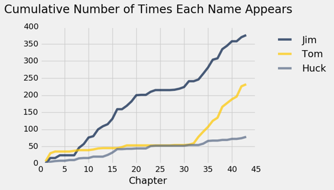
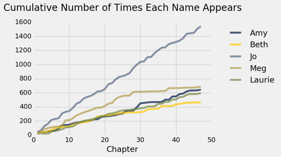
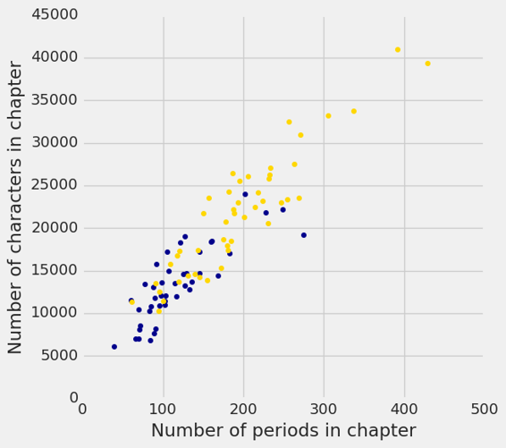

# 一、数据科学

> 原文：[Data Science](https://github.com/data-8/textbook/tree/gh-pages/chapters/01)

> 译者：[飞龙](https://github.com/wizardforcel)

> 协议：[CC BY-NC-SA 4.0](http://creativecommons.org/licenses/by-nc-sa/4.0/)

> 自豪地采用[谷歌翻译](https://translate.google.cn/)

## 什么是数据科学

数据科学是通过探索，预测和推断，从大量不同的数据集中得出有用的结论。探索涉及识别信息中的规律。预测涉及使用我们所知道的信息，对我们希望知道的值作出知情的猜测。推断涉及量化我们的确定程度：我们发现的这些规律是否也出现在新的观察中？我们的预测有多准确？我们用于探索的主要工具是可视化和描述性统计，用于预测的是机器学习和优化，用于推理的是统计测试和模型。

统计学是数据科学的核心部分，因为统计学研究，如何用不完整的信息做出有力的结论。计算是一个重要组成部分，因为编程允许我们将分析技巧应用于大量不同的数据集，它们在真实应用中出现：不仅包括数字，还包括文本，图像，视频和传感器读数。数据科学就是所有这些东西，但是由于应用的原因，它不仅仅是其部分的总和。通过理解一个特定的领域，数据科学家学习提出有关他们的数据的适当的问题，并正确地解释我们的推理和计算工具提供的答案。

## 简介

数据是对我们周围世界的描述，通过观察来收集并存储在计算机上。计算机使我们能够从这些描述中推断出世界的特性。数据科学是使用计算从数据中得出结论的学科。有效的数据分析有三个核心方面：探索，预测和推理。本文对三者进行了一致的研究，同时介绍了统计思想和计算机科学的基本思想。我们专注于一套最小的核心技巧，应用于广泛的实际应用。数据科学的基础不仅需要理解统计和计算技巧，还需要认识到它们如何应用于真实场景。

对于我们希望研究的世界的任何方面，无论是地球气象，世界市场，政治民意调查还是人类思想，我们收集的数据通常都提供了这个主题的不完整描述。数据科学的核心挑战是使用这部分信息作出可靠的结论。

在这个努力中，我们将结合两个基本工具：计算和随机化。例如，我们可能想使用温度观测来了解气候变化的趋势。计算机允许我们使用所有可用的信息得出结论。我们不仅仅关注一个地区的平均气温，而是将整个温度的范围一起考虑，来构建更加细致的分析。随机性允许我们考虑许多不同方式，来完善不完整的信息。我们不会假设温度会以某种特定的方式变化，而是学习使用随机性来设想许多可能的情景，这些情景都与我们观察到的数据一致。

应用这种方法需要学习，如何为一台计算机编程，所以这个文本穿插了编程的完整介绍，并假设没有任何先验知识。 具有编程经验的读者会发现，我们涵盖了计算中的几个主题，这些主题并没有出现在典型的计算机科学课程中。 数据科学也需要对数量进行仔细的推理，但是本书并不假设超出基本代数的数学或统计背景。 在本文中你会发现很少的方程。 相反，技巧使用一种编程语言描述，对于读者和执行它们的计算机来说，是相同的。

### 计算工具

本文使用 Python 3 编程语言，以及数值和数据可视化的标准工具集，它们在商业应用，科学实验和开源项目中广泛使用。 Python 已经招募了许多专业人士，它们使用数据得出结论。通过学习 Python 语言，你将加入一个拥有百万人口的，软件开发人员和数据科学家社区。

入门。开始用 Python 编写程序的最简单和推荐的方法是，登录到本文的配套网站 <https://datahub.berkeley.edu/>。如果你拥有`@ berkeley.edu`电子邮件地址，则你已经可以完全访问该网站上托管的编程环境。如果没有，请填写[此表格](https://goo.gl/forms/saQpxdqzS2rKxjTc2)来申请访问。

你不能完全仅仅使用这个基于 Web 的编程环境。 Python 程序可以由任何计算机执行，无论其制造商或操作系统如何，只要安装了该语言的支持。如果你希望安装符合本文的 Python 版本及其附带库，我们推荐将 Anaconda 发行版与 Python 3 语言解释器，IPython 库和 Jupyter 笔记本环境打包在一起。

本文包括所有这些计算工具的完整介绍。你将学习编写程序，从数据生成图像，并使用在线发布的真实世界的数据集。

### 统计技巧

统计学科长期以来一直面临与数据科学相同的根本挑战：如何使用不完整的信息得出有关世界的有力结论。统计学最重要的贡献之一是，用于描述观察与结论之间关系的，一致而准确的词汇。本文继续保持同样的传统，重点是统计学中的一组核心推断问题：假设检验，置信度估计和未知量预测。

数据科学通过充分利用计算，数据可视化，机器学习，优化和信息访问来扩展统计领域。快速计算机和互联网的结合使得任何人都能够访问和分析大量的数据集：数百万篇新闻文章，完整的百科全书，任何领域的数据库以及大量的音乐，照片和视频库。

真实数据集的应用激发了我们在整个文本中描述的统计技巧。真实数据通常没有规律或匹配标准方程。如果把过多的注意力集中在简单的总结上，比如平均值，那么真实数据中有趣的变化就会丢失。计算机使一系列基于重采样的方法成为可能，它们适用于各种不同的推理问题，考虑了所有可用的信息，并且需要很少的假设或条件。虽然这些技巧经常留作统计学的研究生课程，但它们的灵活性和简单性非常适合数据科学应用。

## 为什么是数据科学

最重要的决策仅仅使用部分信息和不确定的结果做出。然而，许多决策的不确定性，可以通过获取大量公开的数据集和有效分析所需的计算工具，而大幅度降低。以数据为导向的决策已经改变了一大批行业，包括金融，广告，制造业和房地产。同时，大量的学科正在迅速发展，将大规模的数据分析纳入其理论和实践。

学习数据科学使个人能够将这些技巧用于工作，科学研究和个人决策。批判性思维一直是严格教育的标志，但在数据支持下，批判往往是最有效的。对世界任何方面的批判性分析，可能是商业或社会科学，涉及归纳推理；结论很少直接证明，仅仅由现有的证据支持。数据科学提供了手段，对任何一组观测结果进行精确，可靠和定量的论证。有了信息和计算机的前所未有的访问，如果没有有效的推理技巧，对世界上任何可以衡量的方面的批判性思考都是不完整的。

世界上有太多没有答案的问题和困难的挑战，所以不能把这个批判性的推理留给少数专家。所有受过教育的社会成员都可以建立推断数据的能力。这些工具，技巧和数据集都是随手可用的；本文的目的是使所有人都能访问它们。

## 绘制经典作品

在这个例子中，我们将探讨两个经典小说的统计：马克吐温（Mark Twain）的《哈克贝利·芬历险记》（The Adventures of Huckleberry Finn）和路易莎·梅·奥尔科特（Louisa May Alcott）的《小女人》（Little Women）。任何一本书的文本都可以通过电脑以极快的速度读取。 1923 年以前出版的书籍目前处于公有领域，这意味着每个人都有权以任何方式复制或使用文本。 [古登堡计划](http://www.gutenberg.org/)是一个在线出版公共领域书籍的网站。使用 Python，我们可以直接从网络上加载这些书籍的文本。

这个例子是为了说明本书的一些广泛的主题。如果还不理解程序的细节，别担心。相反，重点关注下面生成的图像。后面的部分将介绍下面使用的 Python 编程语言的大部分功能。

首先，我们将这两本书的内容读入章节列表中，称为`huck_finn_chapters`和`little_women_chapters`。在 Python 中，名称不能包含任何空格，所以我们经常使用下划线`_`来代表空格。在下面的行中，左侧提供了一个名称，右侧描述了一些计算的结果。统一资源定位符或 URL 是互联网上某些内容的地址；这里是一本书的文字。`#`符号是注释的起始，计算机会忽略它，但有助于人们阅读代码。

```py
# Read two books, fast!

huck_finn_url = 'https://www.inferentialthinking.com/chapters/01/3/huck_finn.txt'
huck_finn_text = read_url(huck_finn_url)
huck_finn_chapters = huck_finn_text.split('CHAPTER ')[44:]

little_women_url = 'https://www.inferentialthinking.com/chapters/01/3/little_women.txt'
little_women_text = read_url(little_women_url)
little_women_chapters = little_women_text.split('CHAPTER ')[1:]
```

虽然计算机不能理解书的文本，它可以向我们提供文本结构的一些视角。名称`huck_finn_chapters`现在已经绑定到书中章节的列表。我们可以将其放到一个表中，来观察每一章的开头。

```py
# Display the chapters of Huckleberry Finn in a table.

Table().with_column('Chapters', huck_finn_chapters)
```

| Chapters |
| --- |
| I. YOU don't know about me without you have read a book ... |
| II. WE went tiptoeing along a path amongst the trees bac ... |
| III. WELL, I got a good going-over in the morning from o ... |
| IV. WELL, three or four months run along, and it was wel ... |
| V. I had shut the door to. Then I turned around and ther ... |
| VI. WELL, pretty soon the old man was up and around agai ... |
| VII. "GIT up! What you 'bout?" I opened my eyes and look ... |
| VIII. THE sun was up so high when I waked that I judged ... |
| IX. I wanted to go and look at a place right about the m ... |
| X. AFTER breakfast I wanted to talk about the dead man a ... |

（已省略 33 行）

每一章都以章节号开头，以罗马数字的形式，后面是本章的第一个句子。古登堡计划将每章的第一个单词变为大写。

### 文本特征

《哈克贝利·芬历险记》描述了哈克和吉姆沿着密西西比河的旅程。汤姆·索亚（Tom Sawyer）在行动进行的时候加入了他们的行列。在加载文本后，我们可以快速地看到这些字符在本书的任何一处被提及的次数。

```py
# Count how many times the names Jim, Tom, and Huck appear in each chapter.

counts = Table().with_columns([
        'Jim', np.char.count(huck_finn_chapters, 'Jim'),
        'Tom', np.char.count(huck_finn_chapters, 'Tom'),
        'Huck', np.char.count(huck_finn_chapters, 'Huck')
    ])

# Plot the cumulative counts:
# how many times in Chapter 1, how many times in Chapters 1 and 2, and so on.

cum_counts = counts.cumsum().with_column('Chapter', np.arange(1, 44, 1))
cum_counts.plot(column_for_xticks=3)
plots.title('Cumulative Number of Times Each Name Appears', y=1.08);
```



在上图中，横轴显示章节号，纵轴显示每个字符在该章节被提及到的次数。

吉姆是核心人物，它的名字出现了很多次。请注意，第 30 章中汤姆出现并加入了哈克和吉姆，在此之前，汤姆在本书中几乎没有提及。他和吉姆的曲线在这个位置上迅速上升，因为涉及两者的行动都在变多。至于哈克，他的名字几乎没有出现，因为他是叙述者。

《小女人》是南北战争期间四个姐妹一起长大的故事。 在这本书中，章节号码拼写了出来，章节标题用大写字母表示。

```py
# The chapters of Little Women, in a table

Table().with_column('Chapters', little_women_chapters)
```

| Chapters |
| --- |
| ONE PLAYING PILGRIMS "Christmas won't be Christmas witho ... |
| TWO A MERRY CHRISTMAS Jo was the first to wake in the gr ... |
| THREE THE LAURENCE BOY "Jo! Jo! Where are you?" cried Me ... |
| FOUR BURDENS "Oh, dear, how hard it does seem to take up ... |
| FIVE BEING NEIGHBORLY "What in the world are you going t ... |
| SIX BETH FINDS THE PALACE BEAUTIFUL The big house did pr ... |
| SEVEN AMY'S VALLEY OF HUMILIATION "That boy is a perfect ... |
| EIGHT JO MEETS APOLLYON "Girls, where are you going?" as ... |
| NINE MEG GOES TO VANITY FAIR "I do think it was the most ... |
| TEN THE P.C. AND P.O. As spring came on, a new set of am ... |

（已省略 37 行）

我们可以跟踪主要人物的提及，来了解本书的情节。 主角乔（Jo）和她的姐妹梅格（Meg），贝丝（Beth）和艾米（Amy）经常互动，直到第 27 章中她独自搬到纽约。

```py
# Counts of names in the chapters of Little Women

counts = Table().with_columns([
        'Amy', np.char.count(little_women_chapters, 'Amy'),
        'Beth', np.char.count(little_women_chapters, 'Beth'),
        'Jo', np.char.count(little_women_chapters, 'Jo'),
        'Meg', np.char.count(little_women_chapters, 'Meg'),
        'Laurie', np.char.count(little_women_chapters, 'Laurie'),

    ])

# Plot the cumulative counts.

cum_counts = counts.cumsum().with_column('Chapter', np.arange(1, 48, 1))
cum_counts.plot(column_for_xticks=5)
plots.title('Cumulative Number of Times Each Name Appears', y=1.08);
```



劳里（Laurie）是个年轻人，最后和其中一个女孩结婚。 看看你是否可以使用这个图来猜测是哪一个。

### 另一种文本特征

在某些情况下，数量之间的关系能让我们做出预测。 本文将探讨如何基于不完整的信息做出准确的预测，并研究结合多种不确定信息来源进行决策的方法。

作为从多个来源获取信息的可视化的例子，让我们首先使用计算机来获取一些信息，它们通常手工难以获取。在小说的语境中，“特征”（Character）这个词有第二个含义：一个印刷符号，如字母，数字或标点符号。 在这里，我们要求计算机来计算《哈克贝利·芬》和《小女人》的每章中的字符和句号数量。

```py
# In each chapter, count the number of all characters;
# call this the "length" of the chapter.
# Also count the number of periods.

chars_periods_huck_finn = Table().with_columns([
        'Huck Finn Chapter Length', [len(s) for s in huck_finn_chapters],
        'Number of Periods', np.char.count(huck_finn_chapters, '.')
    ])
chars_periods_little_women = Table().with_columns([
        'Little Women Chapter Length', [len(s) for s in little_women_chapters],
        'Number of Periods', np.char.count(little_women_chapters, '.')
    ])
```


这里是《哈克贝利·芬》的数据。 表格的每一行对应小说的一个章节，并显示章节中的字符和句号数量。 毫不奇怪，字符少的章节往往句号也少，一般来说 - 章节越短，句子越少，反之亦然。 然而，这种关系并不是完全可以预测的，因为句子的长度各不相同，还可能涉及其他标点符号，例如问号。

`chars_periods_huck_finn`


| 《哈克贝利·芬》章节长度 | 句号数量 |
| --- | --- |
| 7026 | 66 |
| 11982 | 117 |
| 8529 | 72 |
| 6799 | 84 |
| 8166 | 91 |
| 14550 | 125 |
| 13218 | 127 |
| 22208 | 249 |
| 8081 | 71 |
| 7036 | 70 |

（已省略 33 行）

这里是《小女人》的对应数据：

`chars_periods_little_women`

| 《小女人》章节长度 | 句号数量 |
| --- | --- |
| 21759 | 189 |
| 22148 | 188 |
| 20558 | 231 |
| 25526 | 195 |
| 23395 | 255 |
| 14622 | 140 |
| 14431 | 131 |
| 22476 | 214 |
| 33767 | 337 |
| 18508 | 185 |

（已省略 37 行）


你可以看到，《小女人》的章节总的来说比《哈克贝利·芬》的章节要长。让我们来看看这两个简单的变量 - 每一章的长度和句子数量 - 能否告诉我们这两本书的更多内容。 我们实现它的一个方法是在同一个图上绘制两组数据。

在下面的图中，每本书的每一章都有一个点。 蓝色圆点对应于《哈克贝利·芬》，金色圆点对应于《小女人》。横轴表示句号数量，纵轴表示字符数。

```py
plots.figure(figsize=(6, 6))
plots.scatter(chars_periods_huck_finn.column(1), 
              chars_periods_huck_finn.column(0), 
              color='darkblue')
plots.scatter(chars_periods_little_women.column(1), 
              chars_periods_little_women.column(0), 
              color='gold')
plots.xlabel('Number of periods in chapter')
plots.ylabel('Number of characters in chapter');
```



这个绘图向我们展示，《小女人》的许多章节，而不是所有章节都比《哈克贝利·芬》的章节长，正如我们通过查看数字所看到的那样。 但它也向我们展示了更多东西。 请注意，蓝点粗略聚集在一条直线上，黄点也是如此。 此外看起来，两种颜色的点可能聚集在同一条直线上。

现在查看包含大约 100 个句号的所有章节。 绘图显示，这些章节大致包含约 10,000 个字符到约 15,000 个字符。每个句子大约有 100 到 150 个字符。

事实上，从这个绘图看来，这两本书的两个句号之间平均有 100 到 150 个字符，这是一个非常粗略的估计。 也许这两个伟大的 19 世纪小说正在表明我们现在非常熟悉的东西：Twitter 的 140 个字符的限制。
