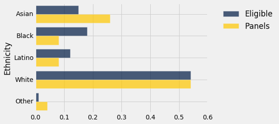
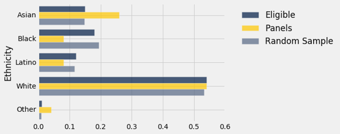
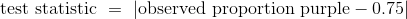
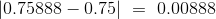
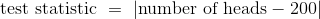

# 十、假设检验

> 原文：[Testing Hypotheses](https://github.com/data-8/textbook/tree/gh-pages/chapters/10)

> 译者：[飞龙](https://github.com/wizardforcel)

> 协议：[CC BY-NC-SA 4.0](http://creativecommons.org/licenses/by-nc-sa/4.0/)

> 自豪地采用[谷歌翻译](https://translate.google.cn/)

数据科学家们经常面对世界的是或不是的问题。你在这个课程中看到了一些这样的问题的例子：

+   巧克力对你有好处吗？
+   Broad Street 水泵的水是否会导致霍乱？
+   加州的人口统计在过去的十年中有所改变吗？

我们是否回答这些问题取决于我们的数据。加州的人口普查数据可以解决人口统计的问题，而答案几乎没有任何不确定性。我们知道 Broad Street 水泵的水源受到霍乱病人的污染，所以我们可以很好地猜测它是否会引起霍乱。

巧克力还是其他任何实验对你有好处，几乎肯定要由医学专家来决定，但是第一步是使用数据科学分析来自研究和随机实验的数据。

在本章中，我们将试图回答这样的问题，根据样本和经验分布的结论。我们将以北加利福尼亚州公民自由联盟（ACLU）2010 年进行的一项研究为例。

## 陪审团选拔

2010 年，ACLU 在加利福尼亚州阿拉米达县提交了一份陪审团选择的报告。报告得出的结论是，在阿拉米达县的陪审团小组成员中，某些族裔人数不足，并建议对专家组进行一些改革，来合理分配陪审员。在本节中，我们将自己分析数据，并检查出现的一些问题。

### 陪审团

陪审团是一群被选为准陪审员的人；终审的陪审团是从他们中挑选的。陪审团可以由几十人或几千人组成，具体情况取决于审判情况。根据法律，陪审团应该是审判所在社区的代表。加州“民事诉讼法（California's Code of Civil Procedure）”第 197 条规定：“All persons selected for jury service shall be selected at random, from a source or sources inclusive of a representative cross section of the population of the area served by the court.”

最终的陪审团是通过故意纳入或排除，从陪审团中挑选出来的。法律允许潜在的陪审员出于医疗原因而被免责；双方的律师可以从名单上挑选一些潜在的陪审员进行所谓的“先制性反对（peremptory challenges）”。初审法官可以根据陪审团填写的问卷进行选择；等等。但最初的陪审团似乎是合格陪审员的总体的随机样本。

### 阿拉米达县的陪审团构成

ACLU 的研究重点是阿拉米达县陪审团的种族组成。 ACLU 编辑了 2009 年和 2010 年在阿拉米达县进行的 11 次重罪审判中陪审团的种族组成的数据。在这些陪审团中，报告出庭的陪审员的总人数是 1453 人。ACLU 收集了所有人口的统计数据，并将这些数据与该县所有合格陪审员的组成进行比较。

数据列在下面的表格中，称为`jury`。 对于每个种族来说，第一个值就是该种族所有合格的陪审员候选人的比例。 第二个值是出现在出现在陪审团选拔过程的人中，那个种族的人的比例。

```py
jury = Table().with_columns(
    'Ethnicity', make_array('Asian', 'Black', 'Latino', 'White', 'Other'),
    'Eligible', make_array(0.15, 0.18, 0.12, 0.54, 0.01),
    'Panels', make_array(0.26, 0.08, 0.08, 0.54, 0.04)
)

jury
```


| Ethnicity | Eligible | Panels |
| --- | --- | --- |
| Asian | 0.15 | 0.26 |
| Black | 0.18 | 0.08 |
| Latino | 0.12 | 0.08 |
| White | 0.54 | 0.54 |
| Other | 0.01 | 0.04 |

研究中的一些种族代表性过多，一些代表性不足。 条形图有助于显示差异。

```py
jury.barh('Ethnicity')
```



### 两个分布的距离

可视化使我们能够快速了解，两个分布之间的相似性和差异。 为了更准确地说出这些差异，我们必须首先量化两个分布之间的差异。 这将使我们的分析能够基于更多东西，不仅仅是我们能够通过眼睛做出的评估。

为了测量两个分布之间的差异，我们将计算一个数量，称之为它们之间的总变异距离（total variation distance）。

为了计算总变异距离，我们首先考虑每个类别中两个比例之间的差异。

```py
# Augment the table with a column of differences between proportions

jury_with_diffs = jury.with_column(
    'Difference', jury.column('Panels') - jury.column('Eligible')
)
jury_with_diffs
```


| Ethnicity | Eligible | Panels | Difference |
| --- | --- | --- | --- |
| Asian | 0.15 | 0.26 | 0.11 |
| Black | 0.18 | 0.08 | -0.1 |
| Latino | 0.12 | 0.08 | -0.04 |
| White | 0.54 | 0.54 | 0 |
| Other | 0.01 | 0.04 | 0.03 |

```py
jury_with_diffs.column('Abs. Difference').sum()/2
0.14000000000000001
```

这个数量 0.14 是合格陪审员总体中种族分布与陪审团分布情况之间的总变异距离（TVD）。

只要加上正的差异，我们就可以得到相同的结果。 但是，我们的方法包含所有绝对差异，不需要追踪哪些差异是正的而哪些不是。

### 计算 TVD 的函数

函数`total_variation_distance`返回两个数组中的分布的 TVD。

```py
def total_variation_distance(distribution_1, distribution_2):
    return np.abs(distribution_1 - distribution_2).sum()/2
```

函数`table_tvd `使用函数`total_variation_distance`来返回表的两列中的分布的 TVD。

```py
def table_tvd(table, label, other):
    return total_variation_distance(table.column(label), table.column(other))

table_tvd(jury, 'Eligible', 'Panels')
0.14000000000000001
```

### 陪审团是否是总体的代表？

现在我们将转到合格的陪审员和陪审团的 TVD 的值。我们如何解释 0.14 的距离呢？要回答这个问题，请回想一下，陪审团应该是随机选择的。因此，将 0.14 的值与合格的陪审员和随机选择的陪审团的 TVD 进行比较，会有帮助。

为了这样做，我们将在模拟中使用我们的技能。研究共有 1453 名准陪审员。所以让我们从合格的陪审员的总体中随机抽取大小为 1453 的样本。

技术注解。准陪审员的随机样本将会不放回地选中。但是，如果样本的大小相对于总体的大小较小，那么无放回的取样类似于放回的取样；总体中的比例在几次抽取之间变化不大。阿拉米达县的合格陪审员的总体超过一百万，与此相比，约 1500 人的样本量相当小。因此，我们将带放回地抽样。

### 从合格的陪审员中随机抽样

到目前为止，我们已经使用`np.random.choice`从数组元素中随机抽样，并使用`sample `对表的行进行抽样。 但是现在我们必须从一个分布中抽样：一组种族以及它们的比例。

为此，我们使用函数`proportions_from_distribution`。 它有三个参数：

+   表名
+   包含比例的列的标签
+   样本大小

该函数执行带放回地随机抽样，并返回一个新的表，该表多出了一列`Random Sample`，是随机样本中所出现的比例。

所有陪审团的总大小是 1453，所以让我们把这个数字赋给给一个名成，然后调用：

```py
proportions_from_distribution.

panel_size = 1453
panels_and_sample = proportions_from_distribution(jury, 'Eligible', panel_size)
panels_and_sample
```


| Ethnicity | Eligible | Panels | Random Sample |
| --- | --- | --- | --- |
| Asian | 0.15 | 0.26 | 0.14797 |
| Black | 0.18 | 0.08 | 0.193393 |
| Latino | 0.12 | 0.08 | 0.116311 |
| White | 0.54 | 0.54 | 0.532691 |
| Other | 0.01 | 0.04 | 0.00963524 |

从结果中可以清楚地看出，随机样本的分布与合格总体的分布非常接近，与陪审团的分布不同。

和之前一样，可视化会有帮助。

```py
panels_and_sample.barh('Ethnicity')
```



灰色条形与蓝色条形比金色条形更接近。 随机样本类似于合格的总体，而不是陪审团。

我们可以通过计算合格总体的分布与随机样本之间的 TVD，来量化这一观察结果。

```py
table_tvd(panels_and_sample, 'Eligible', 'Random Sample')
0.013392980041293877
```

将其与陪审团的距离 0.14 进行比较，可以看到我们在条形图中看到的数值。 合格总体与陪审团之间的 TVD 为 0.14，但合格总体与随机样本之间的 TVD 小得多。

当然，随机样本和合格陪审员的分布之间的距离取决于样本。 再次抽样可能会给出不同的结果。

### 随机样本和总体之间有多少差异？

随机样本与合格陪审员的分布之间的 TVD，是我们用来衡量两个分布之间距离的统计量。 通过重复抽样过程，我们可以看到不同随机样本的统计量是多少。 下面的代码根据抽样过程的大量重复，来计算统计量的经验分布。

```py
# Compute empirical distribution of TVDs

panel_size = 1453
repetitions = 5000

tvds = make_array()

for i in np.arange(repetitions):

    new_sample = proportions_from_distribution(jury, 'Eligible', panel_size)
    tvds = np.append(tvds, table_tvd(new_sample, 'Eligible', 'Random Sample'))

results = Table().with_column('TVD', tvds)
results
```


| TVD |
| --- |
| 0.0247075 |
| 0.0141569 |
| 0.0138403 |
| 0.0214384 |
| 0.012278 |
| 0.017309 |
| 0.0219752 |
| 0.0192017 |
| 0.02351 |
| 0.00818995 |

（省略了 4990 行）

上面每一行包含大小为 1453 的随机样本与合格的陪审员的 TVD。

这一列的直方图显示，从合格候选人中随机抽取 1453 名陪审员的结果是，偏离合格陪审员的种族分布的分布几乎不超过 0.05。

```py
results.hist(bins=np.arange(0, 0.2, 0.005))
```


### 陪审团和随机样本比如何？

然而，研究中的陪审团与合格总体并不十分相似。陪审团和总体之间的 TVD 是 0.14，这距离上面的直方图的尾部很远。这看起来不像是随机样本和合格总体之间的典型距离。

所以我们的分析支持 ACLU 的计算，即陪审团不是合格陪审员的分布的代表。然而，与大多数这样的分析一样，它并没有说明分布为什么不同，或者差异可能暗示了什么。

ACLU 报告讨论了这些差异的几个可能的原因。例如，一些少数群体在选民登记记录和机动车辆部门（选择陪审员的两个主要来源）的代表性不足。在进行研究时，该县没有一个有效的程序，用于跟踪那些被选中但未出庭的准陪审员。ACLU 列举了其他几个原因。不管出于何种原因，似乎很明显，陪审团的组成与我们对随机样本的预期不同，它来自`Eligible`列的分布。

### 数据上的问题

我们已经开发出一种强大的技术，来帮助决定一个分布是否像另一个分布的随机样本。但是数据科学不仅仅是技术。特别是数据科学总是需要仔细研究如何收集数据。

合格的陪审员。首先，重要的是要记住，不是每个人都有资格担任陪审团的职位。阿拉米达县高级法院在其网站上说：“如果你是18 岁的美国公民，和传召所在的县或区的居民，你可能会被要求担任职位。你必须能够理解英语，身体上和精神上都有能力担任，此外，你在过去 12 个月内不得担任任何类型的陪审员，也没有被判重罪。

人口普查没有保存所有这些类别的人口记录。因此 ACLU 必须以其他方式获得合格陪审员的人口统计资料。以下是他们对自己所遵循的过程的描述，以及它可能包含的一些缺陷。

“为了确定阿拉米达县具有陪审团资格的人口的统计数据，我们使用了一个声明，它为阿拉米达县人民起诉斯图亚特·亚历山大的审判而准备。在声明中，圣地亚哥州立大学的人口统计学家 Weeks 教授，根据 2000 年的人口普查数据估算了阿拉米达县的具有陪审团资格的人口，为了得出这个估计值，Weeks 教授考虑到了不符合陪审团担任条件的人数，因为他们不会说英文，不是公民，因此，他的估计应该是对阿拉米达县实际具有陪审团资格的人口的准确评估，而不仅仅是审查居住在阿拉米达的所有人口的种族和族裔的人口普查报告。应该指出的是，Weeks 教授所依据的人口普查数据现在已经有十年了，县的人口统计数据的某些类别，可能已经改变了两到三个百分点。”

因此，分析中使用的合格陪审员的种族分布本身就是一个估计，可能有点过时。

陪审团。 此外，陪审团并不从整个合格总体中选出。 阿拉米达县高等法院说：“法院的目标是提供县人口的准确的横截面，陪审员的名字是从登记选民和/或车管局发出的驾驶执照中随机抽取的”。

所有这些都产生了复杂问题，就是如何准确估计阿拉米达县合格陪审员的种族构成。

目前还不清楚，1453 个陪审团成员如何划分为不同的种族类别（ACLU 报告称“律师......合作收集陪审团数据”）。 存在严重的社会，文化和政治因素，影响谁被归类或自我分类到每个种族类别。 我们也不知道陪审团中这些类别的定义，是否与 Weeks 教授所使用的定义相同，Weeks 教授又在它的估算过程中使用了人口普查类别。 因此被比较的两个分布的对应关系，也存在问题。

### 美国最高法院，1965年：斯温 VS 阿拉巴马州

在二十世纪六十年代初期，阿拉巴马州的塔拉迪加县，一个名叫罗伯特·斯温的黑人被指控强奸一名白人妇女，并被判处死刑。 
他援引所有陪审团是白人的其他因素，对他的判决提出上诉。当时，只有 21 岁或以上的男子被允许在塔拉迪加县的陪审团中任职。 在县里，合格的陪审员中有 26% 是黑人，但在 Swain 的审判中选出的 100 名陪审团中只有 8 名黑人男子。 审判陪审团没有选定黑人。

1965 年，美国最高法院驳回了斯温的上诉。 法院在其裁决中写道：“整体百分比差距很小，没有反映出包括或排除特定数量的黑人的尝试”。（... the overall percentage disparity has been small and reflects no studied attempt to include or exclude a specified number of Negroes.）

让我们用我们开发的方法来检查，陪审团中的 100 名黑人中的 8 名与合格陪审员的分布之间的差异。

```py
swain_jury = Table().with_columns(
    'Ethnicity', make_array('Black', 'Other'),
    'Eligible', make_array(0.26, 0.74),
    'Panel', make_array(0.08, 0.92)
)

swain_jury
```


| Ethnicity | Eligible | Panel |
| --- | --- | --- |
| Black | 0.26 | 0.08 |
| Other | 0.74 | 0.92 |

```py
table_tvd(swain_jury, 'Eligible', 'Panel')
0.18000000000000002
```

两个分布之间的 TVD 是 0.18。 这与合格总体的分布和随机样本之间的 TVD 比较如何？

为了回答这个问题，我们可以模拟从随机样本中计算的 TVD。

```py
# Compute empirical distribution of TVDs

panel_size = 100
repetitions = 5000

tvds = make_array()

for i in np.arange(repetitions):

    new_sample = proportions_from_distribution(swain_jury, 'Eligible', panel_size)
    tvds = np.append(tvds, table_tvd(new_sample, 'Eligible', 'Random Sample'))

results = Table().with_column('TVD', tvds)
results.hist(bins = np.arange(0, 0.2, 0.01))
```


随机样本的 TVD 小于我们所得的值 0.18，它是陪审团和合格陪审员的 TVD。

在这个分析中，数据并没有像我们以前的分析那样被问题盖住 - 涉及的人总数相对较少，而且最高法院案件的统计工作也很仔细。

因此，我们的分析有了明确的结论，那就是陪审团不是总体的代表。 最高法院的判决“整体百分比差距很小”是很难接受的。

## 检验的术语

在陪审团选择的例子的背景下，我们已经形成了一些假设统计检验的基本概念。使用统计检验作为决策的一种方法是许多领域的标准，并且存在标准的术语。以下是大多数统计检验中的步骤顺序，以及一些术语和示例。

### 第一步：假设

所有的统计检验都试图在世界的两种观点中进行选择。具体而言，选择是如何生成数据的两种观点之间的选择。这两种观点被称为假设。

原（零）假设。这就是说，数据在明确指定的假设条件下随机生成，这些假设使计算几率成为可能。 “零”一词强化了这样一个观点，即如果数据看起来与零假设的预测不同，那么这种差异只是偶然的。

在阿拉米达县陪审团选择的例子中，原假设是从合格的陪审员人群中，随机抽取这些陪审团。虽然审团的种族组成与合格的陪审员的总体不同，但除了机会变异以外，没有任何理由存在差异。

备选假设。这就是说，除了几率以外的某些原因使数据与原假设所预测的数据不同。非正式而言，备选假设认为观察到的差异是“真实的”。

在我们阿拉米达县陪审团选择的例子中，备选假设是，这些小组不是随机选出来的。除了几率以外的事情导致了，陪审团的种族组成和合格陪审员总体的种族组成之间存在差异。

### 第二步：检验统计量

为了在这两个假设之间作出决策，我们必须选择一个统计量作为我们决策的依据。 这被称为检验统计量。

在阿拉米达县陪审团的例子中，我们使用的检验统计量是，陪审团与合格陪审员的总体的种族分布之间的总变异距离。

计算检验统计量的观察值通常是统计检验中的第一个计算步骤。 在我们的例子中，陪审团与总体之间的总变异距离的观察值是 0.14。

### 第三步：检验统计量的概率分布，在原假设下

这个步骤把检验统计量的观察值放在一边，而是把重点放在，如果原假设为真，统计量的值是什么。 在原假设下，由于几率，样本可能出现不同的情况。 所以检验统计量可能会有所不同。 这个步骤包括在随机性的原假设下，计算出所有可能的检验统计量及其所有概率。

换句话说，在这个步骤中，我们假设原假设为真，并计算检验统计量的概率分布。 对于许多检验统计量来说，这在数学和计算上都是一项艰巨的任务。 因此，我们通过抽样过程的大量重复，通过统计量的经验分布来近似检验统计量的概率分布。

在我们的例子中，我们通过直方图可视化了这个分布。

### 第四步 检验的结论

原假设和备选假设之间的选择，取决于步骤 2 和 3 的结果之间的比较：检验统计量的观察值以及它的分布，就像由原假设预测的那样。

如果二者一致，则观察到的检验统计量与原假设的预测一致。 换句话说，这个检验并不偏向备选假设；数据更加支持原假设。

但如果两者不一致，就像我们阿拉米达县陪审团的例子那样，那么数据就不支持原假设。 这就是为什么我们得出结论，陪审团不是随机挑选的。 几率之外的东西影响了他们的构成。

如果数据不支持原假设，我们说检验拒绝了原假设。

## 孟德尔的豌豆花

格雷戈·孟德尔（1822-1884）是一位奥地利僧侣，被公认为现代遗传学领域的奠基人。 孟德尔对植物进行了仔细而大规模的实验，提出遗传学的基本规律。

他的许多实验都在各种豌豆上进行。 他提出了一系列每个品种的假设。 这些被称为模型。 然后他通过种植植物和收集数据来测试他的模型的有效性。

让我们分析这样的实验的数据，看看孟德尔的模型是否好。

在一个特定的品种中，每个植物具有紫色或白色的花。 每个植物的颜色不受其他植物颜色的影响。 孟德尔推测，植物应随机具有紫色或白色的花，比例为 3：1。

原假设。 对于每种植物，75% 的几率是紫色的花，25% 的几率是白色的花，无论其他植物的颜色如何。

也就是说，原假设是孟德尔的模型是好的。 任何观察到的模型偏差都是机会变异的结果。

当然，有一个相反的观点。

备选假设。 孟德尔的模型是无效的。

让我们看看孟德尔收集的数据更加支持这些假设中的哪一个。

`flowers`表包含了由模型预测的比例，以及孟德尔种植的植物数据。

```py
flowers = Table().with_columns(
    'Color', make_array('Purple', 'White'),
    'Model Proportion', make_array(0.75, 0.25),
    'Plants', make_array(705, 224)
)

flowers
```


| Color | Model Proportion | Plants |
| --- | --- | --- |
| Purple | 0.75 | 705 |
| White | 0.25 | 224 |

共有 929 株植物。 为了观察颜色的分布是否接近模型预测的结果，我们可以找到观察到的比例和模型比例之间的总变异距离，就像我们之前那样。 但是只有两个类别（紫色和白色），我们有一个更简单的选择：我们可以查看紫色的花的比例。 白色的比例没有新的信息，因为它只是 1 减去紫色的比例。

```py
total_plants = flowers.column('Plants').sum()
total_plants
929
observed_proportion = flowers.column('Plants').item(0)/total_plants
observed_proportion
0.7588805166846071
```

检验统计量。 由于该模型预测 75% 的植物花为紫色，相关的统计量是 0.75 与观察到的花为紫色的植物的比例之间的差异。

```py
observed_statistic = abs(observed_proportion - 0.75)
observed_statistic
0.0088805166846070982
```

这个值与原假设所说的应该的情况相比如何？ 为了回答这个问题，我们需要使用模型来模拟植物的新样本并计算每个样本的统计量。

我们将首先创建数组`model_colors`，包含颜色，比例由模型给定。 然后我们可以使用`np.random.choice`从这个数组中，带放回地随机抽样 929 次。 根据孟德尔的模型，这就是植物的生成过程。

```py
model_colors = make_array('Purple', 'Purple', 'Purple', 'White')
new_sample = np.random.choice(model_colors, total_plants)
```

> 译者注：这里可以使用`np.random.choice`的`p`参数来简化编程。

> ```py
> new_sample = np.random.choice(['Purple', 'White'], total_plants, p=[0.75, 0.25])
> ```


为了与我们观察到的统计量进行比较，我们需要知道这个新样本中，花为紫色的植物的比例与 0.75 的差。

```py
proportion_purple = np.count_nonzero(new_sample == 'Purple')/total_plants
abs(proportion_purple - 0.75)
0.016953713670613602
```

检验统计量的经验分布，在原假设为真的情况下。 毫不奇怪，我们得到的值与我们观察到的统计量之间的差约为 0.00888。 但是如果我们又取了一个样本，会有多大的不同呢？ 你可以通过重新运行上面的两个单元格来回答这个问题，或者使用`for`循环来模拟统计量。

```py
repetitions = 5000

sampled_stats = make_array()

for i in np.arange(repetitions):
    new_sample = np.random.choice(model_colors, total_plants)
    proportion_purple = np.count_nonzero(new_sample == 'Purple')/total_plants
    sampled_stats = np.append(sampled_stats, abs(proportion_purple - 0.75))

results = Table().with_column('Distance from 0.75', sampled_stats)
results.hist()
```


检验的结论。 根据孟德尔的数据，统计量的观测值是 0.00888，刚好 0.01 以下。 这正好在这个分布的中心。

```py
results.hist()

#Plot the observed statistic as a large red point on the horizontal axis
plots.scatter(observed_statistic, 0, color='red', s=30);
```


基于孟德尔数据的统计量，与我们基于孟德尔模型的模拟的分布是一致的。 因此，与备选假设相比，数据更加支持原假设 - 孟德尔的模型是好的。

## P 值和“一致”的含义

在阿拉米达县陪审团的例子中，我们观察到的检验统计量显然与原假设的预测差距很大。在豌豆花的例子中，观察到的统计量与原假设所预测的分布一致。所以在这两个例子中，选择哪个假设是明显的。

但是有时候这个决策还不是很明显。观察到的检验统计量是否与原假设预测的分布一致，是一个判断问题。我们建议你使用检验统计量的值以及原假设预测的分布图，来做出判断。这将使你的读者可以自己判断两者是否一致。

如果你不想做出自己的判断，你可以遵循一些惯例。这些惯例基于所谓的观察到的显着性水平，或简称 P 值。 P 值是一个几率，使用检验统计量的概率分布计算，可以用步骤 3 中的经验分布来近似。

求出 P 值的实用说明。现在，我们只是给出一个求出该值的机械的方法；意义和解释放到下一节中。方法：将观察到的检验统计量放在直方图的横轴上，求出从以该点起始的尾部比例。这就是 P 值，或者是基于经验分布的 P 值的相当好的近似值。

```py
empirical_P = np.count_nonzero(sampled_stats >= observed_statistic)/repetitions
empirical_P
0.5508
```

观察到的统计量 0.00888  非常接近孟德尔模型下所有统计量的中位数。 你可以把它看作是我们之前评论的一个量化，即观察到的统计量正好在原假设的分布中心。

但是如果离得更远呢？ 例如，如果观察到的统计量是 0.035 呢？ 那么我们会得出什么结论呢？

```py
np.count_nonzero(sampled_stats >= 0.035)/repetitions
0.0122
```

这个比例就很小了。 如果 P 值较小，那就意味着它的尾部很小，所以观察到的统计量远离原假设的预测。 这意味着数据支持备选假设而不是支持原假设。

所以如果我们观察到的统计量是 0.035 而不是 0.00888，我们会选择备选假设。

那么多小算“小”呢？ 这里有个约定。

+   如果 P 值小于 5%，结果称为“统计学显着”。

+   如果 P 值更小 - 小于 1%，结果被称为“高度统计学显着”。

在这两种情况下，检验的结论是数据支持备选假设。

### 约定的历史注解

上面定义的统计学显着性的确定，已经在所有应用领域的统计分析中成为标准。当一个约定被如此普遍遵循时，研究它是如何产生的就有趣了。

统计检验方法 - 基于随机样本数据在假设之间选择 - 由 Ronald Fisher 爵士在 20 世纪初开发。在 1925 年出版的《写给研究工作者的统计学方法》（Statistical Methods for Research Workers）一书中的下列陈述中，Ronald 爵士可能在不知情的情况下建立了统计学显著的约定。对于 5% 的水平，他写道：“判断一个偏差是否显著的时候，将它当做一个极限非常方便。

Ronald 爵士觉得“方便”的东西变成了截断，获得了普适常数的地位。无论罗纳德爵士如何选出了这个点，这个值是他在众多值中的个人选择：在 1926 年的一篇文章中，他写道：“如果二十分之一看起来还是不够高，如果我们愿意的话， 我们可以把线画在百分之二的地方，或者百分之一。个人来说，作者更倾向于把显著的较低标准设为 5%...”

Fisher 知道“低”是一个判断问题，没有独特的定义。我们建议你遵循他的优秀例子。提供你的数据，作出判断，并解释你为什么这样做。

### GSI 的辩护

假设检验是最广泛使用的统计推断方法之一。我们已经看到，它的用途十分广泛，例如审团选择和豌豆花。在本节的最后一个例子中，我们将在另一个完全不同的语境中对假设进行测试。

伯克利统计班的 350 名学生被分为 12 个讨论小组，由研究生导师（GSI）带领。期中之后后，第三组的学生注意到，他们的成绩平均上低于班上的其他人。

在这种情况下，学生们往往会抱怨这一组的 GSI 。他们肯定觉得，GSI 的教学一定是有问题的。否则为什么他们组会比别人做得更差呢？

GSI 通常有更多的统计学经验，他们的观点往往是不同的：如果你只是从全班随机抽取一部分学生，他们的平均分数就可能与学生不满意的分数相似。

GSI 的立场是一个明确的几率模型。我们来检验一下。

原假设：第三组的平均成绩类似于从班上随机抽取的相同数量的学生的平均成绩。

备选假设：不是，太低了。

`scores`包含整个班级的每个学生的小组编号和期中成绩。期中成绩是 0 到 25 的整数；0 的意思是学生没来考试。

```py
scores = Table.read_table('scores_by_section.csv')
scores
```

| Section | Midterm |
| --- | --- |
| 1 | 22 |
| 2 | 12 |
| 2 | 23 |
| 2 | 14 |
| 1 | 20 |
| 3 | 25 |
| 4 | 19 |
| 1 | 24 |
| 5 | 8 |
| 6 | 14 |

（省略了 349 行）

这是 12 个小组的平均成绩。

```py
scores.group('Section', np.mean).show()
```

| Section | Midterm mean |
| --- | --- |
| 1 | 15.5938 |
| 2 | 15.125 |
| 3 | 13.6667 |
| 4 | 14.7667 |
| 5 | 17.4545 |
| 6 | 15.0312 |
| 7 | 16.625 |
| 8 | 16.3103 |
| 9 | 14.5667 |
| 10 | 15.2353 |
| 11 | 15.8077 |
| 12 | 15.7333 |

第三组平均成绩比其他组低一点。 这看起来像机会变异？

我们知道如何找出答案。 我们首先从全班随机挑选一个“第三组”，看看它的平均得分是多少；然后再做一遍又一遍。

首先，我们需要第三组的学生人数：

```py
scores.group('Section')
```

| Section | count |
| --- | --- |
| 1 | 32 |
| 2 | 32 |
| 3 | 27 |
| 4 | 30 |
| 5 | 33 |
| 6 | 32 |
| 7 | 24 |
| 8 | 29 |
| 9 | 30 |
| 10 | 34 |

（省略了 2 行）

现在我们的计划是，从班上随机挑选 27 名学生，并计算他们的平均分数。

所有学生的成绩都在一张表上，每个学生一行。 因此，我们将使用`sample`来随机选择行，使用`with_replacement = False`选项，以便我们无放回地抽样。 （稍后我们会看到，结果几乎与我们通过放回取样所得到的结果相同）。

```py
scores.sample(27, with_replacement=False).column('Midterm').mean()
13.703703703703704
```

我们已经准备好，模拟随机的“第三组”的均值的经验分布。

```py
section_3_mean = 13.6667

repetitions = 10000

means = make_array()

for i in np.arange(repetitions):
    new_mean = scores.sample(27, with_replacement=False).column('Midterm').mean()
    means = np.append(means, new_mean)

emp_p_value = np.count_nonzero(means <= section_3_mean)/repetitions
print('Empirical P-value:', emp_p_value)
results = Table().with_column('Random Sample Mean', means)
results.hist()  

#Plot the observed statistic as a large red point on the horizontal axis
plots.scatter(section_3_mean, 0, color='red', s=30);
Empirical P-value: 0.0581
```


从直方图来看，第三组的较低均值看起来有些不寻常，但 5% 截断值的惯例更加偏向 GSI 的假设。 有了这个截断值，我们说这个结果不是统计学显著的。

## 错误概率

在我们决定我们的数据更加支持哪个假设的过程中，最后一步涉及数据的原假设的一致性判断。 虽然绝大多数时候这一步都能产生正确的决策，但有时也会让我们误入歧途。 原因是机会变异。 例如，即使当原假设为真时，机会变异也可能导致样本看起来与原假设的预测完全不同。

在本节中，我们将研究假设的统计检验如何可能得出这样的结论，也就是实际上原假设为真时，数据支持备选假设。

由于我们根据 P 值做出决策，现在应该给出一个更正式的定义，而不是“在经验直方图的横坐标上放置观察到的统计量，并且求出大于它的尾部区域”的机械方法。

### P 值的定义

P 值是在原假设下，检验统计量等于在数据中观察到的值，或甚至在备选假设方向上更进一步的几率。

让我们先看看这个定义如何与前一节的计算结果一致。

### 回顾孟德尔的豌豆花

在这个例子中，我们评估孟德尔的豌豆物种的遗传模型是否良好。 首先回顾一下我们如何建立决策过程，然后在这个背景下考察 P 值的定义。

原假设。 孟德尔的模型是好的：植物的花是紫色或白色，类似于来自总体紫色，紫色，紫色，白色的带放回随机样本。

备选假设。 孟德尔的模型是错误的。

检验统计量。0.75 与花为紫色的植物的观察比例的距离：



样本量较大（929），所以如果孟德尔的模型好，那么观察到的紫色花的比例应该接近 0.75。 如果孟德尔的模型是错误的，则观察到的紫色比例不应该接近0.75，从而使统计值量更大。

因此，在这种情况下，“备选假设的方向”意味着“更大”。
检验统计量的观测值（四舍五入到小数点后五位）是 。根据定义，P 值是从孟德尔的模型中抽取的样本，产生 0.00888 或更大的统计量的几率。

虽然我们还没有学会如何精确地计算这个几率，但我们可以通过模拟来逼近它，这就是我们在前一节中所做的。 以下是该部分的所有相关代码。

```py
# The model and the data
model_colors = make_array('Purple', 'Purple', 'Purple', 'White')
total_plants = 929
observed_statistic = 0.0088805166846070982
# Simulating the test statistic under the null hypothesis
repetitions = 5000
sampled_stats = make_array()
for i in np.arange(repetitions):
    new_sample = np.random.choice(model_colors, total_plants)
    proportion_purple = np.count_nonzero(new_sample == 'Purple')/total_plants
    sampled_stats = np.append(sampled_stats, abs(proportion_purple - 0.75))

# The P-value (an approximation based on the simulation)
empirical_P = np.count_nonzero(sampled_stats >= observed_statistic)/repetitions
# Displaying the results
results = Table().with_column('Distance from 0.75', sampled_stats)
print('Empirical P-value:', empirical_P)
results.hist()
plots.scatter(observed_statistic, 0, color='red', s=30);
Empirical P-value: 0.5436
```


注意 P 值的计算根据孟德尔的模型，基于所有抽取样本的重复，并且每次都计算检验统计量：

```py
empirical_P = np.count_nonzero(sampled_stats >= observed_statistic)/repetitions
empirical_P
0.5436
```

这是统计量大于等于观测值 0.00888 的样本比例。

计算结果表明，如果孟德尔的假设是真实的，那么得到一个植物样本，它的检验统计量大于等于孟德尔的观测值，这个几率大概是 54%。 这是一个很大的几率（并且比“较小”的惯例上的 5%  截断值要大得多）。 因此，孟德尔的数据产生了一个统计量，基于他的模型是不足为奇的，这个数据支持他的模型而不是支持备选假设。

### 回顾 GSI 的辩护

在这个例子中，第三组由一个班级 12 个组中的 27 个学生组成，期中分数均值低于其他组。 我们试图在以下假设之间作出决策：

原假设：第三组的平均分数类似于从班上随机挑选的 27 名学生的平均分数。

备选假设：不是，太低了。

检验统计量。 抽样分数的均值。

在这里，备选假设说了，观察到的平均值太低，并不从随机抽样中产生 - 第三组里面有些东西使得平均值较低。

所以在这里，“备选假设的方向”是指“较小”。

检验统计量的观测值是第三组的平均分 13.6667。因此，根据定义，P 值是 27 位随机选取的学生的平均分 13.6667 或更小的几率。

这是我们通过近似来模拟的几率。 这是上一节的代码。

```py
# The data
scores = Table.read_table('scores_by_section.csv')
sec_3_mean = 13.6667
sec_3_size = 27
# Simulating the test statistic under the null hypothesis
repetitions = 10000
means = make_array()
for i in np.arange(repetitions):
    new_mean = scores.sample(sec_3_size, with_replacement=False).column('Midterm').mean()
    means = np.append(means, new_mean)

# The P-value (an empirical approximation based on the simulation)
empirical_P = np.count_nonzero(means <= sec_3_mean)/repetitions
# Displaying the results
print('Empirical P-value:', empirical_P)
results = Table().with_column('Random Sample Mean', means)
results.hist()  
plots.scatter(sec_3_mean, 0, color='red', s=30);
Empirical P-value: 0.0569
```


经验 P 值的计算在下面的单元格中。

```py
empirical_P = np.count_nonzero(means <= sec_3_mean)/repetitions
empirical_P
0.0569
```

这是随机样本的比例，其中样本均值小于等于第三组的均值 13.667。

模拟结果显示，随机抽样组的 27 名学生平均分数低于第三组的均值，几率为大约 6% ​​。如果按照传统的 5% 截断值作为“较小” P 值的定义，那么 6% 不小了，结果不是统计学显着的。换句话说，你没有足够的证据来拒绝原假设的随机性。

你可以尽管违背约定，选择不同的截断值。如果你这样做，请记住以下几点：

+   始终提供检验统计量的观察值和 P 值，以便读者可以自行决定 P 值是否小。
+   只有当传统的所得结果不符合你的喜好时，才需要违背约定。
+   即使你的检验结论为，第三组平均分数低于随机抽样的学生的平均分数，也没有为什么它较低的信息。

### 做出错误决策的概率

这种平均分数的分析产生了一个重要的观测，关于我们的检验做出错误结论的概率。

假设你决定使用 5% 的截断值作为 P 值。 也就是说，如果 P 值低于 5%，那么假设你会选择备选假设，否则保持原假设。

那么从样本均值的经验直方图可以看出，如果第三组的平均值是 12，那么你会说“太低了”。12 左侧的面积不足 5%。

```py
results.hist()  
```


13 左边的面积也不到 5%。 左侧面积小于 5% 的所有样本均值以红色显示。


你可以看到，如果第三组的平均值接近 13，并且你使用 5% 的截断值作为 P 值，那么你应该说小组的均值不像随机样本的均值。

你也可以看到，随机样本的均值可能在 13 左右（尽管不太可能）。事实上，在我们的模拟中，5000 个随机样本中有几个的均值与 13 相差 0.01 以内。

```py
results.where('Random Sample Mean', are.between(12.99, 13.01)).num_rows
13
```

你看到的是检验做出错误结论的可能性。

如果你使用了 10% 的截断值而不是 5%，那么这里的红色部分意味着，你可能得出结论，它太低了，不能从随机样本中产生，即使在你不知情的情况下，它们是来自随机样本。


### 做出错误决策的几率

假设你想测试一个硬币是否均匀。 那么假设是：

原假设：硬币是均匀的。 也就是说，结果是来自正面和反面的随机样本。

备选假设：硬币不均匀。

假设你的数据基于 400 个硬币的投掷。 你会预计平等的硬币能够在 400 个次投掷中拥有 200 个正面，所以合理的检验统计量就是使用 。

我们可以在均匀的原假设下模拟统计量。

```py
coin = make_array('Heads', 'Tails')
num_tosses = 400

repetitions = 10000
heads = make_array()
for i in np.arange(repetitions):
    tosses = np.random.choice(coin, 400)
    heads = np.append(heads, np.count_nonzero(tosses == 'Heads'))

sampled_stats = abs(heads - 200)
results = Table().with_column('|Number of Heads - 200|', sampled_stats)
results.hist(bins = np.arange(0, 45, 5))
```


如果硬币是不均匀的，那么你预计硬币的数量就不是 200，或者换句话说，如果硬币是均匀的，那么你预计，检验统计量就会大一些。

因此，正如在孟德尔的豌豆花的例子中，P 值是统计量经验分布的右侧尾部的区域。

假设你决定使用 3.5% 的截断值作为 P 值。 那么即使硬币碰巧是均匀的，对于模拟中的 10000 个检验统计量的前 3.5%，你也会得出“不均匀”的结论。

换句话说，如果你用3.5% 的 P 值作为临界值，而硬币恰好是均匀的，那么大概有 3.5% 的概率你会认为硬币是不均匀的。

### P 值的截断值是错误概率

上面的例子是一个普遍事实的特例：

如果对 P 值使用`p%`的截断值，并且原假设恰好是真的，那么大约有`p%`的概率，你的检验就会得出结论：备选假设是正确的。

因此，1% 的截断值比 5% 更保守 - 如果原假设恰好是真的，那么结论为“备选假设”的可能性就会降低。出于这个原因，医学治疗随机对照试验通常使用 1% 作为决定以下两个假设之间的临界值：

原假设：实验没有效果；患者的实验组和对照组的结果之间的观察到的差异，是由于随机性造成的。

备选假设：实验有效果。

这个想法是，控制结论为实验有效，而实际上无效的几率。这减少了给予患者无效治疗的风险。

尽管如此，即使你将截断值设置为 1% 那样低，并且实验没有任何效果，但有大约 1% 的几率得出结论：实验是有效的。这由于机会变异。来自随机样本的数据很可能最终导致你误入歧途。

### 数据窥探

上面的讨论意味着，如果我们进行 500 个单独的随机对照实验，其中实验实际上没有效果，并且每个实验使用 1% 的截断值，那么通过机会变异，500 个实验中的约 5 个将得出结论：实验确实有效果。

我们可以希望，没有人会对一无所获的实验进行 500 次。但研究人员使用相同的数据测试多个假设并不罕见。例如，在一项关于药物作用的随机对照试验中，研究人员可能会测试该药物是否对各种不同疾病有影响。

现在假设药物对任何东西都没有影响。只是机会变异，一小部分的测试可能会得出结论，它确实有效果。所以，当你阅读一篇使用假设检验的研究，并得出实验有效的结论时，总是询问研究人员，在发现所报告的效果之前，究竟检验了多少种不同的效果。

如果研究人员在找到给出“高度统计学显著”的结论之前，进行了多个不同的检验，请谨慎使用结果。这项研究可能会受到数据窥探的影响，这实际上意味着将数据捏造成一个假象。

在这种情况下，验证报告结果的一种方法是，复制实验并单独检验该特定效果。如果它再次表现为显著，就验证了原来的结论。

### 技术注解：其他类型的错误

当然，还有另外一种错误：认为治疗什么也不做，事实上它做了一些事情。近似这个错误超出了本节的范围。要知道，如果你建立你的测试来减少两个错误之一，你几乎总是增加另一个。

### 技术注解：识别拒绝域

在上面的硬币投掷的例子中，我们基于 400 次投掷，使用 P 值的 3.5 倍的截断值来测试硬币的平等性。检验统计量是 。我们在平等的原假设下模拟了这个统计量。

由于所有统计数据的前 3.5%，检验的结论是硬币是不平等的，在下面展示为红色。


从图中可以看出，在平等的原假设下，大约前 3.5% 的检验统计量的值大于 20。你也可以通过求出这些值的比例来确认：

```py
results.where('|Number of Heads - 200|', are.above_or_equal_to(21)).num_rows/results.num_rows
0.0372
```

也就是说，如果检验统计量是 21 或更高，那么以 3.5% 的截断点，你会得出结论：硬币是不公平的。

也就是说，如果检验统计量是 21 或更高，你将拒绝原假设。因此，“21 以上”的范围被称为该检验的拒绝域。它对应的正面数量是 221 及以上，或者是 179 及以下。

如果你没有在直方图上将其标记为红色，你将如何找到这些值？百分位数函数在这里派上用场。它需要你尝试查找的百分比水平以及包含数据的数组。统计量的“前 3.5%”对应于统计量的第 96.5 个百分点：

```py
percentile(96.5, results.column(0))
21.0
```

注意。由于“重复”（即数据中的几个相同的值）和数据数组的任意长度，百分位数并不总是那么整齐。在本课程的后面，我们将给出一个涵盖所有情况的百分位数的精确定义。就目前而言，只要认为`percentile `函数返回一个答案，与你直觉上看做百分点的东西相近即可。

## 示例：漏风门

2015 年 1 月 18 日，印第安纳波利斯小马队（Indianapolis Colts）和新英格兰爱国者队（New England Patriots）进行了美式橄榄球大会（AFC）冠军赛，来确定哪支球队将晋级超级碗（Super Bowl）。比赛结束后，有人指责爱国者的橄榄球没有按照规定的要求膨胀，并且更软。这可能是一个优势，因为较软的球可能更容易被捕获。

几个星期以来，美国橄榄球界充满了指责，否认，理论和怀疑：在 20 世纪 70 年代水门事件的政治丑闻之后，新闻界标记了“漏风门”这个话题。国家橄榄球联盟（NFL）委托了独立分析小组。在这个例子中，我们将执行我们自己的数据分析。

压强通常以磅/平方英寸（psi）来衡量。 NFL 规则规定了比赛用球必须充气为 12.5psi 到 13.5psi 的压强。每个队都拥有 12 个球。球队有责任保持自己的球的压强，但比赛官方会检查球。在 AFC 比赛开始之前，所有爱国者的球都在 12.5psi 左右。小马队的大部分球在大约 13.0psi。但是，这些赛前数据没有被记录下来。

在第二节，小马队拦截了一个爱国者的球。在边线上，他们测量了球的压强，并确定它低于 12.5psi 的阈值。他们及时通知了官方。

中场休息时，所有的比赛用球都被收集起来检查。两名官方人员 Clete Blakeman 和 Dyrol Prioleau 测量了每个球的压强。这里是数据；压强的单位是磅/平方英寸。被小马队拦截的爱国者的球在这个时候没有被检查。大多数小马队的球也没有 - 官方只是耗完了时间，为了下半场的开始，不得不交出了这些球。

```py
football = Table.read_table('football.csv')
football = football.drop('Team')
football.show()
```


| Ball | Blakeman | Prioleau |
| --- | --- | --- |
| Patriots 1 | 11.5 | 11.8 |
| Patriots 2 | 10.85 | 11.2 |
| Patriots 3 | 11.15 | 11.5 |
| Patriots 4 | 10.7 | 11 |
| Patriots 5 | 11.1 | 11.45 |
| Patriots 6 | 11.6 | 11.95 |
| Patriots 7 | 11.85 | 12.3 |
| Patriots 8 | 11.1 | 11.55 |
| Patriots 9 | 10.95 | 11.35 |
| Patriots 10 | 10.5 | 10.9 |
| Patriots 11 | 10.9 | 11.35 |
| Colts 1 | 12.7 | 12.35 |
| Colts 2 | 12.75 | 12.3 |
| Colts 3 | 12.5 | 12.95 |
| Colts 4 | 12.55 | 12.15 |

对于被检查的 15 个球中的每一个，两名官员获得了不同的结果。 在同一物体上重复测量得到不同的结果并不少见，特别是当测量由不同的人进行时。 所以我们将每个球赋为这个球上进行的两次测量的平均值。

```py
football = football.with_column(
    'Combined', (football.column(1)+football.column(2))/2
    )
football.show()
```


| Ball | Blakeman | Prioleau | Combined |
| --- | --- | --- | --- |
| Patriots 1 | 11.5 | 11.8 | 11.65 |
| Patriots 2 | 10.85 | 11.2 | 11.025 |
| Patriots 3 | 11.15 | 11.5 | 11.325 |
| Patriots 4 | 10.7 | 11 | 10.85 |
| Patriots 5 | 11.1 | 11.45 | 11.275 |
| Patriots 6 | 11.6 | 11.95 | 11.775 |
| Patriots 7 | 11.85 | 12.3 | 12.075 |
| Patriots 8 | 11.1 | 11.55 | 11.325 |
| Patriots 9 | 10.95 | 11.35 | 11.15 |
| Patriots 10 | 10.5 | 10.9 | 10.7 |
| Patriots 11 | 10.9 | 11.35 | 11.125 |
| Colts 1 | 12.7 | 12.35 | 12.525 |
| Colts 2 | 12.75 | 12.3 | 12.525 |
| Colts 3 | 12.5 | 12.95 | 12.725 |
| Colts 4 | 12.55 | 12.15 | 12.35 |

一眼望去，爱国者队的压强显然低于小马队。 由于一些放气在比赛过程中是正常的，独立分析师决定计算距离比赛开始的压强下降值。 回想一下，爱国者的球开始时是大约 12.5psi，小马队的球是大约 13.0psi。 因此爱国者球的压强下降值计算为 12.5 减中场时的压强，小马队的球的压强下降值为 13.0 减半场的压强。

我们来构建两张表，一张是爱国者的数据，一张是小马的。 每张表的最后一列是距离开始的压强下降值。

```py
patriots = football.where('Ball', are.containing('Patriots'))
patriots = patriots.with_column('Drop', 12.5-patriots.column('Combined'))
patriots.show()
```

| Ball | Blakeman | Prioleau | Combined | Drop |
| --- | --- | --- | --- | --- |
| Patriots 1 | 11.5 | 11.8 | 11.65 | 0.85 |
| Patriots 2 | 10.85 | 11.2 | 11.025 | 1.475 |
| Patriots 3 | 11.15 | 11.5 | 11.325 | 1.175 |
| Patriots 4 | 10.7 | 11 | 10.85 | 1.65 |
| Patriots 5 | 11.1 | 11.45 | 11.275 | 1.225 |
| Patriots 6 | 11.6 | 11.95 | 11.775 | 0.725 |
| Patriots 7 | 11.85 | 12.3 | 12.075 | 0.425 |
| Patriots 8 | 11.1 | 11.55 | 11.325 | 1.175 |
| Patriots 9 | 10.95 | 11.35 | 11.15 | 1.35 |
| Patriots 10 | 10.5 | 10.9 | 10.7 | 1.8 |
| Patriots 11 | 10.9 | 11.35 | 11.125 | 1.375 |

```py
colts = football.where('Ball', are.containing('Colts'))
colts = colts.with_column('Drop', 13.0-colts.column('Combined'))
colts
```

| Ball | Blakeman | Prioleau | Combined | Drop |
| --- | --- | --- | --- | --- |
| Colts 1 | 12.7 | 12.35 | 12.525 | 0.475 |
| Colts 2 | 12.75 | 12.3 | 12.525 | 0.475 |
| Colts 3 | 12.5 | 12.95 | 12.725 | 0.275 |
| Colts 4 | 12.55 | 12.15 | 12.35 | 0.65 |

看起来好像爱国者的漏气比小马队更大。 自然统计量是两个平均漏气之间的差异。 我们将处理它，但你可以自由地用其他自然统计量重复分析，例如整体平均漏气与爱国者之间的差异。

```py
patriots_mean = patriots.column('Drop').mean()
colts_mean = colts.column('Drop').mean()

observed_statistic = patriots_mean - colts_mean
observed_statistic
0.73352272727272805
```

这种正面的差异反映了这样的事实，即爱国者的球的平均压强下降值大于小马队。

难道这个差异是偶然的，还是爱国者的下降值太大？ 这个问题非常类似于我们之前问过的问题，关于一个大班中的一个小组的成绩。就像我们在这个例子中所做的那样，我们将建立原假设。

原假设：爱国者的下降值就是 15 次下降值中的，大小为 11 的随机样本。 由于机会变异，均值比小马队高。

备选假设：爱国者的下降值太大，并不仅仅是机会变异的结果。

如果原假设是真的，那么爱国者的下降值就可以对比从 15 次下降值随机不带放回抽取的 11 个。 所以让我们创建一个，含有所有 15 个下降值，并从中随机抽取。

```py
drops = Table().with_column(
    'Drop', np.append(patriots.column('Drop'), colts.column('Drop'))
)
drops.show()
```

| Drop |
| --- |
| 0.85 |
| 1.475 |
| 1.175 |
| 1.65 |
| 1.225 |
| 0.725 |
| 0.425 |
| 1.175 |
| 1.35 |
| 1.8 |
| 1.375 |
| 0.475 |
| 0.475 |
| 0.275 |
| 0.65 |

```py
drops.sample(with_replacement=False).show()
```

| Drop |
| --- |
| 1.225 |
| 1.175 |
| 1.175 |
| 0.475 |
| 1.375 |
| 0.425 |
| 0.85 |
| 0.65 |
| 1.35 |
| 1.65 |
| 0.725 |
| 0.475 |
| 1.475 |
| 1.8 |
| 0.275 |

注意`sample`的使用没有带样本大小。 这是因为`sample`使用的默认样本大小是表格的行数；如果你不指定样本大小，则会返回与原始表格大小相同的样本。 这对于我们的目的非常理想，因为当你不放回抽样时（通过指定`with_replacement = False`），并且次数与行数相同，最终会对所有行进行随机洗牌。 运行几次该单元格来查看输出如何变化。

我们现在可以使用打乱表的前 11 行作为原假设下的爱国者的下降值的模拟。 剩下的四行形成了对应的小马队的下降值的模拟。 我们可以使用这两个模拟数组来模拟我们在原假设下的检验统计量。

```py
shuffled = drops.sample(with_replacement=False)

new_patriots = shuffled.take(np.arange(11))
new_patriots_mean = new_patriots.column(0).mean()

new_colts = shuffled.take(np.arange(11, drops.num_rows))
new_colts_mean = new_colts.column(0).mean()

simulated_stat = new_patriots_mean - new_colts_mean
simulated_stat
-0.70681818181818212
```

运行几次该单元格来查看检验统计量的变化情况。 请记住，模拟是在原假设下，即爱国者的下降值类似于随机抽样的 15 个下降值。

现在是我们熟悉的步骤了。 我们将在院假设下重复模拟检验统计量。 模拟结束时，数组的`simulated_statistics`将包含所有模拟的检验统计量。

```py
simulated_statistics = make_array()
repetitions = 10000

for i in np.arange(repetitions):
    shuffled = drops.sample(with_replacement=False)
    new_patriots_mean = shuffled.take(np.arange(11)).column(0).mean()
    new_colts_mean = shuffled.take(np.arange(11, drops.num_rows)).column(0).mean()
    new_statistic = new_patriots_mean - new_colts_mean
    simulated_statistics = np.append(simulated_statistics, new_statistic)
```

现在对于经验 P 值，这是一个几率（在原假设下计算），所得的检验统计量等于观察到统计量，或者更加偏向备选假设方向。 为了弄清楚如何计算它，重要的是要回忆另一个假设：

备选假设：爱国者的下降值太大，并不仅仅是机会变异的结果。

“备选假设的方向”是爱国者的下降值很大，对应我们的检验统计量，“爱国者的均值减去小马队的均值”较大。 所以 P 值是几率（在原假设下计算），所得检验统计量大于等于我们 0.73352272727272805。

```py
empirical_P = np.count_nonzero(simulated_statistics >= observed_statistic)/repetitions
empirical_P
0.0027
```

这是一个非常小的 P 值。 为了观察它，下面是原假设下检验统计量的经验分布，其中观察到的统计量标在横轴上。

```py
print('Observed Statistic:', observed_statistic)
print('Empirical P:', empirical_P)
results = Table().with_column('Simulated Statistic', simulated_statistics)
results.hist()
plots.scatter(observed_statistic, 0, color='red', s=30);
Observed Statistic: 0.733522727273
Empirical P: 0.0027
```


请注意，分布大部分集中在 0 左右。在原假设下，爱国者的下降值是所有 15 下降值的随机样本，因此小马对也是如此。 所以这两组下降值的平均值应该大致相等，因此它们的差值应该在 0 左右。

但是检验统计量的观察值离分布的中心还有很远的距离。 使用什么是“小”的任何合理的截断值，经验 P 值都是小的。 所以我们最终拒绝原假设的随机性，并得出结论，爱国者的下降值太大，并不单独反映机会变异。

独立的调查小组以数种不同的方式分析数据，并考虑到物理定律。最后的报告说：

> “爱国者比赛用球的平均压降超过了小马队的球的平均压降 0.45psi 至 1.02psi，这取决于所使用的测量仪的各种可能的假设，并假设爱国者的球的初始压强为 12.5psi，小马队的球是 13.0psi。”

> - 2015 年 1 月 18 日，由 NFL 委托对 AFC 冠军赛的调查报告

我们的分析显示，平均压降约为 0.73psi，接近“0.45 至 1.02psi”的中心，因此与官方分析一致。

请记住，我们对假设的检验并没有确定差异不是偶然的原因。 建立因果关系通常比进行假设检验更为复杂。

但足球世界里最重要的问题是因果关系：问题是爱国者足球的压强过大是否是故意的。 如果你对调查人员的答案感到好奇，这里是[完整的报告](https://nfllabor.files.wordpress.com/2015/05/investigative-and-expert-reports-re-footballs-used-during-afc-championsh.pdf)。

