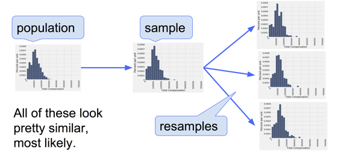
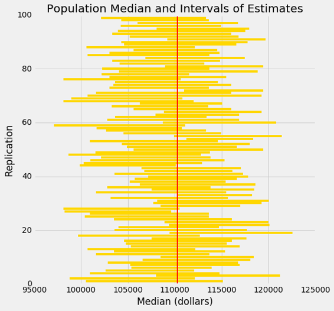
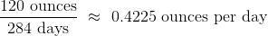

# 十一、估计

> 原文：[Estimation](https://github.com/data-8/textbook/tree/gh-pages/chapters/11)

> 译者：[飞龙](https://github.com/wizardforcel)

> 协议：[CC BY-NC-SA 4.0](http://creativecommons.org/licenses/by-nc-sa/4.0/)

> 自豪地采用[谷歌翻译](https://translate.google.cn/)


在前一章中，我们开始开发推断思维的方法。特别是，我们学会了如何使用数据，在世界的两个假设之间做决策。但是我们通常只想知道，某件事情有多大。

例如，在前面的章节中，我们调查了敌人可能拥有的战机数量。在选举年，我们可能想知道有多少选民赞成特定候选人。为了评估目前的经济状况，我们可能会对美国家庭年收入的中位数感兴趣。

在本章中，我们将开发一种估计未知参数的方法。请记住，参数是总体相关的数值。

要弄清参数的值，我们需要数据。如果我们有整个人口的相关数据，我们可以简单地计算参数。

但是，如果人口非常庞大（例如，如果它由美国的所有家庭组成），那么收集整个人口的数据可能过于昂贵和耗时。在这种情况下，数据科学家依赖从人口中随机抽样。

这导致了一个推断问题：如何根据随机样本中的数据，对未知参数做出正确的结论？我们将用推断思维来回答这个问题。

基于随机样本的统计量可能是总体中未知参数的合理估计。例如，你可能希望使用家庭样本的年收入中位数，来估计美国所有家庭的年收入中位数。

但任何统计量的值都取决于样本，样本基于随机抽取。所以每次数据科学家得到了一个基于随机样本的估计，他们都面临一个问题：

“如果样本是不同的，这个估计有多大的不同呢？”

在本章中，你将学习一种回答这个问题的方法。答案将为你提供工具来估算数值参数，并量化估算中的误差量。

我们将以百分位数开始。最有名的百分位数是中位数，通常用于收入数据的摘要。在我们即将开发的估计方法中，其他百分位数也是非常重要的。所以我们一开始要仔细定义百分位数。

## 百分位数

数值数据可以按照升序或降序排序。因此，数值数据集的值具有等级顺序。百分位数是特定等级的值。

例如，如果你的考试成绩在第 95 个百分位，一个常见的解释是只有 5% 的成绩高于你的成绩。中位数是第 50 个百分位；通常假定数据集中 50% 的值高于中值。

但是，给予百分位一个精确定义，适用于所有等级和所有列表，需要一些谨慎。为了明白为什么，考虑一个极端的例子，一个班级的所有学生在考试中得分为 75 分。那么 75 是中位数的自然候选，但是 50% 的分数高于 75 并不是真的。另外，75 同样是第 95 个或第 25 个百分位数，或任何其他百分位数的自然候选。在定义百分位数时，必须将重复 - 也就是相同的数据值 - 考虑在内。

当相关的索引不明确时，你还必须小心列表到底有多长。例如，10 个值的集合的第 87 个百分位数是多少？有序集合的第 8 个值，还是第 9 个，还是其中的某个位置？

### 数值的例子

在给出所有百分位数的一般定义之前，我们将把数值集合的第80个百分点定义为集合中的（一定条件的）最小值，它至少与所有值的 80% 一样大。

例如，考虑非洲，南极洲，亚洲，北美洲和南美洲五大洲的大小，四舍五入到最接近的百万平方英里。

```py
sizes = make_array(12, 17, 6, 9, 7)
```

第 80 个百分位数是（一定条件的）最小值，至少和 80% 的值一样大，也就是五个元素的五分之四。等于 12：

```py
np.sort(sizes)
array([ 6,  7,  9, 12, 17])
```

第 80 个百分位数是列表中的一个值，也就是 12。你可以看到，80% 的值小于等于它，并且它是列表中满足这个条件的最小值。

与之类似，第 70 个百分位数是该集合中（一定条件的）最小值，至少与 70% 的元素一样大。 现在 5 个元素中的 70% 是“3.5 个元素”，所以第 70 个百分位数是列表中的第 4 个元素。 它是 12，与这些数据的第 80 百分位数相同。

### `percentile`函数

`percentile`函数接受两个参数：一个 0 到 100 之间的等级，和一个数组。它返回数组相应的百分位数。

```py
percentile(70, sizes)
12
```

### 一般定义

令`p`为 0 到 100 之间的数字。集合的第`p`个百分位数是集合中的（一定条件）的最小值，它至少与`p%`的所有值一样大。

通过这个定义，可以计算任何值的集合的任何 0 到 100 之间的百分位数，并且它始终是集合的一个元素。

实际上，假设集合中有`n`个元素。 要找到第`p`个百分位数：

+   对集合升序排序。
+   计算`n`的`p%`：`(p/100) * n`。叫做`k`。
+   如果`k`是一个整数，则取有序集合的第`k`个元素。
+   如果`k`不是一个整数，则将其四舍五入到下一个整数，并采用有序集合的那个元素。

### 示例

`scores_and_sections`表包含 359 名学生，每个学生一行。 列是学生的讨论分组和期中分数。

```py
scores_and_sections = Table.read_table('scores_by_section.csv')
scores_and_sections
```


| Section | Midterm |
| --- | --- |
| 1 | 22 |
| 2 | 12 |
| 2 | 23 |
| 2 | 14 |
| 1 | 20 |
| 3 | 25 |
| 4 | 19 |
| 1 | 24 |
| 5 | 8 |
| 6 | 14 |

（省略了 349 列）

```py
scores_and_sections.select('Midterm').hist(bins=np.arange(-0.5, 25.6, 1))
```


分数的第 85 个百分位数是多少？ 为了使用`percentile`函数，创建包含期中分数的数组`scores`，并找到第 85 个百分位数：

```py
scores = scores_and_sections.column(1)
percentile(85, scores)
22
```

根据`percentile`函数，第 85 个百分点数是 22。为了检查这是否符合我们的新定义，我们直接应用定义。

首先，把分数升序排列：

```py
sorted_scores = np.sort(scores_and_sections.column(1))
```
数组中有 359 个分数。所以下面，计算 359 的 85%，它是 305.15。

```py
0.85 * 359
305.15
```

这不是一个整数。 根据我们的定义，中位数是`sorted_scores`的第 306 个元素，按 Python 的索引约定，它是数组的第 305 项。

```py
# The 306th element of the sorted array

sorted_scores.item(305)
22
```

它和我们通过使用`percentile`得到的答案一样。以后，我们会仅仅使用`percentile`。

### 四分位数

数值集合的第一个四分位数是第 25 个百分分数。 这个术语（quartile）来自第一个季度（quarter）。 第二个四分位数是中位数，第三个四分位数是第 75 个百分位数。

对于我们的分数数据，这些值是：

```py
percentile(25, scores)
11
percentile(50, scores)
16
percentile(75, scores)
20
```

分数的分布有时归纳为“中等 50%”区间，在第一和第三个四分位数之间。

## 自举法

一个数据科学家正在使用随机样本中的数据来估计未知参数。她使用样本来计算用作估计值的统计量。

一旦她计算出了统计量的观察值，她就可以把它作为她的估计值，然后顺其自然。 但她是一名数据科学家。 她知道她的随机样本只是众多可能的随机样本之一，因此她的估计只是众多合理估算之一。

这些估计的变化有多大？ 为了回答这个问题，似乎她需要从总体中抽取另一个样本，并根据新样本计算一个新的估计值。 但是她没有资源来回到总体中，再抽取一个样本。

这个数据科学家看起来好像卡住了。

幸运的是，一个叫做自举法的好主意可以帮助她。 由于从总体中生成新样本是不可行的，自举法通过称为重采样的方法生成新的随机样本：新样本从原始样本中随机抽取。

在本节中，我们将看到自举法的工作方式和原因。 在本章的其余部分，我们将使用自举法进行推理。

### 旧金山市的雇员薪资

[SF OpenData](https://data.sfgov.org/) 是一个网站，旧金山市和县在上面公开提供他们的一些数据。 其中一个数据集包含城市雇员的薪资数据。 其中包括市营医院的医疗专业人员，警察，消防员，运输工人，民选官员以及市内所有其他雇员。

2015 日历年的薪资数据见表`sf2015`。

```py
sf2015 = Table.read_table('san_francisco_2015.csv')
sf2015
```

| Year Type | Year | Organization Group Code | Organization Group | Department Code | Department | Union Code | Union | Job Family Code | Job Family | Job Code | Job | Employee Identifier | Salaries | Overtime | Other Salaries | Total Salary | Retirement | Health/Dental | Other Benefits | Total Benefits | Total Compensation |
| --- | --- | --- | --- | --- | --- | --- | --- | --- | --- | --- | --- | --- | --- | --- | --- | --- | --- | --- | --- | --- | --- |
| Calendar | 2015 | 2 | Public Works, Transportation & Commerce | WTR | PUC Water Department | 21 | Prof & Tech Engineers - Miscellaneous, Local 21 | 2400 | Lab, Pharmacy & Med Techs | 2481 | Water Qualitytech I/II | 21538 | 82146 | 0 | 0 | 82146 | 16942.2 | 12340.9 | 6337.73 | 35620.8 | 117767 |
| Calendar | 2015 | 2 | Public Works, Transportation & Commerce | DPW | General Services Agency - Public Works | 12 | Carpet, Linoleum and Soft Tile Workers, Local 12 | 7300 | Journeyman Trade | 7393 | Soft Floor Coverer | 5459 | 32165.8 | 973.19 | 848.96 | 33987.9 | 0 | 4587.51 | 2634.42 | 7221.93 | 41209.8 |
| Calendar | 2015 | 4 | Community Health | DPH | Public Health | 790 | SEIU - Miscellaneous, Local 1021 | 1600 | Payroll, Billing & Accounting | 1636 | Health Care Billing Clerk 2 | 41541 | 71311 | 5757.98 | 0 | 77069 | 14697.6 | 12424.5 | 6370.06 | 33492.2 | 110561 |
| Calendar | 2015 | 4 | Community Health | DPH | Public Health | 351 | Municipal Executive Association - Miscellaneous | 0900 | Management | 2620 | Food Service Mgr Administrator | 26718 | 28430.2 | 0 | 763.07 | 29193.3 | 0 | 4223.14 | 5208.51 | 9431.65 | 38625 |
| Calendar | 2015 | 2 | Public Works, Transportation & Commerce | MTA | Municipal Transportation Agency | 790 | SEIU - Miscellaneous, Local 1021 | 8200 | Protection & Apprehension | 8201 | School Crossing Guard | 45810 | 7948.75 | 0 | 0 | 7948.75 | 0 | 2873.17 | 616.24 | 3489.41 | 11438.2 |
| Calendar | 2015 | 1 | Public Protection | POL | Police | 911 | Police Officers' Association | Q000 | Police Services | Q002 | Police Officer | 32906 | 2235 | 0 | 0 | 2235 | 490.36 | 286.72 | 176.57 | 953.65 | 3188.65 |
| Calendar | 2015 | 4 | Community Health | DPH | Public Health | 791 | SEIU - Staff and Per Diem Nurses, Local 1021 | 2300 | Nursing | 2328 | Nurse Practitioner | 7506 | 187247 | 0 | 11704.1 | 198951 | 37683.7 | 12424.5 | 11221.7 | 61329.9 | 260281 |
| Calendar | 2015 | 2 | Public Works, Transportation & Commerce | MTA | Municipal Transportation Agency | 253 | Transport Workers - Transit Operators, Local 250-A | 9100 | Street Transit | 9163 | Transit Operator | 36773 | 66988.5 | 3512.88 | 2770.39 | 73271.8 | 19127.2 | 13203 | 5455.1 | 37785.3 | 111057 |
| Calendar | 2015 | 6 | General Administration & Finance | CAT | City Attorney | 311 | Municipal Attorneys' Association | 8100 | Legal & Court | 8177 | Attorney (Civil/Criminal) | 12963 | 135190 | 0 | 1562.5 | 136752 | 27501.8 | 12424.5 | 10103 | 50029.3 | 186781 |
| Calendar | 2015 | 3 | Human Welfare & Neighborhood Development | DSS | Human Services | 535 | SEIU - Human Services, Local 1021 | 9700 | Community Development | 9703 | Emp & Training Spec 2 | 35179 | 70474.8 | 147.28 | 1647.24 | 72269.3 | 14650.3 | 10696.9 | 5993.11 | 31340.3 | 103610 |

（省略了 42979 行）

共有 42,979 名员工，每个人一行。 有许多列包含市政部门隶属关系的信息，以及员工薪酬方案不同部分的详细信息。 这是对应市长 Ed Lee 的一行。

```py
sf2015.where('Job', are.equal_to('Mayor'))
```

| Year Type | Year | Organization Group Code | Organization Group | Department Code | Department | Union Code | Union | Job Family Code | Job Family | Job Code | Job | Employee Identifier | Salaries | Overtime | Other Salaries | Total Salary | Retirement | Health/Dental | Other Benefits | Total Benefits | Total Compensation |
| --- | --- | --- | --- | --- | --- | --- | --- | --- | --- | --- | --- | --- | --- | --- | --- | --- | --- | --- | --- | --- | --- |
| Calendar | 2015 | 6 | General Administration & Finance | MYR | Mayor | 556 | Elected Officials | 1100 | Administrative & Mgmt (Unrep) | 1190 | Mayor | 22433 | 288964 | 0 | 0 | 288964 | 58117 | 12424.5 | 20293 | 90834.5 | 379798 |

我们要研究最后一栏，总薪酬。 这是员工的工资加上市政府对退休和福利计划的贡献。

日历年的财务方案有时难以理解，因为它们取决于雇用日期，员工是否在城市内部换工作等等。 例如，`Total Compensation`列中的最低值看起来有点奇怪。

```py
sf2015.sort('Total Compensation')
```

| Year Type | Year | Organization Group Code | Organization Group | Department Code | Department | Union Code | Union | Job Family Code | Job Family | Job Code | Job | Employee Identifier | Salaries | Overtime | Other Salaries | Total Salary | Retirement | Health/Dental | Other Benefits | Total Benefits | Total Compensation |
| --- | --- | --- | --- | --- | --- | --- | --- | --- | --- | --- | --- | --- | --- | --- | --- | --- | --- | --- | --- | --- | --- |
| Calendar | 2015 | 1 | Public Protection | FIR | Fire Department | 798 | Firefighters - Miscellaneous, Local 798 | H000 | Fire Services | H002 | Firefighter | 43833 | 0 | 0 | 0 | 0 | 0 | 0 | -423.76 | -423.76 | -423.76 |
| Calendar | 2015 | 4 | Community Health | DPH | Public Health | 790 | SEIU - Miscellaneous, Local 1021 | 9900 | Public Service Aide | 9924 | PS Aide Health Services | 27871 | -292.4 | 0 | 0 | -292.4 | 0 | -95.58 | -22.63 | -118.21 | -410.61 |
| Calendar | 2015 | 1 | Public Protection | JUV | Juvenile Probation | 790 | SEIU - Miscellaneous, Local 1021 | 8300 | Correction & Detention | 8320 | Counselor, Juvenile Hall | 10517 | 0 | 0 | 0 | 0 | 0 | 0 | -159.12 | -159.12 | -159.12 |
| Calendar | 2015 | 6 | General Administration & Finance | CPC | City Planning | 21 | Prof & Tech Engineers - Miscellaneous, Local 21 | 1000 | Information Systems | 1053 | IS Business Analyst-Senior | 18961 | 0 | 0 | 0 | 0 | 0 | 0 | -26.53 | -26.53 | -26.53 |
| Calendar | 2015 | 6 | General Administration & Finance | CPC | City Planning | 21 | Prof & Tech Engineers - Miscellaneous, Local 21 | 5200 | Professional Engineering | 5277 | Planner 1 | 19387 | 0 | 0 | 0 | 0 | 0 | 0 | -9.51 | -9.51 | -9.51 |
| Calendar | 2015 | 2 | Public Works, Transportation & Commerce | PUC | PUC Public Utilities Commission | 21 | Prof & Tech Engineers - Miscellaneous, Local 21 | 1000 | Information Systems | 1044 | IS Engineer-Principal | 28988 | 0 | 0 | 0 | 0 | 0 | 0 | -3.1 | -3.1 | -3.1 |
| Calendar | 2015 | 1 | Public Protection | JUV | Juvenile Probation | 39 | Stationary Engineers, Local 39 | 7300 | Journeyman Trade | 7335 | Senior Stationary Engineer | 19125 | 0 | 0 | 0 | 0 | 0 | 0 | -0.01 | -0.01 | -0.01 |
| Calendar | 2015 | 1 | Public Protection | ECD | Department of Emergency Management | 351 | Municipal Executive Association - Miscellaneous | 0900 | Management | 0922 | Manager I | 30025 | 0 | 0 | 0 | 0 | 0 | 0 | 0 | 0 | 0 |
| Calendar | 2015 | 7 | General City Responsibilities | UNA | General Fund Unallocated | 790 | SEIU - Miscellaneous, Local 1021 | 3200 | Recreation | 3280 | Assistant Recreation Director | 49784 | 0 | 0 | 0 | 0 | 0 | 0 | 1.27 | 1.27 | 1.27 |
| Calendar | 2015 | 4 | Community Health | DPH | Public Health | 250 | SEIU - Health Workers, Local 1021 | 2600 | Dietary & Food | 2654 | Cook | 26768 | 0 | 0 | 2.21 | 2.21 | 0 | 0 | 0.17 | 0.17 | 2.38 |

（省略了 42979 行）

为了便于比较，我们将专注于那些工作时间相当于至少半年的人。 最低工资约为每小时 10 美元，52 周每周 20 小时，工资约为 1 万美元。

```py
sf2015 = sf2015.where('Salaries', are.above(10000))
sf2015.num_rows
36569
```

### 总体和参数

让这张超过 36500 行的表格成为我们的总体。 这是总薪资的直方图。

```py
sf_bins = np.arange(0, 700000, 25000)
sf2015.select('Total Compensation').hist(bins=sf_bins)
```


虽然大部分值都低于 300,000 美元，但有一些还是比较高的。 例如，首席投资官的总薪资不多是 65 万美元。 这就是为什么横轴延伸到了 700,000 美元。

```py
sf2015.sort('Total Compensation', descending=True).show(2)
```

| Year Type | Year | Organization Group Code | Organization Group | Department Code | Department | Union Code | Union | Job Family Code | Job Family | Job Code | Job | Employee Identifier | Salaries | Overtime | Other Salaries | Total Salary | Retirement | Health/Dental | Other Benefits | Total Benefits | Total Compensation |
| --- | --- | --- | --- | --- | --- | --- | --- | --- | --- | --- | --- | --- | --- | --- | --- | --- | --- | --- | --- | --- | --- |
| Calendar | 2015 | 6 | General Administration & Finance | RET | Retirement System | 351 | Municipal Executive Association - Miscellaneous | 1100 | Administrative & Mgmt (Unrep) | 1119 | Chief Investment Officer | 46881 | 507832 | 0 | 0 | 507832 | 105053 | 12424.5 | 23566.2 | 141044 | 648875 |
| Calendar | 2015 | 6 | General Administration & Finance | ADM | General Services Agency - City Admin | 164 | Physicians and Dentists - Miscellaneous | 2500 | Med Therapy & Auxiliary | 2598 | Asst Med Examiner | 1016 | 279311 | 3829.36 | 114434 | 397574 | 56211.6 | 12424.5 | 14299.1 | 82935.2 | 480509 |

（省略了 36567 行）

现在让参数为总薪资的中位数。

既然我们有能力从总体中得到所有数据，我们可以简单计算参数：

```py
pop_median = percentile(50, sf2015.column('Total Compensation'))
pop_median
110305.78999999999
```

所有员工的薪酬总额的中位数刚刚超过 110,300 美元。

从实际的角度来看，我们没有理由抽取样本来估计这个参数，因为我们只是知道它的值。 但在本节中，我们假装不知道这个值，看看我们如何根据随机样本来估计它。

在后面的章节中，我们将回到现实，在参数未知的情况下工作。 就目前而言，我们是无所不知的。

### 随机样本和估计

让我们无放回地随机抽取 500 名员工的样本，并将所选员工的总薪酬的中位数作为我们的参数估计量。

```py
our_sample = sf2015.sample(500, with_replacement=False)
our_sample.select('Total Compensation').hist(bins=sf_bins)
```


```py
est_median = percentile(50, our_sample.column('Total Compensation'))
est_median
113598.99000000001
```

样本量很大。 根据平均定律，样本的分布与总体的分布相似，因此样本中位数与总体中位数相差不大（尽管当然并不完全相同）。

所以现在我们有了参数的估计。 但是，如果样本是不同的，估计的值也会不同。 我们希望能够量化估计的值在不同样本间的差异。 这个变化的测量将有助于我们衡量我们可以将参数估计得多么准确。

为了查看样本有多么不同，我们可以从总体中抽取另一个样本，但这样做就作弊了。 我们正试图模仿现实生活，我们不能掌握所有的人口数据。

用某种方式，我们必须得到另一个随机样本，而不从总体中抽样。

### 自举法：从样本中重采样

我们所做的是，从样本中随机抽样。 我们知道了，大型随机样本可能类似于用于抽取的总体。 这一观察使得数据科学家可以通过自举来提升自己：抽样过程可以通过从样本中抽样来复制。

以下是自举法的步骤，用于生成类似总体的另一个随机样本：

+   将原始样本看做总体。
+   从样本中随机抽取样本，与原始样本大小相同。

二次样本的大小与原始样本相同很重要。 原因是估计量的变化取决于样本的大小。 由于我们的原始样本由 500 名员工组成，我们的样本中位数基于 500 个值。 为了看看样本变化多少，我们必须将其与 500 个其他样本的中位数进行比较。

如果我们从大小为 500 的样本中，无放回地随机抽取了 500 次，我们只会得到相同的样本。 通过带放回抽取，我们就可以让新样本与原始样本不同，因为有些员工可能会被抽到一次以上，其他人则完全不会。

为什么这是一个好主意？ 按照平均定律，原始样本的分布可能与总体相似，所有“二次样本”的分布可能与原始样本相似。 因此，所有二次样本的分布也可能与总体相似。



### 二次样本的中位数

回想一下，使用`sample`方法而没有指定样本大小时，默认情况下样本大小等于用于抽取样本的表的行数。 这是完美的自举！ 这是从原始样本中抽取的一个新样本，以及相应的样本中位数。

```py
resample_1 = our_sample.sample()
resample_1.select('Total Compensation').hist(bins=sf_bins)
```


```py
resampled_median_1 = percentile(50, resample_1.column('Total Compensation'))
resampled_median_1
110001.16
```

通过重采样，我们有了总体中位数的另一个估计。 通过一次又一次的重采样，我们得到许多这样的估计，因此有了估计的经验分布。

```py
resample_2 = our_sample.sample()
resampled_median_2 = percentile(50, resample_2.column('Total Compensation'))
resampled_median_2
110261.39999999999
```

### 自举样本中位数的经验分布

让我们定义一个函数`bootstrap_median`，该函数接受我们的原始样本，包含变量的列的标签，以及我们想要的自举样本的数量，并返回二次样本的相应中值的数组。

每次我们重采样并找到中位数，我们重复自举过程。 所以自举样本的数量将被称为重复数量。

```py
def bootstrap_median(original_sample, label, replications):
    """Returns an array of bootstrapped sample medians:
    original_sample: table containing the original sample
    label: label of column containing the variable
    replications: number of bootstrap samples
    """
    just_one_column = original_sample.select(label)
    medians = make_array()
    for i in np.arange(replications):
        bootstrap_sample = just_one_column.sample()
        resampled_median = percentile(50, bootstrap_sample.column(0))
        medians = np.append(medians, resampled_median)

    return medians
```

我们现在将自举过程重复 5000 次。 数组`bstrap_medians`包含所有 5,000 个自举样本的中位数。 注意代码的运行时间比我们以前的代码要长。 因为要做很多重采样！

```py
bstrap_medians = bootstrap_median(our_sample, 'Total Compensation', 5000)
```

这是 5000 个中位数的直方图。 红点是总体的参数：它是整个总体的中位数，我们碰巧知道但没有在自举过程中使用。

```py
resampled_medians = Table().with_column('Bootstrap Sample Median', bstrap_medians)

#median_bins=np.arange(100000, 130000, 2500)
#resampled_medians.hist(bins = median_bins)
resampled_medians.hist()

plots.scatter(pop_median, 0, color='red', s=30);
```


重要的是要记住，红点是固定的：110,305.79 美元，总体的中位数。 经验直方图是随机抽取的结果，将相对于红点随机定位。

请记住，所有这些计算的重点是估计人口中位数，它是红点。我们的估计是所有随机生成的样本中位数，它们的直方图你在上面看到了。 我们希望这些估计量包含参数 - 如果没有，它们就脱线了。

### 估计量是否捕获了参数

红点正好落在二次样本的中位数的经验直方图中间，而不是尾部的几率有多少？ 要回答这个问题，我们必须定义“中间”。 让我们将它看做“红点落在二次样本的中位数的中间 95%”。

以下是二次采样中位数的“中间 95%”的两端：

```py
left = percentile(2.5, bstrap_medians)
left
107652.71000000001
right = percentile(97.5, bstrap_medians)
right
119256.73
```

总体中位数 110,305 美元在这两个数中间。下面的直方图展示了区间和总体中位数。

```py
#median_bins=np.arange(100000, 130000, 2500)
#resampled_medians.hist(bins = median_bins)
resampled_medians.hist()

plots.plot(make_array(left, right), make_array(0, 0), color='yellow', lw=3, zorder=1)
plots.scatter(pop_median, 0, color='red', s=30, zorder=2);
```


我们例子中，估计量的“中间 95%”的区间捕获了参数。 但是，这是一个偶然吗？

要查看区间包含参数的频率，我们必须一遍又一遍地运行整个过程。具体而言，我们将重复以下过程 100 次：

+   从总体中抽取一个大小为 500 的原始样本。
+   执行 5000 次重复的自举过程，并生成二次样本的中位数的“中间 95％”的区间。
+   我们最后得到了 100 个区间，并计算其中有多少个包含总体中位数。

剧透警告：自举的统计理论表明，这个数字应该在 95 左右。它可能高于或低于 95，但不会离得太远。

```py
# THE BIG SIMULATION: This one takes several minutes.

# Generate 100 intervals, in the table intervals

left_ends = make_array()
right_ends = make_array()

total_comps = sf2015.select('Total Compensation')

for i in np.arange(100):
    first_sample = total_comps.sample(500, with_replacement=False)
    medians = bootstrap_median(first_sample, 'Total Compensation', 5000)
    left_ends = np.append(left_ends, percentile(2.5, medians))
    right_ends = np.append(right_ends, percentile(97.5, medians))

intervals = Table().with_columns(
    'Left', left_ends,
    'Right', right_ends
)    
```

对于 100 个重复中的每个，我们得到了一个中位数估计量的区间。

```py
intervals
```

| Left | Right |
| --- | --- |
| 100547 | 115112 |
| 98788.4 | 112129 |
| 107981 | 121218 |
| 100965 | 114796 |
| 102596 | 112056 |
| 105386 | 113909 |
| 105225 | 116918 |
| 102844 | 116712 |
| 106584 | 118054 |
| 108451 | 118421 |

（省略了 90 行）

良好的区间是那些包含我们试图估计的参数的区间。 通常参数是未知的，但在本节中，我们碰巧知道参数是什么。

```py
pop_median
110305.78999999999
```

100 个区间中有多少个包含总体中位数？ 这是左端低于且右端高于总体中位数的区间数量。

```py
intervals.where('Left', are.below(pop_median)).where('Right', are.above(pop_median)).num_rows
95
```

构建所有区间需要花费几分钟时间，但如果你有耐心，请再试一次。最有可能的是，100 个区间中有大约 95 个将是良好的：它们将包含参数。

因为它们有较大的重叠，所以很难在横轴上显示所有的区间 - 毕竟，它们都试图估计相同的参数。下图通过竖直堆叠，在相同轴域上展示的每个区间。纵轴简单地是重复的序号，区间从中生成。

红线是参数所在的位置。良好的区间覆盖了参数；通常有大约 95 个。

如果一个区间不能覆盖这个参数，就是个糟糕的事情。在这个地方，你可以看到红线周围的“亮光”。他们中只有很少 - 通常是大约 5 个 - 但是他们确实存在。

任何基于抽样的方法都有可能脱线。基于随机抽样的方法的优点是，我们可以量化它们可能脱线的频率。



为了总结模拟所示的内容，假设你通过以下过程来估计总体中位数：

从总体中随机抽取一个大样本。
自举你的随机样本，并从新的随机样本中获取估计量。
重复上述步骤数千次，并获得数千个估计量。
挑选所有估计量的“中间 95％”的区间。
这给了你一个估计量的区间。现在，如果重复整个过程 100 次，会得到 100 个区间，那么 100 个区间中的大约 95 个将包含总体的参数。

换句话说，95% 的时间内，这个估计过程捕获了参数。

你可以用一个不同的值代替 95%，只要它不是 100。假设你用 80% 代替了 95%，并保持样本大小为 500。那么你的估计量的区间将比我们这里的模拟要短，因为“中间 80％”是比“中间 95％”更小的范围。只有大约 80% 的区间将包含参数。

## 置信区间

我们已经开发了一种方法，通过使用随机抽样和自举来估计参数。我们的方法产生一个估计区间，来解释随机样本的机会变异。通过提供一个估计区间而不是一个估计量，我们给自己一些回旋的余地。

在前面的例子中，我们看到我们的估计过程在 95% 的时间内产生了一个良好的区间，一个“良好”的区间就是包含这个参数的区间。对于这个过程的结果很好，我们说我们有 95% 的置信度（信心）。我们的估计区间称为参数的 95% 置信区间，95% 称为区间的置信度。

前一个例子中的情况有点不寻常。因为我们碰巧知道参数的值，所以我们能够检查一个区间是好还是不好，这反过来又帮助我们看到，我们的估计过程每 100 次中有 95 次捕获了参数。

但通常情况下，数据科学家不知道参数的值。这就是他们首先想要估计的原因。在这种情况下，他们通过使用一些方法，类似我们开发的方法，获得未知参数的估计区间。由于统计理论，和我们所看到的演示，数据科学家可以确信，他们产生区间的过程，会以已知百分比的几率，产生一个良好的区间。

### 总体中位数的置信区间：自举百分位数方法

现在我们使用自举法来估计未知总体的中位数。 数据来自大型医院系统中的新生儿样本; 我们将把它看作是一个简单的随机样本，虽然抽样分多个阶段完成。 Deborah Nolan 和 Terry Speed 的 Stat Labs 拥有一个大数据集的详细信息，这个样本是从中抽取的。

`baby`表中包含以下母婴偶对的数量：婴儿的出生体重（盎司），孕期天数，母亲的年龄，母亲身高（英寸），孕期体重（磅），母亲是否在孕期吸烟。

```py
baby = Table.read_table('baby.csv')
baby
```


| Birth Weight | Gestational Days | Maternal Age | Maternal Height | Maternal Pregnancy Weight | Maternal Smoker |
| --- | --- | --- | --- | --- | --- |
| 120 | 284 | 27 | 62 | 100 | False |
| 113 | 282 | 33 | 64 | 135 | False |
| 128 | 279 | 28 | 64 | 115 | True |
| 108 | 282 | 23 | 67 | 125 | True |
| 136 | 286 | 25 | 62 | 93 | False |
| 138 | 244 | 33 | 62 | 178 | False |
| 132 | 245 | 23 | 65 | 140 | False |
| 120 | 289 | 25 | 62 | 125 | False |
| 143 | 299 | 30 | 66 | 136 | True |
| 140 | 351 | 27 | 68 | 120 | False |

（省略了 1164 行）

出生体重是新生儿健康的一个重要因素 - 较小的婴儿比较大的婴儿在初期需要更多的医疗护理。 因此，在婴儿出生前估计出生体重是有帮助的。 一种方法是检查出生体重和怀孕天数之间的关系。

这种关系的一个简单的衡量标准是出生体重与怀孕天数的比值。`ratios`表包含`baby`的前两列，以及一列`ratios`。 这一列的第一个条目按以下方式计算：



```py
ratios = baby.select('Birth Weight', 'Gestational Days').with_column(
    'Ratio BW/GD', baby.column('Birth Weight')/baby.column('Gestational Days')
)
ratios
```


| Birth Weight | Gestational Days | Ratio BW/GD |
| --- | --- | --- | --- |
| 120 | 284 | 0.422535 |
| 113 | 282 | 0.400709 |
| 128 | 279 | 0.458781 |
| 108 | 282 | 0.382979 |
| 136 | 286 | 0.475524 |
| 138 | 244 | 0.565574 |
| 132 | 245 | 0.538776 |
| 120 | 289 | 0.415225 |
| 143 | 299 | 0.478261 |
| 140 | 351 | 0.39886 |

（省略了 1164 行）

```py
ratios.select('Ratio BW/GD').hist()
```


一眼望去，直方图看起来相当对称，密度在 4opd 到 4.5opd 的区间内是最大的。 但仔细一看，就可以看出一些比例相当大。 比率的最大值刚好超过 0.78opd，几乎是通常值的两倍。

```py
ratios.sort('Ratio BW/GD', descending=True).take(0)
```


| Birth Weight | Gestational Days | Ratio BW/GD |
| --- | --- | --- |
| 116 | 148 | 0.783784 |

中位数提供了通常比例的感觉，因为它不受非常大或非常小的比例的影响。 样本（比值）的中位数约为 0.429opd。

```py
np.median(ratios.column(2))
0.42907801418439717
```

但是总体中位数是多少？ 我们不知道，所以我们会估计它。

我们的方法将与前一节完全相同。 我们将自举样本 5000 次，结果是 5000 个中位数的估计量。 我们 95% 的置信区间将是我们所有估计量的“中间 95%”。

回忆前一节定义的`bootstrap_median`函数。 我们将调用这个函数，并构造总体（比值）中位数的 95% 置信区间。请记住，`ratios`表包含来自我们的原始样本的相关数据。

```py
def bootstrap_median(original_sample, label, replications):

    """Returns an array of bootstrapped sample medians:
    original_sample: table containing the original sample
    label: label of column containing the variable
    replications: number of bootstrap samples
    """

    just_one_column = original_sample.select(label)
    medians = make_array()
    for i in np.arange(replications):
        bootstrap_sample = just_one_column.sample()
        resampled_median = percentile(50, bootstrap_sample.column(0))
        medians = np.append(medians, resampled_median)

    return medians
# Generate the medians from 5000 bootstrap samples
bstrap_medians = bootstrap_median(ratios, 'Ratio BW/GD', 5000)
# Get the endpoints of the 95% confidence interval
left = percentile(2.5, bstrap_medians)
right = percentile(97.5, bstrap_medians)

make_array(left, right)
array([ 0.42545455,  0.43262411])
```

95% 置信区间是 0.425opd 到 0.433opd。 我们估计的总体（出生重量与怀孕天数的比值）中位数，在 0.425opd 到 0.433opd 的范围内。

基于原始样本的估计量 0.429 恰好在区间两端的中间，尽管这通常不是真的。

为了使我们的结果可视化，让我们画出我们自举的中位数的经验直方图，并将置信区间置于横轴上。

```py
resampled_medians = Table().with_column(
    'Bootstrap Sample Median', bstrap_medians
)
resampled_medians.hist(bins=15)
plots.plot(make_array(left, right), make_array(0, 0), color='yellow', lw=8);
```


这个直方图和区间就像我们在前一节中绘制的直方图和区间，只有一个很大的区别 - 没有显示参数的红点。 我们不知道这个点应该在哪里，或者它是否在区间中。

我们只是有一个估计区间。 这是估计量的 95% 置信区间，因为生成它的过程在 95% 的时间中产生了良好的区间。 那肯定是在随机猜测！

请记住，这个区间是一个大约 95% 的置信区间。 计算中涉及到很多近似值。 近似值并不差，但并不准确。

### 总体均值的置信区间：自举百分位数方法

我们为中位数所做的事情也可以用于均值。 假设我们想估计总体中的母亲的平均年龄。 自然估计量是样本中的母亲的平均年龄。 这是他们的年龄分布，他们的平均年龄大约是 27.2 岁。

```py
baby.select('Maternal Age').hist()
```


```py
np.mean(baby.column('Maternal Age'))
27.228279386712096
```

母亲的平均年龄是多少？ 我们不知道这个参数的值。

我们用自举法来估计未知参数。 为此，我们将编辑`bootstrap_median`的代码，而不是定义函数`bootstrap_mean`。 代码是相同的，除了统计量是代替中位数的均值，并且收集在一个名为`means`而不是`medians`的数组中。

```py
def bootstrap_mean(original_sample, label, replications):

    """Returns an array of bootstrapped sample means:
    original_sample: table containing the original sample
    label: label of column containing the variable
    replications: number of bootstrap samples
    """

    just_one_column = original_sample.select(label)
    means = make_array()
    for i in np.arange(replications):
        bootstrap_sample = just_one_column.sample()
        resampled_mean = np.mean(bootstrap_sample.column(0))
        means = np.append(means, resampled_mean)

    return means
# Generate the means from 5000 bootstrap samples
bstrap_means = bootstrap_mean(baby, 'Maternal Age', 5000)

# Get the endpoints of the 95% confidence interval
left = percentile(2.5, bstrap_means)
right = percentile(97.5, bstrap_means)

make_array(left, right)
array([ 26.89778535,  27.55962521])
```

95% 置信区间是约 26.9 岁到约 27.6 岁。 也就是说，我们估计的母亲的平均年龄在 26.9 岁到 27.6 岁之间。

注意两端距原始样本均值 27.2 岁的距离。 样本量非常大 - 1174 个母亲 - 所以样本均值变化不大。 我们将在下一章进一步探讨这个观察。

下面显示了 5000 个自举均值的经验直方图，以及总体均值的 95% 置信区间。

```py
resampled_means = Table().with_column(
    'Bootstrap Sample Mean', bstrap_means
)
resampled_means.hist(bins=15)
plots.plot(make_array(left, right), make_array(0, 0), color='yellow', lw=8);
```


原始样本的均值（27.23 岁）同样接近区间中心。 这并不奇怪，因为每个自举样本都是从相同的原始样本中抽取的。 自举样本的均值大约对称分布原始样本（从其中抽取）的均值的两侧。

还要注意，即使所采样的年龄的直方图完全不是对称的，二次样本的均值的经验直方图也是大致对称的钟形：

```py
baby.select('Maternal Age').hist()
```


这是概率统计的中心极限定理的结果。 在后面的章节中，我们将看到这个定理是什么。

### 80% 置信区间

你可以使用自举法来构建任意水平的置信区间。 例如，要为总体中的平均年龄构建 80% 置信区间，可以选取二次样本的均值的“中间 80%”。 所以你会希望为两个尾巴的每一个分配 10%，因此端点是二次样本的均值的第 10 和第 90 个百分位数。

```py
left_80 = percentile(10, bstrap_means)
right_80 = percentile(90, bstrap_means)
make_array(left_80, right_80)
array([ 27.01192504,  27.439523  ])
resampled_means.hist(bins=15)
plots.plot(make_array(left_80, right_80), make_array(0, 0), color='yellow', lw=8);
```


这个 80% 置信区间比 95% 置信区间要短得多。 它只是约定 27.0 岁到约 27.4 岁。 虽然这是估计量的较窄区间，你知道这个过程在 80% 的时间内产生良好的区间。

之前过程产生了较宽的区间，但是我们对产生它的过程拥有更高的置信度。

为了以较高的置信度获得较窄的置信区间，你必须从较大的样本开始。 我们将在下一章看到为什么。

### 总体比例的置信区间：自举百分位数方法

在样本中，39% 的母亲在怀孕期间吸烟。

```py
baby.where('Maternal Smoker', are.equal_to(True)).num_rows/baby.num_rows
0.3909710391822828
```

以下对观察很实用，这个比例也可以通过数组操作来计算：

```py
smoking = baby.column('Maternal Smoker')
np.count_nonzero(smoking)/len(smoking)
0.3909710391822828
```

> 译者注：

> `np.count_nonzero(arr)`等价于`np.sum(arr != 0)`。

总体中有百分之多少的母亲在怀孕期间吸烟？ 这是一个未知的参数，我们可以通过自举置信区间来估计。 这个过程中的步骤与我们用来估计总体均值和中位数的步骤相似。

我们将首先定义一个函数`bootstrap_proportion`，返回一个自举样本的比例的数组。 我们再一次通过编辑`bootstrap_median`的定义来实现它。 计算中唯一的变化是用二次样本的吸烟者比例代替中位数。 该代码假定数据列由布尔值组成。 其他的改变只是数组的名字，来帮助我们阅读和理解我们的代码。

```py
def bootstrap_proportion(original_sample, label, replications):

    """Returns an array of bootstrapped sample proportions:
    original_sample: table containing the original sample
    label: label of column containing the Boolean variable
    replications: number of bootstrap samples
    """

    just_one_column = original_sample.select(label)
    proportions = make_array()
    for i in np.arange(replications):
        bootstrap_sample = just_one_column.sample()
        resample_array = bootstrap_sample.column(0)
        resampled_proportion = np.count_nonzero(resample_array)/len(resample_array)
        proportions = np.append(proportions, resampled_proportion)

    return proportions
```

让我们使用`bootstrap_proportion`来构建总体的母亲吸烟者百分比的 95% 置信区间。 该代码类似于均值和中位数的相应代码。

```py
# Generate the proportions from 5000 bootstrap samples
bstrap_props = bootstrap_proportion(baby, 'Maternal Smoker', 5000)

# Get the endpoints of the 95% confidence interval
left = percentile(2.5, bstrap_props)
right = percentile(97.5, bstrap_props)

make_array(left, right)
array([ 0.36286201,  0.41908007])
```

置信区间是 36% 到 42%。原始样本的百分比 39% 非常接近于区间的中心。你可以在下面看到：

```py
resampled_proportions = Table().with_column(
    'Bootstrap Sample Proportion', bstrap_props
)
resampled_proportions.hist(bins=15)
plots.plot(make_array(left, right), make_array(0, 0), color='yellow', lw=8);
```


### 自举法的注意事项

自举法是一个优雅而强大的方法。在使用之前，记住一些要点非常重要。

以大型随机样本开始。如果你不这样做，该方法可能无法正常工作。它的成功基于大型随机样本（因此也从样本中重采样）。平均定律说，如果随机样本很大，这很可能是真的。

为了近似统计量的概率分布，最好多次复制重采样过程。数千次重复将产生样本中位数分布的正确近似，特别是如果总体分布存在峰值并且不是非常不对称的话。在我们的例子中，我们使用了 5000 次重复，但一般会推荐 10000 次。

自举百分位数方法适用于基于大型随机样本，估计总体中位数或均值。但是，它也有其局限性，所有的估计方法也是如此。例如，在以下情况下，它预期没有效果。

+   目标是估计总体中的最小值或最大值，或非常低或非常高的百分位数，或受总体中稀有元素影响较大的参数。
+   统计量的概率分布不是近似钟形的。
+   原始样本非常小，比如 10 或 15。

## 使用置信区间

```py
def bootstrap_median(original_sample, label, replications):

    """Returns an array of bootstrapped sample medians:
    original_sample: table containing the original sample
    label: label of column containing the variable
    replications: number of bootstrap samples
    """

    just_one_column = original_sample.select(label)
    medians = make_array()
    for i in np.arange(replications):
        bootstrap_sample = just_one_column.sample()
        resampled_median = percentile(50, bootstrap_sample.column(0))
        medians = np.append(medians, resampled_median)

    return medians
def bootstrap_mean(original_sample, label, replications):

    """Returns an array of bootstrapped sample means:
    original_sample: table containing the original sample
    label: label of column containing the variable
    replications: number of bootstrap samples
    """

    just_one_column = original_sample.select(label)
    means = make_array()
    for i in np.arange(replications):
        bootstrap_sample = just_one_column.sample()
        resampled_mean = np.mean(bootstrap_sample.column(0))
        means = np.append(means, resampled_mean)

    return means
def bootstrap_proportion(original_sample, label, replications):

    """Returns an array of bootstrapped sample proportions:
    original_sample: table containing the original sample
    label: label of column containing the Boolean variable
    replications: number of bootstrap samples
    """

    just_one_column = original_sample.select(label)
    proportions = make_array()
    for i in np.arange(replications):
        bootstrap_sample = just_one_column.sample()
        resample_array = bootstrap_sample.column(0)
        resampled_proportion = np.count_nonzero(resample_array)/len(resample_array)
        proportions = np.append(proportions, resampled_proportion)

    return proportions
```

置信区间只有一个目的 - 根据随机样本中的数据估计未知参数。在最后一节中，我们说区间`(36%, 42%)`是总体中吸烟者百分比的约 95% 的置信区间。正式的表述方式为，据我们估计，总体中的吸烟者比例在 36% 到 42% 之间，我们的估计过程在 95% 的时间内是正确的。

克制住将置信区间用于其他目的的冲动，这很重要。例如，回想一下，我们计算了区间`(26.9 yr, 27.6 yr)`，作为母亲平均年龄的约 95% 的置信区间。区间的一个令人惊讶的常见误用是得出这样的结论，约 95% 的女性在 26.9 岁至 27.6 岁之间。你不需要怎么了解置信区间，来查看这是不是正确的 - 你不会预计 95% 的母亲的年龄在这个较小的范围内。实际上，抽样年龄的直方图显示出相当多的变化。

```py
baby = Table.read_table('baby.csv')
baby.select('Maternal Age').hist()
```


抽样年龄的一小部分在`(26.9, 27.6)`的区间内，你可能会预计总体中的百分比很小。 区间只是估计一个数字：总体中所有年龄的平均值。

但是，除了仅仅告诉我们这个参数有多大之外，用置信区间来估计一个参数确实有重要的用处。

### 使用置信区间来检验假设

我们总体（年龄）均值的 95% 置信区间是 26.9 岁到 27.6 岁。假设有人想要测试以下假设：

原假设。人口的平均年龄是 30 岁。

备选假设。人口的平均年龄不是 30 岁。

那么，如果你使用 5% 的截断值作为 P 值，则会拒绝原假设。这是因为总体平均值 30 不在 95% 置信区间内。在 5% 的显着性水平上，30 对于人口平均值并不合理。

置信区间的使用是置信区间和检验之间二元性结果：如果你正在测试总体平均值是否是特定值 x，并且你使用的 5% 截断值作为 P 值，那么如果 x 不在平均值的 95% 置信区间内，你将拒绝原零假设。

这可以由统计理论来确定。在实践中，它只是归结为，检查原假设中指定的值是否在置信区间内。

如果你使用 1% 的截断值作为 P 值，你必须检查，原假设中指定的值是否在总体均值的 99% 置信区间内。

粗略地说，如果样本量很大，这些陈述也适用于总体比例。

虽然我们现在有一种方法，使用置信区间来检验一种特定假设，但是你可能想知道，测试总体（年龄）的均值是否等于 30 的意义。实际上，这个意义并不清楚。但是在某些情况下，对这种假设的检验既自然又有用。

我们将在数据的背景下来研究它，这些数据是霍奇金病治疗的随机对照试验中收集的信息的子集。霍奇金病是一种通常影响年轻人的癌症。这种疾病是可以治愈的，但治疗可能非常艰难。该试验的目的是找出治疗癌症的剂量，并且将对患者的不利影响最小化。

这张表格包含治疗对 22 名患者肺部的影响的数据。这些列是：

+   身高（厘米）
+   覆盖物辐射的测量（颈部，胸部，手臂下）
+   化疗的测量
+   基线下，即在治疗开始时的肺健康得分；较高的分数对应于更健康的肺
+   治疗后 15 个月，相同的肺的健康得分

```py
hodgkins = Table.read_table('hodgkins.csv')
hodgkins
```

| height | rad | chemo | base | month15 |
| --- | --- | --- | --- | --- |
| 164 | 679 | 180 | 160.57 | 87.77 |
| 168 | 311 | 180 | 98.24 | 67.62 |
| 173 | 388 | 239 | 129.04 | 133.33 |
| 157 | 370 | 168 | 85.41 | 81.28 |
| 160 | 468 | 151 | 67.94 | 79.26 |
| 170 | 341 | 96 | 150.51 | 80.97 |
| 163 | 453 | 134 | 129.88 | 69.24 |
| 175 | 529 | 264 | 87.45 | 56.48 |
| 185 | 392 | 240 | 149.84 | 106.99 |
| 178 | 479 | 216 | 92.24 | 73.43 |

（省略了 12 行）

我们将比较基准和 15 个月的得分。 由于每行对应一个病人，我们说基线得分的样本和 15 个月得分的样本是成对的 - 它们不是每组 22 个值的两组，而是 22 对值，每个病人一个。

一眼望去，你可以看到，15 个月的得分往往低于基线得分 - 抽样患者的肺似乎在治疗后 15 个月更差。 这个由`drop`列主要是正值来证实，它是基线得分减去 15 个月的得分。

```py
hodgkins = hodgkins.with_column(
    'drop', hodgkins.column('base') - hodgkins.column('month15')
)
hodgkins
```


| height | rad | chemo | base | month15 | drop |
| --- | --- | --- | --- | --- | --- |
| 164 | 679 | 180 | 160.57 | 87.77 | 72.8 |
| 168 | 311 | 180 | 98.24 | 67.62 | 30.62 |
| 173 | 388 | 239 | 129.04 | 133.33 | -4.29 |
| 157 | 370 | 168 | 85.41 | 81.28 | 4.13 |
| 160 | 468 | 151 | 67.94 | 79.26 | -11.32 |
| 170 | 341 | 96 | 150.51 | 80.97 | 69.54 |
| 163 | 453 | 134 | 129.88 | 69.24 | 60.64 |
| 175 | 529 | 264 | 87.45 | 56.48 | 30.97 |
| 185 | 392 | 240 | 149.84 | 106.99 | 42.85 |
| 178 | 479 | 216 | 92.24 | 73.43 | 18.81 |

（省略了 12 行）

```py
hodgkins.select('drop').hist(bins=np.arange(-20, 81, 20))
```

```py
np.mean(hodgkins.column('drop'))
28.615909090909096
```

但是，这可能是机会变异的结果吗？ 似乎并不如此，但数据来自随机样本。 难道在整个人群中，平均下降值只有 0 吗？

为了回答这个问题，我们可以设定两个假设：

原假设：总体（下降值）均值为 0。

备选假设：总体（下降值）均值不为 0。

为了使用 1% 的截断值作为 P 值来验证这个假设，让我们为总体（下降值）均值构建近似 99% 置信区间。

```py
bstrap_means = bootstrap_mean(hodgkins, 'drop', 10000)

left = percentile(0.5, bstrap_means)
right = percentile(99.5, bstrap_means)

make_array(left, right)
array([ 17.25045455,  40.60136364])
resampled_means = Table().with_column(
    'Bootstrap Sample Mean', bstrap_means
)
resampled_means.hist()
plots.plot(make_array(left, right), make_array(0, 0), color='yellow', lw=8);
```


总体均值的 99% 置信区间是约 17 到约 40。区间不包含 0。因此，我们拒绝原假设。

但是请注意，我们所做的不仅仅是简单得出结论：总体均值不是 0，我们估计了均值的幅度是多大。这比仅仅说“不是 0”更有用。

对于准确性的注解：我们的置信区间相当宽泛，主要有两个原因：

+   置信水平很高（99％）。
+   与我们之前的例子相比，样本量相对较小。

在下一章中，我们将研究样本大小如何影响准确性。我们还将研究，样本均值的经验分布为何经常出现钟形，尽管底层数据的分布根本不是钟形的。

### 尾注

一个领域的术语通常来自该领域的主要研究人员。首先提出自举技术的 [Brad Efron](https://en.wikipedia.org/wiki/Bradley_Efron) 用了一个[美国血统的术语](https://en.wikipedia.org/wiki/Bootstrapping)。中国统计学家不甘示弱，[提出了自己的方法](http://econpapers.repec.org/article/eeestapro/v_3a37_3ay_3a1998_3ai_3a4_3ap_3a321-329.htm)。
