# 十三、预测

> 原文：[Prediction](https://github.com/data-8/textbook/tree/gh-pages/chapters/13)

> 译者：[飞龙](https://github.com/wizardforcel)

> 协议：[CC BY-NC-SA 4.0](http://creativecommons.org/licenses/by-nc-sa/4.0/)

> 自豪地采用[谷歌翻译](https://translate.google.cn/)

数据科学的一个重要方面，是发现数据可以告诉我们什么未来的事情。气候和污染的数据说了几十年内温度的什么事情？根据一个人的互联网个人信息，哪些网站可能会让他感兴趣？病人的病史如何用来判断他或她对治疗的反应？

为了回答这样的问题，数据科学家已经开发出了预测的方法。在本章中，我们将研究一种最常用的方法，基于一个变量的值来预测另一个变量。

方法的基础由弗朗西斯·高尔顿爵士（Sir Francis Galton）奠定。我们在 7.1 节看到，高尔顿研究了身体特征是如何从一代传到下一代的。他最著名的工作之一，是根据父母的高度预测子女的身高。我们已经研究了高尔顿为此收集的数据集。`heights `表包含了 934 个成年子女的双亲身高和子女身高（全部以英寸为单位）。

```py
# Galton's data on heights of parents and their adult children
galton = Table.read_table('galton.csv')
heights = Table().with_columns(
    'MidParent', galton.column('midparentHeight'),
    'Child', galton.column('childHeight')
    )
heights
```


| MidParent | Child |
| --- | --- |
| 75.43 | 73.2 |
| 75.43 | 69.2 |
| 75.43 | 69 |
| 75.43 | 69 |
| 73.66 | 73.5 |
| 73.66 | 72.5 |
| 73.66 | 65.5 |
| 73.66 | 65.5 |
| 72.06 | 71 |
| 72.06 | 68 |

（省略了 924 行）

```py
heights.scatter('MidParent')
```


收集数据的主要原因是能够预测成年子女的身高，他们的父母与数据集中相似。 在注意到两个变量之间的正相关之后，我们在第 7.1 节中做了这些预测。

我们的方法是，基于新人的双亲身高周围的所有点来做预测。 为此，我们编写了一个名为`predict_child`的函数，该函数以双亲身高作为参数，并返回双亲身高在半英寸之内的，所有子女的平均身高。

```py
def predict_child(mpht):
    """Return a prediction of the height of a child 
    whose parents have a midparent height of mpht.
    
    The prediction is the average height of the children 
    whose midparent height is in the range mpht plus or minus 0.5 inches.
    """

    close_points = heights.where('MidParent', are.between(mpht-0.5, mpht + 0.5))
    return close_points.column('Child').mean()              
```

我们将函数应用于`Midparent`列，可视化我们的结果。

```py
# Apply predict_child to all the midparent heights

heights_with_predictions = heights.with_column(
    'Prediction', heights.apply(predict_child, 'MidParent')
    )
# Draw the original scatter plot along with the predicted values

heights_with_predictions.scatter('MidParent')
```


给定双亲身高的预测值，大致位于给定身高处的垂直条形的中心。这种预测方法称为回归。 本章后面我们会看到这个术语的来源。 我们也会看到，我们是否可以避免将“接近”任意定义为“在半英寸之内”。 但是首先我们要开发一个可用于很多环境的方法，来决定一个变量作为另一个变量的预测值有多好。

## 相关性

在本节中，我们将开发一种度量，度量散点图紧密聚集在一条直线上的程度。 形式上，这被称为测量线性关联。

`hybrid`表包含了 1997 年到 2013 年在美国销售的混合动力车的数据。数据来自佛罗里达大学 [Larry Winner 教授](http://www.stat.ufl.edu/~winner/)的在线数据档案。这些列为：

+   `vehicle`：车的型号
+   `year`：出厂年份
+   `msrp`: 2013 年制造商的建议零售价（美元）
+   `acceleration`: 加速度（千米每小时每秒）
+   `mpg`: 燃油效率（英里每加仑）
+   `class`: 型号的类别

（省略了 143 行）

下图是`msrp`与`acceleration`的散点图。 这意味着`msrp`绘制在纵轴上并且`acceleration`在横轴上。

```py
hybrid.scatter('acceleration', 'msrp')
```


注意正相关。 散点图倾斜向上，表明加速度较大的车辆通常成本更高；相反，价格更高的汽车通常具有更大的加速。

`msrp`与`mpg`的散点图表明了负相关。 `mpg`较高的混合动力车往往成本较低。 这似乎令人惊讶，直到你明白了，加速更快的汽车往往燃油效率更低，行驶里程更低。 之前的散点图显示，这些也是价格更高的车型。

```py
hybrid.scatter('mpg', 'msrp')
```


除了负相关，价格与效率的散点图显示了两个变量之间的非线性关系。 这些点似乎围绕在一条曲线周围，而不是一条直线。

但是，如果我们只将数据限制在 SUV 类别中，价格和效率之间仍然负相关的，但是这种关系似乎更为线性。 SUV 价格与加速度之间的关系也呈线性趋势，但是斜率是正的。

```py
suv = hybrid.where('class', 'SUV')
suv.scatter('mpg', 'msrp')
```


```py
suv.scatter('acceleration', 'msrp')
```


你会注意到，即使不关注变量被测量的单位，我们也可以从散点图的大体方向和形状中得到有用的信息。

事实上，我们可以将所有的变量绘制成标准单位，并且绘图看起来是一样的。 这给了我们一个方法，来比较两个散点图中的线性程度。

回想一下，在前面的章节中，我们定义了`standard_units`函数来将数值数组转换为标准单位。

```py
def standard_units(any_numbers):
    "Convert any array of numbers to standard units."
    return (any_numbers - np.mean(any_numbers))/np.std(any_numbers)  
```

我们可以使用这个函数重新绘制 SUV 的两个散点图，所有变量都以标准单位测量。

```py
Table().with_columns(
    'mpg (standard units)',  standard_units(suv.column('mpg')), 
    'msrp (standard units)', standard_units(suv.column('msrp'))
).scatter(0, 1)
plots.xlim(-3, 3)
plots.ylim(-3, 3);
```


```py
Table().with_columns(
    'acceleration (standard units)', standard_units(suv.column('acceleration')), 
    'msrp (standard units)',         standard_units(suv.column('msrp'))
).scatter(0, 1)
plots.xlim(-3, 3)
plots.ylim(-3, 3);
```


我们在这些数字中看到的关联与我们之前看到的一样。 另外，由于现在两张散点图的刻度完全相同，我们可以看到，第二张图中的线性关系比第一张图中的线性关系更加模糊。

我们现在将定义一个度量，使用标准单位来量化我们看到的这种关联。

### 相关系数

相关系数测量两个变量之间线性关系的强度。 在图形上，它测量散点图聚集在一条直线上的程度。

相关系数这个术语不容易表述，所以它通常缩写为相关性并用`r`表示。

以下是一些关于`r`的数学事实，我们将通过模拟观察。

+   相关系数`r`是介于`-1`和`1`之间的数字。
+   `r`度量了散点图围绕一条直线聚集的程度。
+   如果散点图是完美的向上倾斜的直线，`r = 1`，如果散点图是完美的向下倾斜的直线，`r = -1`。

函数`r_scatter`接受`r`值作为参数，模拟相关性非常接近`r`的散点图。 由于模拟中的随机性，相关性不会完全等于`r`。

调用`r_scatter`几次，以`r`的不同值作为参数，并查看散点图如何变化。

当`r = 1`时，散点图是完全线性的，向上倾斜。 当`r = -1`时，散点图是完全线性的，向下倾斜。 当`r = 0`时，散点图是围绕水平轴的不定形云，并且变量据说是不相关的。

```py
r_scatter(0.9)
```


```py
r_scatter(0.25)
```


```py
r_scatter(0)
```


```py
r_scatter(-0.55)
```


### 计算`r`

目前为止，`r`的公式还不清楚。 它拥有超出本课程范围的数学基础。 然而，你将会看到，这个计算很简单，可以帮助我们理解`r`的几个属性。

`r`的公式：

`r`是两个变量的乘积的均值，这两个变量都以标准单位来衡量。

以下是计算中的步骤。 我们将把这些步骤应用于`x`和`y`值的简单表格。

```py
x = np.arange(1, 7, 1)
y = make_array(2, 3, 1, 5, 2, 7)
t = Table().with_columns(
        'x', x,
        'y', y
    )
t
```

| x | y |
| --- | --- |
| 1 | 2 |
| 2 | 3 |
| 3 | 1 |
| 4 | 5 |
| 5 | 2 |
| 6 | 7 |

根据散点图，我们预计`r`将是正值，但不等于 1。

```py
t.scatter(0, 1, s=30, color='red')
```


第一步：将每个变量转换为标准单位。

```py
t_su = t.with_columns(
        'x (standard units)', standard_units(x),
        'y (standard units)', standard_units(y)
    )
t_su
```

| x | y | x (standard units) | y (standard units) |
| --- | --- | --- | --- |
| 1 | 2 | -1.46385 | -0.648886 |
| 2 | 3 | -0.87831 | -0.162221 |
| 3 | 1 | -0.29277 | -1.13555 |
| 4 | 5 | 0.29277 | 0.811107 |
| 5 | 2 | 0.87831 | -0.648886 |
| 6 | 7 | 1.46385 | 1.78444 |

第二步：将每一对标准单位相乘

```py
t_product = t_su.with_column('product of standard units', t_su.column(2) * t_su.column(3))
t_product
```

| x | y | x (standard units) | y (standard units) | product of standard units |
| --- | --- | --- | --- |
| 1 | 2 | -1.46385 | -0.648886 | 0.949871 |
| 2 | 3 | -0.87831 | -0.162221 | 0.142481 |
| 3 | 1 | -0.29277 | -1.13555 | 0.332455 |
| 4 | 5 | 0.29277 | 0.811107 | 0.237468 |
| 5 | 2 | 0.87831 | -0.648886 | -0.569923 |
| 6 | 7 | 1.46385 | 1.78444 | 2.61215 |

第三步：`r`是第二步计算的乘积的均值。

```py
# r is the average of the products of standard units

r = np.mean(t_product.column(4))
r
0.61741639718977093
```

正如我们的预期，`r`是个不等于的正值。

### `r`的性质

计算结果表明：

`r`是一个纯数字。 它没有单位。 这是因为`r`基于标准单位。
`r`不受任何轴上单位的影响。 这也是因为`r`基于标准单位。
`r`不受轴的交换的影响。 在代数上，这是因为标准单位的乘积不依赖于哪个变量被称为`x `和`y`。 在几何上，轴的切换关于`y = x`直线翻转了散点图，但不会改变群聚度和关联的符号。

```py
t.scatter('y', 'x', s=30, color='red')
```


### `correlation `函数


我们将要重复计算相关性，所以定义一个函数会有帮助，这个函数通过执行上述所有步骤来计算它。 让我们定义一个函数`correlation `，它接受一个表格，和两列的标签。该函数返回`r`，它是标准单位下这些列的值的乘积的平均值。

```py
def correlation(t, x, y):
    return np.mean(standard_units(t.column(x))*standard_units(t.column(y)))
```

让我们在`t`的`x`和`y`列上调用函数。 该函数返回`x`和`y`之间的相关性的相同答案，就像直接应用`r`的公式一样。

```py
correlation(t, 'x', 'y')
0.61741639718977093
```

我们注意到，变量被指定的顺序并不重要。

```py
correlation(t, 'y', 'x')
0.61741639718977093
```

在`suv`表的列上调用`correlation`，可以使我们看到价格和效率之间的相关性，以及价格和加速度之间的相关性。

```py
correlation(suv, 'mpg', 'msrp')
-0.6667143635709919
correlation(suv, 'acceleration', 'msrp')
0.48699799279959155
```

这些数值证实了我们的观察：

价格和效率之间存在负相关关系，而价格和加速度之间存在正相关关系。
价格和加速度之间的线性关系（相关性约为 0.5），比价格和效率之间的线性关系稍弱（相关性约为 -0.67）。
相关性是一个简单而强大的概念，但有时会被误用。 在使用`r`之前，重要的是要知道相关性能做和不能做什么。

### 相关不是因果

相关只衡量关联，并不意味着因果。 尽管学区内的孩子的体重与数学能力之间的相关性可能是正的，但这并不意味着做数学会使孩子更重，或者说增加体重会提高孩子的数学能力。 年龄是一个使人混淆的变量：平均来说，较大的孩子比较小的孩子更重，数学能力更好。

### 相关性度量线性关联

相关性只测量一种关联 - 线性关联。 具有较强非线性关联的变量可能具有非常低的相关性。 这里有一个变量的例子，它具有完美的二次关联`y = x ^ 2`，但是相关性等于 0。

```py
new_x = np.arange(-4, 4.1, 0.5)
nonlinear = Table().with_columns(
        'x', new_x,
        'y', new_x**2
    )
nonlinear.scatter('x', 'y', s=30, color='r')
```


```py
correlation(nonlinear, 'x', 'y')
0.0
```

### 相关性受到离群点影响

离群点可能对相关性有很大的影响。 下面是一个例子，其中通过增加一个离群点，`r`等于 1 的散点图变成`r`等于 0 的图。

```py
line = Table().with_columns(
        'x', make_array(1, 2, 3, 4),
        'y', make_array(1, 2, 3, 4)
    )
line.scatter('x', 'y', s=30, color='r')
```


```py
correlation(line, 'x', 'y')
1.0
outlier = Table().with_columns(
        'x', make_array(1, 2, 3, 4, 5),
        'y', make_array(1, 2, 3, 4, 0)
    )
outlier.scatter('x', 'y', s=30, color='r')
```


```py
correlation(outlier, 'x', 'y')
0.0
```

### 生态相关性应谨慎解读

基于汇总数据的相关性可能会产生误导。 作为一个例子，这里是 2014 年 SAT 批判性阅读和数学成绩的数据。50 个州和华盛顿特区各有一个点。`Participation Rate`列包含参加考试的高中学生的百分比。 接下来的三列显示了每个州的测试每个部分的平均得分，最后一列是测试总得分的平均值。

```py
sat2014 = Table.read_table('sat2014.csv').sort('State')
sat2014
```


| State | Participation Rate | Critical Reading | Math | Writing | Combined |
| --- | --- | --- | --- | --- | --- |
| Alabama | 6.7 | 547 | 538 | 532 | 1617 |
| Alaska | 54.2 | 507 | 503 | 475 | 1485 |
| Arizona | 36.4 | 522 | 525 | 500 | 1547 |
| Arkansas | 4.2 | 573 | 571 | 554 | 1698 |
| California | 60.3 | 498 | 510 | 496 | 1504 |
| Colorado | 14.3 | 582 | 586 | 567 | 1735 |
| Connecticut | 88.4 | 507 | 510 | 508 | 1525 |
| Delaware | 100 | 456 | 459 | 444 | 1359 |
| District of Columbia | 100 | 440 | 438 | 431 | 1309 |
| Florida | 72.2 | 491 | 485 | 472 | 1448 |

（省略了 41 行）

数学得分与批判性阅读得分的散点图紧密聚集在一条直线上; 相关性接近 0.985。

```py
sat2014.scatter('Critical Reading', 'Math')
```


```py
correlation(sat2014, 'Critical Reading', 'Math')
0.98475584110674341
```

这是个非常高的相关性。但重要的是要注意，这并不能反映学生的数学和批判性阅读得分之间的关系强度。

数据由每个州的平均分数组成。但是各州不参加考试 - 而是学生。表中的数据通过将每个州的所有学生聚集为（这个州里面的两个变量的均值处的）单个点而创建。但并不是所有州的学生都会在这个位置，因为学生的表现各不相同。如果你为每个学生绘制一个点，而不是每个州一个点，那么在上图中的每个点周围都会有一圈云状的点。整体画面会更模糊。学生的数学和批判性阅读得分之间的相关性，将低于基于州均值计算的数值。

基于聚合和均值的相关性被称为生态相关性，并且经常用于报告。正如我们刚刚所看到的，他们必须谨慎解读。

### 严重还是开玩笑？

2012 年，在著名的《新英格兰医学杂志》（New England Journal of Medicine）上发表的一篇论文，研究了一组国家巧克力消费与的诺贝尔奖之间的关系。《科学美国人》（Scientific American）严肃地做出回应，而其他人更加轻松。 欢迎你自行决定！下面的图表应该让你有兴趣去看看。

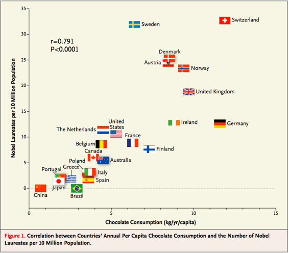

## 回归直线

相关系数`r`并不只是测量散点图中的点聚集在一条直线上的程度。 它也有助于确定点聚集的直线。 在这一节中，我们将追溯高尔顿和皮尔逊发现这条直线的路线。

高尔顿的父母及其成年子女身高的数据显示出线性关系。 当我们基于双亲身高的子女身高的预测大致沿着直线时，就证实了线性。

```py
galton = Table.read_table('galton.csv')

heights = Table().with_columns(
    'MidParent', galton.column('midparentHeight'),
    'Child', galton.column('childHeight')
    )
def predict_child(mpht):
    """Return a prediction of the height of a child 
    whose parents have a midparent height of mpht.
    
    The prediction is the average height of the children 
    whose midparent height is in the range mpht plus or minus 0.5 inches.
    """

    close_points = heights.where('MidParent', are.between(mpht-0.5, mpht + 0.5))
    return close_points.column('Child').mean()   
heights_with_predictions = heights.with_column(
    'Prediction', heights.apply(predict_child, 'MidParent')
    )
heights_with_predictions.scatter('MidParent')
```


### 标准单位下的度量

让我们看看，我们是否能找到一个方法来确定这条线。 首先，注意到线性关联不依赖于度量单位 - 我们也可以用标准单位来衡量这两个变量。

```py
def standard_units(xyz):
    "Convert any array of numbers to standard units."
    return (xyz - np.mean(xyz))/np.std(xyz)  
heights_SU = Table().with_columns(
    'MidParent SU', standard_units(heights.column('MidParent')),
    'Child SU', standard_units(heights.column('Child'))
)
heights_SU
```


| MidParent SU | Child SU |
| --- | --- |
| 3.45465 | 1.80416 |
| 3.45465 | 0.686005 |
| 3.45465 | 0.630097 |
| 3.45465 | 0.630097 |
| 2.47209 | 1.88802 |
| 2.47209 | 1.60848 |
| 2.47209 | -0.348285 |
| 2.47209 | -0.348285 |
| 1.58389 | 1.18917 |
| 1.58389 | 0.350559 |

（省略了 924 行）

在这个刻度上，我们可以像以前一样精确地计算我们的预测。 但是首先我们必须弄清楚，如何将“接近”的点的旧定义转换为新的刻度上的一个值。 我们曾经说过，如果双亲高度在 0.5 英寸之内，它们就是“接近”的。 由于标准单位以标准差为单位测量距离，所以我们必须计算出，0.5 英寸是多少个双亲身高的标准差。

双亲身高的标准差约为 1.8 英寸。 所以 0.5 英寸约为 0.28 个标准差。

```py
sd_midparent = np.std(heights.column(0))
sd_midparent
1.8014050969207571
0.5/sd_midparent
0.27756111096536701
```

现在我们准备修改我们的预测函数，来预测标准单位。 所有改变的是，我们正在使用标准单位的值的表格，并定义如上所述的“接近”。

```py
def predict_child_su(mpht_su):
    """Return a prediction of the height (in standard units) of a child 
    whose parents have a midparent height of mpht_su in standard units.
    """
    close = 0.5/sd_midparent
    close_points = heights_SU.where('MidParent SU', are.between(mpht_su-close, mpht_su + close))
    return close_points.column('Child SU').mean()   
heights_with_su_predictions = heights_SU.with_column(
    'Prediction SU', heights_SU.apply(predict_child_su, 'MidParent SU')
    )
heights_with_su_predictions.scatter('MidParent SU')
```


这个绘图看起来就像在原始刻度上绘图。 只改变了轴上的数字。 这证实了我们可以通过在标准单位下工作，来理解预测过程。

### 确定标准单位下的直线

高尔顿的散点图形状是个橄榄球 - 就是说，像橄榄球一样大致椭圆形。不是所有的散点图都是橄榄形的，甚至那些线性关联的也不都是。但在这一节中，我们假装我们是高尔顿，只能处理橄榄形的散点图。在下一节中，我们将把我们的分析推广到其他形状的绘图。

这里是一个橄榄形散点图，两个变量以标准单位测量。 45 度线显示为红色。


但是 45 度线不是经过垂直条形的中心的线。你可以看到在下图中，1.5 个标准单位的垂直线显示为黑色。蓝线附近的散点图上的点的高度都大致在 -2 到 3 的范围内。红线太高，无法命中中心。


所以 45 度线不是“均值图”。该线是下面显示的绿线。


两条线都经过原点`(0,0)`。绿线穿过垂直条形的中心（至少大概），比红色的 45 度线平坦。

45 度线的斜率为 1。所以绿色的“均值图”直线的斜率是正值但小于 1。

这可能是什么值呢？你猜对了 - 这是`r`。

### 标准单位下的回归直线

绿色的“均值图”线被称为回归直线，我们将很快解释原因。 但首先，让我们模拟一些`r`值不同的橄榄形散点图，看看直线是如何变化的。 在每种情况中，绘制红色 45 度线作比较。

执行模拟的函数为`regression_line`，并以`r`为参数。

```py
regression_line(0.95)
```


```py
regression_line(0.6)
```


当`r`接近于 1 时，散点图，45 度线和回归线都非常接近。 但是对于`r`较低值来说，回归线显然更平坦。

### 回归效应

就预测而言，这意味着，对于双亲身高为 1.5 个标准单位的家长来说，我们对女子身高的预测要稍低于 1.5 个标准单位。如果双亲高度是 2 个标准单位，我们对子女身高的预测，会比 2 个标准单位少一些。

换句话说，我们预测，子女会比父母更接近均值。

弗朗西斯·高尔顿爵士就不高兴了。他一直希望，特别高的父母会有特别高的子女。然而，数据是清楚的，高尔顿意识到，高个子父母通常拥有并不是特别高的子女。高尔顿沮丧地将这种现象称为“回归平庸”。

高尔顿还注意到，特别矮的父母通常拥有相对于他们这一代高一些的子女。一般来说，一个变量的平均值远远低于另一个变量的平均值。这被称为回归效应。

### 回归直线的方程

在回归中，我们使用一个变量（我们称`x`）的值来预测另一个变量的值（我们称之为`y`）。 当变量`x`和`y`以标准单位测量时，基于`x`预测`y`的回归线斜率为`r`并通过原点。 因此，回归线的方程可写为：

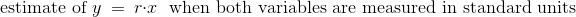

在数据的原始单位下，就变成了：

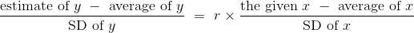

原始单位的回归线的斜率和截距可以从上图中导出。


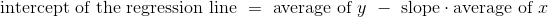

下面的三个函数计算相关性，斜率和截距。 它们都有三个参数：表的名称，包含`x`的列的标签以及包含`y`的列的标签。

```py
def correlation(t, label_x, label_y):
    return np.mean(standard_units(t.column(label_x))*standard_units(t.column(label_y)))

def slope(t, label_x, label_y):
    r = correlation(t, label_x, label_y)
    return r*np.std(t.column(label_y))/np.std(t.column(label_x))

def intercept(t, label_x, label_y):
    return np.mean(t.column(label_y)) - slope(t, label_x, label_y)*np.mean(t.column(label_x))
```

### 回归直线和高尔顿的数据

双亲身高和子女身高之间的相关性是 0.32：

```py
galton_r = correlation(heights, 'MidParent', 'Child')
galton_r
0.32094989606395924
```

我们也可以找到回归直线的方程，来基于双亲身高预测子女身高：

```py
galton_slope = slope(heights, 'MidParent', 'Child')
galton_intercept = intercept(heights, 'MidParent', 'Child')
galton_slope, galton_intercept
(0.63736089696947895, 22.636240549589751)
```

回归直线的方程是：

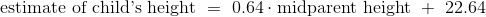

这也成为回归方程。回归方程的主要用途是根据`x`预测`y`。

例如，对于 70.48 英寸的双亲身高，回归直线预测，子女身高为 67.56 英寸。

```py
galton_slope*70.48 + galton_intercept
67.557436567998622
```

我们最初的预测，通过计算双亲身高接近 70.48 的所有子女的平均身高来完成，这个预测非常接近：67.63 英寸，而回归线的预测是 67.55 英寸。

```py
heights_with_predictions.where('MidParent', are.equal_to(70.48)).show(3)
```

| MidParent | Child | Prediction |
| --- | --- | --- |
| 70.48 | 74 | 67.6342 |
| 70.48 | 70 | 67.6342 |
| 70.48 | 68 | 67.6342 |

（省略了 5 行）

这里是高尔顿的表格的所有行，我们的原始预测，以及子女身高的回归预测。

```py
heights_with_predictions = heights_with_predictions.with_column(
    'Regression Prediction', galton_slope*heights.column('MidParent') + galton_intercept
)
heights_with_predictions
```


| MidParent | Child | Prediction | Regression Prediction |
| --- | --- | --- | --- |
| 75.43 | 73.2 | 70.1 | 70.7124 |
| 75.43 | 69.2 | 70.1 | 70.7124 |
| 75.43 | 69 | 70.1 | 70.7124 |
| 75.43 | 69 | 70.1 | 70.7124 |
| 73.66 | 73.5 | 70.4158 | 69.5842 |
| 73.66 | 72.5 | 70.4158 | 69.5842 |
| 73.66 | 65.5 | 70.4158 | 69.5842 |
| 73.66 | 65.5 | 70.4158 | 69.5842 |
| 72.06 | 71 | 68.5025 | 68.5645 |
| 72.06 | 68 | 68.5025 | 68.5645 |

（省略了 924 行）

```py
heights_with_predictions.scatter('MidParent')
```

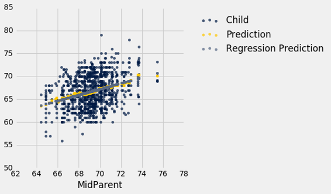

灰色圆点显示回归预测，全部在回归线上。 注意这条线与均值的金色图非常接近。 对于这些数据，回归线很好地逼近垂直条形的中心。

### 拟合值

所有的预测值都在直线上，被称为“拟合值”。 函数`fit`使用表名和`x`和`y`的标签，并返回一个拟合值数组，散点图中每个点一个。

```py
def fit(table, x, y):
    """Return the height of the regression line at each x value."""
    a = slope(table, x, y)
    b = intercept(table, x, y)
    return a * table.column(x) + b
```

下图比上图更轻易看到直线：

```py
heights.with_column('Fitted', fit(heights, 'MidParent', 'Child')).scatter('MidParent')
```


另一个绘制直线的方式是在表方法`scatter`中，使用选项`fit_line=True`。

```py
heights.scatter('MidParent', fit_line=True)
```


### 斜率的测量单位

斜率是一个比值，值得花点时间来研究它的测量单位。 我们的例子来自熟悉的医院系统中产妇的数据集。 孕期体重与高度的散点图看起来像是一个橄榄球，已经在一场比赛中使用了很多次，但足够接近橄榄球，我们可以让我们的拟合直线穿过它来证明。 在后面的章节中，我们将看到如何使这种证明更正式。

```py
baby = Table.read_table('baby.csv')
baby.scatter('Maternal Height', 'Maternal Pregnancy Weight', fit_line=True)
```


```py
slope(baby, 'Maternal Height', 'Maternal Pregnancy Weight')
3.5728462592750558
```

回归线的斜率是 3.57 磅每英寸。 这意味着，对于身高相差 1 英寸的两名女性来说，我们对孕期体重的预测相差 3.57 磅。 对于身高相差 2 英寸的女性，我们预测的孕期体重相差`2 * 3.57 ~= 7.14`磅。

请注意，散点图中的连续垂直条形相距 1 英寸，因为高度已经舍入到最近的英寸。 另一种考虑斜率的方法是取两个相连的条形（相隔 1 英寸），相当于两组身高相差 1 英寸的女性。 3.57 磅每英寸的斜率意味着，较高组的平均孕期体重比较矮组多大约 3.57 磅。

### 示例

假设我们的目标是使用回归，基于巴塞特猎犬的体重来估计它的身高，所用的样本与回归模型看起来一致。 假设观察到的相关性`r`为 0.5，并且这两个变量的汇总统计量如下表所示：


| | average | SD |
| --- | --- | --- |
| height | 14 inches | 2 inches |
| weight | 50 pounds | 5 pounds |

为了计算回归线的方程，我们需要斜率和截距。

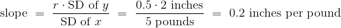

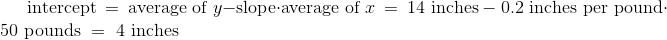

回归线的方程允许我们，根据给定重量（磅）计算估计高度（英寸）：

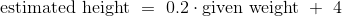

线的斜率衡量随着重量的单位增长的估计高度的增长。 斜率是正值，重要的是要注意，这并不表示我们认为，如果体重增加巴塞特猎狗就会变得更高。 斜率反映了两组狗的平均身高的差异，这两组狗的体重相差 1 磅。 具体来说，考虑一组重量为`w`磅，以及另一组重量为`w + 1`磅的狗。 我们估计，第二组的均值高出 0.2 英寸。 对于样本中的所有`w`值都是如此。

一般来说，回归线的斜率可以解释为随着`x`单位增长的`y`平均增长。 请注意，如果斜率为负值，那么对于`x`的每单位增长，`y`的平均值会减少。

### 尾注

即使我们没有建立回归方程的数学基础，我们可以看到，当散点图是橄榄形的时候，它会给出相当好的预测。 这是一个令人惊讶的数学事实，无论散点图的形状如何，同一个方程给出所有直线中的“最好”的预测。 这是下一节的主题。

## 最小二乘法

我们已经回溯了高尔顿和皮尔森用于开发回归线方程的步骤，它穿过橄榄形的散点图。但不是所有的散点图都是橄榄形的，甚至不是线性的。每个散点图都有一个“最优”直线吗？如果是这样，我们仍然可以使用上一节中开发的斜率和截距公式，还是需要新的公式？

为了解决这些问题，我们需要一个“最优”的合理定义。回想一下，这条线的目的是预测或估计`y`的值，在给定`x`值的情况下。估计通常不是完美的。每个值都由于误差而偏离真正的值。“最优”直线的合理标准是，它在所有直线中总体误差尽可能最小。

在本节中，我们将精确确定这个标准，看看我们能否确定标准下的最优直线。

我们的第一个例子是小说《小女人》数据集，每章都有一行。目标是根据句子数来估计字符数（即字母，空格标点符号等等）。回想一下，我们在本课程的第一堂课中试图实现它。

```py
little_women = Table.read_table('little_women.csv')
little_women = little_women.move_to_start('Periods')
little_women.show(3)
```


| Periods | Characters |
| --- | --- |
| 189 | 21759 |
| 188 | 22148 |
| 231 | 20558 |

（省略了 44 行）

```py
little_women.scatter('Periods', 'Characters')
```


为了探索数据，我们将需要使用上一节定义的函数`correlation`，`slope`，`intercept`和`fit `。

```py
correlation(little_women, 'Periods', 'Characters')
0.92295768958548163
```

散点图明显接近线性，相关性大于 0.92。

### 估计中的误差

下图显示了我们在上一节中开发的散点图和直线。 我们还不知道这是否是所有直线中最优的。 我们首先必须准确表达“最优”的意思。

```py
lw_with_predictions = little_women.with_column('Linear Prediction', fit(little_women, 'Periods', 'Characters'))
lw_with_predictions.scatter('Periods')
```

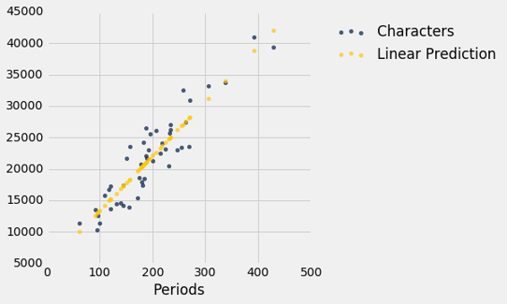

对应于散点图上的每个点，预测的误差是计算为实际值减去预测值。 它是点与直线之间的垂直距离，如果点在线之下，则为负值。

```py
actual = lw_with_predictions.column('Characters')
predicted = lw_with_predictions.column('Linear Prediction')
errors = actual - predicted
lw_with_predictions.with_column('Error', errors)
```


| Periods | Characters | Linear Prediction | Error |
| --- | --- | --- | --- |
| 189 | 21759 | 21183.6 | 575.403 |
| 188 | 22148 | 21096.6 | 1051.38 |
| 231 | 20558 | 24836.7 | -4278.67 |
| 195 | 25526 | 21705.5 | 3820.54 |
| 255 | 23395 | 26924.1 | -3529.13 |
| 140 | 14622 | 16921.7 | -2299.68 |
| 131 | 14431 | 16138.9 | -1707.88 |
| 214 | 22476 | 23358 | -882.043 |
| 337 | 33767 | 34056.3 | -289.317 |
| 185 | 18508 | 20835.7 | -2327.69 |

（省略了 37 行）

我们可以使用`slope `和`intercept`来计算拟合直线的斜率和截距。 下图显示了该直线（浅蓝色）。 对应于四个点的误差以红色显示。 这四个点没什么特别的。 他们只是为了展示的清晰而被选中。 函数`lw_errors`以斜率和截距（按照该顺序）作为参数，并绘制该图形。

```py
lw_reg_slope = slope(little_women, 'Periods', 'Characters')
lw_reg_intercept = intercept(little_women, 'Periods', 'Characters')
print('Slope of Regression Line:    ', np.round(lw_reg_slope), 'characters per period')
print('Intercept of Regression Line:', np.round(lw_reg_intercept), 'characters')
lw_errors(lw_reg_slope, lw_reg_intercept)
Slope of Regression Line:     87.0 characters per period
Intercept of Regression Line: 4745.0 characters
```


如果我们用不同的线来创建我们的估计，误差将会不同。 下面的图表显示了如果我们使用另一条线进行估算，误差会有多大。 第二张图显示了通过使用完全愚蠢的线获得了较大误差。

```py
lw_errors(50, 10000)
```


```py
lw_errors(-100, 50000)
```


### 均方根误差（RMSE）

我们现在需要的是误差大小的一个总体衡量。 你会认识到创建它的方法 - 这正是我们开发标准差的方式。

如果你使用任意直线来计算你的估计值，那么你的一些误差可能是正的，而其他的则是负的。 为了避免误差大小在测量时抵消，我们将采用误差平方的均值而不是误差的均值。

估计的均方误差大概是误差的平方有多大，但正如我们前面提到的，它的单位很难解释。 取平方根产生均方根误差（RMSE），与预测变量的单位相同，因此更容易理解。

### 使 RMSE 最小

到目前为止，我们的观察可以总结如下。

+   要根据`x`估算`y`，可以使用任何你想要的直线。
+   每个直线都有估计的均方根误差。
+   “更好”的直线有更小的误差。

有没有“最好”的直线？ 也就是说，是否有一条线可以使所有行中的均方根误差最小？

为了回答这个问题，我们首先定义一个函数`lw_rmse`，通过《小女人》的散点图来计算任意直线的均方根误差。 函数将斜率和截距（按此顺序）作为参数。

```py
def lw_rmse(slope, intercept):
    lw_errors(slope, intercept)
    x = little_women.column('Periods')
    y = little_women.column('Characters')
    fitted = slope * x + intercept
    mse = np.mean((y - fitted) ** 2)
    print("Root mean squared error:", mse ** 0.5)
lw_rmse(50, 10000)
Root mean squared error: 4322.16783177
```


```py
lw_rmse(-100, 50000)
Root mean squared error: 16710.1198374
```


正如预期的那样，不好的直线 RMSE 很大。 但是如果我们选择接近于回归线的斜率和截距，则 RMSE 要小得多。

```py
lw_rmse(90, 4000)
Root mean squared error: 2715.53910638
```


这是对应于回归线的均方根误差。 通过显着的数学事实，没有其他线路能击败这一条。

回归线是所有直线之间的唯一直线，使估计的均方误差最小。

```py
lw_rmse(lw_reg_slope, lw_reg_intercept)
Root mean squared error: 2701.69078531
```


这个声明的证明需要超出本课程范围的抽象数学。 另一方面，我们有一个强大的工具 -- Python，它可以轻松执行大量的数值计算。 所以我们可以使用 Python 来确认回归线最小化的均方误差。

### 数值优化

首先注意，使均方根误差最小的直线，也是使平方误差最小的直线。 平方根对最小值没有任何影响。 所以我们会为自己节省一个计算步骤，并将平均方差 MSE 减到最小。

我们试图根据《小女人》的句子数（`x`）来预测字符数量（`y`）。 如果我们使用 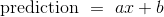 直线，它将有一个 MSE，它取决于斜率`a`和截距`b`。 函数`lw_mse`以斜率和截距为参数，并返回相应的 MSE。

```py
def lw_mse(any_slope, any_intercept):
    x = little_women.column('Periods')
    y = little_women.column('Characters')
    fitted = any_slope*x + any_intercept
    return np.mean((y - fitted) ** 2)
```

让我们确认一下，`lw_mse`得到回归线的 RMSE 的正确答案。 请记住，`lw_mse`返回均方误差，所以我们必须取平方根来得到 RMSE。

```py
lw_mse(lw_reg_slope, lw_reg_intercept)**0.5
2701.690785311856
```


它和我们之前使用`lw_rmse `得到的值相同。

```py
lw_rmse(lw_reg_slope, lw_reg_intercept)
Root mean squared error: 2701.69078531
```

你可以确认对于其他的斜率和截距，`lw_mse`也返回正确的值。 例如，这里是我们之前尝试的，非常不好的直线的 RMSE。

```py
lw_mse(-100, 50000)**0.5
16710.119837353752
```

这里是这条直线的 RMSE，它接近回归线。

```py
lw_mse(90, 4000)**0.5
2715.5391063834586
```

如果我们尝试不同的值，我们可以通过反复试验找到一个误差较低的斜率和截距，但这需要一段时间。 幸运的是，有一个 Python 函数为我们做了所有的试错。

`minimize`函数可用于寻找函数的参数，函数在这里返回其最小值。 Python 使用类似的试错法，遵循使输出值递减的变化量。

`minimize`的参数是一个函数，它本身接受数值参数并返回一个数值。 例如，函数`lw_mse`以数值斜率和截距作为参数，并返回相应的 MSE。

调用`minimize(lw_mse)`返回一个数组，由斜率和截距组成，它们使 MSE 最小。 这些最小值是通过智能试错得出的极好的近似值，而不是基于公式的精确值。

```py
best = minimize(lw_mse)
best
array([   86.97784117,  4744.78484535])
```

这些值与我们之前使用`slope`和`intercept`函数计算的值相同。 由于最小化的不精确性，我们看到较小的偏差，但是这些值本质上是相同的。

```py
print("slope from formula:        ", lw_reg_slope)
print("slope from minimize:       ", best.item(0))
print("intercept from formula:    ", lw_reg_intercept)
print("intercept from minimize:   ", best.item(1))
slope from formula:         86.9778412583
slope from minimize:        86.97784116615884
intercept from formula:     4744.78479657
intercept from minimize:    4744.784845352655
```

### 最小二乘直线

因此我们发现，不仅回归线具有最小的均方误差，而且均方误差的最小化也给出了回归线。 回归线是最小化均方误差的唯一直线。

这就是回归线有时被称为“最小二乘直线”的原因。

## 最小二乘回归

在前面的章节中，我们开发了回归直线的斜率和截距方程，它穿过一个橄榄形的散点图。 事实证明，无论散点图的形状如何，最小二乘直线的斜率和截距都与我们开发的公式相同。

我们在《小女人》的例子中看到了它，但是让我们以散点图显然不是橄榄形的例子来证实它。 对于这些数据，我们再次受惠于佛罗里达大学 Larry Winner 教授的丰富数据档案。 《国际运动科学杂志》（International Journal of Exercise Science）2013 年的一项研究，研究了大学生铅球运动员，并考察了力量与铅球距离的关系。 总体由 28 名女大学生运动员组成。 运动员在赛季前的“1RM power clean”中举起的最大值（公斤）是衡量力量的指标。 距离（米）是运动员个人最佳成绩。

```py
shotput = Table.read_table('shotput.csv')
shotput
```

| Weight Lifted | Shot Put Distance |
| --- | --- |
| 37.5 | 6.4 |
| 51.5 | 10.2 |
| 61.3 | 12.4 |
| 61.3 | 13 |
| 63.6 | 13.2 |
| 66.1 | 13 |
| 70 | 12.7 |
| 92.7 | 13.9 |
| 90.5 | 15.5 |
| 90.5 | 15.8 |

（省略了 18 行）

```py
shotput.scatter('Weight Lifted')
```


这不是橄榄形的散点图。 事实上，它似乎有一点非线性成分。 但是，如果我们坚持用一条直线来做出预测，那么所有直线之中仍然有一条最好的直线。

我们为回归线的斜率和截距建立公式，它来源于橄榄形的散点图，并给出了下列值：

```py
slope(shotput, 'Weight Lifted', 'Shot Put Distance')
0.098343821597819972
intercept(shotput, 'Weight Lifted', 'Shot Put Distance')
5.9596290983739522
```

即使散点图不是橄榄形，使用这些公式还有意义吗？ 我们可以通过求出使 MSE 最小的斜率和截距来回答这个问题。

我们将定义函数`shotput_linear_mse`，以斜体和截距作为参数并返回相应的 MSE。 然后将`minimize`应用于`shotput_linear_mse`将返回最优斜率和截距。

```py
def shotput_linear_mse(any_slope, any_intercept):
    x = shotput.column('Weight Lifted')
    y = shotput.column('Shot Put Distance')
    fitted = any_slope*x + any_intercept
    return np.mean((y - fitted) ** 2)
minimize(shotput_linear_mse)
array([ 0.09834382,  5.95962911])
```

这些值与我们使用我们的公式得到的值相同。 总结：

无论散点图的形状如何，都有一条独特的线，可以使估计的均方误差最小。 它被称为回归线，其斜率和截距由下式给出：

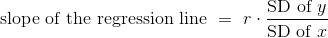

> 译者注：也就是`cov(x, y)/var(x)`。


```py
fitted = fit(shotput, 'Weight Lifted', 'Shot Put Distance')
shotput.with_column('Best Straight Line', fitted).scatter('Weight Lifted')
```

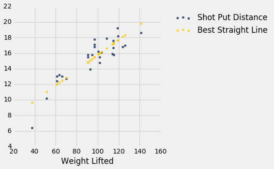

### 非线性回归

上面的图表强化了我们之前的观察，即散点图有点弯曲。 因此，最好拟合曲线而不是直线。 研究假设举起的重量与铅球距离之间是二次关系。 所以让我们使用二次函数来预测，看看我们能否找到最好的曲线。

我们必须找到所有二次函数中最好的二次函数，而不是所有直线中最好的直线。 最小二乘法允许我们这样做。

这种最小化的数学是复杂的，不容易仅仅通过检查散点图来发现。 但是数值最小化和线性预测一样简单！ 再次通过使用最小化我们可以得到最好的二次预测。 让我们看看这是如何工作的。

回想一下，二次函数的形式：

```
f(x) = ax^2 + bx + c
```

`a`、`b`和`c`是常数。

为了基于举起的重量找到最好的二次函数来预测距离，使用最小二乘法，我们首先编写一个函数，以三个常量为自变量的，用上面的二次函数计算拟合值，然后返回均方误差。

该函数被称为`shotput_quadratic_mse`。 请注意，定义与`lw_mse`的定义类似，不同的是拟合值基于二次函数而不是线性。

```py
def shotput_quadratic_mse(a, b, c):
    x = shotput.column('Weight Lifted')
    y = shotput.column('Shot Put Distance')
    fitted = a*(x**2) + b*x + c
    return np.mean((y - fitted) ** 2)
```

我们现在可以像之前那样使用`minimize`，并找到使 MSE 最小的常数。

```py
best = minimize(shotput_quadratic_mse)
best
array([ -1.04004838e-03,   2.82708045e-01,  -1.53182115e+00])
```

我们预测，一个举起`x`公斤的运动员的铅球距离大概是`-0.00104x^2 + 0.2827x - 1.5318`米。 例如，如果运动员可以举起 100 公斤，预测的距离是 16.33 米。 在散点图上，在 100 公斤左右的垂直条形的中心附近。

```py
(-0.00104)*(100**2) + 0.2827*100 - 1.5318
16.3382
```

以下是所有`Weight Lifted`的预测。 你可以看到他们穿过散点图的中心，大致上接近。

```py
x = shotput.column(0)
shotput_fit = best.item(0)*(x**2) + best.item(1)*x + best.item(2)
shotput.with_column('Best Quadratic Curve', shotput_fit).scatter(0)
```

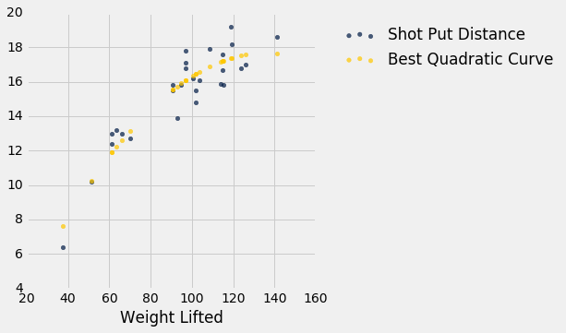

## 视觉诊断

假设数据科学家已经决定使用线性回归，基于预测变量估计响应变量的值。 为了了解这种估计方法的效果如何，数据科学家必须知道估计值距离实际值多远。 这些差异被称为残差。

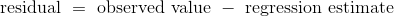

残差就是剩下的东西 - 估计之后的剩余。

残差是回归线和点的垂直距离。 散点图中的每个点都有残差。 残差是`y`的观测值与`y`的拟合值之间的差值，所以对于点`(x, y)`：

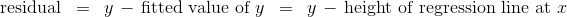

`residual`函数计算残差。 该计算假设我们已经定义的所有相关函数：`standard_units`，`correlation`，`slope`，`intercept`和`fit`。

```py
def residual(table, x, y):
    return table.column(y) - fit(table, x, y)
```

继续使用高尔顿的数据的例子，基于双亲身高（预测变量）来估计成年子女身高（响应变量），让我们计算出拟合值和残差。

```py
heights = heights.with_columns(
        'Fitted Value', fit(heights, 'MidParent', 'Child'),
        'Residual', residual(heights, 'MidParent', 'Child')
    )
heights
```


| MidParent | Child | Fitted Value | Residual |
| --- | --- | --- | --- |
| 75.43 | 73.2 | 70.7124 | 2.48763 |
| 75.43 | 69.2 | 70.7124 | -1.51237 |
| 75.43 | 69 | 70.7124 | -1.71237 |
| 75.43 | 69 | 70.7124 | -1.71237 |
| 73.66 | 73.5 | 69.5842 | 3.91576 |
| 73.66 | 72.5 | 69.5842 | 2.91576 |
| 73.66 | 65.5 | 69.5842 | -4.08424 |
| 73.66 | 65.5 | 69.5842 | -4.08424 |
| 72.06 | 71 | 68.5645 | 2.43553 |
| 72.06 | 68 | 68.5645 | -0.564467 |

（省略了 924 行）

如果要处理的变量太多，以可视化开始总是很有帮助的。 函数`scatter_fit`绘制数据的散点图，以及回归线。

```py
def scatter_fit(table, x, y):
    table.scatter(x, y, s=15)
    plots.plot(table.column(x), fit(table, x, y), lw=4, color='gold')
    plots.xlabel(x)
    plots.ylabel(y)
scatter_fit(heights, 'MidParent', 'Child')
```


通过绘制残差和预测变量来绘制残差图。函数`residual_plot`就是这样做的。

```py
def residual_plot(table, x, y):
    x_array = table.column(x)
    t = Table().with_columns(
            x, x_array,
            'residuals', residual(table, x, y)
        )
    t.scatter(x, 'residuals', color='r')
    xlims = make_array(min(x_array), max(x_array))
    plots.plot(xlims, make_array(0, 0), color='darkblue', lw=4)
    plots.title('Residual Plot')
residual_plot(heights, 'MidParent', 'Child')
```


双亲身高在横轴上，就像原始散点图中一样。 但是现在纵轴显示了残差。 请注意，该图看上去以`y=0`的横线为中心（以深蓝色显示）。 还要注意，绘图没有显示上升或下降的趋势。 我们稍后会观察到所有的回归都是如此。

### 回归诊断

残差图有助于我们直观评估线性回归分析的质量。 这种评估被称为诊断。 函数`regression_diagnostic_plots`绘制原始散点图以及残差图，以便于比较。

```py
def regression_diagnostic_plots(table, x, y):
    scatter_fit(table, x, y)
    residual_plot(table, x, y)
regression_diagnostic_plots(heights, 'MidParent', 'Child')
```


这个残差图表明，线性回归是合理的估计方法。 注意残差关于`y=0`的横线上下对称分布，相当于原始散点图大致上下对称。 还要注意，绘图的垂直延伸，在子女身高最常见的值上相当均匀。 换句话说，除了一些离群点之外，绘图并不是一些地方窄。另一些地方宽。

换句话说，在预测变量的观察范围内，回归的准确性似乎是相同的。

良好回归的残差图不显示任何规律。 在预测变量的范围内，残差在`y=0`的直线处上下相同。

### 检测非线性

绘制数据的散点图，通常表明了两个变量之间的关系是否是非线性的。 然而，通常情况下，残差图中比原始散点图中更容易发现非线性。 这通常是因为这两个图的规模：残差图允许我们放大错误，从而更容易找出规律。


我们的数据是海牛的年龄和长度的数据集，这是一种海洋哺乳动物（维基共享资源图）。 数据在一个名为`dugong`的表中。 年龄以年为单位，长度以米为单位。 因为海牛通常不跟踪他们的生日，年龄是根据他们的牙齿状况等变量来估计的。

```py
dugong = Table.read_table('http://www.statsci.org/data/oz/dugongs.txt')
dugong = dugong.move_to_start('Length')
dugong
```

| Length | Age |
| --- | --- |
| 1.8 | 1 |
| 1.85 | 1.5 |
| 1.87 | 1.5 |
| 1.77 | 1.5 |
| 2.02 | 2.5 |
| 2.27 | 4 |
| 2.15 | 5 |
| 2.26 | 5 |
| 2.35 | 7 |
| 2.47 | 8 |

（省略了 17 行）

如果我们可以衡量海牛的长度，对于它的年龄我们可以说什么呢？ 让我们来看看我们的数据说了什么。 这是一个长度（预测变量）和年龄（响应变量）的回归。 这两个变量之间的相关性相当大，为 0.83。

```py
correlation(dugong, 'Length', 'Age')
0.82964745549057139
```

尽管相关性仍然很高，绘图显示出曲线规律，在残差图中更加明显。

```py
regression_diagnostic_plots(dugong, 'Length', 'Age')
```


虽然你可以发现原始散点图中的非线性，但在残差图中更明显。

在长度的较低一端，残差几乎都是正的；然后他们几乎都是负的；然后在较高一端，残差再次为正。 换句话说，回归估计值过高，然后过低，然后过高。 这意味着使用曲线而不是直线来估计年龄会更好。

当残差图显示了规律时，变量之间可能存在非线性关系。

### 检测异方差

异方差这个词，那些准备拼写游戏的人肯定会感兴趣。 对于数据科学家来说，其兴趣在于它的意义，即“不均匀延伸”。

回想一下`hybrid `表，包含美国混合动力汽车的数据。这是燃油效率对加速度的回归。这个关联是负面的：加速度高的汽车往往效率较低。

```py
regression_diagnostic_plots(hybrid, 'acceleration', 'mpg')
```


注意残差图在加速度的较低一端变得发散。 换句话说，对于较低的加速度，误差的大小的变化比较高值更大。 残差图中比原始的散点图中更容易注意到不均匀的变化。

如果残差图显示`y=0`的横线处的不均匀变化，则在预测变量的范围内，回归的估计不是同等准确的。

## 数值诊断

除了可视化之外，我们还可以使用残差的数值属性来评估回归的质量。 我们不会在数学上证明这些属性。 相反，我们将通过计算来观察它们，看看它们告诉我们回归的什么东西。

下面列出的所有事实都适用于散点图的所有形状，无论它们是否是线性的。

### 残差图不展示形状

对于每一个线性回归，无论是好还是坏，残差图都不展示任何趋势。 总的来说，它是平坦的。 换句话说，残差和预测变量是不相关的。

你可以在上面所有的残差图中看到它。 我们还可以计算每种情况下，预测变量和残差之间的相关性。

```py
correlation(heights, 'MidParent', 'Residual')
-2.7196898076470642e-16
```

这看起来不是零，但它是个很小的数字，除了由于计算的舍入误差之外，它就是零。 在这里也一样，取小数点后 10 位。 减号是因为上面的舍入。

```py
round(correlation(heights, 'MidParent', 'Residual'), 10)
-0.0
dugong = dugong.with_columns(
       'Fitted Value', fit(dugong, 'Length', 'Age'),
       'Residual', residual(dugong, 'Length', 'Age')
)
round(correlation(dugong, 'Length', 'Residual'), 10)
0.0
```

### 残差的均值

不管散点图的形状如何，剩余的均值都是 0。

这类似于这样一个事实，如果你选取任何数值列表并计算距离均值的偏差的列表，则偏差的均值为 0。

在上面的所有残差图中，你看到`y=0`的横线穿过图的中心。 这是这个事实的可视化。

作为一个数值示例，这里是高尔顿数据集中，基于双亲高度的子女高度的回归的残差均值。

```py
round(np.mean(heights.column('Residual')), 10)
0.0
```

海牛长度和年龄的回归的残差均值也是一样。 残差均值为 0，除了舍入误差。

```py
round(np.mean(dugong.column('Residual')), 10)
0.0
```

### 残差的标准差

无论散点图的形状如何，残差的标准差是响应变量的标准差的一个比例。 比例是 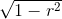。

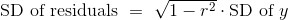

我们将很快看到，它如何衡量回归估计的准确性。 但首先，让我们通过例子来确认。

在子女身高和双亲身高的案例中，残差的标准差约为 3.39 英寸。

```py
np.std(heights.column('Residual'))
3.3880799163953426
```

这和响应变量的标准差乘`sqrt(1 - r^2)`相同。

```py
r = correlation(heights, 'MidParent', 'Child')
np.sqrt(1 - r**2) * np.std(heights.column('Child'))
3.3880799163953421
```

混合动力汽车的加速和里程的回归也是如此。 相关性`r`是负数（约 -0.5），但`r^2`是正数，所以`sqrt(1 - r^2)`是一个分数。

```py
r = correlation(hybrid, 'acceleration', 'mpg')
r
-0.5060703843771186
hybrid = hybrid.with_columns(
     'fitted mpg', fit(hybrid, 'acceleration', 'mpg'),
     'residual', residual(hybrid, 'acceleration', 'mpg')
)
np.std(hybrid.column('residual')), np.sqrt(1 - r**2)*np.std(hybrid.column('mpg'))
(9.4327368334302903, 9.4327368334302903)
```

现在让我们看看，残差的标准差是如何衡量回归的好坏。请记住，残差的均值为 0。因此，残差的标准差越小，则残差越接近于 0。换句话说，如果残差的标准差小，那么回归中的总体误差就小。

极端情况是`r = 1`或`r = -1`。在这两种情况下，`sqrt(1 - r^2) = 0`。因此，残差的均值为 0，标准差为 0，因此残差都等于 0。回归线确实是完美的估计。我们在本章的前面看到，如果`r = ± 1`，散点图是一条完美的直线，与回归线相同，所以回归估计中确实没有错误。

但通常`r`不是极端的。如果`r`既不是`±1`也不是 0，那么`sqrt(1 - r^2)`是一个适当的分数，并且回归估计的误差大小，整体上大致在 0 和`y`的标准差之间。

最糟糕的情况是`r = 0`。那么`sqrt(1 - r^2)` = 1，残差的标准差等于`y`的标准差。这与观察结果一致，如果`r = 0`那么回归线就是`y`的均值上的一条横线。在这种情况下，回归的均方根误差是距离`y`的平均值的偏差的均方根，这是`y`的标准差。实际上，如果`r = 0`，那么这两个变量之间就没有线性关联，所以使用线性回归没有任何好处。

### 另一种解释`r`的方式

我们可以重写上面的结果，不管散点图的形状如何：


互补的结果是，无论散点图的形状如何，拟合值的标准差是观察值`y`的标准差的一个比例。比例是`|r|`。

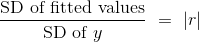

要查看比例在哪里出现，请注意拟合值全部位于回归线上，而`y`的观测值是散点图中所有点的高度，并且更加可变。

```py
scatter_fit(heights, 'MidParent', 'Child')
```


拟合值的范围在 64 到 71 之间，而所有子女的身高则变化很大，大约在 55 到 80 之间。

为了在数值上验证结果，我们只需要计算双方的一致性。

```py
correlation(heights, 'MidParent', 'Child')
0.32094989606395924
```

这里是出生体重的拟合值的标准差与观察值的标准差的比值：

```py
np.std(heights.column('Fitted Value'))/np.std(heights.column('Child'))
0.32094989606395957
```

这个比例等于`r`，证实了我们的结果。

绝对值出现在哪里？ 首先要注意的是，标准差不能是负数，标准差的比值也不行。 那么当`r`是负数时会发生什么呢？ 燃油效率和加速度的例子将向我们展示。

```py
correlation(hybrid, 'acceleration', 'mpg')
-0.5060703843771186
np.std(hybrid.column('fitted mpg'))/np.std(hybrid.column('mpg'))
0.5060703843771186
```

两个标准差的比值就是`|r|`。

解释这个结果的更标准的方法是，回想一下：

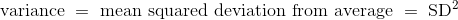

因此，对结果的两边取平方：

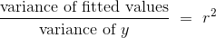
