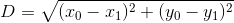
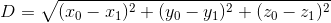
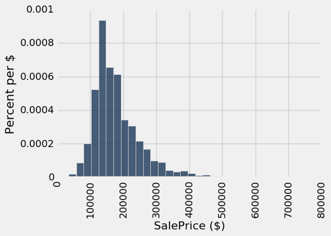
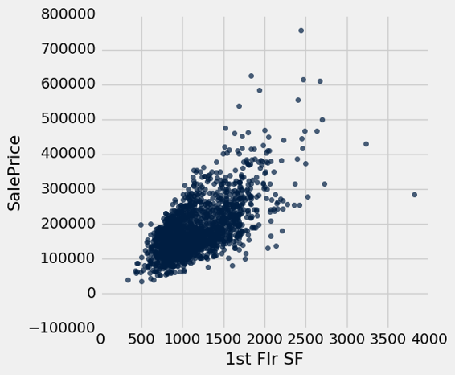
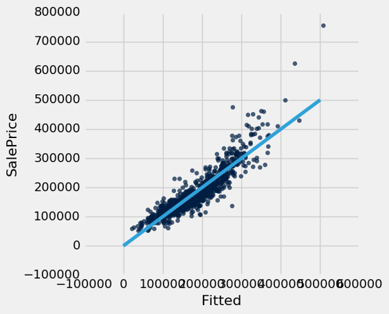
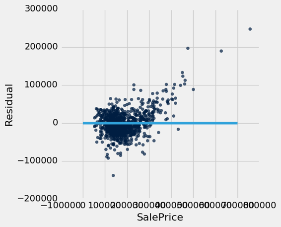
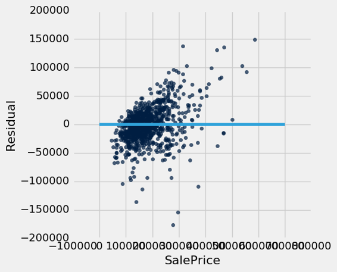

# 十五、分类

> 原文：[Classification](https://github.com/data-8/textbook/tree/gh-pages/chapters/15)

> 译者：[飞龙](https://github.com/wizardforcel)

> 协议：[CC BY-NC-SA 4.0](http://creativecommons.org/licenses/by-nc-sa/4.0/)

> 自豪地采用[谷歌翻译](https://translate.google.cn/)


[David Wagner](https://en.wikipedia.org/wiki/David_A._Wagner) 是这一章的主要作者。

机器学习是一类技术，用于自动寻找数据中的规律，并使用它来推断或预测。你已经看到了线性回归，这是一种机器学习技术。本章介绍一个新的技术：分类。

分类就是学习如何根据过去的例子做出预测。我们举了一些例子，告诉我们什么是正确的预测，我们希望从这些例子中学习，如何较好地预测未来。以下是在实践中分类的一些应用领域：

+   他们有一些每个订单的信息（例如，它的总值，订单是否被运送到这个客户以前使用过的地址，是否与信用卡持有人的账单地址相同）。他们有很多过去的订单数据，他们知道哪些过去的订单是欺诈性的，哪些不是。他们想要学习规律，这将帮助他们预测新订单到达时，这些新订单是否有欺诈行为。

+   在线约会网站希望预测：这两个人合适吗？他们有很多数据，他们过去向顾客推荐一些东西，它们就知道了哪个是成功的。当新客户注册时，他们想预测谁可能是他们的最佳伴侣。

+   医生想知道：这个病人是否患有癌症？根据一些实验室测试的结果，他们希望能够预测特定患者是否患有癌症。基于一些实验室测试的测量结果，以及他们是否最终发展成癌症，并且由此他们希望尝试推断，哪些测量结果倾向于癌症（或非癌症）特征，以便能够准确地诊断未来的患者。

+   政客们想预测：你打算为他们投票吗？这将帮助他们将筹款工作集中在可能支持他们的人身上，并将动员工作集中在投票给他们的人身上。公共数据库和商业数据库有大多数人的大量信息，例如，他们是否拥有房屋或房租；他们是否住在富裕的社区还是贫穷的社区；他们的兴趣和爱好；他们的购物习惯；等等。政治团体已经调查了一些选民，并找到了他们计划投票的人，所以他们有一些正确答案已知的例子。

所有这些都是分类任务。请注意，在每个例子中，预测是一个是与否的问题 - 我们称之为二元分类，因为只有两个可能的预测。

在分类任务中，我们想要进行预测的每个个体或情况都称为观测值。我们通常有很多观测值。每个观测值具有多个已知属性（例如，亚马逊订单的总值，或者选民的年薪）。另外，每个观测值都有一个类别，这是对我们关心的问题（例如欺骗与否，或者是否投票）的回答。

当亚马逊预测订单是否具有欺诈性时，每个订单都对应一个单独的观测值。每个观测值都有几个属性：订单的总值，订单是否被运送到此客户以前使用的地址等等。观测值类别为 0 或 1，其中 0 意味着订单不是欺诈，1 意味着订单是欺诈性的。当一个客户生成新的订单时，我们并没有观察到这个订单是否具有欺诈性，但是我们确实观察了这个订单的属性，并且我们会尝试用这些属性来预测它的类别。

分类需要数据。它涉及到发现规律，并且为了发现规律，你需要数据。这就是数据科学的来源。特别是，我们假设我们可以获得训练数据：一系列的观测数据，我们知道每个观测值的类别。这些预分类的观测值集合也被称为训练集。分类算法需要分析训练集，然后提出一个分类器：用于预测未来观测值类别的算法。

分类器不需要是完全有用的。即使准确度低于 100%，它们也可以是有用的。例如，如果在线约会网站偶尔会提出不好的建议，那没关系；他们的顾客已经预期，在他们找到真爱之前需要遇见许多人。当然，你不希望分类器犯太多的错误，但是不必每次都得到正确的答案。

## 最近邻

在本节中，我们将开发最近邻分类方法。 如果一些代码神秘，不要担心，现在只要把注意力思路上。 在本章的后面，我们将看到如何将我们的想法组织成执行分类的代码。

### 慢性肾病

我们来浏览一个例子。 我们将使用收集的数据集来帮助医生诊断慢性肾病（CKD）。 数据集中的每一行都代表单个患者，过去接受过治疗并且诊断已知。 对于每个患者，我们都有一组血液测试的测量结果。 我们希望找到哪些测量结果对诊断慢性肾病最有用，并根据他们的血液检查结果，开发一种方法，将未来的患者分类为“CKD”或“非 CKD”。

```py
ckd = Table.read_table('ckd.csv').relabeled('Blood Glucose Random', 'Glucose')
ckd
```

| Age | Blood Pressure | Specific Gravity | Albumin | Sugar | Red Blood Cells | Pus Cell | Pus Cell clumps | Bacteria | Glucose | Blood Urea | Serum Creatinine | Sodium | Potassium | Hemoglobin | Packed Cell Volume | White Blood Cell Count | Red Blood Cell Count | Hypertension | Diabetes Mellitus | Coronary Artery Disease | Appetite | Pedal Edema | Anemia | Class |
| --- | --- | --- | --- | --- | --- | --- | --- | --- | --- | --- | --- | --- | --- | --- | --- | --- | --- | --- | --- | --- | --- | --- | --- |
| 48 | 70 | 1.005 | 4 | 0 | normal | abnormal | present | notpresent | 117 | 56 | 3.8 | 111 | 2.5 | 11.2 | 32 | 6700 | 3.9 | yes | no | no | poor | yes | yes | 1 |
| 53 | 90 | 1.02 | 2 | 0 | abnormal | abnormal | present | notpresent | 70 | 107 | 7.2 | 114 | 3.7 | 9.5 | 29 | 12100 | 3.7 | yes | yes | no | poor | no | yes | 1 |
| 63 | 70 | 1.01 | 3 | 0 | abnormal | abnormal | present | notpresent | 380 | 60 | 2.7 | 131 | 4.2 | 10.8 | 32 | 4500 | 3.8 | yes | yes | no | poor | yes | no | 1 |
| 68 | 80 | 1.01 | 3 | 2 | normal | abnormal | present | present | 157 | 90 | 4.1 | 130 | 6.4 | 5.6 | 16 | 11000 | 2.6 | yes | yes | yes | poor | yes | no | 1 |
| 61 | 80 | 1.015 | 2 | 0 | abnormal | abnormal | notpresent | notpresent | 173 | 148 | 3.9 | 135 | 5.2 | 7.7 | 24 | 9200 | 3.2 | yes | yes | yes | poor | yes | yes | 1 |
| 48 | 80 | 1.025 | 4 | 0 | normal | abnormal | notpresent | notpresent | 95 | 163 | 7.7 | 136 | 3.8 | 9.8 | 32 | 6900 | 3.4 | yes | no | no | good | no | yes | 1 |
| 69 | 70 | 1.01 | 3 | 4 | normal | abnormal | notpresent | notpresent | 264 | 87 | 2.7 | 130 | 4 | 12.5 | 37 | 9600 | 4.1 | yes | yes | yes | good | yes | no | 1 |
| 73 | 70 | 1.005 | 0 | 0 | normal | normal | notpresent | notpresent | 70 | 32 | 0.9 | 125 | 4 | 10 | 29 | 18900 | 3.5 | yes | yes | no | good | yes | no | 1 |
| 73 | 80 | 1.02 | 2 | 0 | abnormal | abnormal | notpresent | notpresent | 253 | 142 | 4.6 | 138 | 5.8 | 10.5 | 33 | 7200 | 4.3 | yes | yes | yes | good | no | no | 1 |
| 46 | 60 | 1.01 | 1 | 0 | normal | normal | notpresent | notpresent | 163 | 92 | 3.3 | 141 | 4 | 9.8 | 28 | 14600 | 3.2 | yes | yes | no | good | no | no | 1 |


（省略了 148 行）

一些变量是类别（像“异常”这样的词），还有一些是定量的。 定量变量都有不同的规模。 我们将要通过眼睛比较和估计距离，所以我们只选择一些变量并在标准单位下工作。 之后我们就不用担心每个变量的规模。

```py
ckd = Table().with_columns(
    'Hemoglobin', standard_units(ckd.column('Hemoglobin')),
    'Glucose', standard_units(ckd.column('Glucose')),
    'White Blood Cell Count', standard_units(ckd.column('White Blood Cell Count')),
    'Class', ckd.column('Class')
)
ckd
```


| Hemoglobin | Glucose | White Blood Cell Count | Class |
| --- | --- | --- | --- |
| -0.865744 | -0.221549 | -0.569768 | 1 |
| -1.45745 | -0.947597 | 1.16268 | 1 |
| -1.00497 | 3.84123 | -1.27558 | 1 |
| -2.81488 | 0.396364 | 0.809777 | 1 |
| -2.08395 | 0.643529 | 0.232293 | 1 |
| -1.35303 | -0.561402 | -0.505603 | 1 |
| -0.413266 | 2.04928 | 0.360623 | 1 |
| -1.28342 | -0.947597 | 3.34429 | 1 |
| -1.10939 | 1.87936 | -0.409356 | 1 |
| -1.35303 | 0.489051 | 1.96475 | 1 |

（省略了 148 行）

我们来看两列，（病人的血液中）血红蛋白水平和血糖水平（一天中的随机时间；没有专门为血液测试禁食）。

我们将绘制一个散点图来显示两个变量之间的关系。 蓝点是 CKD 患者; 金点是非 CKD 的患者。 什么样的医学检验结果似乎表明了 CKD？

```py
color_table = Table().with_columns(
    'Class', make_array(1, 0),
    'Color', make_array('darkblue', 'gold')
)
ckd = ckd.join('Class', color_table)
ckd.scatter('Hemoglobin', 'Glucose', colors='Color')
```


假设爱丽丝是不在数据集中的新患者。 如果我告诉你爱丽丝的血红蛋白水平和血糖水平，你可以预测她是否有 CKD 嘛？ 确实看起来可以！ 你可以在这里看到非常清晰的规律：右下角的点代表没有 CKD 的人，其余的倾向于有 CKD 的人。 对于人来说，规律是显而易见的。 但是，我们如何为计算机编程来自动检测这种规律？

### 最近邻分类器

我们可能寻找很多种模式，还有很多分类算法。但是我会告诉你一个算法，它拥有令人惊讶的效果。它被称为最近邻分类。这是它的思路。如果我们有爱丽丝的血红蛋白和血糖数值，我们可以把她放在这个散点图的某个地方；血红蛋白是她的`x`坐标，血糖是她的`y`坐标。现在，为了预测她是否有 CKD，我们在散点图中找到最近的点，检查它是蓝色还是金色；我们预测爱丽丝应该接受与该患者相同的诊断。

换句话说，为了将 Alice 划分为 CKD 与否，我们在训练集中找到与 Alice “最近”的患者，然后将该患者的诊断用作对 Alice 的预测。直觉上，如果散点图中的两个点彼此靠近，那么相应的测量结果非常相似，所以我们可能会预计，他们（更可能）得到相同的诊断。我们不知道 Alice 的诊断，但是我们知道训练集中所有病人的诊断，所以我们在训练集中找到与 Alice 最相似的病人，并利用病人的诊断来预测 Alice 的诊断。

在下图中，红点代表爱丽丝。它与距离它最近的点由一条黑线相连，即训练集中最近邻。该图由一个名为`show_closest`的函数绘制。它需要一个数组，代表 Alice 点的`x和`y`坐标。改变它们来查看最近的点如何改变！特别注意最近的点是蓝色，以及金色的时候。

```py
# In this example, Alice's Hemoglobin attribute is 0 and her Glucose is 1.5.
alice = make_array(0, 1.5)
show_closest(alice)
```


因此，我们的最近邻分类器是这样工作的：

+   找到训练集中离新点最近的点。
+   如果最近的点是“CKD”点，则将新点划分为“CKD”。如果最近的点是“非 CKD”点，则将新点划分为“非 CKD”。

散点图表明这个最近邻分类器应该相当准确。右下角的点倾向于接受“非 CKD”的诊断，因为他们的最近邻是一个金点。其余的点倾向于接受“CKD”诊断，因为他们的最近邻是蓝点。所以这个例子中，最近邻策略似乎很好地捕捉了我们的直觉。

## 决策边界

有时一种分类器可视化的实用方法是，绘制出分类器预测“CKD”的几种属性，以及预测“非 CKD”的几种。我们最终得到两者之间的边界，边界一侧的点将被划分为“CKD”，而另一侧的点将划分为“非 CKD”。这个边界称为决策边界。每个不同的分类器将有不同的决策边界；决策边界只是一种方法，用于可视化分类器实用什么标准来对点分类。

例如，假设爱丽丝的点坐标是`(0, 1.5)`。注意最近邻是蓝色的。现在尝试减少点的高度（`y`坐标）。你会看到，在`y = 0.95`左右，最近邻从蓝色变为金色。

```py
alice = make_array(0, 0.97)
show_closest(alice)
```


这里有数百个未分类的新点，都是红色的。


每个红点在训练集中都有一个最近邻（与之前的蓝点和金点相同）。对于一些红点，你可以很容易地判断最近邻是蓝色还是金色。对于其他点来说，通过眼睛来做出决定更为棘手。那些是靠近决策边界的点。

但是计算机可以很容易地确定每个点的最近邻。那么让我们将我们的最近邻分类器应用于每个红点：

对于每个红点，它必须找到训练集中最近的点；它必须将红点的颜色改变为最近邻的颜色。

结果图显示哪些点将划分为“CKD”（全部为蓝色），或者“非 CKD”（全部为金色）。


决策边界是分类器从将红点转换为蓝色变成金色的地方。

## KNN

然而，两个类别的分类并不总是那么清晰。例如，假设我们不用血红蛋白水平而是看白细胞计数。看看会发生什么：

```py
ckd.scatter('White Blood Cell Count', 'Glucose', colors='Color')
```


如你所见，非 CKD 个体都聚集在左下角。大多数 CKD 患者在该簇的上方或右侧，但不是全部。上图左下角有一些 CKD 患者（分散在金簇中的少数蓝点表示）。这意味着你不能从这两个检测结果确定，某些人是否拥有 CKD。

如果提供爱丽丝的血糖水平和白细胞计数，我们可以预测她是否患有慢性肾病嘛？是的，我们可以做一个预测，但是我们不应该期望它是 100% 准确的。直觉上，似乎存在预测的自然策略：绘制 Alice 在散点图中的位置；如果她在左下角，则预测她没有 CKD，否则预测她有 CKD。

这并不完美 - 我们的预测有时是错误的。 （请花点时间思考一下，会把哪些患者弄错？）上面的散点图表明，CKD 患者的葡萄糖和白细胞水平有时与没有 CKD 的患者相同，因此任何分类器都是不可避免地会对他们做出错误的预测。

我们可以在计算机上自动化吗？那么，最近邻分类器也是一个合理的选择。花点时间思考一下：它的预测与上述直觉策略的预测相比如何？他们什么时候会不同？

它的预测与我们的直觉策略非常相似，但偶尔会做出不同的预测。特别是，如果爱丽丝的血液检测结果恰好把她放在左下角的一个蓝点附近，那么这个直观的策略就可能预测“非 CKD”，而最近邻的分类器会预测“CKD”。

最近邻分类器有一个简单的推广，修正了这个异常。它被称为 K 最近邻分类器。为了预测爱丽丝的诊断，我们不仅仅查看靠近她的一个邻居，而是查看靠近她的三个点，并用这三个点中的每一个点的诊断来预测艾丽丝的诊断。特别是，我们将使用这 3 个诊断中的大部分值作为我们对 Alice 诊断的预测。当然，数字 3 没有什么特别之处：我们可以使用 4 或 5 或更多。 （选择一个奇数通常是很方便的，所以我们不需要处理相等）。一般来说，我们选择一个数字`k`，而我们对 Alice 的预测诊断是基于训练集中最接近爱丽丝的`k`个点。直观来说，这些是血液测试结果与爱丽丝最相似的`k`个患者，因此使用他们的诊断来预测爱丽丝的诊断似乎是合理的。

## 训练和测试

我们最近的邻居分类器有多好？要回答这个问题，我们需要知道我们的分类有多正确。如果患者患有慢性肾脏疾病，那么我们的分类器有多可能将其选出来呢？

如果病人在我们的训练集中，我们可以立即找到。我们已经知道病人位于什么类别，所以我们可以比较我们的预测和病人的真实类别。

但是分类器的重点在于对未在训练集中的新患者进行预测。我们不知道这些病人位于什么类别，但我们可以根据分类器做出预测。如何知道预测是否正确？

一种方法是等待患者之后的医学检查，然后检查我们的预测是否与检查结果一致。用这种方法，当我们可以说我们的预测有多准确的时候，它就不再能用于帮助病人了。

相反，我们将在一些真实类别已知的病人上尝试我们的分类器。然后，我们将计算分类器正确的时间比例。这个比例将作为我们分类器准确预测的所有新患者的比例的估计值。这就是所谓的测试。

## 过于乐观的“测试”

训练集提供了一组非常吸引人的患者，我们在它们上测试我们的分类器，因为我们可以知道训练集中每个患者的分类。

但是，我们要小心，如果我们走这条道路，前面就会有隐患。一个例子会告诉我们为什么。

假设我们使用 1 邻近分类器，根据血糖和白细胞计数来预测患者是否患有慢性肾病。

```py
ckd.scatter('White Blood Cell Count', 'Glucose', colors='Color')
```


之前，我们说我们预计得到一些分类错误，因为在左下方有一些蓝色和金色的点。

但是训练集中的点，也就是已经在散点图上的点呢？我们会把它们误分类吗？

答案是否。请记住，1 最近邻分类寻找训练集中离被分类点最近的点。那么，如果被分类的点已经在训练集中，那么它在训练集中的最近邻就是它自己！因此它将被划分为自己的颜色，这将是正确的，因为训练集中的每个点都已经被正确着色。

换句话说，如果我们使用我们的训练集来“测试”我们的 1 邻近分类器，分类器将以 100% 的几率内通过测试。

任务完成。多好的分类器！

不，不是。正如我们前面提到的，左下角的一个新点很容易被误分类。 “100% 准确”是一个很好的梦想，而它持续。

这个例子的教训是不要使用训练集来测试基于它的分类器。

### 生成测试集

在前面的章节中，我们看到可以使用随机抽样来估计符合一定标准的总体中的个体比例。不幸的是，我们刚刚看到训练集不像所有患者总体中的随机样本，在一个重要的方面：我们的分类器正确猜测训练集中的个体，比例高于总体中的个体。

当我们计算数值参数的置信区间时，我们希望从一个总体中得到许多新的随机样本，但是我们只能访问一个样本。我们通过从我们的样本中自举重采样来解决这个问题。

我们将使用一个类似的想法来测试我们的分类器。我们将从原始训练集中创建两个样本，将其中一个样本作为我们的训练集，另一个用于测试。

所以我们将有三组个体：

+   训练集，我们可以对它进行任何大量的探索来建立我们的分类器
+   一个单独的测试集，在它上面测试我们的分类器，看看分类的正确比例是多少
+   个体的底层总体，我们不了解它；我们的希望是我们的分类器对于这些个体也会成功，就像我们的测试集一样。

如何生成训练和测试集？你猜对了 - 我们会随机选择。

`ckd`有 158 个个体。让我们将它们随机的一半用于训练，另一半用于测试。为此，我们将打乱所有行，把前 79 个作为训练集，其余的 79 个用于测试。

```py
shuffled_ckd = ckd.sample(with_replacement=False)
training = shuffled_ckd.take(np.arange(79))
testing = shuffled_ckd.take(np.arange(79, 158))
```

现在让我们基于训练样本中的点构造我们的分类器：

```py
training.scatter('White Blood Cell Count', 'Glucose', colors='Color')
plt.xlim(-2, 6)
plt.ylim(-2, 6);
```


我们得到以下分类区域和决策边界：


把测试数据放在这个图上，你可以立刻看到分类器对于几乎所有的点都正确，但也有一些错误。 例如，测试集的一些蓝点落在分类器的金色区域。


尽管存在一些错误，但分类器看起来在测试集上表现得相当好。 假设原始样本是从底层总体中随机抽取的，我们希望分类器在整个总体上具有相似的准确性，因为测试集是从原始样本中随机选取的。

## 表的行

现在我们对最近邻分类有一个定性的了解，是时候实现我们的分类器了。

在本章之前，我们主要处理表格的单列。 但现在我们必须看看一个个体是否“接近”另一个个体。 个体数据包含在表格的行中。

那么让我们首先仔细看一下行。

这里是原始表格`ckd`，包含慢性肾病患者资料。

```py
ckd = Table.read_table('ckd.csv').relabeled('Blood Glucose Random', 'Glucose')
```

对应第一个患者的数据在表中第 0 行，与 Python 的索引系统一致。 `Table`的`row`方法将行索引作为其参数来访问行。

```py
ckd.row(0)
Row(Age=48, Blood Pressure=70, Specific Gravity=1.0049999999999999, Albumin=4, Sugar=0, Red Blood Cells='normal', Pus Cell='abnormal', Pus Cell clumps='present', Bacteria='notpresent', Glucose=117, Blood Urea=56, Serum Creatinine=3.7999999999999998, Sodium=111, Potassium=2.5, Hemoglobin=11.199999999999999, Packed Cell Volume=32, White Blood Cell Count=6700, Red Blood Cell Count=3.8999999999999999, Hypertension='yes', Diabetes Mellitus='no', Coronary Artery Disease='no', Appetite='poor', Pedal Edema='yes', Anemia='yes', Class=1)

```

行拥有自己的数据类型：它们是行对象。 注意屏幕不仅显示行中的值，还显示相应列的标签。

行通常不是数组，因为它们的元素可以是不同的类型。 例如，上面那行的一些元素是字符串（如`'abnormal'`），有些是数字。 所以行不能被转换成数组。

但是，行与数组有一些特征。 你可以使用`item`来访问行中的特定元素。 例如，要访问患者 0 的白蛋白水平，我们可以查看上面那行的打印输出中的标签，发现它是第 3 项：

```py
ckd.row(0).item(3)
4
```

### 将行转换为数组（可能的时候）

元素都是数字（或都是字符串）的行可以转换为数组。 将行转换为数组可以让我们访问算术运算和其他漂亮的 NumPy 函数，所以它通常很有用。

回想一下，在上一节中，我们试图根据血红蛋白和血糖两个属性将患者划分为“CKD”或“非 CKD”，这两个属性都是以标准单位测量的。

```py
ckd = Table().with_columns(
    'Hemoglobin', standard_units(ckd.column('Hemoglobin')),
    'Glucose', standard_units(ckd.column('Glucose')),
    'Class', ckd.column('Class')
)

color_table = Table().with_columns(
    'Class', make_array(1, 0),
    'Color', make_array('darkblue', 'gold')
)
ckd = ckd.join('Class', color_table)
ckd
```

| Class | Hemoglobin | Glucose | Color |
| --- | --- | --- | --- |
| 0 | 0.456884 | 0.133751 | gold |
| 0 | 1.153 | -0.947597 | gold |
| 0 | 0.770138 | -0.762223 | gold |
| 0 | 0.596108 | -0.190654 | gold |
| 0 | -0.239236 | -0.49961 | gold |
| 0 | -0.0304002 | -0.159758 | gold |
| 0 | 0.282854 | -0.00527964 | gold |
| 0 | 0.108824 | -0.623193 | gold |
| 0 | 0.0740178 | -0.515058 | gold |
| 0 | 0.83975 | -0.422371 | gold |

（省略了 148 行）

下面是两个属性的散点图，以及新患者 Alice 对应的红点。 她的血红蛋白值是 0（即平均值）和血糖为 1.1（即比平均值高 1.1 个 SD）。

```py
alice = make_array(0, 1.1)
ckd.scatter('Hemoglobin', 'Glucose', colors='Color')
plots.scatter(alice.item(0), alice.item(1), color='red', s=30);
```


为了找到 Alice 点和其他点之间的距离，我们只需要属性的值：

```py
ckd_attributes = ckd.select('Hemoglobin', 'Glucose')
ckd_attributes
```


| Hemoglobin | Glucose |
| --- | --- |
| 0.456884 | 0.133751 |
| 1.153 | -0.947597 |
| 0.770138 | -0.762223 |
| 0.596108 | -0.190654 |
| -0.239236 | -0.49961 |
| -0.0304002 | -0.159758 |
| 0.282854 | -0.00527964 |
| 0.108824 | -0.623193 |
| 0.0740178 | -0.515058 |
| 0.83975 | -0.422371 |

（省略了 148 行）

每行由我们的训练样本中的一个点的坐标组成。 由于行现在只包含数值，因此可以将它们转换为数组。 为此，我们使用函数`np.array`，将任何类型的有序对象（如行）转换为数组。 （我们的老朋友`make_array`用于创建数组，而不是用于将其他类型的序列转换为数组。）

```py
ckd_attributes.row(3)
Row(Hemoglobin=0.59610766482326683, Glucose=-0.19065363034327712)
np.array(ckd_attributes.row(3))
array([ 0.59610766, -0.19065363])
```

这非常方便，因为我们现在可以在每行的数据上使用数组操作了。

### 只有两个属性时点的距离

我们需要做的主要计算是，找出 Alice 的点与其他点之间的距离。 为此，我们需要的第一件事就是计算任意一对点之间的距离。

我们如何实现呢？ 在二维空间中，这非常简单。 如果我们在坐标`(x0, y0)`处有一个点，而在`(x1, y1)`处有另一个点，则它们之间的距离是：



（这是从哪里来的？它来自勾股定理：我们有一个直角三角形，边长为`x0 - x1`和`y0 - y1`，我们想要求出斜边的长度。）

在下一节中，我们将看到，当存在两个以上的属性时，这个公式有个直接的扩展。 现在，让我们使用公式和数组操作来求出 Alice 和第 3 行病人的距离。

```py
patient3 = np.array(ckd_attributes.row(3))
alice, patient3
(array([ 0. ,  1.1]), array([ 0.59610766, -0.19065363]))
distance = np.sqrt(np.sum((alice - patient3)**2))
distance
1.4216649188818471
```

我们需要 Alice 和一堆点之间的距离，所以让我们写一个称为距离的函数来计算任意一对点之间的距离。 该函数将接受两个数组，每个数组包含一个点的`(x, y)`坐标。 （记住，那些实际上是患者的血红蛋白和血糖水平。）

```py
def distance(point1, point2):
    """Returns the Euclidean distance between point1 and point2.
    
    Each argument is an array containing the coordinates of a point."""
    return np.sqrt(np.sum((point1 - point2)**2))
distance(alice, patient3)
1.4216649188818471
```

我们已经开始建立我们的分类器：距离函数是第一个积木。 现在让我们来研究下一个片段。

### 在整个行上使用`apply`

回想一下，如果要将函数应用于表的列的每个元素，一种方法是调用`table_name.apply(function_name, column_label)`。 当我们在列的每个元素上调用该函数时，它求值为由函数返回值组成的数组。所以数组的每个条目都基于表的相应行。

如果使用`apply`而不指定列标签，则整行将传递给该函数。 让我们在一个非常小的表格上，看看它的工作原理，表格包含训练样本中前五个患者的信息。

```py
t = ckd_attributes.take(np.arange(5))
t
```

| Hemoglobin | Glucose |
| --- | --- |
| 0.456884 | 0.133751 |
| 1.153 | -0.947597 |
| 0.770138 | -0.762223 |
| 0.596108 | -0.190654 |
| -0.239236 | -0.49961 |

举个例子，假设对于每个病人，我们都想知道他们最不寻常的属性是多么的不寻常。 具体而言，如果患者的血红蛋白水平远高于其血糖水平，我们想知道它离平均值有多远。 如果她的血糖水平远远高于她的血红蛋白水平，那么我们想知道它离平均值有多远。

这与获取两个量的绝对值的最大值是一样的。 为了为特定的行执行此操作，我们可以将行转换为数组并使用数组操作。

```py
def max_abs(row):
    return np.max(np.abs(np.array(row)))
max_abs(t.row(4))
0.49961028259186968
```

现在我们可以将`max_abs`应用于`t`表的每一行：

```py
t.apply(max_abs)
array([ 0.4568837 ,  1.15300352,  0.77013762,  0.59610766,  0.49961028])
```

这种使用`apply`的方式帮助我们创建分类器的下一个积木。

### Alice 的 K 最近邻

如果我们想使用 K 最近邻分类器来划分 Alice，我们必须确定她的 K 个最近邻。 这个过程中的步骤是什么？ 假设`k = 5`。 然后这些步骤是：

+   步骤 1：的是 Alice 与训练样本中每个点之间的距离。
+   步骤 2：按照距离的升序对数据表进行排序。
+   步骤 3：取得有序表的前 5 行。

步骤 2 和步骤 3 似乎很简单，只要我们有了距离。 那么我们来关注步骤 1。

这是爱丽丝：

```py
alice
array([ 0. ,  1.1])
```

我们需要一个函数，它可以求出 Alice 和另一个点之间的距离，它的坐标包含在一行中。 `distance`函数返回任意两点之间的距离，他们的坐标位于数组中。 我们可以使用它来定义`distance_from_alice`，它将一行作为参数，并返回该行与 Alice 之间的距离。

```py
def distance_from_alice(row):
    """Returns distance between Alice and a row of the attributes table"""
    return distance(alice, np.array(row))
distance_from_alice(ckd_attributes.row(3))
1.4216649188818471
```

现在我们可以调用`apply`，将`distance_from_alice`函数应用于`ckd_attributes`的每一行，第一步完成了。

```py
distances = ckd_attributes.apply(distance_from_alice)
ckd_with_distances = ckd.with_column('Distance from Alice', distances)
ckd_with_distances
```

| Class | Hemoglobin | Glucose | Color | Distance from Alice |
| --- | --- | --- | --- | --- |
| 0 | 0.456884 | 0.133751 | gold | 1.06882 |
| 0 | 1.153 | -0.947597 | gold | 2.34991 |
| 0 | 0.770138 | -0.762223 | gold | 2.01519 |
| 0 | 0.596108 | -0.190654 | gold | 1.42166 |
| 0 | -0.239236 | -0.49961 | gold | 1.6174 |
| 0 | -0.0304002 | -0.159758 | gold | 1.26012 |
| 0 | 0.282854 | -0.00527964 | gold | 1.1409 |
| 0 | 0.108824 | -0.623193 | gold | 1.72663 |
| 0 | 0.0740178 | -0.515058 | gold | 1.61675 |
| 0 | 0.83975 | -0.422371 | gold | 1.73862 |

（省略了 148 行）

对于步骤 2，让我们以距离的升序对表排序：

```py
sorted_by_distance = ckd_with_distances.sort('Distance from Alice')
sorted_by_distance
```

| Class | Hemoglobin | Glucose | Color | Distance from Alice |
| --- | --- | --- | --- | --- |
| 1 | 0.83975 | 1.2151 | darkblue | 0.847601 |
| 1 | -0.970162 | 1.27689 | darkblue | 0.986156 |
| 0 | -0.0304002 | 0.0874074 | gold | 1.01305 |
| 0 | 0.14363 | 0.0874074 | gold | 1.02273 |
| 1 | -0.413266 | 2.04928 | darkblue | 1.03534 |
| 0 | 0.387272 | 0.118303 | gold | 1.05532 |
| 0 | 0.456884 | 0.133751 | gold | 1.06882 |
| 0 | 0.178436 | 0.0410639 | gold | 1.07386 |
| 0 | 0.00440582 | 0.025616 | gold | 1.07439 |
| 0 | -0.169624 | 0.025616 | gold | 1.08769 |

（省略了 148 行）

步骤 3：前五行对应 Alice 的五个最近邻；你可以将五替换为任意正整数。

```py
alice_5_nearest_neighbors = sorted_by_distance.take(np.arange(5))
alice_5_nearest_neighbors
```

| Class | Hemoglobin | Glucose | Color | Distance from Alice |
| --- | --- | --- | --- | --- |
| 1 | 0.83975 | 1.2151 | darkblue | 0.847601 |
| 1 | -0.970162 | 1.27689 | darkblue | 0.986156 |
| 0 | -0.0304002 | 0.0874074 | gold | 1.01305 |
| 0 | 0.14363 | 0.0874074 | gold | 1.02273 |
| 1 | -0.413266 | 2.04928 | darkblue | 1.03534 |

爱丽丝五个最近邻中有三个是蓝点，两个是金点。 所以 5 邻近的分类器会把爱丽丝划分为蓝色：它可能预测爱丽丝有慢性肾病。

下面的图片放大了爱丽丝和她五个最近邻。 这两个金点就在红点正下方的圆圈内。 分类器说，爱丽丝更像她身边的三个蓝点。


我们正在实现我们的 K 最近邻分类器。 在接下来的两节中，我们将把它放在一起并评估其准确性。

## 实现分类器

现在我们准备基于多个属性实现 K 最近邻分类器。 到目前为止，我们只使用了两个属性，以便可视化。 但通常预测将基于许多属性。 这里是一个例子，显示了多个属性可能比两个更好。

### 钞票检测

这次我们来看看，预测钞票（例如 20 美元钞票）是伪造还是合法的。 研究人员根据许多单个钞票的照片，为我们汇集了一套数据集：一些是假冒的，一些是合法的。 他们从每张图片中计算出一些数字，使用这门课中我们无需担心的技术。 所以，对于每一张钞票，我们知道了一些数字，它们从钞票的照片以及它的类别（是否是伪造的）中计算。 让我们把它加载到一个表中，并看一下。

```py
banknotes = Table.read_table('banknote.csv')
banknotes
```


| WaveletVar | WaveletSkew | WaveletCurt | Entropy | Class |
| --- | --- | --- | --- | --- |
| 3.6216 | 8.6661 | -2.8073 | -0.44699 | 0 |
| 4.5459 | 8.1674 | -2.4586 | -1.4621 | 0 |
| 3.866 | -2.6383 | 1.9242 | 0.10645 | 0 |
| 3.4566 | 9.5228 | -4.0112 | -3.5944 | 0 |
| 0.32924 | -4.4552 | 4.5718 | -0.9888 | 0 |
| 4.3684 | 9.6718 | -3.9606 | -3.1625 | 0 |
| 3.5912 | 3.0129 | 0.72888 | 0.56421 | 0 |
| 2.0922 | -6.81 | 8.4636 | -0.60216 | 0 |
| 3.2032 | 5.7588 | -0.75345 | -0.61251 | 0 |
| 1.5356 | 9.1772 | -2.2718 | -0.73535 | 0 |

（省略了 1362 行）

让我们看看，前两个数值是否告诉了我们，任何钞票是否伪造的事情。这里是散点图：

```py
color_table = Table().with_columns(
    'Class', make_array(1, 0),
    'Color', make_array('darkblue', 'gold')
)
banknotes = banknotes.join('Class', color_table)
banknotes.scatter('WaveletVar', 'WaveletCurt', colors='Color')
```


非常有趣！ 这两个测量值看起来对于预测钞票是否伪造有帮助。 然而，在这个例子中，你现在可以看到蓝色的簇和金色的簇之间有一些重叠。 这表示基于这两个数字，很难判断钞票是否合法。 不过，你可以使用 K 最近邻分类器来预测钞票的合法性。

花点时间想一想：假设我们使用`k = 11`（是假如）。 图中的哪些部分会得到正确的结果，哪些部分会产生错误？ 决定边界是什么样子？

数据中显示的规律可能非常乱。 例如，如果使用与图像不同的一对测量值，我们可以得到以下结果：

```py
banknotes.scatter('WaveletSkew', 'Entropy', colors='Color')
```


似乎存在规律，但它是非常复杂。 尽管如此， K 最近邻分类器仍然可以使用，并将有效地“发现”规律。 这说明了机器学习有多强大：它可以有效地利用规律，我们不曾预料到它，或者我们打算将其编入计算机。

### 多个属性

到目前为止，我一直假设我们有两个属性，可以用来帮助我们做出预测。如果我们有两个以上呢？例如，如果我们有 3 个属性呢？

这里有一个很酷的部分：你也可以对这个案例使用同样的想法。你需要做的所有事情，就是绘制一个三维散点图，而不是二维的。你仍然可以使用 K 最近邻分类器，但现在计算 3 维而不是 2 维距离，它还是有用。可以，很酷！

事实上，2 或 3 没有什么特别之处。如果你有 4 个属性，你可以使用 4 维的 K 最近邻分类器。 5 个属性？在五维空间里工作。没有必要在这里停下来！这一切都适用于任意多的属性。你只需在非常高维的空间中工作。它变得有点奇怪 - 不可能可视化，但没关系。计算机算法推广得很好：你需要的所有事情，就是计算距离的能力，这并不难。真是亦可赛艇！

```py
ax = plt.figure(figsize=(8,8)).add_subplot(111, projection='3d')
ax.scatter(banknotes.column('WaveletSkew'), 
           banknotes.column('WaveletVar'), 
           banknotes.column('WaveletCurt'), 
           c=banknotes.column('Color'));
```


真棒！只用 2 个属性，两个簇之间有一些重叠（这意味着对于重叠中的一些点，分类器必然犯一些错误）。但是当我们使用这三个属性时，两个簇几乎没有重叠。换句话说，使用这 3 个属性的分类器比仅使用 2 个属性的分类器更精确。

这是分类中的普遍现象。每个属性都可能会给你提供新的信息，所以更多的属性有时可以帮助你建立一个更好的分类器。当然开销是，现在我们必须收集更多的信息来衡量每个属性的值，但是如果这个开销显着提高了我们的分类器的精度，那么它可能非常值得。

综上所述：你现在知道如何使用 K 最近邻分类，预测是与否的问题的答案，基于一些属性值，假设你有一个带有样本的训练集，其中正确的预测已知。总的路线图是这样的：

找出一些属性，你认为可能帮助你预测问题的答案。
收集一组训练样本，其中你知道属性值以及正确预测。
为了预测未来，测量属性的值，然后使用 K 最近邻分类来预测问题的答案。

### 多维距离

我们知道如何在二维空间中计算距离。 如果我们在坐标`(x0, y0)`处有一个点，而在`(x1, y1)`处有另一个点，则它们之间的距离是：


在三维空间中，点是`(x0, y0, z0)`和`(x1, y1, z1)`，它们之间的距离公式为：



在 N 维空间中，东西有点难以可视化，但我想你可以看到公式是如何推广的：我们总结每个独立坐标差的平方，然后取平方根。

在最后一节中，我们定义了函数`distance`返回两点之间距离。 我们在二维中使用它，但好消息是函数并不关心有多少维！ 它只是将两个坐标数组相减（无论数组有多长），求差值的平方并加起来，然后取平方根。 我们不必更改代码就可以在多个维度上工作。

```py
def distance(point1, point2):
    """Returns the distance between point1 and point2
    where each argument is an array 
    consisting of the coordinates of the point"""
    return np.sqrt(np.sum((point1 - point2)**2))
```

我们在这个新的数据集上使用它。 `wine`表含有 178 种不同的意大利葡萄酒的化学成分。 这些类别是葡萄品种，称为品种。 有三个类别，但我们只看看是否可以把第一类和其他两个类别分开。

```py
wine = Table.read_table('wine.csv')

# For converting Class to binary

def is_one(x):
    if x == 1:
        return 1
    else:
        return 0

wine = wine.with_column('Class', wine.apply(is_one, 0))
wine
```


| Class | Alcohol | Malic Acid | Ash | Alcalinity of Ash | Magnesium | Total Phenols | Flavanoids | Nonflavanoid phenols | Proanthocyanins | Color Intensity | Hue | OD280/OD315 of diulted wines | Proline |
| --- | --- | --- | --- | --- | --- | --- | --- | --- | --- | --- | --- | --- | --- |
| 1 | 14.23 | 1.71 | 2.43 | 15.6 | 127 | 2.8 | 3.06 | 0.28 | 2.29 | 5.64 | 1.04 | 3.92 | 1065 |
| 1 | 13.2 | 1.78 | 2.14 | 11.2 | 100 | 2.65 | 2.76 | 0.26 | 1.28 | 4.38 | 1.05 | 3.4 | 1050 |
| 1 | 13.16 | 2.36 | 2.67 | 18.6 | 101 | 2.8 | 3.24 | 0.3 | 2.81 | 5.68 | 1.03 | 3.17 | 1185 |
| 1 | 14.37 | 1.95 | 2.5 | 16.8 | 113 | 3.85 | 3.49 | 0.24 | 2.18 | 7.8 | 0.86 | 3.45 | 1480 |
| 1 | 13.24 | 2.59 | 2.87 | 21 | 118 | 2.8 | 2.69 | 0.39 | 1.82 | 4.32 | 1.04 | 2.93 | 735 |
| 1 | 14.2 | 1.76 | 2.45 | 15.2 | 112 | 3.27 | 3.39 | 0.34 | 1.97 | 6.75 | 1.05 | 2.85 | 1450 |
| 1 | 14.39 | 1.87 | 2.45 | 14.6 | 96 | 2.5 | 2.52 | 0.3 | 1.98 | 5.25 | 1.02 | 3.58 | 1290 |
| 1 | 14.06 | 2.15 | 2.61 | 17.6 | 121 | 2.6 | 2.51 | 0.31 | 1.25 | 5.05 | 1.06 | 3.58 | 1295 |
| 1 | 14.83 | 1.64 | 2.17 | 14 | 97 | 2.8 | 2.98 | 0.29 | 1.98 | 5.2 | 1.08 | 2.85 | 1045 |
| 1 | 13.86 | 1.35 | 2.27 | 16 | 98 | 2.98 | 3.15 | 0.22 | 1.85 | 7.22 | 1.01 | 3.55 | 1045 |

前两种葡萄酒都属于第一类。为了找到它们之间的距离，我们首先需要一个只有属性的表格：

```py
wine_attributes = wine.drop('Class')
distance(np.array(wine_attributes.row(0)), np.array(wine_attributes.row(1)))
31.265012394048398
```

中的最后一个葡萄酒是第零类。它与第一个葡萄酒的距离是：

```py
distance(np.array(wine_attributes.row(0)), np.array(wine_attributes.row(177)))
506.05936766351834
```

这也太大了！ 让我们做一些可视化，看看第一类是否真的看起来不同于第零类。

```py
wine_with_colors = wine.join('Class', color_table)
wine_with_colors.scatter('Flavanoids', 'Alcohol', colors='Color')
```


蓝点（第一类）几乎完全与金点分离。 这表明了，为什么两种第一类葡萄酒之间的距离小于两个不同类别葡萄酒之间的距离。 我们使用不同的一对属性，也可以看到类似的现象：

```py
wine_with_colors.scatter('Alcalinity of Ash', 'Ash', colors='Color')
```


但是对于不同的偶对，图像更加模糊。

```py
wine_with_colors.scatter('Magnesium', 'Total Phenols', colors='Color')
```


让我们来看看，是否可以基于所有的属性来实现一个分类器。 之后，我们会看到它有多准确。

### 实现计划

现在是时候编写一些代码来实现分类器了。 输入是我们要分类的一个点。 分类器的原理是，找到训练集中的 K 个最近邻点。 所以，我们的方法将会是这样：

找出最接近的 K 个点，即训练集中与点最相似的 K 个葡萄酒。

看看这些 K 个邻居的类别，并取大多数，找到最普遍的葡萄酒类别。 用它作为我们对点的预测。

所以这将指导我们的 Python 代码的结构。

```py
def closest(training, p, k):
    ...

def majority(topkclasses):
    ...

def classify(training, p, k):
    kclosest = closest(training, p, k)
    kclosest.classes = kclosest.select('Class')
    return majority(kclosest)
```

### 实现步骤 1

为了为肾病数据实现第一步，我们必须计算点到训练集中每个患者的距离，按照距离排序，并取出训练集中最接近的 K 个患者。

这就是我们在上一节中使用对应 Alice 的点所做的事情。 我们来概括一下这个代码。 我们将在这里重新定义`distance`，只是为了方便。

```py
def distance(point1, point2):
    """Returns the distance between point1 and point2
    where each argument is an array 
    consisting of the coordinates of the point"""
    return np.sqrt(np.sum((point1 - point2)**2))

def all_distances(training, new_point):
    """Returns an array of distances
    between each point in the training set
    and the new point (which is a row of attributes)"""
    attributes = training.drop('Class')
    def distance_from_point(row):
        return distance(np.array(new_point), np.array(row))
    return attributes.apply(distance_from_point)

def table_with_distances(training, new_point):
    """Augments the training table 
    with a column of distances from new_point"""
    return training.with_column('Distance', all_distances(training, new_point))

def closest(training, new_point, k):
    """Returns a table of the k rows of the augmented table
    corresponding to the k smallest distances"""
    with_dists = table_with_distances(training, new_point)
    sorted_by_distance = with_dists.sort('Distance')
    topk = sorted_by_distance.take(np.arange(k))
    return topk
```

让我们看看它如何在我们的葡萄酒数据上工作。 我们只要取第一个葡萄酒，在所有葡萄酒中找到最近的五个邻居。 请记住，由于这个葡萄酒是数据集的一部分，因此它自己是最近的邻居。 所以我们应该预计看到，它在列表顶端，后面是其他四个。

首先让我们来提取它的属性：

```py
special_wine = wine.drop('Class').row(0)
```

现在让我们找到它的五个最近邻：

```py
closest(wine, special_wine, 5)
```

| Class | Alcohol | Malic Acid | Ash | Alcalinity of Ash | Magnesium | Total Phenols | Flavanoids | Nonflavanoid phenols | Proanthocyanins | Color Intensity | Hue | OD280/OD315 of diulted wines | Proline | Distance |
| --- | --- | --- | --- | --- | --- | --- | --- | --- | --- | --- | --- | --- | --- |
| 1 | 14.23 | 1.71 | 2.43 | 15.6 | 127 | 2.8 | 3.06 | 0.28 | 2.29 | 5.64 | 1.04 | 3.92 | 1065 | 0 |
| 1 | 13.74 | 1.67 | 2.25 | 16.4 | 118 | 2.6 | 2.9 | 0.21 | 1.62 | 5.85 | 0.92 | 3.2 | 1060 | 10.3928 |
| 1 | 14.21 | 4.04 | 2.44 | 18.9 | 111 | 2.85 | 2.65 | 0.3 | 1.25 | 5.24 | 0.87 | 3.33 | 1080 | 22.3407 |
| 1 | 14.1 | 2.02 | 2.4 | 18.8 | 103 | 2.75 | 2.92 | 0.32 | 2.38 | 6.2 | 1.07 | 2.75 | 1060 | 24.7602 |
| 1 | 14.38 | 3.59 | 2.28 | 16 | 102 | 3.25 | 3.17 | 0.27 | 2.19 | 4.9 | 1.04 | 3.44 | 1065 | 25.0947 |

好的！ 第一行是最近邻，这是它自己 - `Distance`中值为零，和预期一样。 所有五个最近邻都属于第一类，这与我们先前的观察结果一致，即第一类葡萄酒集中在某些维度。

### 实现步骤 2 和 3

接下来，我们需要获取最近邻的“最大计数”，并把我们的点分配给大多数的相同类别。

```py
def majority(topkclasses):
    ones = topkclasses.where('Class', are.equal_to(1)).num_rows
    zeros = topkclasses.where('Class', are.equal_to(0)).num_rows
    if ones > zeros:
        return 1
    else:
        return 0

def classify(training, new_point, k):
    closestk = closest(training, new_point, k)
    topkclasses = closestk.select('Class')
    return majority(topkclasses)
classify(wine, special_wine, 5)
1
```

如果将`special_wine`改为数据集中的最后一个，我们的分类器是否能够判断它在第零类中嘛？

```py
special_wine = wine.drop('Class').row(177)
classify(wine, special_wine, 5)
0
```

是的! 分类器弄对了。

但是我们还不知道它对于所有其它葡萄酒如何，而且无论如何我们都知道，测试已经属于训练集的葡萄酒可能过于乐观了。 在本章的最后部分，我们将葡萄酒分为训练集和测试集，然后测量分类器在测试集上的准确性。

## 分类器的准确性

为了看看我们的分类器做得如何，我们可以将 50% 的数据放入训练集，另外 50% 放入测试集。基本上，我们保留一些数据以便以后使用，所以我们可以用它来测量分类器的准确性。我们始终将这个称为测试集。有时候，人们会把你留下用于测试的数据叫做保留集，他们会把这个估计准确率的策略称为保留方法。

请注意，这种方法需要严格的纪律。在开始使用机器学习方法之前，你必须先取出一些数据，然后放在一边用于测试。你必须避免使用测试集来开发你的分类器：你不应该用它来帮助训练你的分类器或者调整它的设置，或者用头脑风暴的方式来改进你的分类器。相反，在最后你已经完成分类器之后，当你想要它的准确率的无偏估计时，你应该仅仅使用它使用一次。

### 测量我们的葡萄酒分类器的准确率

好吧，让我们应用保留方法来评估 K 最近邻分类器识别葡萄酒的有效性。数据集有 178 个葡萄酒，所以我们将随机排列数据集，并将其中的 89 个放在训练集中，其余 89 个放在测试集中。

```py
shuffled_wine = wine.sample(with_replacement=False) 
training_set = shuffled_wine.take(np.arange(89))
test_set  = shuffled_wine.take(np.arange(89, 178))
```

我们将使用训练集中的 89 个葡萄酒来训练分类器，并评估其在测试集上的表现。 为了让我们更轻松，我们将编写一个函数，在测试集中每个葡萄酒上评估分类器：

```py
def count_zero(array):
    """Counts the number of 0's in an array"""
    return len(array) - np.count_nonzero(array)

def count_equal(array1, array2):
    """Takes two numerical arrays of equal length
    and counts the indices where the two are equal"""
    return count_zero(array1 - array2)

def evaluate_accuracy(training, test, k):
    test_attributes = test.drop('Class')
    def classify_testrow(row):
        return classify(training, row, k)
    c = test_attributes.apply(classify_testrow)
    return count_equal(c, test.column('Class')) / test.num_rows
```

现在到了答案揭晓的时候了，我们来看看我们做得如何。 我们将任意使用`k = 5`。

```py
evaluate_accuracy(training_set, test_set, 5)
0.9213483146067416
```

对于一个简单的分类器来说，这个准确率完全不差。

### 乳腺癌诊断

现在我想展示乳腺癌诊断的例子。我受到布列塔尼·温格（Brittany Wenger）的启发，他在 2012 年赢得了谷歌科学竞赛，还是一位 17 岁的高中生。这是布列塔尼：


布列塔尼的科学竞赛项目是构建一个诊断乳腺癌的分类算法。由于她构建了一个精度接近 99% 的算法，她获得了大奖。

让我们看看我们能做得如何，使用我们在这个课程中学到的思路。

所以，让我告诉你一些数据集的信息。基本上，如果一个女性的乳房存在肿块，医生可能想要进行活检，看看它是否是癌症。有几个不同的过程用于实现它。布列塔尼专注于细针抽吸（FNA），因为它比替代方案的侵袭性小。医生得到一块样本，放在显微镜下，拍摄一张照片，一个训练有素的实验室技术人员分析图像，来确定是否是癌症。我们得到一张图片，像下面这样：


不幸的是，区分良性和恶性可能是棘手的。因此，研究人员已经研究了机器学习的用法，来帮助完成这项任务。我们的想法是，我们要求实验室技术人员分析图像并计算各种属性：诸如细胞的通常大小，细胞大小之间有多少变化等等。然后，我们将尝试使用这些信息来预测（分类）样本是否是恶性的。我们有一套来自女性的过去样本的训练集，其中正确的诊断已知，我们希望我们的机器学习算法可以使用它们来学习如何预测未来样本的诊断。

我们最后得到了以下数据集。对于`Class`列，1 表示恶性（癌症）；0 意味着良性（不是癌症）。

```py
patients = Table.read_table('breast-cancer.csv').drop('ID')
patients
```


| Clump Thickness | Uniformity of Cell Size | Uniformity of Cell Shape | Marginal Adhesion | Single Epithelial Cell Size | Bare Nuclei | Bland Chromatin | Normal Nucleoli | Mitoses | Class |
| --- | --- | --- | --- | --- | --- | --- | --- | --- | --- |
| 5 | 1 | 1 | 1 | 2 | 1 | 3 | 1 | 1 | 0 |
| 5 | 4 | 4 | 5 | 7 | 10 | 3 | 2 | 1 | 0 |
| 3 | 1 | 1 | 1 | 2 | 2 | 3 | 1 | 1 | 0 |
| 6 | 8 | 8 | 1 | 3 | 4 | 3 | 7 | 1 | 0 |
| 4 | 1 | 1 | 3 | 2 | 1 | 3 | 1 | 1 | 0 |
| 8 | 10 | 10 | 8 | 7 | 10 | 9 | 7 | 1 | 1 |
| 1 | 1 | 1 | 1 | 2 | 10 | 3 | 1 | 1 | 0 |
| 2 | 1 | 2 | 1 | 2 | 1 | 3 | 1 | 1 | 0 |
| 2 | 1 | 1 | 1 | 2 | 1 | 1 | 1 | 5 | 0 |
| 4 | 2 | 1 | 1 | 2 | 1 | 2 | 1 | 1 | 0 |

（省略了 673 行）

所以我们有 9 个不同的属性。 我不知道如何制作它们全部的 9 维散点图，所以我要挑选两个并绘制它们：

```py
color_table = Table().with_columns(
    'Class', make_array(1, 0),
    'Color', make_array('darkblue', 'gold')
)
patients_with_colors = patients.join('Class', color_table)
patients_with_colors.scatter('Bland Chromatin', 'Single Epithelial Cell Size', colors='Color')
```


这个绘图完全是误导性的，因为有一堆点的`x`坐标和`y`坐标都有相同的值。 为了更容易看到所有的数据点，我将为`x`和`y`值添加一点点随机抖动。 这是看起来的样子：


例如，你可以看到有大量的染色质为 2 和上皮细胞大小为 2 的样本；所有都不是癌症。

请记住，抖动仅用于可视化目的，为了更容易感知数据。 我们现在已经准备好使用这些数据了，我们将使用原始数据（没有抖动）。

首先，我们将创建一个训练集和一个测试集。 数据集有 683 名患者，因此我们将随机排列数据集，并将其中的 342 个放在训练集中，其余的 341 个放在测试集中。

```py
shuffled_patients = patients.sample(683, with_replacement=False) 
training_set = shuffled_patients.take(np.arange(342))
test_set  = shuffled_patients.take(np.arange(342, 683))
```

让我们选取 5 个最近邻，并观察我们的分类器如何。

```py
evaluate_accuracy(training_set, test_set, 5)
0.967741935483871
```

准确性超过 96%。不错！这样一个简单的技术再一次相当不错。

作为脚注，你可能已经注意到布列塔尼·温格做得更好了。 她使用了什么技术？ 一个关键的创新是，她将置信评分纳入了结果：她的算法有一种方法来确定何时无法做出有把握的预测，对于那些患者，甚至不尝试预测他们的诊断。 她的算法对于做出预测的病人是 99% 准确的，所以这个扩展看起来有点帮助。

## 多元回归

现在我们已经探索了使用多个属性来预测类别变量的方法，让我们返回来预测定量变量。 预测数值量被称为回归，多个属性进行回归的常用方法称为多元线性回归。

### 房价

下面的房价和属性数据集在爱荷华州埃姆斯市收集了数年。 数据集的描述在线显示。 我们将仅仅关注列的一个子集。 我们将尝试从其它列中预测价格列。

```py
all_sales = Table.read_table('house.csv')
sales = all_sales.where('Bldg Type', '1Fam').where('Sale Condition', 'Normal').select(
    'SalePrice', '1st Flr SF', '2nd Flr SF', 
    'Total Bsmt SF', 'Garage Area', 
    'Wood Deck SF', 'Open Porch SF', 'Lot Area', 
    'Year Built', 'Yr Sold')
sales.sort('SalePrice')
```


| SalePrice | 1st Flr SF | 2nd Flr SF | Total Bsmt SF | Garage Area | Wood Deck SF | Open Porch SF | Lot Area | Year Built | Yr Sold |
| --- | --- | --- | --- | --- | --- | --- | --- | --- | --- |
| 35000 | 498 | 0 | 498 | 216 | 0 | 0 | 8088 | 1922 | 2006 |
| 39300 | 334 | 0 | 0 | 0 | 0 | 0 | 5000 | 1946 | 2007 |
| 40000 | 649 | 668 | 649 | 250 | 0 | 54 | 8500 | 1920 | 2008 |
| 45000 | 612 | 0 | 0 | 308 | 0 | 0 | 5925 | 1940 | 2009 |
| 52000 | 729 | 0 | 270 | 0 | 0 | 0 | 4130 | 1935 | 2008 |
| 52500 | 693 | 0 | 693 | 0 | 0 | 20 | 4118 | 1941 | 2006 |
| 55000 | 723 | 363 | 723 | 400 | 0 | 24 | 11340 | 1920 | 2008 |
| 55000 | 796 | 0 | 796 | 0 | 0 | 0 | 3636 | 1922 | 2008 |
| 57625 | 810 | 0 | 0 | 280 | 119 | 24 | 21780 | 1910 | 2009 |
| 58500 | 864 | 0 | 864 | 200 | 0 | 0 | 8212 | 1914 | 2010 |

（省略了 1992 行）

销售价格的直方图显示出大量的变化，分布显然不是正态。 右边的长尾包含几个价格非常高的房屋。 左边的短尾不包含任何售价低于 35,000 美元的房屋。

```py
sales.hist('SalePrice', bins=32, unit='$')
```



### 相关性

没有单个属性足以预测销售价格。 例如，第一层面积（平方英尺）与销售价格相关，但仅解释其一些变化。

```py
sales.scatter('1st Flr SF', 'SalePrice')

correlation(sales, 'SalePrice', '1st Flr SF')
0.64246625410302249
```



事实上，没有任何单个属性与销售价格的相关性大于 0.7（销售价格本身除外）。

```py
for label in sales.labels:
    print('Correlation of', label, 'and SalePrice:\t', correlation(sales, label, 'SalePrice'))
Correlation of SalePrice and SalePrice:     1.0
Correlation of 1st Flr SF and SalePrice:     0.642466254103
Correlation of 2nd Flr SF and SalePrice:     0.35752189428
Correlation of Total Bsmt SF and SalePrice:     0.652978626757
Correlation of Garage Area and SalePrice:     0.638594485252
Correlation of Wood Deck SF and SalePrice:     0.352698666195
Correlation of Open Porch SF and SalePrice:     0.336909417026
Correlation of Lot Area and SalePrice:     0.290823455116
Correlation of Year Built and SalePrice:     0.565164753714
Correlation of Yr Sold and SalePrice:     0.0259485790807
```

但是，组合属性可以提供更高的相关性。 特别是，如果我们总结一楼和二楼的面积，那么结果的相关性就比任何单独的属性都要高。

```py
both_floors = sales.column(1) + sales.column(2)
correlation(sales.with_column('Both Floors', both_floors), 'SalePrice', 'Both Floors')
0.7821920556134877
```

这种高度相关性表明，我们应该尝试使用多个属性来预测销售价格。 在具有多个观测属性和要预测的单个数值（这里是销售价格）的数据集中，多重线性回归可能是有效的技术。

## 多元线性回归

在多元线性回归中，通过将每个属性值乘以不同的斜率，从数值输入属性预测数值输出，然后对结果求和。 在这个例子中，第一层的斜率将代表房屋第一层面积的美元每平方英尺，它应该用于我们的预测。

在开始预测之前，我们将数据随机分成一个相同大小的训练和测试集。

```py
train, test = sales.split(1001)
print(train.num_rows, 'training and', test.num_rows, 'test instances.')
1001 training and 1001 test instances.
```

多元回归中的斜率是一个数组，例子中每个属性拥有一个斜率值。 预测销售价格包括，将每个属性乘以斜率并将结果相加。

```py
def predict(slopes, row):
    return sum(slopes * np.array(row))

example_row = test.drop('SalePrice').row(0)
print('Predicting sale price for:', example_row)
example_slopes = np.random.normal(10, 1, len(example_row))
print('Using slopes:', example_slopes)
print('Result:', predict(example_slopes, example_row))
Predicting sale price for: Row(1st Flr SF=1092, 2nd Flr SF=1020, Total Bsmt SF=952.0, Garage Area=576.0, Wood Deck SF=280, Open Porch SF=0, Lot Area=11075, Year Built=1969, Yr Sold=2008)
Using slopes: [  9.99777721   9.019661    11.13178317   9.40645585  11.07998556
  11.03830075  10.26908341  10.42534332  11.00103437]
Result: 195583.275784
```

结果是估计的销售价格，可以将其与实际销售价格进行比较，以评估斜率是否提供准确的预测。 由于上面的`example_slopes`是随机选取的，我们不应该期望它们提供准确的预测。

```py
print('Actual sale price:', test.column('SalePrice').item(0))
print('Predicted sale price using random slopes:', predict(example_slopes, example_row))
Actual sale price: 206900
Predicted sale price using random slopes: 195583.275784
```

### 最小二乘回归

执行多元回归的下一步是定义最小二乘目标。 我们对训练集中的每一行执行预测，然后根据实际价格计算预测的均方根误差（RMSE）。

```py
train_prices = train.column(0)
train_attributes = train.drop(0)

def rmse(slopes, attributes, prices):
    errors = []
    for i in np.arange(len(prices)):
        predicted = predict(slopes, attributes.row(i))
        actual = prices.item(i)
        errors.append((predicted - actual) ** 2)
    return np.mean(errors) ** 0.5

def rmse_train(slopes):
    return rmse(slopes, train_attributes, train_prices)

print('RMSE of all training examples using random slopes:', rmse_train(example_slopes))
RMSE of all training examples using random slopes: 69653.9880638
```

最后，我们使用`minimize `函数来找到使 RMSE 最低的斜率。 由于我们想要最小化的函数`rmse_train`需要一个数组而不是一个数字，所以我们必须向`minimize`函数传递`array = True`参数。 当使用这个参数时，`minimize`也需要斜率的初始猜测，以便知道输入数组的维数。 最后，为了加速优化，我们使用`smooth = True`属性，指出`rmse_train`是一个平滑函数。 计算最佳斜率可能需要几分钟的时间。

```py
best_slopes = minimize(rmse_train, start=example_slopes, smooth=True, array=True)
print('The best slopes for the training set:')
Table(train_attributes.labels).with_row(list(best_slopes)).show()
print('RMSE of all training examples using the best slopes:', rmse_train(best_slopes))
The best slopes for the training set:
```


| 1st Flr SF | 2nd Flr SF | Total Bsmt SF | Garage Area | Wood Deck SF | Open Porch SF | Lot Area | Year Built | Yr Sold |
| --- | --- | --- | --- | --- | --- | --- | --- | --- | --- |
| 73.7779 | 72.3057 | 51.8885 | 46.5581 | 39.3267 | 11.996 | 0.451265 | 538.243 | -534.634 |

```py
RMSE of all training examples using the best slopes: 31146.4442711
```

### 解释多元线性回归

让我们来解释这些结果。 最佳斜率为我们提供了一个方法，从其房屋属性估算价格。 一楼的面积约为 75 美元每平方英尺（第一个斜率），而二楼的面积约为 70 元每平方英尺（第二个斜率）。 最后的负值描述了市场：最近几年的价格平均较低。

大约 3 万美元的 RMSE 意味着，我们基于所有属性的销售价格的最佳线性预测，在训练集上平均差了大约 3 万美元。 当预测测试集的价格时，我们发现了类似的误差，这表明我们的预测方法可推广到来自同一总体的其他样本。

```py
test_prices = test.column(0)
test_attributes = test.drop(0)

def rmse_test(slopes):
    return rmse(slopes, test_attributes, test_prices)

rmse_linear = rmse_test(best_slopes)
print('Test set RMSE for multiple linear regression:', rmse_linear)
Test set RMSE for multiple linear regression: 31105.4799398
```

如果预测是完美的，那么预测值和实际值的散点图将是一条斜率为 1 的直线。我们可以看到大多数点落在该线附近，但预测中存在一些误差。

```py
def fit(row):
    return sum(best_slopes * np.array(row))

test.with_column('Fitted', test.drop(0).apply(fit)).scatter('Fitted', 0)
plots.plot([0, 5e5], [0, 5e5]);
```



多元回归的残差图通常将误差（残差）与预测变量的实际值进行比较。 我们在下面的残差图中看到，我们系统性低估了昂贵房屋的值，由图右侧的许多正的残差值所示。

```py
test.with_column('Residual', test_prices-test.drop(0).apply(fit)).scatter(0, 'Residual')
plots.plot([0, 7e5], [0, 0]);
```



就像简单的线性回归一样，解释预测结果至少和预测一样重要。 很多解释多元回归的课程不包含在这个课本中。 完成这门课之后的下一步自然是深入研究线性建模和回归。

## 最近邻回归

另一种预测房屋销售价格的方法是使用类似房屋的价格。 这个最近邻的方法与我们的分类器非常相似。 为了加速计算，我们将只使用与原始分析中销售价格相关性最高的属性。

```py
train_nn = train.select(0, 1, 2, 3, 4, 8)
test_nn = test.select(0, 1, 2, 3, 4, 8)
train_nn.show(3)
```


| SalePrice | 1st Flr SF | 2nd Flr SF | Total Bsmt SF | Garage Area | Year Built |
| --- | --- | --- | --- | --- | --- |
| 240000 | 1710 | 0 | 1710 | 550 | 2004 |
| 229000 | 1302 | 735 | 672 | 472 | 1996 |
| 136500 | 864 | 0 | 864 | 336 | 1978 |

（省略了 998 行）

最近邻的计算与最近邻分类器相同。 在这种情况下，我们将从距离计算中排除`'SalePrice'`而不是`'Class'`列。 第一个测试行的五个最近邻如下所示。

```py
def distance(pt1, pt2):
    """The distance between two points, represented as arrays."""
    return np.sqrt(sum((pt1 - pt2) ** 2))

def row_distance(row1, row2):
    """The distance between two rows of a table."""
    return distance(np.array(row1), np.array(row2))

def distances(training, example, output):
    """Compute the distance from example for each row in training."""
    dists = []
    attributes = training.drop(output)
    for row in attributes.rows:
        dists.append(row_distance(row, example))
    return training.with_column('Distance', dists)

def closest(training, example, k, output):
    """Return a table of the k closest neighbors to example."""
    return distances(training, example, output).sort('Distance').take(np.arange(k))

example_nn_row = test_nn.drop(0).row(0)
closest(train_nn, example_nn_row, 5, 'SalePrice')
```


| SalePrice | 1st Flr SF | 2nd Flr SF | Total Bsmt SF | Garage Area | Year Built | Distance |
| --- | --- | --- | --- | --- | --- |
| 150000 | 1299 | 0 | 967 | 494 | 1954 | 51.9711 |
| 144000 | 1344 | 0 | 1024 | 484 | 1958 | 60.8358 |
| 183500 | 1299 | 0 | 1001 | 486 | 1979 | 68.6003 |
| 140000 | 1283 | 0 | 931 | 506 | 1962 | 76.5049 |
| 173000 | 1287 | 0 | 957 | 541 | 1977 | 77.2464 |

预测价格的一个简单方法是计算最近邻的价格均值。

```py
def predict_nn(example):
    """Return the majority class among the k nearest neighbors."""
    return np.average(closest(train_nn, example, 5, 'SalePrice').column('SalePrice'))

predict_nn(example_nn_row)
158100.0
```

最后，我们可以使用一个测试样本，检查我们的预测是否接近真实销售价格。 看起来很合理！

```py
print('Actual sale price:', test_nn.column('SalePrice').item(0))
print('Predicted sale price using nearest neighbors:', predict_nn(example_nn_row))
Actual sale price: 146000
Predicted sale price using nearest neighbors: 158100.0
```

### 尾注

为了为整个测试集评估这个方法的性能，我们将`predict_nn`应用于每个测试示例，然后计算预测的均方根误差。 预测的计算可能需要几分钟的时间。

```py
nn_test_predictions = test_nn.drop('SalePrice').apply(predict_nn)
rmse_nn = np.mean((test_prices - nn_test_predictions) ** 2) ** 0.5

print('Test set RMSE for multiple linear regression: ', rmse_linear)
print('Test set RMSE for nearest neighbor regression:', rmse_nn)
Test set RMSE for multiple linear regression:  30232.0744208
Test set RMSE for nearest neighbor regression: 31210.6572877
```

对于这些数据，这两种技术的误差非常相似！ 对于不同的数据集，一种技术可能会胜过另一种。 通过计算两种技术在同一数据上的均方根误差，我们可以公平比较这些方法。值得注意的是：表现的差异可能不完全由于技术；这可能由于随机变化，由于首先对训练和测试集进行抽样。

最后，我们可以为这些预测画出一个残差图。 我们仍然低估了最昂贵房屋的价格，但偏差似乎并不像系统性的。 然而，较低价格的残差非常接近零，这表明较低价格的预测准确性非常高。

```py
test.with_column('Residual', test_prices-nn_test_predictions).scatter(0, 'Residual')
plots.plot([0, 7e5], [0, 0]);
```


