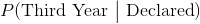
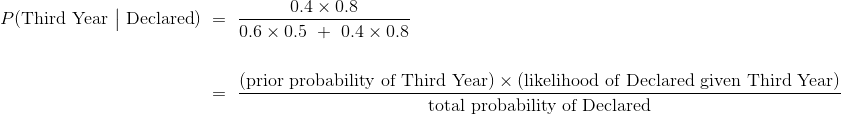
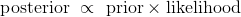
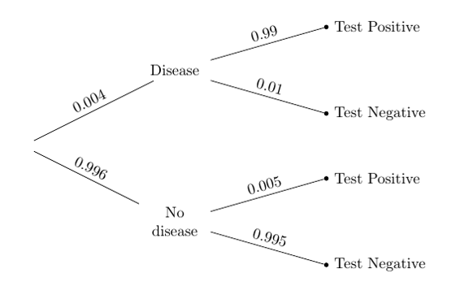
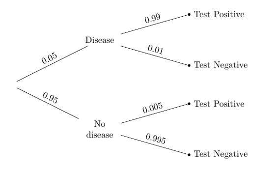

# 十七、更新预测

> 原文：[Updating Predictions](https://github.com/data-8/textbook/tree/gh-pages/chapters/17)

> 译者：[飞龙](https://github.com/wizardforcel)

> 协议：[CC BY-NC-SA 4.0](http://creativecommons.org/licenses/by-nc-sa/4.0/)

> 自豪地采用[谷歌翻译](https://translate.google.cn/)

我们知道如何使用训练数据将一个点划分为两类之一。 我们的分类只是对类别的预测，基于最接近我们的新点的，训练点中最常见的类别。

假设我们最终发现了我们的新点的真实类别。 然后我们会知道我们的分类是否正确。 另外，我们将会有一个新点，可以加入到我们的训练集中，因为我们知道它的类别。 这就更新了我们的训练集。 所以，我们自然希望，根据新的训练集更新我们的分类器。

本章将介绍一些简单的情况，其中新的数据会使我们更新我们的预测。 虽然本章中的例子在计算方面较简单，但是更新方法可以推广到复杂的设定，是机器学习最强大的工具之一。

## “更可能”的二分类器

让我们尝试使用数据，将一个点划分为两个类别之一，选择我们认为更可能的类别。 为此，我们不仅需要数据，而且还要清楚地描述几率是什么样。

我们将从一个简单的人造情况开始，开发主要的技术，然后跳到更有趣的例子。

假设有个大学班级，其组成如下：

+   60% 的学生为二年级，其余的 40% 是三年级
+   50% 二年级学生已经声明了他们的专业
+   80% 三年级学生已经声明了他们的专业

现在假设我从班上随机挑选一个学生。 你能否用“更可能”的标准，将学生划分为二年级或三年级？

你可以，因为这个学生是随机挑选的，所以你知道这个学生是二年级的几率是 60%。 这比三年级的 40% 的可能性更大，所以你会把学生划分为二年级。

专业的信息是无关紧要的，因为我们已经知道班上二，三年的比例。

我们有了非常简单的分类器！ 但是现在假设我给了你一些被挑选的学生的更多信息：

这个学生已经声明了专业。

这个知识会改变你的分类吗？

## 基于新信息更新预测

现在我们知道学生已经宣布了专业，重要的是要看看年级和专业声明的关系。 二年级的学生比三年级多，这仍然正确。 但是，三年级的学生，比二年级的学生，声明专业的比例更高，这也是事实。 我们的分类器必须考虑到这两个观察。

为了使这个可视化，我们将使用`students`表，它包含 100 个学生，每个学生一行，学生的年级和专业比例和数据中相同。

```py
students.show(3)
```


| Year | Major |
| --- | --- |
| Second | Undeclared |
| Second | Undeclared |
| Second | Undeclared |

（省略了 97 行）

为了检查比例是否正确，我们使用`pivot`，按照这两个变量对每个学生进行交叉分类。

```py
students.pivot('Major', 'Year')
```

| Year | Declared | Undeclared |
| --- | --- | --- |
| Second | 30 | 30 |
| Third | 32 | 8 |


总人数为 100 人，其中二年级 60 人，三年级 40 人。 二年级中，每个专业类别有 50%。 三年级的 40 人中，20% 是未声明的，80% 已声明。 因此，这 100 人的比例和我们问题中的班级相同，我们可以假定，我们的学生是从 100 名学生中随机抽取的。

我们必须选择学生最可能进入的那一行。当我们对这个学生一无所知时，他或她可能在四个单元格中的任何一个，因此更可能在第一行（二年级），因为那里包含更多的学生。

但是现在我们知道这个学生已经声明了专业，所以可能结果的空间已经减少了：现在学生只能在两个已声明的单元格中的一个。

这些单元格共有 62 名学生，其中 32 名是三年级。 这是一半以上，即使不是太多。

所以，考虑到学生专业的新信息，我们必须更新我们的预测，现在将学生划分为三年级。

我们的分类的正确几率是多少？ 对于所有声明了专业的 32 个三年级，我们是正确的，对于那 30 个二年级，我们是错误的。 因此，我们的正确几率大约是 0.516。

换句话说，我们正确几率是声明专业的学生中三年级的比例。

```py
32/(30+32)
0.5161290322580645
```

## 树形图

我们刚刚计算的比例基于 100 名学生。 但是班级没有理由没有 200 名学生，只要单元格中的所有比例都是正确的。 那么我们的计算就变成了`64 /(60 + 64)`，就是 0.516。

所以计算只取决于不同类别的比例，而不是计数。 为了便于比较，比例可以用树形图可视化，直接显示在数据透视表下方。

```py
students.pivot('Major', 'Year')
```

| Year | Declared | Undeclared |
| --- | --- | --- |
| Second | 30 | 30 |
| Third | 32 | 8 |

像数据透视表一样，该图将学生分成四个不同的组，称为“分支”。请注意，“三年级已声明”分支中的学生比例为`0.4 x 0.8 = 0.32`，对应于数据透视表中“三年级已声明”单元格中的 32 名学生。 “二年级已声明”分支中包含学生的`0.6 x 0.5 = 0.3`，对应于数据透视表中“二年级已声明”单元格中的 30 个。

我们知道，被挑选的学生属于“已声明”分支。也就是说，学生在两个顶层分支之一。这两个分支现在形成了我们的简化概率空间，所有几率的计算必须相对于这个简化空间的总概率。

所以，考虑到学生已声明专业，他们是三年级的几率可以直接从树中计算出来。答案是相对于两个“已声明”分类的总比例，“三年级已声明”分类的比例。

也就是说，答案是和以前一样，已声明的学生中三年级的比例。

```py
(0.4 * 0.8)/(0.6 * 0.5  +  0.4 * 0.8)
0.5161290322580645
```

### 贝叶斯法则

我们刚刚使用的方法来源于托马斯·贝叶斯牧师（1701-1761）。他的方法解决了所谓的“逆向概率”问题：假设有了新的数据，如何更新之前发现的几率？虽然贝叶斯生活在三个世纪之前，但他的方法现在在机器学习中广泛使用。

我们将在学生总体的背景下讲述这个规则。首先，一些术语：

先验概率。在我们知道所选学生的专业声明状态之前，学生是二年级的几率是 60%，学生是三年级的几率是 40%。这是两个类别的先验概率。

可能性。这是专业状态在给出学生类别情况下的几率；因此可以从树形图中读出。例如，假设学生是二年级，已声明的可能性是 0.5。

后验概率。这些是考虑专业声明状态的信息后，二年级的概率。我们计算了其中的一个：

假设学生已经声明，学生是三年级的后验概率表示为 ，计算如下。



另一个后验概率是：


```py
(0.6 * 0.5)/(0.6 * 0.5  +  0.4 * 0.8)
0.4838709677419354
```

这大概是 0.484，还不到一半，与我们三年的分类一致。

请注意，两个后验概率的分母相同：新信息，也就是学生已声明的几率。

正因为如此，贝叶斯方法有时被归纳为比例陈述：



公式非常便于高效地描述计算。 但是在我们的学生示例这样的情况中，不用公式来思考更简单。 我们仅仅使用树形图。

## 做出决策

贝叶斯规则的一个主要用途，是基于不完整的信息做出决策，并在新的信息到来时纳入它们。本节指出了在决策时保持你的假设的重要性。

许多疾病的医学检测都会返回阳性或阴性结果。阳性结果意味着，根据检测患者有疾病。阴性结果意味着，检测的结论是患者没有这种疾病。

医学检测经过精心设计，非常准确。但是很少有检测是 100% 准确的。几乎所有检测都有两种错误：

假阳性是，检测结果为阳性，但患者没有该疾病的错误。

假阴性是，检测结果为阴性，但患者确实有这种疾病的错误。

这些错误可能会影响人们的决策。假阳性可能引起焦虑和不必要的治疗（在某些情况下，这是昂贵的或危险的）。如果由于其阴性检测结果，患者未接受治疗，则假阴性可能具有更严重的后果。

### 罕见疾病的检测

假设总体很大，疾病只占总体的一小部分。 下面的属性图总结了这种疾病的信息，以及它的医学检测。



总的来说，只有千分之四的总体有这种疾病。 检测相当准确：假阳性几率非常小，为 5/1000，但是假阴性更大（尽管还是很小），为 1/100。

个体可能知道也可能不知道他们是否患有这种疾病；通常情况下，人们会进行检测来确认他们是否拥有。

所以假设随机从总体中挑选一个人并进行检测。 如果检测结果是阳性的，你会如何分类：患病还是没有患病？

我们可以通过应用贝叶斯规则，和使用我们的“更可能”的分类器来回答这个问题。 鉴于该人已经检测出阳性，他或她患病的几率是相对于`Test Positive`分支中的总比例，顶层分支的比例。

```py
(0.004 * 0.99)/(0.004 * 0.99  +  0.996*0.005 )
0.44295302013422816
```

鉴于这个人已经检测出阳性，他或她有这种疾病的几率是大约 44%。 所以我们将它们分类为：没有疾病。

这是一个奇怪的结论。 我们有一个相当准确的检测，一个人检测出阳性，我们的分类是...他们没有这种疾病？ 这似乎没有任何意义。

面对一个令人不安的答案，首先要做的是检查计算。 上面的算法是正确的。 我们来看看是否可以用不同的方式得到相同的答案。

函数`population`群体返回 100,000 名患者的结果表格，它的列展示了实际情况和检测结果。 检测与树中描述的相同。 但是有这种疾病的比例是这个函数的参数。

我们将 0.004 用作参数来调用`population`，然后调用`pivot `，对这十万人中的每一个人进行交叉分类。

```py
population(0.004).pivot('Test Result', 'True Condition')
```


| True Condition | Negative | Positive |
| --- | --- | --- |
| Disease | 4 | 396 |
| No Disease | 99102 | 498 |

表的单元格计数正确。 例如，根据总体的描述，一千人中有四人患有这种疾病。 表格中有十万人，所以 400 人应该有这种病。 这就是表格所显示的：`4 + 396 = 400`。在这 400 认中，99% 获得了阳性检测结果：`0.99 x 400 = 396`。

```py
396/(396 + 498)
0.4429530201342282
```

这就是我们通过使用贝叶斯规则得到的答案。`Positives`列中的计数显示为什么它小于 1/2。 在阳性的人中，更多的人没有疾病而不是有疾病。

原因是，很大一部分人没有这种疾病。检测出假阳性的一小部分人比真阳性要多。 这在树形图中更容易可视化：


真阳性的比例是总体一小部分（0.004）的很大一部分（0.99）。
假阳性的比例是总体很大一部分（0.996）的一小部分（0.005）。
这两个比例是可比的；第二个大一点。

所以，鉴于随机选择的人检测为阳性，我们将他们划分为，更有可能没有疾病，是正确的。

### 主观先验

正确并不总令人满意。将阳性患者划分为不患有该疾病似乎仍然有些错误，对于这样的精确检测来说。由于计算是正确的，我们来看看我们的概率计算的基础：随机性假设。

我们的假设是，一个随机选择的人进行了检测，并得到了阳性结果。但是这在现实中并没有发生。因为他们认为他们可能有疾病，或者因为他们的医生认为他们可能有疾病，人们去接受检测。被检测的人不是随机选择的总体的成员。

这就是为什么，我们对被检测者的直觉与我们得到的答案不太相符。我们正在想象一个病人接受检测的现实情况，因为有一些理由让他们这样做，而计算基于随机选择的人进行检测。

所以让我们在更现实的假设下重做我们的计算，即病人正在接受检测，因为医生认为病人有发病的机会。

这里需要注意的是，“医生认为有机会”是指医生的意见，而不是总体中的比例。这被称为主观概率。在病人是否患有这种疾病的情况下，这也是主观的先验概率。

一些研究人员坚持认为，所有的概率必须是相对的频率，但主观概率导出都是。候选人赢得下一次选举的几率，大地震在下一个十年将会袭击湾区的几率，某个国家赢得下一届足球世界杯的几率：这些都不是基于相对频率或长期的频率。每个都包含主观因素。涉及它们的所有计算也都有主观因素。

假设医生的主观意见是，患者有 5% 的几率患病。那么树形图中的先验概率将会改变：



鉴于病人检测为阳性，他或她有这种疾病的几率是由贝叶斯规则给出。

```py
(0.05 * 0.99)/(0.05 * 0.99  +  0.95 * 0.005)
0.9124423963133641
```

改变先验的效果是惊人的。 即使病人患病的医生的先验概率（5%）很低，一旦患者检测出阳性，患病的后验概率高达 91% 以上。

如果患者检测出阳性，医生认为患者患病是合理的。

### 确认结果

虽然医生的意见是主观的，但我们可以产生一个人造总体，5% 的人患有这种疾病，并且使用相同的检测来进行检测。 然后，我们可以计算不同类别的人数，看看这些计数是否与我们使用贝叶斯规则得到的答案一致。


我们可以使用`population(0.05)`和`pivot`构建相应的总体，并看看四个单元格中的计数。

```py
population(0.05).pivot('Test Result', 'True Condition')
```


| True Condition | Negative | Positive |
| --- | --- | --- |
| Disease | 50 | 4950 |
| No Disease | 94525 | 475 |


在这个人工创建的 10 万人的总体中，有 5000 人（5%）患有这种疾病，其中 99% 的人检测为阳性，导致 4950 人为真阳性。 将其与 475 个假阳性相比：在阳性中，拥有疾病的比例与我们通过贝叶斯规则得到的结果相同。

```py
4950/(4950 + 475)
0.9124423963133641
```

因为我们可以一个具有合适比例的总体，我们也可以使用模拟来确认我们的答案是否合理。 `pop_05`表包含 10 万人的总体，使用医生的先验患病概率 5%，以及检测的错误率来生成。 我们从总体中抽取一个规模为 10,000 的简单随机样本，并提取`positive`表，仅包含样本中阳性检测结果的个体。

```py
pop_05 = population(0.05)

sample = pop_05.sample(10000, with_replacement=False)

positive = sample.where('Test Result', are.equal_to('Positive'))
```

在这些阳性结果中，真实比例是多少？ 那是拥有这种疾病的阳性的比例：

```py
positive.where('True Condition', are.equal_to('Disease')).num_rows/positive.num_rows
0.9131205673758865
```

运行这两个单元格几次，你会发现，阳性中真阳性的比例位于我们通过贝叶斯规则计算的值 0.912 周围。

你也可以以不同参数调用`population`函数，来改变先验患病概率，并查看后验概率如何受到影响。
