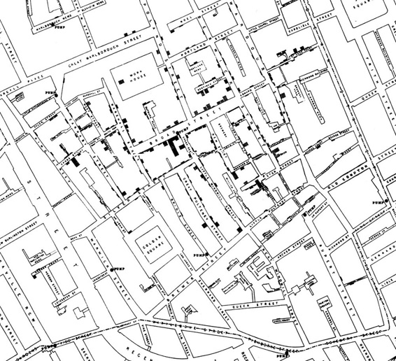
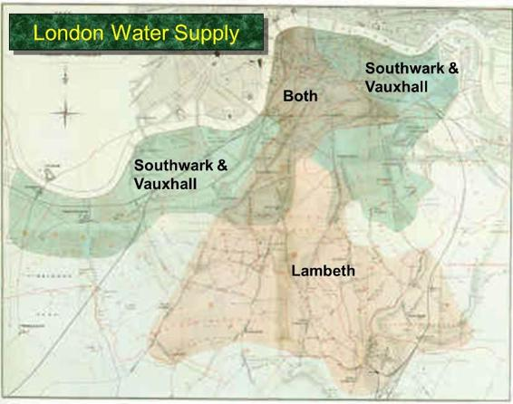

# 二、因果和实验

> 原文：[Causality and Experiments](https://github.com/data-8/textbook/tree/gh-pages/chapters/02)

> 译者：[飞龙](https://github.com/wizardforcel)

> 协议：[CC BY-NC-SA 4.0](http://creativecommons.org/licenses/by-nc-sa/4.0/)

> 自豪地采用[谷歌翻译](https://translate.google.cn/)

“这些问题已经，而且可能永远留在自然界难以捉摸的秘密之中，它们属于人类智力根本难以接近的一类问题。 - 1849 年 9 月，伦敦时报，霍乱如何传染和传播

死刑有威慑作用吗？巧克力对你有好处吗？什么导致乳腺癌？

所有这些问题试图为结果找到一个原因。仔细检查数据可以帮助揭示这些问题。在本节中，你将学习建立因果关系所涉及的一些基本概念。

观察是良好科学的关键。观察研究是一项研究，科学家根据他们所观察到的，但却无法产生的数据作出结论。在数据科学中，许多这样的研究涉及对一组个体的观察，称为实验的利害关系（factor of interest），以及对每个个体的测量结果。

将个体视为人是最容易的。在研究巧克力是否对健康有好处时，个体确实是人，实验是吃巧克力，结果可能是血压的测量。但观察研究中的个体不一定是人。在研究死刑是否具有威慑作用时，个体可以为联盟的 50 个州。允许死刑的州的法律是实验，结果可能是州的谋杀率。

根本问题是实验是否对结果有影响。实验和结果之间的任何关系被称为关联。如果实验导致结果发生，那么这个关联是因果关系。因果关系是本节开头提出的所有三个问题的核心。例如，问题之一是巧克力是否直接导致健康状况的改善，而不是巧克力与健康之间是否存在关联。

因果关系的建立往往分两个阶段进行。首先，观察一个关联。接下来，更仔细的分析决定了因果关系。

## John Snow 和 Broad 街水泵

### 观察和可视化：John Snow 和 Broad 街水泵

精确观察导致建立因果关系的例子之一，最早可以追溯到 150 多年前。为了将你的思维带回正确的时间，试着想象一下 19 世纪 50 年代的伦敦。这是世界上最富裕的城市，但其中许多人却极度贫困。那时，查尔斯·狄更斯（Charles Dickens）在名气鼎盛时，正在写作关于他们的困境的文章。这个城市的贫困地区疾病盛行，霍乱是最可怕的。那个时候还不知道细菌会导致疾病，主流理论是“瘴气”是主要的罪魁祸首。 瘴气表现为恶臭，被认为是由腐烂物质引起的无形的有毒颗粒。伦敦的部分地区气味非常糟糕，特别是在炎热的天气里。为了保护自己免受感染，那些有能力的人把甜的东西放在鼻子上。

几年来，一个名叫约翰·斯诺（John Snow）的医生一直在跟踪着时不时袭击英国的巨大霍乱。疾病突然到来，几乎立即致命：人们在一两天内死亡，数百人在一个星期内死亡，单批总死亡人数可能达到数万人。斯诺对瘴气理论持怀疑态度。他注意到，当整个家庭被霍乱摧毁时，邻居有时完全没有受到影响。当他们呼吸和邻居一样的空气和瘴气时，不好的气味和霍乱的发生之间没有什么紧密的联系。

斯诺还注意到，这种疾病的发作几乎总是牵涉呕吐和腹泻。因此，他认为这种感染是由人们吃或喝的东西来进行的，而不是他们所呼吸的空气。他主要怀疑被污染的水。

1854 年 8 月底，霍乱在过度拥挤的伦敦苏豪区爆发。随着死亡人数的增加，斯诺用一种在疾病传播研究中成为标准的方法，勤奋地将它们记录下来：他画了一张地图。在该地区的街道地图上，他记录了每次死亡的地点。

这是斯诺的原始地图。每个黑色条形代表一次死亡。黑色圆圈标记了水泵的位置。地图上显示了一个惊人的启示 - 死亡大致集中在 Broad 街水泵周围。

斯诺仔细研究了他的地图，并调查了明显的异常。他们都设计 Broad 街水泵。例如：

+   死亡发生在离 Rupert 街水泵更近的房子，而不是 Broad  街。尽管 Rupert 街水泵直线上更近，但由于街道布局不方便，是死路一条。那些房子里的居民使用了 Broad 街水泵。
+   泵东边的两个街区没有死亡。那是 Lion Brewery 的位置，那里的工人喝了他们酿造的东西。如果他们想喝水，啤酒厂有自己的井。
+   Broad 街水泵几个街区之外的房子里，发生了少量死亡。那些孩子在上学路上从 Broad 街水泵饮水。泵的水清凉爽口。

最后一个支持斯诺的理论的证据是，在距离 Soho 区很远的 Hampstead  地区的两个孤立的死亡事件。斯诺对这些人感到困惑，直到他得知死者是住在 Broad 街的 Susannah Eley 夫人和她的侄女。Eley 夫人每天都将 Broad 街水泵的水带到 Hampstead 给她。她喜欢水的味道。

后来发现了一个粪坑，距离 Broad 街水泵几英尺远，渗入了井里面。因此，来自霍乱受害者房子的污水污染了水泵的水。

斯诺用他的地图来说服当地政府，拆除 Broad 街水泵的手柄。虽然霍乱疫情已经在减少，但是停止使用这种水泵有可能阻止了许多人死于未来的疾病。

Broad 街水泵的手柄的拆除已成为一个传奇。在亚特兰大的疾病控制中心（CDC），当科学家寻找流行病问题的简单答案时，他们有时会互相问：“这个水泵的手柄在哪里？”

斯诺的地图是数据可视化的最早和最强大的用法之一。现在各种疾病地图是跟踪流行病的标准工具。

### 因果关系

虽然地图给了斯诺强有力的证据，说明了供水的清洁是控制霍乱的关键，但是，为了使“污染的水导致疾病的传播”这个科学论证有说服力，还有很长一段路要走。为了使案例更有说服力，他必须使用比较法。

科学家使用比较来确定实验与结果之间的关联。他们比较了一组接受实验的个体（实验组）的结果，和一组没有接受实验的个体的结果（对照组）。例如，现在的研究人员可能会比较死刑国家和没有死刑的国家的平均谋杀率。

如果结果不同，那就是表明关联的证据。但是为了确定因果关系，需要更加小心。

## 斯诺的“大实验”

斯诺为自己在 Soho 中学到的东西感到鼓舞，他对霍乱的死亡情况做了更彻底的分析。一段时间中，他一直在收集伦敦一个地区的数据，这里由两家水厂服务。Lambeth 水厂从污水排入泰晤士河的地方的上游抽水。它的水比较干净。但 Southwark and Vauxhall (S&V) 公司在污水排放的下游抽水，因此其供水受到污染。

下图显示了两家公司所服务的地区。斯诺专注于两个服务地区重叠的地方。

斯诺注意到，S&V 供应的人和 Lambeth 供应的人之间没有系统的差别。 “每家公司都供应富人和穷人，大房子和小房子，接受不同公司的供水的人的状况或职业并没有差别......接受两家公司供水的人或者房子都没什么区别，它们周围的物理状况也没什么区别...”

唯一的区别是供水方面，“一组供水含有伦敦的污水，其中有一些可能来自霍乱病人，另一组则不含。”

斯诺相信他能够得出一个清楚的结论，斯诺在下表中总结了他的数据。

| Supply Area | Number of houses | cholera deaths | deaths per 10,000 houses |
| --- | --- | --- | --- |
| S&V | 40,046 | 1,263 | 315 |
| Lambeth | 26,107 | 98 | 37 |
| Rest of London | 256,423 | 1,422 | 59 |

数字在指责 S&V。 S&V 供应的房屋的霍乱死亡率几乎是 Lambeth 供应的房屋的十倍。

## 建立因果

用本节前面提出的语言，可以将 S&V 房屋中的人作为实验组，Lambeth 房屋中的人作为对照组。斯诺的分析中的一个关键因素是，除了实验组以外，两组相互比较。

为了确定供水是否引起霍乱，斯诺必须比较两个彼此相似的群体，它们只有一方面不同：供水。只有这样，他才能够将其结果的差异归因于供水。如果这两个群体在其他方面有所不同，那么就很难把供水视为疾病的来源。例如，如果实验组由工厂工人组成，而对照组不是，那么两组之间的结果之间的差异可能是由于供水，工厂工作或两者兼有，或使两组彼此不同的其它因素。最后的图景会更加模糊。

斯诺的才智在于，确定可以使他的比较清晰的两组。他开始着手建立水污染和霍乱感染之间的因果关系，并且在很大程度上他成功了，尽管瘴气学说忽视甚至嘲笑他。当然，斯诺并不了解人类感染霍乱的详细机制。这个发现是在 1883 年，当时德国科学家罗伯特·科赫（Robert Koch）分离出霍乱弧菌，这种霍乱弧菌是进入人体小肠并引起霍乱的细菌。

事实上，霍乱弧菌在 1854 年由意大利的菲利波·帕齐尼（Filippo Pacini）发现，就在斯诺在伦敦分析他的数据的时候。由于意大利瘴气学说的统治，帕齐尼的发现并不为人所知。但到了十九世纪末，瘴气学说正在消失。随后的历史证明了帕齐尼和约翰·斯诺。斯诺的方法导致了流行病学领域的发展，它是疾病传播的研究。

### 混淆

现在让我们回到更现代化的时代，带着我们一路上学到的重要经验：

在一项观察研究中，如果实验组和对照组在实验以外的方面有所不同，则很难对因果关系作出结论。

两组之间的根本区别（除了实验）被称为混淆因素，因为当你试图得出结论时，它可能会混淆你（也就是搞砸你）。

示例：咖啡和肺癌。二十世纪六十年代的研究表明，喝咖啡的人患肺癌的比率高于不喝咖啡的人。因此，有些人认为咖啡是肺癌的一个原因。但咖啡不会导致肺癌。分析包含一个混淆因素 - 吸烟。在那些日子里，喝咖啡的人也可能是吸烟者，吸烟确实会导致肺癌。喝咖啡与肺癌有关，但不会导致疾病。

混淆因素在观察研究中很常见。良好的研究需要非常小心，以减少混淆。

## 随机化

避免混淆的一个很好的方法是，将个体随机分配到实验和对照组，然后将实验给予分配到实验组的人。随机化使两组除了实验之外都相似。

如果你能够将个体随机分为实验组和对照组，你正在进行一项随机对照试验（RCT）。有时候，人们在实验中的反应会受到他们知道他们在哪个群体的影响。所以你可能希望进行盲法实验，其中个体不知道他们是在实验组还是对照组。为了使它有效，你必须把安慰剂给控制组，这是一种和实验看起来完全一样的东西，但实际上没有效果。

随机对照实验早已成为医学领域的黄金标准，例如确定新药是否有效。在经济学等其他领域也越来越普遍。

示例：墨西哥的福利补贴。在 20 世纪 90 年代的墨西哥村庄，贫困家庭的孩子往往没有入学。其中一个原因是年龄较大的孩子可以上班，从而帮助家庭。墨西哥财政部长 Santiago Levy 着手调查福利项目是否可以用来提升入学率和改善健康状况。他在一组村庄进行了一项随机对照试验，随机选择其中的一些来接受一个名为 PROGRESA 的新福利项目。如果他们的孩子定期上学，并且家庭使用了预防性医疗保险，那么这个项目会把钱捐给贫困家庭。如果孩子上中学而不是小学，会给他们更多钱，来补偿孩子的工资损失，女孩上学比男孩给的更多。其余的村庄没有得到这个实验，并形成了对照组。由于随机化，没有销魂因素，可以确定 PROGRESA 增加了入学率。对于男孩，入学率从对照组的 73% 上升到 PROGRESA 组的 77%。对于女孩来说，增长幅度更大，从对照组的 67% 增加到 PROGRESA 组的近75%。由于这个实验的成功，墨西哥政府以 OPORTUNIDADES 这个新名称支持这个项目，作为对一个健康和受过良好教育的人口的投资。

在某些情况下，即使目标是调查因果关系，也不可能进行随机对照实验。例如，假设你想研究怀孕期间饮酒的影响，你随机将一些孕妇分配到你的“酒精”组。如果你给他们喝一杯，你不应该期待她们会合作。在这种情况下，你几乎总是在进行观察研究，而不是实验。要警惕混淆因素。

## 尾注

根据我们开发的术语，约翰·斯诺进行了一项观察研究，而不是一个随机的实验。但是他把自己的研究称为“大实验”，因为他写道：“至少三十万人......被分成两组，他们无法选择，在大多数情况下，他们并不知情......”

斯诺的这种研究有时被称为“自然实验”。然而，真正的随机化并不仅仅意味着，实验和对照组“在他们无法选择的情况下”进行选择。

随机化的方法可以像掷硬币一样简单。它也可能更复杂一点。但是随机化的每一种方法都是由一系列精心定义的步骤组成的，这些步骤允许几率以数学方式指定。这有两个重要的结果。

+   它使我们能够以数学方式，计算随机化产生实验和对照组的可能性。

+   它使我们能够对实验组和对照组之间的差异作出精确的数学表述。这反过来帮助我们对实验是否有效作出正确的结论。

在本课程中，你将学习如何进行和分析你自己的随机实验。这将涉及比本节更多的细节。目前，只需关注主要思想：尝试建立因果关系，如果可能，进行随机对照实验。如果你正在进行一项观察研究，你可能能够建立联系而不是因果关系。在根据观察研究得出因果关系的结论之前，要非常小心混淆因素。

### 术语

+   observational study：观察研究
+   treatment：实验
+   outcome：结果
+   association：关联/联系
+   causal association：因果联系
+   causality：因果（关系）
+   comparison：比较
+   treatment group：实验组
+   control group：对照组
+   epidemiology：流行病学/传染病学
+   confounding：混淆
+   randomization：随机化
+   randomized controlled experiment：随机对照实验
+   randomized controlled trial (RCT)：随机对照实验
+   blind：盲法
+   placebo：安慰剂

### 有趣的事实

+   约翰·斯诺有时被称为流行病学之父，但他是专业的麻醉师。 他的病人之一是维多利亚女王，她是分娩时麻醉剂的早期接受者。

+   弗洛伦斯·南丁格尔，现代护理实践的创始人，因其在克里米亚战争中的工作而闻名，是一位顽固瘴气主义者。 她没有时间研究传染病和细菌的理论，也没有时间讲述她的话。 她说：“与这个学说相关的荒谬是无穷无尽的。一言以蔽之，从一般意义上说，没有任何科学研究可以接受的证据表明，存在传染病这样的事情。”

+   后来的随机对照试验表明，PROGRESA 坚持的条件 - 孩子上学，预防性医疗保险 - 对于提升入学率没有必要。 只是提高福利金就足够了。

### 扩展阅读

+   [The Strange Case of the Broad Street Pump: John Snow and the Mystery of Cholera](http://www.ucpress.edu/book.php?isbn=9780520250499) 由 Sandra Hempel 所著，加利福尼亚大学出版社出版，读起来像是侦探小说。 这是本节中约翰·斯诺和他的工作的主要来源之一。 一些警告：这本书的一些内容令人反胃。

+   [Poor Economics](http://www.pooreconomics.com/) 由 MIT 的 Abhijit V. Banerjee 和 Esther Duflo 所著的畅销书，是对抗全球贫困的方式的易理解的真实记录。 它包含了很多 RCT 的例子，包括本节中的 PROGRESA 示例。
