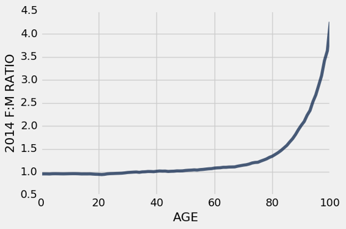

# 五、表格

> 原文：[Tables](https://github.com/data-8/textbook/tree/gh-pages/chapters/05)

> 译者：[飞龙](https://github.com/wizardforcel)

> 协议：[CC BY-NC-SA 4.0](http://creativecommons.org/licenses/by-nc-sa/4.0/)

> 自豪地采用[谷歌翻译](https://translate.google.cn/)


表格是表示数据集的基本对象类型。 表格可以用两种方式查看：

+   具名列的序列，每列都描述数据集中所有条目的一个方面，或者
+   行的序列，每行都包含数据集中单个条目的所有信息。

为了使用表格，导入所有称为`datascience`的模块，这是为这篇文章创建的模块。

```py
from datascience import *
```

空表格可以使用`Table`创建。空表格是实用的，因为他可以扩展来包含新行和新列。

```py
Table()
```

表格上的`with_columns`方法使用带有附加标签的列，构造一个新表。 表格的每一列都是一个数组。 为了将一个新列添加到表中，请使用标签和数组调用`with_columns`。 （`with_column`方法具有相同的效果。）

下面，我们用一个没有列的空表开始每个例子。

```py
Table().with_columns('Number of petals', make_array(8, 34, 5))
```

| Number of petals |
| --- |
| 8 |
| 34 |
| 5 |

为了添加两个（或更多）新列，请为每列提供一个数组和标签。 所有列必须具有相同的长度，否则会发生错误。

```py
Table().with_columns(
    'Number of petals', make_array(8, 34, 5),
    'Name', make_array('lotus', 'sunflower', 'rose')
)
```


| Number of petals | Name |
| --- | --- |
| 8 | lotus |
| 34 | sunflower |
| 5 | rose |

我们可以给这个表格一个名词，之后使用另外一列扩展表格。

```py
flowers = Table().with_columns(
    'Number of petals', make_array(8, 34, 5),
    'Name', make_array('lotus', 'sunflower', 'rose')
)

flowers.with_columns(
    'Color', make_array('pink', 'yellow', 'red')
)
```


| Number of petals | Name | Color |
| --- | --- | --- |
| 8 | lotus | pink |
| 34 | sunflower | yellow |
| 5 | rose | red |

`with_columns`方法每次调用时，都会创建一个新表，所以原始表不受影响。 例如，表`an_example`仍然只有它创建时的两列。

```
flowers
```

| Number of petals | Name |
| --- | --- |
| 8 | lotus |
| 34 | sunflower |
| 5 | rose |

通过这种方式创建表涉及大量的输入。 如果数据已经输入到某个地方，通常可以使用 Python 将其读入表格中，而不是逐个单元格地输入。

通常，表格从包含逗号分隔值的文件创建。这些文件被称为 CSV 文件。

下面，我们使用`Table`的`read_table`方法，来读取一个 CSV 文件，它包含了一些数据，Minard 在他的拿破仑的俄罗斯战役的图片中使用。 数据放在名为`minard`的表中。

```
minard = Table.read_table('minard.csv')
minard
```

| Longitude | Latitude | City | Direction | Survivors |
| --- | --- | --- | --- | --- |
| 32 | 54.8 | Smolensk | Advance | 145000 |
| 33.2 | 54.9 | Dorogobouge | Advance | 140000 |
| 34.4 | 55.5 | Chjat | Advance | 127100 |
| 37.6 | 55.8 | Moscou | Advance | 100000 |
| 34.3 | 55.2 | Wixma | Retreat | 55000 |
| 32 | 54.6 | Smolensk | Retreat | 24000 |
| 30.4 | 54.4 | Orscha | Retreat | 20000 |
| 26.8 | 54.3 | Moiodexno | Retreat | 12000 |

我们将使用这个小的表格来演示一些有用的表格方法。 然后，我们将使用这些相同的方法，并在更大的数据表上开发其他方法。

### 表格的大小

`num_columns `方法提供了表中的列数量，`num_rows`是行数量。

```py
minard.num_columns
5
minard.num_rows
8
```

### 列标签

`labels `方法可以用来列出所有列的标签。 对于`minard`，并不是特别有用，但是对于那些非常大的表格，并不是所有的列都在屏幕上可见。

```py
minard.labels
('Longitude', 'Latitude', 'City', 'Direction', 'Survivors')
```

我们使用`relabeled `修改列标签。这会创建新的表格，并保留`minard`不变。

```
minard.relabeled('City', 'City Name')
```

| Longitude | Latitude | City Name | Direction | Survivors |
| --- | --- | --- | --- | --- |
| 32 | 54.8 | Smolensk | Advance | 145000 |
| 33.2 | 54.9 | Dorogobouge | Advance | 140000 |
| 34.4 | 55.5 | Chjat | Advance | 127100 |
| 37.6 | 55.8 | Moscou | Advance | 100000 |
| 34.3 | 55.2 | Wixma | Retreat | 55000 |
| 32 | 54.6 | Smolensk | Retreat | 24000 |
| 30.4 | 54.4 | Orscha | Retreat | 20000 |
| 26.8 | 54.3 | Moiodexno | Retreat | 12000 |

但是，这个方法并不修改原始表。

```
minard
```

| Longitude | Latitude | City | Direction | Survivors |
| --- | --- | --- | --- | --- |
| 32 | 54.8 | Smolensk | Advance | 145000 |
| 33.2 | 54.9 | Dorogobouge | Advance | 140000 |
| 34.4 | 55.5 | Chjat | Advance | 127100 |
| 37.6 | 55.8 | Moscou | Advance | 100000 |
| 34.3 | 55.2 | Wixma | Retreat | 55000 |
| 32 | 54.6 | Smolensk | Retreat | 24000 |
| 30.4 | 54.4 | Orscha | Retreat | 20000 |
| 26.8 | 54.3 | Moiodexno | Retreat | 12000 |

常见的模式时将原始名称`minard`赋给新的表，以便`minard `未来的所有使用，都会引用修改标签的表格。

```py
minard = minard.relabeled('City', 'City Name')
minard
```

| Longitude | Latitude | City Name | Direction | Survivors |
| --- | --- | --- | --- | --- |
| 32 | 54.8 | Smolensk | Advance | 145000 |
| 33.2 | 54.9 | Dorogobouge | Advance | 140000 |
| 34.4 | 55.5 | Chjat | Advance | 127100 |
| 37.6 | 55.8 | Moscou | Advance | 100000 |
| 34.3 | 55.2 | Wixma | Retreat | 55000 |
| 32 | 54.6 | Smolensk | Retreat | 24000 |
| 30.4 | 54.4 | Orscha | Retreat | 20000 |
| 26.8 | 54.3 | Moiodexno | Retreat | 12000 |

### 访问列中的数据

我们可以使用列标签来访问列中的数据数组。

```py
minard.column('Survivors')
array([145000, 140000, 127100, 100000,  55000,  24000,  20000,  12000])
```

五列的下标分别为`0, 1, 2, 3, 4`。`Survivors`列也可以使用列下标来访问。

```py
minard.column(4)
array([145000, 140000, 127100, 100000,  55000,  24000,  20000,  12000])
```

数组中的八个条目下标为`0, 1, 2, ..., 7`。列中的条目可以使用`item`访问，就像任何数组那样。

```py
minard.column(4).item(0)
145000
minard.column(4).item(5)
24000
```

### 处理列中的数据

因为列是数组，所以我们可以使用数组操作来探索新的信息。 例如，我们可以创建一个新列，其中包含 Smolensk 之后每个城市的所有幸存者的百分比。

```py
initial = minard.column('Survivors').item(0)
minard = minard.with_columns(
    'Percent Surviving', minard.column('Survivors')/initial
)
minard
```


| Longitude | Latitude | City Name | Direction | Survivors | Percent Surviving |
| --- | --- | --- | --- | --- | --- |
| 32 | 54.8 | Smolensk | Advance | 145000 | 100.00% |
| 33.2 | 54.9 | Dorogobouge | Advance | 140000 | 96.55% |
| 34.4 | 55.5 | Chjat | Advance | 127100 | 87.66% |
| 37.6 | 55.8 | Moscou | Advance | 100000 | 68.97% |
| 34.3 | 55.2 | Wixma | Retreat | 55000 | 37.93% |
| 32 | 54.6 | Smolensk | Retreat | 24000 | 16.55% |
| 30.4 | 54.4 | Orscha | Retreat | 20000 | 13.79% |
| 26.8 | 54.3 | Moiodexno | Retreat | 12000 | 8.28% |

要使新列中的比例显示为百分比，我们可以使用选项`PercentFormatter`调用`set_format`方法。 `set_format`方法接受`Formatter `对象，存在日期（`DateFormatter`），货币（`CurrencyFormatter`），数字和百分比。

```py
minard.set_format('Percent Surviving', PercentFormatter)
```

| Longitude | Latitude | City Name | Direction | Survivors | Percent Surviving |
| --- | --- | --- | --- | --- | --- |
| 32 | 54.8 | Smolensk | Advance | 145000 | 100.00% |
| 33.2 | 54.9 | Dorogobouge | Advance | 140000 | 96.55% |
| 34.4 | 55.5 | Chjat | Advance | 127100 | 87.66% |
| 37.6 | 55.8 | Moscou | Advance | 100000 | 68.97% |
| 34.3 | 55.2 | Wixma | Retreat | 55000 | 37.93% |
| 32 | 54.6 | Smolensk | Retreat | 24000 | 16.55% |
| 30.4 | 54.4 | Orscha | Retreat | 20000 | 13.79% |
| 26.8 | 54.3 | Moiodexno | Retreat | 12000 | 8.28% |

### 选择列的集合

`select `方法创建一个新表，仅仅包含指定的列。

```py
minard.select('Longitude', 'Latitude')
```


| Longitude | Latitude |
| --- | --- |
| 32 | 54.8 |
| 33.2 | 54.9 |
| 34.4 | 55.5 |
| 37.6 | 55.8 |
| 34.3 | 55.2 |
| 32 | 54.6 |
| 30.4 | 54.4 |
| 26.8 | 54.3 |

使用列索引而不是标签，也可以执行相同选择。

```py
minard.select(0, 1)
```


| Longitude | Latitude |
| --- | --- |
| 32 | 54.8 |
| 33.2 | 54.9 |
| 34.4 | 55.5 |
| 37.6 | 55.8 |
| 34.3 | 55.2 |
| 32 | 54.6 |
| 30.4 | 54.4 |
| 26.8 | 54.3 |

`select `的结果是个新表，即使当你选择一列时也是这样。

```
minard.select('Survivors')
```

| Survivors |
| --- |
| 145000 |
| 140000 |
| 127100 |
| 100000 |
| 55000 |
| 24000 |
| 20000 |
| 12000 |

要注意结果是个表格，不像`column`的结果，它是个数组。

```py
minard.column('Survivors')
array([145000, 140000, 127100, 100000,  55000,  24000,  20000,  12000])
```

另一种创建新表，包含列集合的方式，是`drop`你不想要的列。

```py
minard.drop('Longitude', 'Latitude', 'Direction')
```


| City Name | Survivors | Percent Surviving |
| --- | --- | --- |
| Smolensk | 145000 | 100.00% |
| Dorogobouge | 140000 | 96.55% |
| Chjat | 127100 | 87.66% |
| Moscou | 100000 | 68.97% |
| Wixma | 55000 | 37.93% |
| Smolensk | 24000 | 16.55% |
| Orscha | 20000 | 13.79% |
| Moiodexno | 12000 | 8.28% |

`select `和`drop`都不修改原始表格。 相反，他们创建了共享相同数据的新小型表格。 保留的原始表格是实用的！ 你可以生成多个不同的表格，只考虑某些列，而不用担心会互相影响。

```
minard
```

| Longitude | Latitude | City Name | Direction | Survivors | Percent Surviving |
| --- | --- | --- | --- | --- | --- |
| 32 | 54.8 | Smolensk | Advance | 145000 | 100.00% |
| 33.2 | 54.9 | Dorogobouge | Advance | 140000 | 96.55% |
| 34.4 | 55.5 | Chjat | Advance | 127100 | 87.66% |
| 37.6 | 55.8 | Moscou | Advance | 100000 | 68.97% |
| 34.3 | 55.2 | Wixma | Retreat | 55000 | 37.93% |
| 32 | 54.6 | Smolensk | Retreat | 24000 | 16.55% |
| 30.4 | 54.4 | Orscha | Retreat | 20000 | 13.79% |
| 26.8 | 54.3 | Moiodexno | Retreat | 12000 | 8.28% |

我们用过的所有方法都可以用在任何表格上。

## 对行排序

CNN 在 2016 年 3 月报道说：“NBA 是全球薪水最高的职业体育联盟。”`nba_salaries`包含了 2015~2016 年间所有 NBA 球员的薪水。

每行表示一个球员。列为：


| 列标签 | 描述 |
| --- | --- |
| `PLAYER` | 球员名称 |
| `POSITION `| 球员在队里的位置 |
| `TEAM` | 队的明确 |
| `'15-'16 SALARY` | 2015~2016 年的球员薪水，单位是百万美元。 |

位置代码是 PG（控球后卫），SG（得分后卫），PF（大前锋），SF（小前锋）和 C（中锋）。 但接下来的内容并不涉及篮球运动的细节。

第一行显示，亚特兰大老鹰队（Atlanta Hawks）的大前锋保罗·米尔萨普（Paul Millsap）在 2015~2016 年间的薪水接近 1870 万美元。

```py
# This table can be found online: https://www.statcrunch.com/app/index.php?dataid=1843341
nba_salaries = Table.read_table('nba_salaries.csv')
nba_salaries
```

| `PLAYER` | `POSITION` | `TEAM` | `'15-'16 SALARY` |
| --- | --- | --- | --- |
| Paul Millsap | PF | Atlanta Hawks | 18.6717 |
| Al Horford | C | Atlanta Hawks | 12 |
| Tiago Splitter | C | Atlanta Hawks | 9.75625 |
| Jeff Teague | PG | Atlanta Hawks | 8 |
| Kyle Korver | SG | Atlanta Hawks | 5.74648 |
| Thabo Sefolosha | SF | Atlanta Hawks | 4 |
| Mike Scott | PF | Atlanta Hawks | 3.33333 |
| Kent Bazemore | SF | Atlanta Hawks | 2 |
| Dennis Schroder | PG | Atlanta Hawks | 1.7634 |
| Tim Hardaway Jr. | SG | Atlanta Hawks | 1.30452 |

（省略了 407 行）


该表包含 417 行，每个球员一行。 只显示了 10 行。`show`方法允许我们指定行数，缺省值（没有指定）是表的所有行。

```py
nba_salaries.show(3)
```


| `PLAYER` | `POSITION` | `TEAM` | `'15-'16 SALARY` |
| --- | --- | --- | --- |
| Paul Millsap | PF | Atlanta Hawks | 18.6717 |
| Al Horford | C | Atlanta Hawks | 12 |
| Tiago Splitter | C | Atlanta Hawks | 9.75625 |

（省略了 414 行）

通过浏览大约 20 行左右，你会看到行按字母顺序排列。 也可以使用`sort`方法，按球员姓名的字母顺序列出相同的行。 `sort`的参数是列标签或索引。

```py
nba_salaries.sort('PLAYER').show(5)
```

| `PLAYER` | `POSITION` | `TEAM` | `'15-'16 SALARY` |
| --- | --- | --- | --- |
| Aaron Brooks | PG | Chicago Bulls | 2.25 |
| Aaron Gordon | PF | Orlando Magic | 4.17168 |
| Aaron Harrison | SG | Charlotte Hornets | 0.525093 |
| Adreian Payne | PF | Minnesota Timberwolves | 1.93884 |
| Al Horford | C | Atlanta Hawks | 12 |

（省略了 412 行）


440/5000
为了检查球员的薪水，如果数据是按薪水排序的话，会更有帮助。

为了实现它，我们首先简化薪水列的标签（只是为了方便），然后用新的标签`SALARY`进行排序。

这会按照薪水的升序排列表中的所有行，最低的薪水在最前面。 输出是一个新表，列与原始表格相同，但行是重新排列的。

```py
nba = nba_salaries.relabeled("'15-'16 SALARY", 'SALARY')
nba.sort('SALARY')
```

| `PLAYER` | `POSITION` | `TEAM` | `'15-'16 SALARY` |
| --- | --- | --- | --- |
| Thanasis Antetokounmpo | SF | New York Knicks | 0.030888 |
| Jordan McRae | SG | Phoenix Suns | 0.049709 |
| Cory Jefferson | PF | Phoenix Suns | 0.049709 |
| Elliot Williams | SG | Memphis Grizzlies | 0.055722 |
| Orlando Johnson | SG | Phoenix Suns | 0.055722 |
| Phil Pressey | PG | Phoenix Suns | 0.055722 |
| Keith Appling | PG | Orlando Magic | 0.061776 |
| Sean Kilpatrick | SG | Denver Nuggets | 0.099418 |
| Erick Green | PG | Utah Jazz | 0.099418 |
| Jeff Ayres | PF | Los Angeles Clippers | 0.111444 |

（省略了 407 行）

这些数字有些难以比较，因为这些球员中的一些，在赛季中改变了球队，并从不止一支球队获得了薪水。 只有最后一支球队的薪水出现在表中。 控球后卫菲尔·普莱西（Phil Pressey）在年内从费城搬到了凤凰城，可能会再次转到金州勇士队（Golden State Warriors）。

CNN 的报道是薪酬水平的另一端 - 那些在世界上薪水最高的球员。

为了按照薪水的降序对表格的行排序，我们必须以`descending=True`调用`sort`函数。

```py
nba.sort('SALARY', descending=True)
```

| `PLAYER` | `POSITION` | `TEAM` | `'15-'16 SALARY` |
| --- | --- | --- | --- |
| Kobe Bryant | SF | Los Angeles Lakers | 25 |
| Joe Johnson | SF | Brooklyn Nets | 24.8949 |
| LeBron James | SF | Cleveland Cavaliers | 22.9705 |
| Carmelo Anthony | SF | New York Knicks | 22.875 |
| Dwight Howard | C | Houston Rockets | 22.3594 |
| Chris Bosh | PF | Miami Heat | 22.1927 |
| Chris Paul | PG | Los Angeles Clippers | 21.4687 |
| Kevin Durant | SF | Oklahoma City Thunder | 20.1586 |
| Derrick Rose | PG | Chicago Bulls | 20.0931 |
| Dwyane Wade | SG | Miami Heat | 20 |

（省略了 407 行）

科比（Kobe Bryant）在湖人队（Lakers）的最后一个赛季是薪水最高的，2500 万美元。 请注意，MVP 斯蒂芬·库里（Stephen Curry）并没有出现在前 10 名之列。他排在后面，我们将在后面看到。

### 具名参数

这个调用表达式的`descending = True`部分称为具名参数。 调用一个函数或方法时，每个参数都有一个位置和一个名字。 从函数或方法的帮助文本中都可以看出它们。

```py
help(nba.sort)
Help on method sort in module datascience.tables:

sort(column_or_label, descending=False, distinct=False) method of datascience.tables.Table instance
    Return a Table of rows sorted according to the values in a column.

    Args:
        ``column_or_label``: the column whose values are used for sorting.

        ``descending``: if True, sorting will be in descending, rather than
            ascending order.

        ``distinct``: if True, repeated values in ``column_or_label`` will
            be omitted.

    Returns:
        An instance of ``Table`` containing rows sorted based on the values
        in ``column_or_label``.

    >>> marbles = Table().with_columns(
    ...    "Color", make_array("Red", "Green", "Blue", "Red", "Green", "Green"),
    ...    "Shape", make_array("Round", "Rectangular", "Rectangular", "Round", "Rectangular", "Round"),
    ...    "Amount", make_array(4, 6, 12, 7, 9, 2),
    ...    "Price", make_array(1.30, 1.30, 2.00, 1.75, 1.40, 1.00))
    >>> marbles
    Color | Shape       | Amount | Price
    Red   | Round       | 4      | 1.3
    Green | Rectangular | 6      | 1.3
    Blue  | Rectangular | 12     | 2
    Red   | Round       | 7      | 1.75
    Green | Rectangular | 9      | 1.4
    Green | Round       | 2      | 1
    >>> marbles.sort("Amount")
    Color | Shape       | Amount | Price
    Green | Round       | 2      | 1
    Red   | Round       | 4      | 1.3
    Green | Rectangular | 6      | 1.3
    Red   | Round       | 7      | 1.75
    Green | Rectangular | 9      | 1.4
    Blue  | Rectangular | 12     | 2
    >>> marbles.sort("Amount", descending = True)
    Color | Shape       | Amount | Price
    Blue  | Rectangular | 12     | 2
    Green | Rectangular | 9      | 1.4
    Red   | Round       | 7      | 1.75
    Green | Rectangular | 6      | 1.3
    Red   | Round       | 4      | 1.3
    Green | Round       | 2      | 1
    >>> marbles.sort(3) # the Price column
    Color | Shape       | Amount | Price
    Green | Round       | 2      | 1
    Red   | Round       | 4      | 1.3
    Green | Rectangular | 6      | 1.3
    Green | Rectangular | 9      | 1.4
    Red   | Round       | 7      | 1.75
    Blue  | Rectangular | 12     | 2
    >>> marbles.sort(3, distinct = True)
    Color | Shape       | Amount | Price
    Green | Round       | 2      | 1
    Red   | Round       | 4      | 1.3
    Green | Rectangular | 9      | 1.4
    Red   | Round       | 7      | 1.75
    Blue  | Rectangular | 12     | 2
```

在`help`文本的最上面，出现了`sort`方法的签名。

```py
sort(column_or_label, descending=False, distinct=False)
```

这描述了`sort`的三个参数的位置，名称和默认值。 调用此方法时，可以使用位置参数或具名参数，因此以下三个调用完全相同。

```py
sort('SALARY', True)
sort('SALARY', descending=True)
sort(column_or_label='SALARY', descending=True)
```

当一个参数只是`True`或`False`时，包含参数名称是实用的约定，以便更明显地说明参数值的含义。

## 行的选取

通常，我们只想提取那些行，它们对应具有特定特征的条目。 例如，我们可能只需要对应勇士的行，或者获得超过一千万美元的球员。 或者我们可能只想要薪水前五名的人。

### 指定行


`Table`的方法就是干这个的 - 它需要一组指定的行。 它的参数是行索引或索引数组，它创建一个只包含这些行的新表。

例如，如果我们只想要`nba`的第一行，我们可以这样使用`take`。

```py
nba
```

| `PLAYER` | `POSITION` | `TEAM` | `'15-'16 SALARY` |
| --- | --- | --- | --- |
| Paul Millsap | PF | Atlanta Hawks | 18.6717 |
| Al Horford | C | Atlanta Hawks | 12 |
| Tiago Splitter | C | Atlanta Hawks | 9.75625 |
| Jeff Teague | PG | Atlanta Hawks | 8 |
| Kyle Korver | SG | Atlanta Hawks | 5.74648 |
| Thabo Sefolosha | SF | Atlanta Hawks | 4 |
| Mike Scott | PF | Atlanta Hawks | 3.33333 |
| Kent Bazemore | SF | Atlanta Hawks | 2 |
| Dennis Schroder | PG | Atlanta Hawks | 1.7634 |
| Tim Hardaway Jr. | SG | Atlanta Hawks | 1.30452 |

（省略了 407 行）

```py
nba.take(0)
```

| `PLAYER` | `POSITION` | `TEAM` | `'15-'16 SALARY` |
| --- | --- | --- | --- |
| Paul Millsap | PF | Atlanta Hawks | 18.6717 |


这是一个新表，只拥有我们指定的单个行。

通过指定一系列索引作为参数，我们还可以获得第四，第五和第六行。

```py
nba.take(np.arange(3, 6))
```


| `PLAYER` | `POSITION` | `TEAM` | `'15-'16 SALARY` |
| --- | --- | --- | --- |
| Jeff Teague | PG | Atlanta Hawks | 8 |
| Kyle Korver | SG | Atlanta Hawks | 5.74648 |
| Thabo Sefolosha | SF | Atlanta Hawks | 4 |

如果我们想要前五个最高薪球员的表格，我们可以先按薪水排序，然后取前五行：

```py
nba.sort('SALARY', descending=True).take(np.arange(5))
```

| `PLAYER` | `POSITION` | `TEAM` | `'15-'16 SALARY` |
| --- | --- | --- | --- |
| Kobe Bryant | SF | Los Angeles Lakers | 25 |
| Joe Johnson | SF | Brooklyn Nets | 24.8949 |
| LeBron James | SF | Cleveland Cavaliers | 22.9705 |
| Carmelo Anthony | SF | New York Knicks | 22.875 |
| Dwight Howard | C | Houston Rockets | 22.3594 |

### 对应指定特征的行


更常见的情况是，我们打算访问一组行中的数据，它们具有某种特征，但是我们并不知道其索引。 例如，我们可能想要所有薪水大于一千万美元的球员的数据，但我们不希望花费时间，对已排序的表中的行进行计数。

`where`方法可以做到。 它的输出是一个表格，列与原始表格相同，但只有特征出现的行。

`where`的第一个参数是列标签，列中包含信息，有关某行是否具有我们想要的特征。 如果特征是“薪水超过一千万美元”，那么列就是`SALARY`。

`where`的第二个参数是用于指定特征的方式。 一些例子会使指定的一般方式更容易理解。

在第一个例子中，我们提取了所有薪水超过一千万美元的人的数据。

```py
nba.where('SALARY', are.above(10))
```

| `PLAYER` | `POSITION` | `TEAM` | `'15-'16 SALARY` |
| --- | --- | --- | --- |
| Paul Millsap | PF | Atlanta Hawks | 18.6717 |
| Al Horford | C | Atlanta Hawks | 12 |
| Joe Johnson | SF | Brooklyn Nets | 24.8949 |
| Thaddeus Young | PF | Brooklyn Nets | 11.236 |
| Al Jefferson | C | Charlotte Hornets | 13.5 |
| Nicolas Batum | SG | Charlotte Hornets | 13.1253 |
| Kemba Walker | PG | Charlotte Hornets | 12 |
| Derrick Rose | PG | Chicago Bulls | 20.0931 |
| Jimmy Butler | SG | Chicago Bulls | 16.4075 |
| Joakim Noah | C | Chicago Bulls | 13.4 |

（省略了 59 行）

`are.above(10)`的参数的确保了，每个选择的行的`SALARY`大于 10。

新的表格有 69 行，相当于 69 个球员的薪水是一千万美元。 按顺序排列这些行使数据更易于分析。 多伦多猛龙队（Toronto Raptors）的德玛尔·德罗赞（DeMar DeRozan）是这个分组（薪水超过一千万美元）中“最穷”的一个。

```py
nba.where('SALARY', are.above(10)).sort('SALARY')
```

| `PLAYER` | `POSITION` | `TEAM` | `'15-'16 SALARY` |
| --- | --- | --- | --- |
| DeMar DeRozan | SG | Toronto Raptors | 10.05 |
| Gerald Wallace | SF | Philadelphia 76ers | 10.1059 |
| Luol Deng | SF | Miami Heat | 10.1516 |
| Monta Ellis | SG | Indiana Pacers | 10.3 |
| Wilson Chandler | SF | Denver Nuggets | 10.4494 |
| Brendan Haywood | C | Cleveland Cavaliers | 10.5225 |
| Jrue Holiday | PG | New Orleans Pelicans | 10.5955 |
| Tyreke Evans | SG | New Orleans Pelicans | 10.7346 |
| Marcin Gortat | C | Washington Wizards | 11.2174 |
| Thaddeus Young | PF | Brooklyn Nets | 11.236 |

（省略了 59 行）


斯蒂芬·库里（Stephen Curry）挣了多少？ 对于答案，我们必须访问`PLAYER`的值等于`Stephen Curry`的行。 这是一个只包含一行的表格：

```py
nba.where('PLAYER', are.equal_to('Stephen Curry'))
```

| `PLAYER` | `POSITION` | `TEAM` | `'15-'16 SALARY` |
| --- | --- | --- | --- |
| Stephen Curry | PG | Golden State Warriors | 11.3708 |

库里只有不到 1140 万美元。 这是很多钱，但还不到勒布朗·詹姆斯（LeBron James）薪水的一半。 你可以在本节前面的“前 5 名”表中找到薪水，或者你可以在上面的代码中找到它，将`'Stephen Curry`换成`'LeBron James'`。

代码中再次使用了`are`，但这次是谓词`equal_to`而不是上面那个。 因此，例如，你可以得到包含所有的勇士的表格：

```py
nba.where('TEAM', are.equal_to('Golden State Warriors')).show()
```

| `PLAYER` | `POSITION` | `TEAM` | `'15-'16 SALARY` |
| --- | --- | --- | --- |
| Klay Thompson | SG | Golden State Warriors | 15.501 |
| Draymond Green | PF | Golden State Warriors | 14.2609 |
| Andrew Bogut | C | Golden State Warriors | 13.8 |
| Andre Iguodala | SF | Golden State Warriors | 11.7105 |
| Stephen Curry | PG | Golden State Warriors | 11.3708 |
| Jason Thompson | PF | Golden State Warriors | 7.00847 |
| Shaun Livingston | PG | Golden State Warriors | 5.54373 |
| Harrison Barnes | SF | Golden State Warriors | 3.8734 |
| Marreese Speights | C | Golden State Warriors | 3.815 |
| Leandro Barbosa | SG | Golden State Warriors | 2.5 |
| Festus Ezeli | C | Golden State Warriors | 2.00875 |
| Brandon Rush | SF | Golden State Warriors | 1.27096 |
| Kevon Looney | SF | Golden State Warriors | 1.13196 |
| Anderson Varejao | PF | Golden State Warriors | 0.289755 |

这部分表格已经按薪水排序，因为原始的表格按薪水排序，列出了同一个球队中球员。 行尾的`.show()`确保显示所有行，而不仅仅是前 10 行。

请求某列等于某值的行非常普遍，因此`are.equal_to`调用是可选的。 相反，仅仅使用列名和值来调用`where`方法，以达到相同的效果。

```
nba.where('TEAM', 'Denver Nuggets') 
# equivalent to nba.where('TEAM', are.equal_to('Denver Nuggets'))
```

| `PLAYER` | `POSITION` | `TEAM` | `'15-'16 SALARY` |
| --- | --- | --- | --- |
| Danilo Gallinari | SF | Denver Nuggets | 14 |
| Kenneth Faried | PF | Denver Nuggets | 11.236 |
| Wilson Chandler | SF | Denver Nuggets | 10.4494 |
| JJ Hickson | C | Denver Nuggets | 5.6135 |
| Jameer Nelson | PG | Denver Nuggets | 4.345 |
| Will Barton | SF | Denver Nuggets | 3.53333 |
| Emmanuel Mudiay | PG | Denver Nuggets | 3.10224 |
| Darrell Arthur | PF | Denver Nuggets | 2.814 |
| Jusuf Nurkic | C | Denver Nuggets | 1.842 |
| Joffrey Lauvergne | C | Denver Nuggets | 1.70972 |

（省略了 4 行）

### 多个属性

通过重复使用`where`，你可以访问具有多个指定特征的行。 例如，这是一种方法，提取薪水超过一千五百万美元的所有控球后卫。

```py
nba.where('POSITION', 'PG').where('SALARY', are.above(15))
```

| `PLAYER` | `POSITION` | `TEAM` | `'15-'16 SALARY` |
| --- | --- | --- | --- |
| Derrick Rose | PG | Chicago Bulls | 20.0931 |
| Kyrie Irving | PG | Cleveland Cavaliers | 16.4075 |
| Chris Paul | PG | Los Angeles Clippers | 21.4687 |
| Russell Westbrook | PG | Oklahoma City Thunder | 16.7442 |
| John Wall | PG | Washington Wizards | 15.852 |

### 一般形式

现在你已经意识到，通过选择具有给定特征的行，来创建新表的一般方法，是使用`where`和`are`，以及适当的条件：

```py
original_table_name.where(column_label_string, are.condition)

nba.where('SALARY', are.between(10, 10.3))
```

| `PLAYER` | `POSITION` | `TEAM` | `'15-'16 SALARY` |
| --- | --- | --- | --- |
| Luol Deng | SF | Miami Heat | 10.1516 |
| Gerald Wallace | SF | Philadelphia 76ers | 10.1059 |
| Danny Green | SG | San Antonio Spurs | 10 |
| DeMar DeRozan | SG | Toronto Raptors | 10.05 |

请注意，上面的表格包括赚一千万美元的 Danny Green，而不包括一千三百万美元的 Monta Ellis。 与 Python 中的其他地方一样，范围包括左端但不包括右端。

如果我们指定一个任何行都不满足的条件，我们得到一个带有列标签但没有行的表。

```py
nba.where('PLAYER', are.equal_to('Barack Obama'))
```

| PLAYER | POSITION | TEAM | SALARY |
| --- | --- | --- | --- |
| | | |

### 更多条件

这里有一些谓词，你可能会觉得有用。 请注意，`x`和`y`是数字，`STRING`是一个字符串，`Z`是数字或字符串；你必须指定这些，取决于你想要的特征。

| 谓词 | 描述 |
| --- | --- |
| `are.equal_to(Z)` | 等于`Z` |
| `are.above(x)` | 大于`x` |
| `are.above_or_equal_to(x)` | 大于等于`x` |
| `are.below(x)` | 小于`x` |
| `are.below_or_equal_to(x)` | 小于等于`x` |
| `are.between(x, y)` | 大于等于`x`，小于`y` |
| `are.strictly_between(x, y)` | 大于`x`，小于`y` |
| `are.between_or_equal_to(x, y)` | 大于等于`x`，小于等于`y` |
| `are.containing(S)` | 包含字符串`S` |

你也可以指定任何这些条件的否定，通过在条件前面使用`.not_`。


| 谓词 | 描述 |
| --- | --- |
| `are.not_equal_to(Z)` | 不等于`Z` |
| `are.not_above(x)` | 不大于`x` |

以及其他。通常的逻辑规则是适用的，例如，“不大于`x`”等价于“小于等于`x`”。

我们以一系列示例结束这一节。

`are.containing`的使用有助于少打一些字。 例如，你可以指定`Warriors`而不是`Golden State Warriors`：

```py
nba.where('TEAM', are.containing('Warriors')).show()
```

| `PLAYER` | `POSITION` | `TEAM` | `'15-'16 SALARY` |
| --- | --- | --- | --- |
| Klay Thompson | SG | Golden State Warriors | 15.501 |
| Draymond Green | PF | Golden State Warriors | 14.2609 |
| Andrew Bogut | C | Golden State Warriors | 13.8 |
| Andre Iguodala | SF | Golden State Warriors | 11.7105 |
| Stephen Curry | PG | Golden State Warriors | 11.3708 |
| Jason Thompson | PF | Golden State Warriors | 7.00847 |
| Shaun Livingston | PG | Golden State Warriors | 5.54373 |
| Harrison Barnes | SF | Golden State Warriors | 3.8734 |
| Marreese Speights | C | Golden State Warriors | 3.815 |
| Leandro Barbosa | SG | Golden State Warriors | 2.5 |
| Festus Ezeli | C | Golden State Warriors | 2.00875 |
| Brandon Rush | SF | Golden State Warriors | 1.27096 |
| Kevon Looney | SF | Golden State Warriors | 1.13196 |
| Anderson Varejao | PF | Golden State Warriors | 0.289755 |

你可以提取所有后卫的数据，包括控球后卫和得分后卫。

```py
nba.where('POSITION', are.containing('G'))
```

| `PLAYER` | `POSITION` | `TEAM` | `'15-'16 SALARY` |
| --- | --- | --- | --- |
| Jeff Teague | PG | Atlanta Hawks | 8 |
| Kyle Korver | SG | Atlanta Hawks | 5.74648 |
| Dennis Schroder | PG | Atlanta Hawks | 1.7634 |
| Tim Hardaway Jr. | SG | Atlanta Hawks | 1.30452 |
| Jason Richardson | SG | Atlanta Hawks | 0.947276 |
| Lamar Patterson | SG | Atlanta Hawks | 0.525093 |
| Terran Petteway | SG | Atlanta Hawks | 0.525093 |
| Avery Bradley | PG | Boston Celtics | 7.73034 |
| Isaiah Thomas | PG | Boston Celtics | 6.91287 |
| Marcus Smart | PG | Boston Celtics | 3.43104 |

（省略了 171 行）

你可以获取所有不是克利夫兰骑士队的球员，并且薪水不低于两千万美元：

```py
other_than_Cavs = nba.where('TEAM', are.not_equal_to('Cleveland Cavaliers'))
other_than_Cavs.where('SALARY', are.not_below(20))
```

| `PLAYER` | `POSITION` | `TEAM` | `'15-'16 SALARY` |
| --- | --- | --- | --- |
| Joe Johnson | SF | Brooklyn Nets | 24.8949 |
| Derrick Rose | PG | Chicago Bulls | 20.0931 |
| Dwight Howard | C | Houston Rockets | 22.3594 |
| Chris Paul | PG | Los Angeles Clippers | 21.4687 |
| Kobe Bryant | SF | Los Angeles Lakers | 25 |
| Chris Bosh | PF | Miami Heat | 22.1927 |
| Dwyane Wade | SG | Miami Heat | 20 |
| Carmelo Anthony | SF | New York Knicks | 22.875 |
| Kevin Durant | SF | Oklahoma City Thunder | 20.1586 |

有很多方式可以创建相同的表格。这里是另一种，并且显然你可以想出来更多。

```py
other_than_Cavs.where('SALARY', are.above_or_equal_to(20))
```

| `PLAYER` | `POSITION` | `TEAM` | `'15-'16 SALARY` |
| --- | --- | --- | --- |
| Joe Johnson | SF | Brooklyn Nets | 24.8949 |
| Derrick Rose | PG | Chicago Bulls | 20.0931 |
| Dwight Howard | C | Houston Rockets | 22.3594 |
| Chris Paul | PG | Los Angeles Clippers | 21.4687 |
| Kobe Bryant | SF | Los Angeles Lakers | 25 |
| Chris Bosh | PF | Miami Heat | 22.1927 |
| Dwyane Wade | SG | Miami Heat | 20 |
| Carmelo Anthony | SF | New York Knicks | 22.875 |
| Kevin Durant | SF | Oklahoma City Thunder | 20.1586 |

你可以看到，`where`的使用提供了很大的灵活性，来访问你感兴趣的特征。 不要犹豫，尝试它吧！

## 示例：人口趋势

### 美国人口的趋势

现在我们做好了处理大量的数据表的准备。 下面的文件包含“美国居民人口的年度估计，按年龄和性别分列”。 请注意，`read_table`可以直接从 URL 读取数据。

```py
# As of Jan 2017, this census file is online here: 
data = 'http://www2.census.gov/programs-surveys/popest/datasets/2010-2015/national/asrh/nc-est2015-agesex-res.csv'

# A local copy can be accessed here in case census.gov moves the file:
# data = 'nc-est2015-agesex-res.csv'

full_census_table = Table.read_table(data)
full_census_table
```

| SEX | AGE | CENSUS2010POP | ESTIMATESBASE2010 | POPESTIMATE2010 | POPESTIMATE2011 | POPESTIMATE2012 | POPESTIMATE2013 | POPESTIMATE2014 | POPESTIMATE2015 |
| --- | --- | --- | --- | --- | --- | --- | --- | --- | --- |
| 0 | 0 | 3944153 | 3944160 | 3951330 | 3963087 | 3926540 | 3931141 | 3949775 | 3978038 |
| 0 | 1 | 3978070 | 3978090 | 3957888 | 3966551 | 3977939 | 3942872 | 3949776 | 3968564 |
| 0 | 2 | 4096929 | 4096939 | 4090862 | 3971565 | 3980095 | 3992720 | 3959664 | 3966583 |
| 0 | 3 | 4119040 | 4119051 | 4111920 | 4102470 | 3983157 | 3992734 | 4007079 | 3974061 |
| 0 | 4 | 4063170 | 4063186 | 4077551 | 4122294 | 4112849 | 3994449 | 4005716 | 4020035 |
| 0 | 5 | 4056858 | 4056872 | 4064653 | 4087709 | 4132242 | 4123626 | 4006900 | 4018158 |
| 0 | 6 | 4066381 | 4066412 | 4073013 | 4074993 | 4097605 | 4142916 | 4135930 | 4019207 |
| 0 | 7 | 4030579 | 4030594 | 4043046 | 4083225 | 4084913 | 4108349 | 4155326 | 4148360 |
| 0 | 8 | 4046486 | 4046497 | 4025604 | 4053203 | 4093177 | 4095711 | 4120903 | 4167887 |
| 0 | 9 | 4148353 | 4148369 | 4125415 | 4035710 | 4063152 | 4104072 | 4108349 | 4133564 |

（已省略 296 行）

只显示了表格的前 10 行。稍后我们将看到如何显示整个表格；但是，这通常不适用于大型表格。

表格的描述一起出现。`SEX`列包含数字代码：`0`代表总体，`1代`表男性，`2`代表女性。 `AGE`列包含完整年份为单位的年龄，但特殊值`999`是人口的总和。 其余的列包含美国人口的估计。

通常，公共表格将包含更多的信息，不仅仅是特定调查或分析所需的信息。 在这种情况下，我们假设我们只对 2010 年到 2014 年的人口变化感兴趣。让我们选择相关的列。

```py
partial_census_table = full_census_table.select('SEX', 'AGE', 'POPESTIMATE2010', 'POPESTIMATE2014')
partial_census_table
```

| SEX | AGE | POPESTIMATE2010 | POPESTIMATE2014 |
| --- | --- | --- | --- |
| 0 | 0 | 3951330 | 3949775 |
| 0 | 1 | 3957888 | 3949776 |
| 0 | 2 | 4090862 | 3959664 |
| 0 | 3 | 4111920 | 4007079 |
| 0 | 4 | 4077551 | 4005716 |
| 0 | 5 | 4064653 | 4006900 |
| 0 | 6 | 4073013 | 4135930 |
| 0 | 7 | 4043046 | 4155326 |
| 0 | 8 | 4025604 | 4120903 |
| 0 | 9 | 4125415 | 4108349 |

（已省略 296 行）

我们也可以简化所选列的标签。

```py
us_pop = partial_census_table.relabeled('POPESTIMATE2010', '2010').relabeled('POPESTIMATE2014', '2014')
us_pop
```

| SEX | AGE | 2010 | 2014 |
| --- | --- | --- | --- |
| 0 | 0 | 3951330 | 3949775 |
| 0 | 1 | 3957888 | 3949776 |
| 0 | 2 | 4090862 | 3959664 |
| 0 | 3 | 4111920 | 4007079 |
| 0 | 4 | 4077551 | 4005716 |
| 0 | 5 | 4064653 | 4006900 |
| 0 | 6 | 4073013 | 4135930 |
| 0 | 7 | 4043046 | 4155326 |
| 0 | 8 | 4025604 | 4120903 |
| 0 | 9 | 4125415 | 4108349 |

（已省略 296 行）

我们现在有了一个易于使用的表格。 表中的每一列都是一个等长的数组，因此列可以使用算术进行组合。 这是 2010 年至 2014 年的人口变化。

```py
us_pop.column('2014') - us_pop.column('2010')
array([  -1555,   -8112, -131198, ...,    6443,   12950, 4693244])
```

让我们使用包含这些变化的列来扩展`us_pop`，一列是绝对数值，另一列是相对于 2010 年数值的百分比。

```py
change = us_pop.column('2014') - us_pop.column('2010')
census = us_pop.with_columns(
    'Change', change,
    'Percent Change', change/us_pop.column('2010')
)
census.set_format('Percent Change', PercentFormatter)
```

| SEX | AGE | 2010 | 2014 | Change | Percent Change |
| --- | --- | --- | --- | --- | --- |
| 0 | 0 | 3951330 | 3949775 | -1555 | -0.04% |
| 0 | 1 | 3957888 | 3949776 | -8112 | -0.20% |
| 0 | 2 | 4090862 | 3959664 | -131198 | -3.21% |
| 0 | 3 | 4111920 | 4007079 | -104841 | -2.55% |
| 0 | 4 | 4077551 | 4005716 | -71835 | -1.76% |
| 0 | 5 | 4064653 | 4006900 | -57753 | -1.42% |
| 0 | 6 | 4073013 | 4135930 | 62917 | 1.54% |
| 0 | 7 | 4043046 | 4155326 | 112280 | 2.78% |
| 0 | 8 | 4025604 | 4120903 | 95299 | 2.37% |
| 0 | 9 | 4125415 | 4108349 | -17066 | -0.41% |

（已省略 296 行）

将数据排序。让我们按照人口绝对变化的降序排序表格。

```py
census.sort('Change', descending=True)
```

| SEX | AGE | 2010 | 2014 | Change | Percent Change |
| --- | --- | --- | --- | --- | --- |
| 0 | 999 | 309346863 | 318907401 | 9560538 | 3.09% |
| 1 | 999 | 152088043 | 156955337 | 4867294 | 3.20% |
| 2 | 999 | 157258820 | 161952064 | 4693244 | 2.98% |
| 0 | 67 | 2693707 | 3485241 | 791534 | 29.38% |
| 0 | 64 | 2706055 | 3487559 | 781504 | 28.88% |
| 0 | 66 | 2621335 | 3347060 | 725725 | 27.69% |
| 0 | 65 | 2678525 | 3382824 | 704299 | 26.29% |
| 0 | 71 | 1953607 | 2519705 | 566098 | 28.98% |
| 0 | 34 | 3822189 | 4364748 | 542559 | 14.19% |
| 0 | 23 | 4217228 | 4702156 | 484928 | 11.50% |

毫不奇怪，排序后表格的第一行对应整个人口：所有年龄和性别的分组。 从 2010 年到 2014 年，美国人口增加了约 950 万人，仅为 3%。

接下来的两行分别对应所有的男性和所有的女性。 以绝对数量和百分比来衡量，男性人口的增长高于女性人口。 百分比变化都在 3% 左右。

现在看看接下来的几行。 百分比变化从总人口的 3% 左右，上升到 60 年代末和 70 年代初的近 30%。 这个惊人的变化称为美国的老龄化。

到目前为止，2014 年 64~67 岁年龄段的绝对变化最大。什么可以解释这一大幅增长的原因？ 我们可以通过考察相关分组的出生年份，来探索这个问题。

那些 2010 年在 64~67 岁年龄段的人，在 1943 年到 1946 年间出生。珍珠港的袭击是在 1941 年底，美军在 1942 年发动了一场大规模战争，结束于 1945 年。

2014 年 64 岁到 67 岁的人生于 1947 年到 1950 年，是美国二战后的生育高峰。

战后的生育高峰，是我们观察到的巨大变化的主要原因。

## 示例：性别趋势

### 性别比例的趋势

我们现在拥有了足够的编码技能，足以检查美国人群中的特征和趋势。在这个例子中，我们将查看不同年龄的男性和女性的分布情况。我们将继续使用上一节中的`us_pop`表。

```py
us_pop
```

| SEX | AGE | 2010 | 2014 |
| --- | --- | --- | --- |
| 0 | 0 | 3951330 | 3949775 |
| 0 | 1 | 3957888 | 3949776 |
| 0 | 2 | 4090862 | 3959664 |
| 0 | 3 | 4111920 | 4007079 |
| 0 | 4 | 4077551 | 4005716 |
| 0 | 5 | 4064653 | 4006900 |
| 0 | 6 | 4073013 | 4135930 |
| 0 | 7 | 4043046 | 4155326 |
| 0 | 8 | 4025604 | 4120903 |
| 0 | 9 | 4125415 | 4108349 |

（已省略 296 行）

我们从之前对这个数据集的检查得知，表格的描述一起出现。 它提醒了表中包含的内容。

每一行表示一个年龄。`SEX`列包含数字代码：`0`代表总数，`1`代表男性，`2`代表女性。 年龄栏包含以完整年份为单位的年龄，但特殊值`999`代表整个人口，不论年龄是什么。其余的列包含美国人口的估计。

### 理解`AGE=100`

作为一个初步的例子，我们来解释一下表中最后的年龄的数据，其中年龄是`100`岁。下面的代码提取了男性和女性（性别代码`0`）的组合分组，年龄最大的行。

```py
us_pop.where('SEX', are.equal_to(0)).where('AGE', are.between(97, 101))
```

| SEX | AGE | 2010 | 2014 |
| --- | --- | --- | --- |
| 0 | 97 | 68893 | 83089 |
| 0 | 98 | 47037 | 59726 |
| 0 | 99 | 32178 | 41468 |
| 0 | 100 | 54410 | 71626 |

不足为奇的是，年龄越大，人数越少，例如 99 岁的人数少于 98 岁。

然而，令人吃惊的是，100 岁的数值比 99 岁的数值要大得多。仔细查看文件，这是因为人口普查局使用 100 作为 100 或岁以上的每个人的代码。

年龄为 100 岁的人不仅仅代表 100 岁的人，还包括年龄在 100 岁以上的人。这就是为什么那一行的数字大于 99 岁的人的数字。

### 男性和女性的整体比例

我们现在开始考察 2014 年的性别比例。首先，我们一起来看看所有的年龄。 请记住，这意味着查看`AGE`编码为`999`的行。`all_ages`表包含此信息。其中有三行：一个是两种性别总体，一个是男性（`SEX`代码为`1`），一个是女性（`SEX`代码为`2`）。

```py
us_pop_2014 = us_pop.drop('2010')
all_ages = us_pop_2014.where('AGE', are.equal_to(999))
all_ages
```

| SEX | AGE | 2014 |
| --- | --- | --- |
| 0 | 999 | 318907401 |
| 1 | 999 | 156955337 |
| 2 | 999 | 161952064 |

`all_ages`的第 0 行包含两年中每年的美国总人口。2014 年，美国人口刚刚少于 3.19 亿。

第 1 行包含男性的计数，女性是第 2 行。 比较这两行可以看到，在 2014 年，美国的女性比男性多。

第 1 行和第 2 行的人口数加起来为第 0 行的总人口数。

为了与其他数量进行比较，我们需要将这些数字转换为总人口中的百分比。 让我们访问 2014 年的总数并命名。 然后，我们将显示带有比例列的人口表格。 与我们先前观察到的，女性人数多于男性的情况一致，2014 年约有 50.8% 的人口是女性，两年的每年中，约有 49.2% 的人口是男性。

```py
pop_2014 = all_ages.column('2014').item(0)
all_ages.with_column(
    'Proportion', all_ages.column('2014')/pop_2014
).set_format('Proportion', PercentFormatter)
```

| SEX | AGE | 2014 | Proportion |
| --- | --- | --- | --- |
| 0 | 999 | 318907401 | 100.00% |
| 1 | 999 | 156955337 | 49.22% |
| 2 | 999 | 161952064 | 50.78% |

### 新生儿中男孩和女孩的比例

但是，当我们查看婴儿时，情况正好相反。 让我们将婴儿定义为还没有完整一年的人，对应年龄为 0 的行。这里是他们的人口数量。 你可以看到男婴比女婴多。

```py
infants = us_pop_2014.where('AGE', are.equal_to(0))
infants
```

| SEX | AGE | 2014 |
| --- | --- | --- |
| 0 | 0 | 3949775 |
| 1 | 0 | 2020326 |
| 2 | 0 | 1929449 |

像以前一样，我们可以将这些数字转换成婴儿总数中的百分比。 所得表格显示，2014 年，美国超过 51% 的婴儿是男性。

```py
infants_2014 = infants.column('2014').item(0)
infants.with_column(
    'Proportion', infants.column('2014')/infants_2014
).set_format('Proportion', PercentFormatter)
```

| SEX | AGE | 2014 | Proportion |
| --- | --- | --- | --- |
| 0 | 0 | 3949775 | 100.00% |
| 1 | 0 | 2020326 | 51.15% |
| 2 | 0 | 1929449 | 48.85% |

事实上，长期以来，新生儿中男孩的比例略高于 1/2。 这个原因还没有得到彻底的理解，[科学家们还在努力](http://www.npr.org/sections/health-shots/2015/03/30/396384911/why-are-more-baby-boys-born-than-girls)。

### 每个年龄的男女比例

我们已经看到，虽然男婴比女婴多，但女性总数比男性多。 所以很显然，性别之间的分隔在不同年龄之间必须有所不同。

为了研究这个变化，我们将女性和男性的数据分开，并消除所有年龄的组合，年龄编码为 999 的行。

`females`和`male`表格分别包含两个性别的数据。

```py
females_all_rows = us_pop_2014.where('SEX', are.equal_to(2))
females = females_all_rows.where('AGE', are.not_equal_to(999))
females
```

| SEX | AGE | 2014 |
| --- | --- | --- |
| 2 | 0 | 1929449 |
| 2 | 1 | 1931375 |
| 2 | 2 | 1935991 |
| 2 | 3 | 1957483 |
| 2 | 4 | 1961199 |
| 2 | 5 | 1962561 |
| 2 | 6 | 2024870 |
| 2 | 7 | 2032494 |
| 2 | 8 | 2015285 |
| 2 | 9 | 2010659 |

（省略了 91 行）

```py
males_all_rows = us_pop_2014.where('SEX', are.equal_to(1))
males = males_all_rows.where('AGE', are.not_equal_to(999))
males
```

| SEX | AGE | 2014 |
| --- | --- | --- |
| 1 | 0 | 2020326 |
| 1 | 1 | 2018401 |
| 1 | 2 | 2023673 |
| 1 | 3 | 2049596 |
| 1 | 4 | 2044517 |
| 1 | 5 | 2044339 |
| 1 | 6 | 2111060 |
| 1 | 7 | 2122832 |
| 1 | 8 | 2105618 |
| 1 | 9 | 2097690 |

（省略了 91 行）

现在的计划是，比较两年中每一年的，每个年龄的女性人数和男性人数。 数组和表格的方法为我们提供了直接的方式。 这两个表格中，每个年龄都有一行。

```py
males.column('AGE')
array([  0,   1,   2,   3,   4,   5,   6,   7,   8,   9,  10,  11,  12,
        13,  14,  15,  16,  17,  18,  19,  20,  21,  22,  23,  24,  25,
        26,  27,  28,  29,  30,  31,  32,  33,  34,  35,  36,  37,  38,
        39,  40,  41,  42,  43,  44,  45,  46,  47,  48,  49,  50,  51,
        52,  53,  54,  55,  56,  57,  58,  59,  60,  61,  62,  63,  64,
        65,  66,  67,  68,  69,  70,  71,  72,  73,  74,  75,  76,  77,
        78,  79,  80,  81,  82,  83,  84,  85,  86,  87,  88,  89,  90,
        91,  92,  93,  94,  95,  96,  97,  98,  99, 100])
females.column('AGE')
array([  0,   1,   2,   3,   4,   5,   6,   7,   8,   9,  10,  11,  12,
        13,  14,  15,  16,  17,  18,  19,  20,  21,  22,  23,  24,  25,
        26,  27,  28,  29,  30,  31,  32,  33,  34,  35,  36,  37,  38,
        39,  40,  41,  42,  43,  44,  45,  46,  47,  48,  49,  50,  51,
        52,  53,  54,  55,  56,  57,  58,  59,  60,  61,  62,  63,  64,
        65,  66,  67,  68,  69,  70,  71,  72,  73,  74,  75,  76,  77,
        78,  79,  80,  81,  82,  83,  84,  85,  86,  87,  88,  89,  90,
        91,  92,  93,  94,  95,  96,  97,  98,  99, 100])
```

对于任何特定年龄，我们都可以通过将女性人数除以男性人数，获的女性：男性性别比例。 为了一步完成它，我们可以使用列来提取女性数量的数组，和相应的男性数量的数组，然后简单地将一个数组除以另一个数组。 逐元素相除将为所有年份创建性别比例的数组。

```py
ratios = Table().with_columns(
    'AGE', females.column('AGE'),
    '2014 F:M RATIO', females.column('2014')/males.column('2014')
)
ratios
```


| AGE | 2014 F:M RATIO |
| --- | --- |
| 0 | 0.955019 |
| 1 | 0.956884 |
| 2 | 0.956672 |
| 3 | 0.955058 |
| 4 | 0.959248 |
| 5 | 0.959998 |
| 6 | 0.959172 |
| 7 | 0.957445 |
| 8 | 0.957099 |
| 9 | 0.958511 |

（省略了 91 行）

从输出中可以看出，九岁以下儿童的比例都在 0.96 左右。 当男女比例小于 1 时，女性比男性少。 因此，我们所看到的是，在 0~9 岁的年龄段中，女孩比男孩少。此外，在每个年龄中，每 100 个男孩大约对应 96 个女孩。

那么人口中女性的整体比例为什么高于男性呢？

当我们检查年龄的另一端时，会发现一些非同寻常的事情。 以下是 75 岁以上的男女比例。

```py
ratios.where('AGE', are.above(75)).show()
```


| AGE | 2014 F:M RATIO |
| --- | --- |
| 76 | 1.23487 |
| 77 | 1.25797 |
| 78 | 1.28244 |
| 79 | 1.31627 |
| 80 | 1.34138 |
| 81 | 1.37967 |
| 82 | 1.41932 |
| 83 | 1.46552 |
| 84 | 1.52048 |
| 85 | 1.5756 |
| 86 | 1.65096 |
| 87 | 1.72172 |
| 88 | 1.81223 |
| 89 | 1.91837 |
| 90 | 2.01263 |
| 91 | 2.09488 |
| 92 | 2.2299 |
| 93 | 2.33359 |
| 94 | 2.52285 |
| 95 | 2.67253 |
| 96 | 2.87998 |
| 97 | 3.09104 |
| 98 | 3.41826 |
| 99 | 3.63278 |
| 100 | 4.25966 |

不仅所有这些比例大于 1，在所有这些年龄段中，女性比男性多，其中许多比例大于 1。

+   在 89 岁和 90 岁中，比例接近 2，这意味着 2014 年这些年龄的女性约为男性的两倍。
+   在 98 岁和 99 岁中，女性约为男性的 3.5 至 4 倍。

如果你想知道有多少高龄的人，你可以使用 Python 来发现：

```py
males.where('AGE', are.between(98, 100))
```

| SEX | AGE | 2014 |
| --- | --- | --- |
| 1 | 98 | 13518 |
| 1 | 99 | 8951 |

```
females.where('AGE', are.between(98, 100))
```

| SEX | AGE | 2014 |
| --- | --- | --- |
| 2 | 98 | 46208 |
| 2 | 99 | 32517 |

下图展示了年龄相关的性别比率。 蓝色曲线显示 2014 年的比例与年龄。

从 0 岁到 60 岁，这个比例差不多是 1（表示男性和女性差不多相等），但从 65 岁开始，比例开始急剧上升（女性多于男性）。

美国女性人数多于男性，部分原因是老年妇女的显着的性别不平衡。

```py
ratios.plot('AGE')
```


