# 六、可视化

> 原文：[Visualization](https://github.com/data-8/textbook/tree/gh-pages/chapters/06)

> 译者：[飞龙](https://github.com/wizardforcel)

> 协议：[CC BY-NC-SA 4.0](http://creativecommons.org/licenses/by-nc-sa/4.0/)

> 自豪地采用[谷歌翻译](https://translate.google.cn/)

表格是一种组织和可视化数据的强大方式。然而，无论数据如何组织，数字的大型表格可能难以解释。 有时解释图片比数字容易得多。

在本章中，我们将开发一些数据分析的基本图形方法。 我们的数据源是[互联网电影数据库](http://www.imdb.com/)（IMDB），这是一个在线数据库，包含电影，电视节目，和视频游戏等信息。[Box Office Mojo](http://www.boxofficemojo.com/) 网站提供了许多 IMDB 数据摘要，我们已经采用了其中一些。 我们也使用了 [The Numbers](http://www.the-numbers.com/) 的数据摘要，这个网站的口号是“数据和电影业务的相遇之处”。

## 散点图和线形图


`actors`表包含好莱坞的男性和女性演员的数据。 其中的列是：

| 列 | 内容 |
| --- | --- |
| Actor | 演员名称 |
| Total Gross | 演员所有电影的国内票房总收入（百万美元） |
| Number of Movies | 演员所演的电影数量 |
| Average per Movie | 总收入除以电影数量 |
| #1 Movie | 演员所演的票房最高的电影 |
| Gross | 演员的 #1 电影的国内票房总收入（百万美元） |

在总票房的计算中，数据的制表人没有包括一些电影，其中演员是客串角色或陈述角色，没有太多的登场时间。

这个表格有 50 行，对应着 50 个最顶级的演员。 这个表已经按照`Total Gross`排序了，所以很容易看出，`Harrison Ford`是最棒的演员。 总的来说，他的电影的国内票房收入比其他演员的电影多。

```py
actors = Table.read_table('actors.csv')
actors
```

| Actor | Total Gross | Number of Movies | Average per Movie | #1 Movie | Gross |
| --- | --- | --- | --- | --- | --- |
| Harrison Ford | 4871.7 | 41 | 118.8 | Star Wars: The Force Awakens | 936.7 |
| Samuel L. Jackson | 4772.8 | 69 | 69.2 | The Avengers | 623.4 |
| Morgan Freeman | 4468.3 | 61 | 73.3 | The Dark Knight | 534.9 |
| Tom Hanks | 4340.8 | 44 | 98.7 | Toy Story 3 | 415 |
| Robert Downey, Jr. | 3947.3 | 53 | 74.5 | The Avengers | 623.4 |
| Eddie Murphy | 3810.4 | 38 | 100.3 | Shrek 2 | 441.2 |
| Tom Cruise | 3587.2 | 36 | 99.6 | War of the Worlds | 234.3 |
| Johnny Depp | 3368.6 | 45 | 74.9 | Dead Man's Chest | 423.3 |
| Michael Caine | 3351.5 | 58 | 57.8 | The Dark Knight | 534.9 |
| Scarlett Johansson | 3341.2 | 37 | 90.3 | The Avengers | 623.4 |

（已省略 40 行）

术语。变量是我们称之为“特征”的东西的正式名称，比如`'number of movies'`。 术语“变量”强调了，对于不同的个体，这个特征可以有不同的值 - 演员所演电影的数量因人而异。

拥有数值的变量（如`'number of movies'`或`'average gross receipts per movie'`）的变量称为定量或数值变量。

### 散点图

散点图展示两个数值变量之间的关系。 在前面的章节中，我们看到了一个散点图的例子，我们看了两个经典小说的时间段和角色数量。

`Table`的`scatter`方法绘制一个散点图，由表格的每一行组成。它的第一个参数是要在横轴上绘制的列标签，第二个参数是纵轴上的列标签。

```py
actors.scatter('Number of Movies', 'Total Gross')
```


散点图包含 50 个点，表中的每个演员为一个。 一般来说，你可以看到它向上倾斜。 一个演员的电影越多，所有这些电影的总收入就越多。

在形式上，我们说图表显示了变量之间的关联，并且关联是正的：一个变量的高值往往与另一个变量的高值相关联，而低值也是一样，通常情况下。

当然有一些变化。 一些演员有很多电影，但总收入中等。 其他人电影数量中等，但收入很高。正相关只是一个大体趋势的叙述。

在课程后面，我们将学习如何量化关联。目前，我们只是定性地思考。

现在我们已经探索了电影的数量与总收入的关系，让我们把注意力转向它与每部电影的平均收入的关系。

```py
actors.scatter('Number of Movies', 'Average per Movie')
```


这是一个截然不同的情况，并表现出负相关。 一般来说，演员的电影数量越多，每部电影的平均收入就越少。

另外，有一个点是非常高的，在绘图的左边。 它对应于一个电影数量很少，每部电影平均值很高的演员。 这个点是异常的。 它位于数据的一般范围之外。 事实上，这与绘图中的其他所有点相差甚远。

我们将通过查看绘图的左右两端的点，来进一步检查负相关。

对于右端，我们通过查看没有异常值的部分来放大图的主体。

```py
no_outlier = actors.where('Number of Movies', are.above(10))
no_outlier.scatter('Number of Movies', 'Average per Movie')
```


负相关仍然清晰可见。 让我们找出一些演员，对应位于绘图右侧的点，这里电影数量较多：

```py
actors.where('Number of Movies', are.above(60))
```

| Actor | Total Gross | Number of Movies | Average per Movie | #1 Movie | Gross |
| --- | --- | --- | --- | --- | --- |
| Samuel L. Jackson | 4772.8 | 69 | 69.2 | The Avengers | 623.4 |
| Morgan Freeman | 4468.3 | 61 | 73.3 | The Dark Knight | 534.9 |
| Robert DeNiro | 3081.3 | 79 | 39 | Meet the Fockers | 279.3 |
| Liam Neeson | 2942.7 | 63 | 46.7 | The Phantom Menace | 474.5 |

伟大的演员罗伯特·德尼罗（Robert DeNiro）拥有最高的电影数量和最低的每部电影的平均收入。 其他优秀的演员在不远处的点，但德尼罗在极远处。

为了理解负相关，请注意，演员所演的电影越多，在风格，流派和票房方片，这些电影变化就越大。 例如，一个演员可能会出现在一些高收入的动作电影或喜剧中（如 Meet Fockers），也可能是优秀但不会吸引大量人群的小众电影。 因此，演员的每部电影的平均收入值可能相对较低。

为了从不同的角度来看待这个观点，现在让我们来看看这个异常点。

```py
actors.where('Number of Movies', are.below(10))
```

| Actor | Total Gross | Number of Movies | Average per Movie | #1 Movie | Gross |
| --- | --- | --- | --- | --- | --- |
| Anthony Daniels | 3162.9 | 7 | 451.8 | Star Wars: The Force Awakens | 936.7 |

作为一名演员，安东尼·丹尼尔斯（Anthony Daniels）可能没有罗伯特·德尼罗（Robert DeNiro）的身材。 但是他的 7 部电影的平均收入却高达每部电影近 4.52 亿美元。

这些电影是什么？ 你可能知道《星球大战：C-3PO》中的 Droid C-3PO，那是金属机甲里面的安东尼·丹尼尔斯。 他扮演 C-3PO。


丹尼尔斯先生的全部电影（除了客串）都是由高收入的“星球大战”系列电影组成的。 这就解释了他的高平均收入和低电影数量。

类型和制作预算等变量，会影响电影数量与每部电影的平均收入之间的关联。 这个例子提醒人们，研究两个变量之间的关联，往往也涉及到了解其他相关的变量。

## 线形图


线形图是最常见的可视化图形之一，通常用于研究时序型的趋势和模式。


`movies_by_year`表包含了 1980 年到 2015 年间，美国电影公司制作的电影的数据。这些列是：

| 列 | 内容 |
| --- | --- |
| Year | 年份 |
| Total Gross | 所有发行电影的国内总票房收入（以百万美元为单位） |
| Number of Movies | 发行的电影数量 |
| #1 Movie | 收入最高的电影 |

```py
movies_by_year = Table.read_table('movies_by_year.csv')
movies_by_year
```


| Year | Total Gross | Number of Movies | #1 Movie |
| --- | --- | --- | --- |
| 2015 | 11128.5 | 702 | Star Wars: The Force Awakens |
| 2014 | 10360.8 | 702 | American Sniper |
| 2013 | 10923.6 | 688 | Catching Fire |
| 2012 | 10837.4 | 667 | The Avengers |
| 2011 | 10174.3 | 602 | Harry Potter / Deathly Hallows (P2) |
| 2010 | 10565.6 | 536 | Toy Story 3 |
| 2009 | 10595.5 | 521 | Avatar |
| 2008 | 9630.7 | 608 | The Dark Knight |
| 2007 | 9663.8 | 631 | Spider-Man 3 |
| 2006 | 9209.5 | 608 | Dead Man's Chest |

（省略了 26 行）

`Table`的`plot`方法产生线形图。 它的两个参数与散点图相同：首先是横轴上的列，然后是纵轴上的列。 这是 1980 年到 2015 年间每年发行的电影数量的线形图。

```py
movies_by_year.plot('Year', 'Number of Movies')
```


虽然每年的数字都有明显的变化，但图形急剧上升，然后呈现平缓的上升趋势。 20 世纪 80 年代早期的剧增，部分是由于在上世纪 70 年代，电影制作人推动电影业的几年后，电影制片厂重新回到电影制作的前沿。

我们的重点将放在最近几年。 根据电影的主题，对应 2000 年到 2015 年的行，分配给名称`century_21`。

```py
century_21 = movies_by_year.where('Year', are.above(1999))
century_21.plot('Year', 'Number of Movies')
```


2008 年的全球金融危机有明显的效果 - 2009 年发行的电影数量急剧下降。

但是，美元数量并没有太大的变化。

```py
century_21.plot('Year', 'Total Gross')
```


尽管发生了金融危机，电影发行的数量也少得多，但 2009 年的国内总收入仍高于 2008 年。

造成这种矛盾的一个原因是，人们在经济衰退时往往会去看电影。 “经济低迷时期，美国人涌向电影”，“纽约时报”于 2009 年 2 月说。文章引用南加州大学的马丁·卡普兰（Martin Kaplan）的话说：“人们想要忘记自己的烦恼，想和别人在一起。” 当节假日和昂贵的款待难以负担，电影提供了受欢迎的娱乐和宽慰。

2009 年的高票房收入的另一个原因是，电影《阿凡达》及其 3D 版本。 阿凡达不仅是 2009 年的第一部电影，它也是有史以来第二高的总票房电影，我们将在后面看到。

```py
century_21.where('Year', are.equal_to(2009))
```

| Year | Total Gross | Number of Movies | #1 Movie |
| --- | --- | --- | --- |
| 2009 | 10595.5 | 521 | Avatar |

## 类别分许

### 可视化类别分布

许多数据不以数字的形式出现。 数据可以是音乐片段，或地图上的地方。 他们也可以是类别，你可以在里面放置个体。 以下是一些类别变量的例子。

+   个体是冰淇淋纸盒，变量就是纸盒里的味道。
+   个体是职业篮球运动员，变量是球员的队伍。
+   个体是年，而变量是今年最高票房电影的流派。
+   个体是调查对象，变量是他们从“完全不满意”，“有点满意”和“非常满意”中选择的回答。

`icecream `表包含 30 盒冰激凌的数据。

```py
icecream = Table().with_columns(
    'Flavor', make_array('Chocolate', 'Strawberry', 'Vanilla'),
    'Number of Cartons', make_array(16, 5, 9)
)
icecream
```


| Flavor | Number of Cartons |
| --- | --- |
| Chocolate | 16 |
| Strawberry | 5 |
| Vanilla | 9 |

分类变量“口味”的值是巧克力，草莓和香草。 表格显示了每种口味的纸盒数量。 我们称之为分布表。 分布显示了所有变量的值，以及每个变量的频率。

### 条形图

条形图是可视化类别分布的熟悉方式。 它为每个类别显示一个条形。 条形的间隔相等，宽度相同。 每个条形的长度与相应类别的频率成正比。

我们使用横条绘制条形图，因为这样更容易标注条形图。 所以`Table`的方法称为`barh`。 它有两个参数：第一个是类别的列标签，第二个是频率的列标签。

```py
icecream.barh('Flavor', 'Number of Cartons')
```


如果表格只包含一列类别和一列频率（如冰淇淋），则方法调用甚至更简单。 你可以指定包含类别的列，`barh`将使用另一列中的值作为频率。

```py
icecream.barh('Flavor')
```


### 类别分布的特征

除了纯粹的视觉差异之外，条形图和我们在前面章节中看到的两个图表之间还有一个重要的区别。 它们是散点图和线图，两者都显示两个数值变量 - 两个轴上的变量都是数值型的。 相比之下，条形图的一个轴上是类别，在另一个轴上具有数值型频率。

这对图表有影响。首先，每个条形的宽度和相邻条形之间的间隔完全取决于生成图的人，或者用于生成该图的程序。 Python 为我们做了这些选择。 如果你要手动绘制条形图，则可以做出完全不同的选择，并且仍然会是完全正确的条形图，前提是你使用相同宽度绘制了所有条形，并使所有间隔保持相同。

最重要的是，条形可以以任何顺序绘制。 “巧克力”，“香草”和“草莓”这些类别没有普遍的等级顺序，不像数字`5, 7`和`10`。

这意味着我们可以绘制一个易于解释的条形图，方法是按降序重新排列条形图。 为了实现它，我们首先按照`Number of Cartons`的降序，重新排列`icecream `的行，然后绘制条形图。

```py
icecream.sort('Number of Cartons', descending=True).barh('Flavor')
```


这个条形图包含的信息和以前的完全一样，但是它更容易阅读。 虽然在只读三个条形的情况下，这并不是一个巨大的收益，但是当分类数量很大时，这可能是相当重要的。

## 组合分类数据

为了构造`icecream`表，有人不得不查看 30 个冰淇淋盒子，并计算每种口味的数量。 但是，如果我们的数据还没有包含频率，我们必须在绘制条形图之前计算频率。 这是一个例子，其中它是必要的。

`top`表由美国历史上最畅销的电影组成。 第一列包含电影的标题；《星球大战：原力觉醒》（Star Wars: The Force Awakens）排名第一，美国票房总额超过 9 亿美元。 第二列包含制作电影的工作室的名称。 第三列包含国内票房收入（美元），第四列包含按 2016 年价格计算的，票面总收入。 第五列包含电影的发行年份。

列表中有 200 部电影。 根据未调整的总收入，这是前十名。

```py
top = Table.read_table('top_movies.csv')
top
```

| Title | Studio | Gross | Gross (Adjusted) | Year |
| --- | --- | --- | --- | --- |
| Star Wars: The Force Awakens | Buena Vista (Disney) | 906723418 | 906723400 | 2015 |
| Avatar | Fox | 760507625 | 846120800 | 2009 |
| Titanic | Paramount | 658672302 | 1178627900 | 1997 |
| Jurassic World | Universal | 652270625 | 687728000 | 2015 |
| Marvel's The Avengers | Buena Vista (Disney) | 623357910 | 668866600 | 2012 |
| The Dark Knight | Warner Bros. | 534858444 | 647761600 | 2008 |
| Star Wars: Episode I - The Phantom Menace | Fox | 474544677 | 785715000 | 1999 |
| Star Wars | Fox | 460998007 | 1549640500 | 1977 |
| Avengers: Age of Ultron | Buena Vista (Disney) | 459005868 | 465684200 | 2015 |
| The Dark Knight Rises | Warner Bros. | 448139099 | 500961700 | 2012 |

（省略了 190 行）

迪斯尼的子公司布埃纳维斯塔（Buena Vista）就像福克斯（Fox）和华纳兄弟（Warner Brothers）一样，经常出现在前十名中 如果我们从 200 行中看，哪个工作室最常出现？

为了解决这个问题，首先要注意的是，我们需要的只是一个拥有电影和工作室的表格；其他信息是不必要的。

```py
movies_and_studios = top.select('Title', 'Studio')
```

`Table`的`group`方法组允许我们，通过将每个工作室当做一个类别，并将每一行分配给一个类别，来计算每个工作室出现在表中的频率。 `group`方法将包含类别的列标签作为其参数，并返回每个类别中行数量的表格。 数量列始终称为`count`，但如果你希望的话，则可以使用`relabeled`更改该列。

```py
movies_and_studios.group('Studio')
```

| Studio | count |
| --- | --- |
| AVCO | 1 |
| Buena Vista (Disney) | 29 |
| Columbia | 10 |
| Disney | 11 |
| Dreamworks | 3 |
| Fox | 26 |
| IFC | 1 |
| Lionsgate | 3 |
| MGM | 7 |
| MPC | 1 |


（省略了 14 行）

因此，`group`创建一个分布表，显示电影在类别（工作室）之间如何分布。

现在我们可以使用这个表格，以及我们上面获得的图形技能来绘制条形图，显示前 200 个最高收入的电影中，哪个工作室是最常见的。

```py
studio_distribution = movies_and_studios.group('Studio')
studio_distribution.sort('count', descending=True).barh('Studio')
```

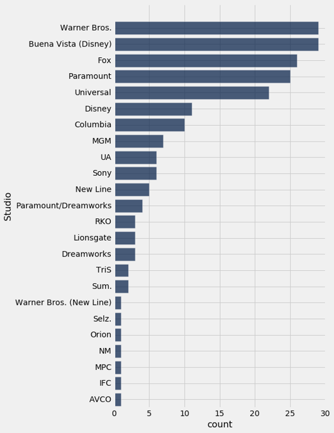

华纳兄弟（Warner Brothers）和布埃纳维斯塔（Buena Vista）是前 200 电影中最常见的工作室。 华纳兄弟制作了哈利波特电影，布埃纳维斯塔制作了星球大战。

由于总收入以未经调整的美元来衡量，所以最近几年的顶级电影比过去几十年更频繁，这并不令人惊讶。 以绝对数量来看，现在的电影票价比以前更高，因此总收入也更高。 这是通过条形图证明的，这些条形图显示了 200 部电影的发行年份。

```py
movies_and_years = top.select('Title', 'Year')
movies_and_years.group('Year').sort('count', descending=True).barh('Year')
```

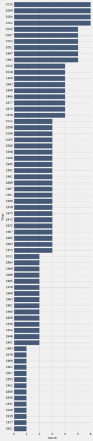

所有最长的条形都对应 2000 年以后的年份。这与我们的观察一致，即最近几年应该是最频繁的。

### 面向数值变量

这张图有一些未解决的地方。 虽然它确实回答了这个问题，200 部最受欢迎的电影中，最常见的发行年份，但并没有按时间顺序列出所有年份。 它将年作为一个分类变量。

但是，年份是固定的时序单位，确实拥有顺序。 他们也有相对于彼此的固定的数值距离。 让我们看看当我们试图考虑它的时候会发生什么。

默认情况下，`barh`将类别（年）从最低到最高排序。 所以我们将运行这个代码，但不按`count`进行排序。

```py
movies_and_years.group('Year').barh('Year')
```

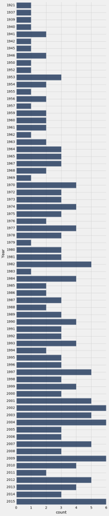

现在年份是升序了。 但是这个条形图还是有点问题。 1921 年和 1937 年的条形与 1937 年和 1939 年的条形相距甚远。条形图并没有显示出，200 部电影中没有一部是在 1922 年到 1936 年间发布的。基于这种可视化，这种不一致和遗漏，使早期年份的分布难以理解。

条形图用做类别变量的可视化。 当变量是数值，并且我们创建可视化时，必须考虑其值之间的数值关系。 这是下一节的主题。

## 数值分布

### 可视化数值分布

数据科学家研究的许多变量是定量的或数值的。它们的值是你可以做算术的数字。我们所看到的例子包括一本书的章节数量，电影的收入以及美国人的年龄。

类别变量的值可以按照数字编码，但是这不会使变量成为定量的。在我们研究的，按年龄组分类的人口普查数据的例子中，分类变量`SEX`中，`'Male'`的数字代码为`1`，`'Female'`的数字代码为`2`，以及分组`1`和`2`的合计为`0`。 `1`和`2`是数字，在这种情况下，从`2`中减`1`或取`0,1`和`2`的平均值，或对这三个值执行其他算术是没有意义的。 `SEX`是一个类别变量，即使这些值已经赋予一个数字代码。

对于我们的主要示例，我们将返回到我们在可视化分类数据时，所研究的数据集。这是一个表格，它由美国历史上最畅销的电影中的数据组成。为了方便起见，这里再次描述表格。

第一列包含电影的标题。第二列包含制作电影的工作室的名称。第三个包含国内票房总值（美元），第四个包含按 2016 年价格计算的票面收入总额。第五个包含电影的发行年份。

列表中有 200 部电影。根据`Gross`列中未调整的总收入，这是前十名。

```py
top = Table.read_table('top_movies.csv')
# Make the numbers in the Gross and Gross (Adjusted) columns look nicer:
top.set_format([2, 3], NumberFormatter)
```

| Title | Studio | Gross | Gross (Adjusted) | Year |
| --- | --- | --- | --- | --- |
| Star Wars: The Force Awakens | Buena Vista (Disney) | 906,723,418 | 906,723,400 | 2015 |
| Avatar | Fox | 760,507,625 | 846,120,800 | 2009 |
| Titanic | Paramount | 658,672,302 | 1,178,627,900 | 1997 |
| Jurassic World | Universal | 652,270,625 | 687,728,000 | 2015 |
| Marvel's The Avengers | Buena Vista (Disney) | 623,357,910 | 668,866,600 | 2012 |
| The Dark Knight | Warner Bros. | 534,858,444 | 647,761,600 | 2008 |
| Star Wars: Episode I - The Phantom Menace | Fox | 474,544,677 | 785,715,000 | 1999 |
| Star Wars | Fox | 460,998,007 | 1,549,640,500 | 1977 |
| Avengers: Age of Ultron | Buena Vista (Disney) | 459,005,868 | 465,684,200 | 2015 |
| The Dark Knight Rises | Warner Bros. | 448,139,099 | 500,961,700 | 2012 |

（省略了 190 行）

### 可视化调整后收入的分布

在本节中，我们将绘制`Gross (Adjusted)`列中数值变量的分布图。 为了简单起见，我们创建一个包含我们所需信息的小表。 而且由于三位数字比九位数字更容易处理，我们以百万美元衡量调整后的总收入。 注意如何使用舍入仅保留两位小数。

```py
millions = top.select(0).with_column('Adjusted Gross', 
                                     np.round(top.column(3)/1e6, 2))
millions
```

| Title | Adjusted Gross |
| --- | --- |
| Star Wars: The Force Awakens | 906.72 |
| Avatar | 846.12 |
| Titanic | 1178.63 |
| Jurassic World | 687.73 |
| Marvel's The Avengers | 668.87 |
| The Dark Knight | 647.76 |
| Star Wars: Episode I - The Phantom Menace | 785.72 |
| Star Wars | 1549.64 |
| Avengers: Age of Ultron | 465.68 |
| The Dark Knight Rises | 500.96 |

### 直方图

数值数据集的直方图看起来非常像条形图，虽然它有一些重要的差异，我们将在本节中讨论。 首先，我们只画出调整后收入的直方图。

hist方法生成列中值的直方图。 可选的单位参数用于两个轴上的标签。 直方图显示调整后的总额分布，以百万美元为单位。

```py
millions.hist('Adjusted Gross', unit="Million Dollars")
```

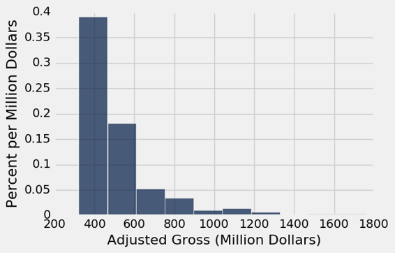

### 横轴

这些金额已被分组为连续的间隔，称为桶。尽管在这个数据集中，没有电影正好在两个桶之间的边缘上，但是`hist`必须考虑数值可能在边缘的情况。所以`hist`有一个端点约定：`bin`包含左端点的数据，但不包含右端点的数据。

我们使用符号`[a, b)`表示从`a`开始并在`b`结束但不包括`b`的桶。

有时，必须在第一个或最后一个箱中进行调整，以确保包含变量的最小值和最大值。在前面研究的人口普查数据中，你看到了一个这样的调整的例子，其中“100”岁的年龄实际上意味着“100 岁以上”。

我们可以看到，有 10 个桶（有些桶很低，难以看到），而且它们的宽度都是一样的。我们也可以看到，没有一部电影的收入不到三亿美元，那是因为我们只考虑有史以来最畅销的电影。

准确看到桶的末端在哪里，有点困难。例如，精确地确定值 500 位于横轴上的位置并不容易。所以很难判断一个条形的结束位置和下一个条形的开始位置。

可选参数`bins`可以与`hist`一起使用来指定桶的端点。它必须由一系列数字组成，这些数字以第一个桶的左端开始，以最后一个桶的右端结束。我们首先将桶中的数字设置为`300,400,500`等等，以`2000`结尾。

```py
millions.hist('Adjusted Gross', bins=np.arange(300,2001,100), unit="Million Dollars")
```

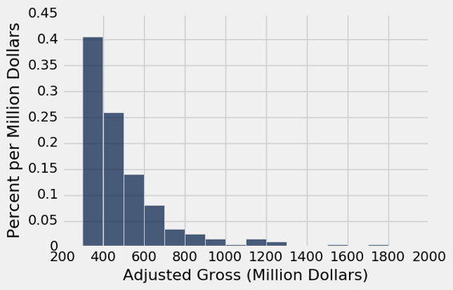

这个图的横轴比较容易阅读。 标签`200,400,600`等以对应的值为中心。 最高的条形是对应三亿到四亿美元之间的电影。

少数电影投入了 8 亿美元甚至更多。 这导致这个数字“向右倾斜”，或者更不正式地说，“右侧长尾”。 大量人口的收入或租金等变量的分布也经常具有这种形式。

### 桶的数量

可以使用`bin`方法从一个表格中计算出桶中的值的数量，该方法接受列标签或索引，以及可选的序列或桶的数量。 结果是直方图的表格形式。 第一列列出了桶的左端点（但请参阅下面关于最终值的注释）。 第二列包含`Adjusted Gross`列中所有值在相应桶中的数量。 也就是说，它计数所有`Adjusted Gross`的所有值，它们大于或等于`bin`中的值，但小于下一个`bin`中的值。

```py
bin_counts = millions.bin('Adjusted Gross', bins=np.arange(300,2001,100))
bin_counts.show()
```

| bin | Adjusted Gross count |
| --- | --- |
| 300 | 81 |
| 400 | 52 |
| 500 | 28 |
| 600 | 16 |
| 700 | 7 |
| 800 | 5 |
| 900 | 3 |
| 1000 | 1 |
| 1100 | 3 |
| 1200 | 2 |
| 1300 | 0 |
| 1400 | 0 |
| 1500 | 1 |
| 1600 | 0 |
| 1700 | 1 |
| 1800 | 0 |
| 1900 | 0 |
| 2000 | 0 |

注意最后一行的`bin`值 2000。 这不是任何条形的左端点 - 这是最后一个条形的右端点。 按照端点约定，那里的数据不包括在内。 因此，相应的计数记录为 0，并且即使已经有超过二十亿美元的电影也被记录为 0。 当`bin`或`hist`使用`bin`参数调用时，图只考虑在指定`bin`中的值。

一旦数值已经分入桶中，所得数量可以用来使用`bin_column`命名参数来生成直方图，以指定哪个列包含桶的下界。

```py
bin_counts.hist('Adjusted Gross count', bin_column='bin', unit='Million Dollars')
```


### 纵轴：密度刻度

一旦我们已经照顾到细节，如桶的末端，直方图的横轴易于阅读。 纵轴的特征需要更多关注。 我们会一一讲解。

我们先来看看如何计算垂直轴上的数字。 如果计算看起来有些奇怪，请耐心等待 - 本节的其余部分将解释原因。

计算。每个条形的高度是桶中的元素的百分比，除以桶的宽度。

> 译者注：存在很多种直方图，比如频数直方图、频率质量直方图和频率密度直方图。它们的纵轴数值不相同，但是图形形状是一样的。这里是最后一种，频率密度直方图。

```py
counts = bin_counts.relabeled('Adjusted Gross count', 'Count')
percents = counts.with_column(
    'Percent', (counts.column('Count')/200)*100
    )
heights = percents.with_column(
    'Height', percents.column('Percent')/100
    )
heights
```

| bin | Count | Percent | Height |
| --- | --- | --- | --- |
| 300 | 81 | 40.5 | 0.405 |
| 400 | 52 | 26 | 0.26 |
| 500 | 28 | 14 | 0.14 |
| 600 | 16 | 8 | 0.08 |
| 700 | 7 | 3.5 | 0.035 |
| 800 | 5 | 2.5 | 0.025 |
| 900 | 3 | 1.5 | 0.015 |
| 1000 | 1 | 0.5 | 0.005 |
| 1100 | 3 | 1.5 | 0.015 |
| 1200 | 2 | 1 | 0.01 |

（省略了 8 行）

在上面直方图的纵轴上查看数字，检查列高度是否正确。

如果我们只查看表格的第一行，计算就会变得清晰。

请记住，数据集中有 200 部电影。这个`[300,400)`的桶包含 81 部电影。这是所有电影的 40.5%：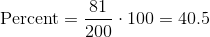。

`[300, 400)`桶的宽度是`400-300 = 100`。所以 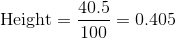。

用于计算高度的代码使用了总共​​有 200 个电影，以及每个箱的宽度是 100 的事实。

单位。条形的高度是 40.5% 除以 1 亿美元，因此高度是 0.405% 每百万美元。

这种绘制直方图的方法创建了一个垂直轴，它是在密度刻度上的。条形的高度不是桶中条目的百分比；它是桶中的条目除以桶的宽度。这就是为什么高度衡量拥挤度或密度。

让我们看看为什么这很重要。

### 不等的桶

直方图相比条形图的一个优点是，直方图可以包含不等宽度的桶。 以下将`Millions `中的值分为三个不均匀的类别。

```py
uneven = make_array(300, 400, 600, 1500)
millions.hist('Adjusted Gross', bins=uneven, unit="Million Dollars")
```

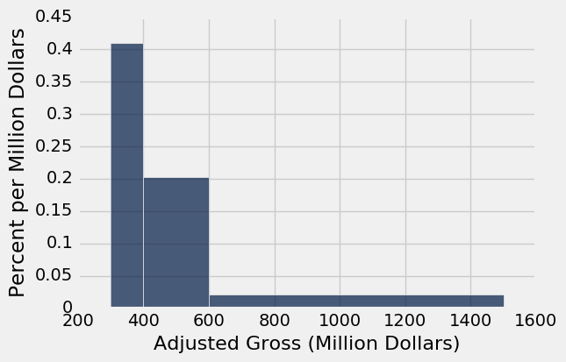

这里是三个桶中的数量。

```py
millions.bin('Adjusted Gross', bins=uneven)
```


| bin | Adjusted Gross count |
| --- | --- |
| 300 | 81 |
| 400 | 80 |
| 600 | 37 |
| 1500 | 0 |

虽然范围`[300,400)`和`[400,600)`具有几乎相同的计数，但前者的高度是后者的两倍，因为它只有一半的宽度。 `[300,400)`中的值的密度是`[400,600)`中的密度的两倍。

直方图帮助我们可视化数轴上数据最集中的地方，特别是当桶不均匀的时候。

### 仅仅绘制数量的问题


可以使用`hist`方法的`normed=False`选项直接在图表中显示数量。 生成的图表与直方图具有相同的形状，但这些桶的宽度均相等，尽管纵轴上的数字不同。

```py
millions.hist('Adjusted Gross', bins=np.arange(300,2001,100), normed=False)
```

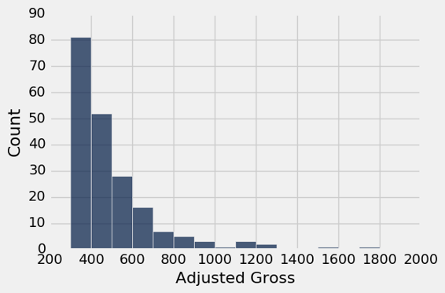

虽然数量刻度可能比密度刻度更自然，但当桶宽度不同时，图表高度的有误导性。 下面看起来（由于计数）高收入电影相当普遍，事实上我们已经看到它们相对较少。

```py
millions.hist('Adjusted Gross', bins=uneven, normed=False)
```

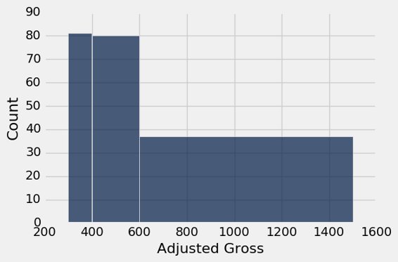

即使使用的方法被称为`hist`，上面的图不是一个直方图。 误导性地夸大了至少 6 亿美元的电影比例。 每个桶的高度只是按照桶中的电影数量绘制，而不考虑桶宽度的差异。

如果最后两个桶组合起来，情况就变得更加荒谬了。

```py
very_uneven = make_array(300, 400, 1500)
millions.hist('Adjusted Gross', bins=very_uneven, normed=False)
```

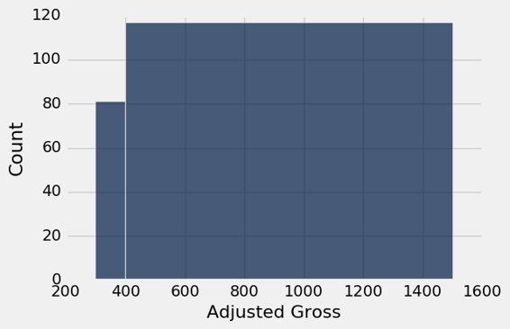

在这个基于数量的图像中，电影分布完全失去了形状。

### 直方图：通用原则和计算

上图显示，眼睛将面积视为“较大”的东西，而不是高度。当桶的宽度不同时，这种观察变得尤为重要。

这就是直方图具有两个定义属性的原因：

+   桶按比例绘制并且是连续的（尽管有些可能是空的），因为横轴上的值是数值型的。
+   每个条形的面积与桶中的条目数成比例。

属性（2）是绘制直方图的关键，通常实现如下：

```
条形的面积 = 桶中条目的百分比
```

高度的计算仅仅使用了一个事实，条形是长方形的。

```
条形的面积 = 条形的高度 * 桶的宽度
```

因此，

```
条形的高度 = 条形的面积 / 桶的宽度
           = 桶中条目的百分比 / 桶的宽度
```

高度的单位是“百分比每横轴单位”。

当使用这种方法绘制时，直方图被称为在密度刻度上绘制。 在这个刻度上：

+   每个条形的面积等于相应桶中的数据值的百分比。
+   直方图中所有条形的总面积为 100%。 从比例的角度来讲，我们说直方图中所有条形的面积“总计为 1”。

### 平顶和细节水平

即使密度刻度使用面积正确表示了百分比，但是通过将值分组到桶中，丢失了一些细节。

再看一下下图中的`[300,400)`的桶。 值为“0.405% 每百万美元”的桶的平顶，隐藏了电影在这个桶分布有些不均匀的事实。

```py
millions.hist('Adjusted Gross', bins=uneven, unit="Million Dollars")
```


为了看到它，让我们将`[300, 400)`划分为更窄的 10 个桶。每个桶的宽度都是一千万美元。

```py
some_tiny_bins = make_array(300, 310, 320, 330, 340, 350, 360, 370, 380, 390, 400, 600, 1500)
millions.hist('Adjusted Gross', bins=some_tiny_bins, unit='Million Dollars')
```

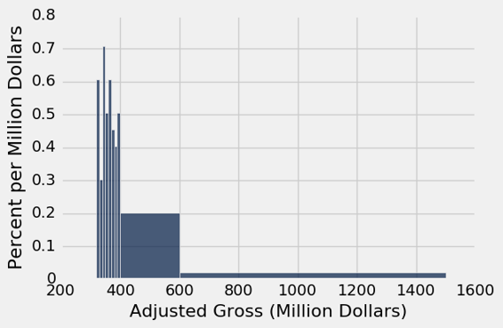

### 直方图 Q&A

让我们再画一遍直方图，这次只有四个桶，检查我们对概念的理解。

```py
uneven_again = make_array(300, 350, 400, 450, 1500)
millions.hist('Adjusted Gross', bins=uneven_again, unit='Million Dollars')

millions.bin('Adjusted Gross', bins=uneven_again)
```


| bin | Adjusted Gross count |
| --- | --- |
| 300 | 32 |
| 350 | 49 |
| 400 | 25 |
| 450 | 92 |
| 1500 | 0 |

再次查看直方图，并将`[400,450)`的桶与`[450,1500)`桶进行比较。

问：哪个桶里面有更多的电影？

答：`[450,1500)`的桶。它有 92 部电影，而`[400,450)`桶中有 25 部电影。

问：那么为什么`[450,1500)`的桶比`[400,450)`桶短得多呢？

答：因为高度代表桶里每单位空间的密度，而不是桶里的电影数量。 `[450,1500)`的桶中的电影确实比`[400,450)`的桶多，但它也是一个大桶。 所以它不那么拥挤。 其中的电影密度要低得多。

### 条形图和直方图的区别

+   条形图为每个类别展示一个数量。 它们通常用于显示类别变量的分布。 直方图显示定量变量的分布。
+   条形图中的所有条形都具有相同的宽度，相邻的条形之间有相等的间距。 直方图的条形可以具有不同的宽度，并且是连续的。
+   条形图中条形的长度（或高度，如果垂直绘制）与每个类别的值成正比。 直方图中条形的高度是密度的度量；直方图中的条形的面积与桶中的条目数量成正比。

## 重叠的图表

在这一章中，我们学习了如何通过绘制图表来显示数据。 这种可视化的常见用法是比较两个数据集。 在本节中，我们将看到如何叠加绘图，即将它们绘制在单个图形中，拥有同一对坐标轴

为了使重叠有意义，重叠的图必须表示相同的变量并以相同的单位进行测量。

为了绘制重叠图，可以用相同的方法调用`scatter`，`plot`和`barh`方法。 对于`scatter`和`plot`，一列必须作为所有叠加图的公共横轴。 对于`barh`，一列必须作为一组类别的公共轴。 一般的调用看起来像这样：

```py
name_of_table.method(column_label_of_common_axis, array_of_labels_of_variables_to_plot)
```

更常见的是，我们首先仅仅选取图表所需的列。之后通过指定共同轴上的变量来调用方法。

```py
name_of_table.method(column_label_of_common_axis)
```

### 散点图

高尔顿（Franics Galton，1822 ~ 1911 年）是一位英国博学家，他是分析数值变量之间关系的先驱。 他对有争议的优生学领域特别感兴趣，实际上，他创造了这个术语 - 这涉及到如何将物理特征从一代传到下一代。

高尔顿精心收集了大量的数据，其中一些我们将在本课程中分析。 这是高尔顿的，有关父母及其子女身高的数据的子集。 具体来说，数据由 179 名男性组成，他们在家庭中第一个出生。数据是他们自己的高度和父母的高度。所有的高度都是以英寸来测量的。

```py
heights = Table.read_table('galton_subset.csv')
heights
```

| father | mother | son |
| --- | --- | --- |
| 78.5 | 67 | 73.2 |
| 75.5 | 66.5 | 73.5 |
| 75 | 64 | 71 |
| 75 | 64 | 70.5 |
| 75 | 58.5 | 72 |
| 74 | 68 | 76.5 |
| 74 | 62 | 74 |
| 73 | 67 | 71 |
| 73 | 67 | 68 |
| 73 | 66.5 | 71 |

（省略了 169 行）

`scatter`方法使我们能够可视化，儿子的身高如何与父母的身高有关。 在图中，儿子的身高将形成公共的横轴。

```py
heights.scatter('son')
```

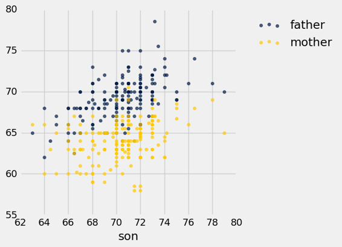

注意我们仅仅指定了公共的横轴上的变量（儿子的身高）。 Python 绘制了两个散点图：这个变量和另外两个之间的关系，每个关系一个。

金色和蓝色的散点图向上倾斜，并显示出儿子的高度和父母的高度之间的正相关。 蓝色（父亲）的绘图一般比金色高，因为父亲一般比母亲高。

### 线形图

我们的下一个例子涉及更近的儿童数据。 我们将返回到人口普查数据表`us_pop`，再次在下面创建用于参考。 由此，我们将提取 0 至 18 岁年龄段的所有儿童的数量。

```py
# Read the full Census table
census_url = 'http://www2.census.gov/programs-surveys/popest/datasets/2010-2015/national/asrh/nc-est2015-agesex-res.csv'
full_census_table = Table.read_table(census_url)

# Select columns from the full table and relabel some of them
partial_census_table = full_census_table.select(['SEX', 'AGE', 'POPESTIMATE2010', 'POPESTIMATE2014'])
us_pop = partial_census_table.relabeled('POPESTIMATE2010', '2010').relabeled('POPESTIMATE2014', '2014')

# Access the rows corresponding to all children, ages 0-18
children = us_pop.where('SEX', are.equal_to(0)).where('AGE', are.below(19)).drop('SEX')
children.show()
```

| AGE | 2010 | 2014 |
| --- | --- | --- |
| 0 | 3951330 | 3949775 |
| 1 | 3957888 | 3949776 |
| 2 | 4090862 | 3959664 |
| 3 | 4111920 | 4007079 |
| 4 | 4077551 | 4005716 |
| 5 | 4064653 | 4006900 |
| 6 | 4073013 | 4135930 |
| 7 | 4043046 | 4155326 |
| 8 | 4025604 | 4120903 |
| 9 | 4125415 | 4108349 |
| 10 | 4187062 | 4116942 |
| 11 | 4115511 | 4087402 |
| 12 | 4113279 | 4070682 |
| 13 | 4119666 | 4171030 |
| 14 | 4145614 | 4233839 |
| 15 | 4231002 | 4164796 |
| 16 | 4313252 | 4168559 |
| 17 | 4376367 | 4186513 |
| 18 | 4491005 | 4227920 |

现在我们可以绘制两个叠加的线形图，显示 2010 年和 2014 年的不同年龄的儿童人数。方法调用类似于前面例子中的`scatter`调用。

```py
children.plot('AGE')
```

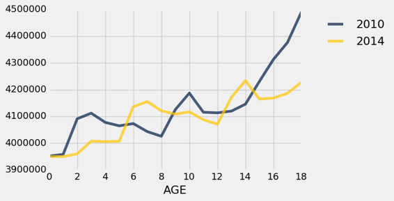

在这个刻度上，重要的是要记住我们只有`0,1,2`岁等等的数据。 两个图形的点相互“交织”。

这些图表在一些地方相互交叉：例如，2010 年的 4 岁人数比 2014 年多，2014 年的 14 岁人数比 2010 年多。

当然，2014 年的 14 岁儿童大部分都是 2010 年的 10 岁儿童。为了看到这一点，请查看 14 岁的金色图表和 10 岁的蓝色图表。事实上，你会注意到，整个金色图表（2014 年）看起来像蓝色图表（2010 年）向右滑了 4 年。 由于 2010 年至 2014 年间进入该国的儿童的净效应，这个下滑幅度还是有所上升， 幸运的是，在这些年代，没有太多的生命损失。

### 条形图

对于本节的最后一个例子，我们看看加利福尼亚州以及整个美国的成人和儿童的种族分布情况。

凯撒家庭基金会根据人口普查数据，编制了美国人口种族分布情况。基金会的网站提供了 2014 年整个美国人口以及当年 18 岁以下的美国儿童的数据汇总。

这里是一个表格，采用了美国和加利福尼亚州的数据。 这些列代表美国和加利福尼亚州的每个人，美国和加州的儿童。 表格的主体包含不同类别的比例。 每一列显示了，该列对应的人群的种族分布。 所以在每一列中，条目总计为 1。

```py
usa_ca = Table.read_table('usa_ca_2014.csv')
usa_ca
```


| Ethnicity | USA All | CA All | USA Children | CA Children |
| --- | --- | --- | --- | --- |
| Black | 0.12 | 0.05 | 0.14 | 0.05 |
| Hispanic | 0.18 | 0.38 | 0.24 | 0.5 |
| White | 0.62 | 0.39 | 0.52 | 0.29 |
| Other | 0.08 | 0.18 | 0.1 | 0.16 |

我们自然想要比较这些分布。 直接比较列是有意义的，因为所有条目都是比例，因此在相同刻度上。

`barh`方法允许我们通过在相同轴域上绘制多个条形图，将比较可视化。这个调用类似于`scatter`和`plot`：我们必须指定类别的公共轴。

> 译者注：轴域（Axes）是横轴和纵轴围城的区域。

```py
usa_ca.barh('Ethnicity')
```

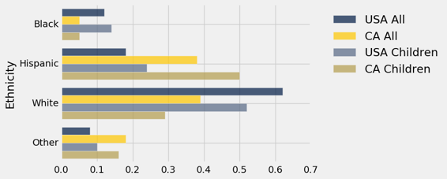

虽然绘制叠加的条形图非常简单，但是我们可以在这个图表上找到太多的信息，以便能够理清种群之间的相似性和差异性。 似乎很清楚的是，美国所有人和美国儿童的种族分布比任何其他列都更相似，但是一次比较一对要容易得多。

首先比较美国和加利福尼亚的整个人口。

```py
usa_ca.select('Ethnicity', 'USA All', 'CA All').barh('Ethnicity')
```

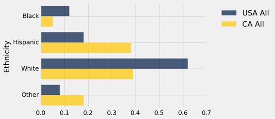

这两个分布是完全不同的。 加利福尼亚州的拉美裔和其他类别比例较高，黑人和白人比例相应较低。 这种差异主要是由于，加利福尼亚州的地理位置和移民模式，无论是历史上还是近几十年来。 例如，加利福尼亚的“其他”类别包括相当一部分亚洲人和太平洋岛民。

从图中可以看出，2014 年加州近 40% 的人口是拉美裔。 与该州儿童人口的比较表明，未来几年拉美裔人口的比例可能会更高。 在加州儿童中，50% 属于拉美裔。

```py
usa_ca.select('Ethnicity', 'CA All', 'CA Children').barh('Ethnicity')
```

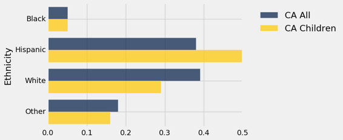

更复杂的数据集自然会产生各种有趣的可视化效果，包括不同种类的重叠图形。 为了分析这些数据，获得更多的数据操作技能的有帮助的，这样我们就可以将数据转化为一种形式，使我们能够使用本节中的方法。 在下一章中，我们将介绍其中的一些技巧。
