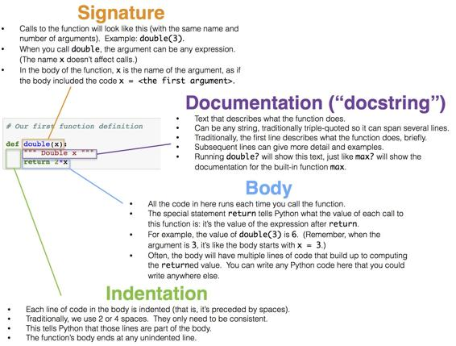
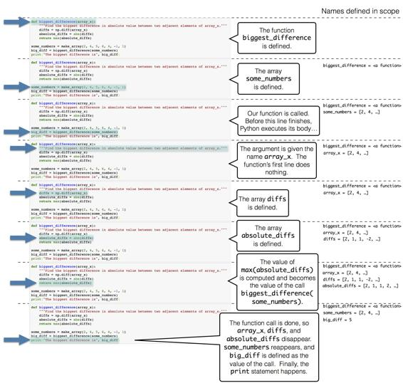
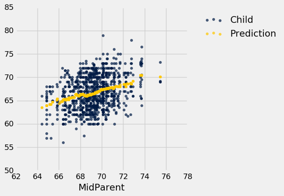
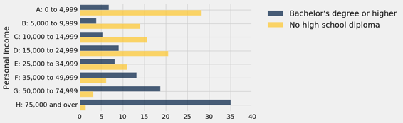
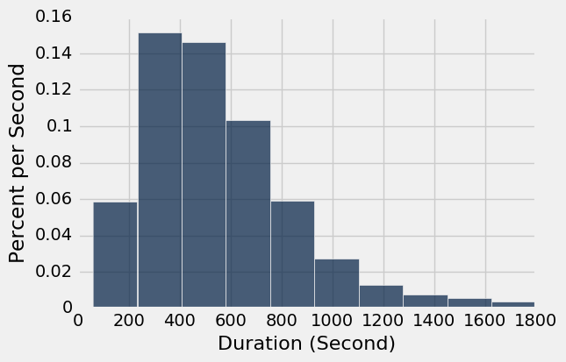
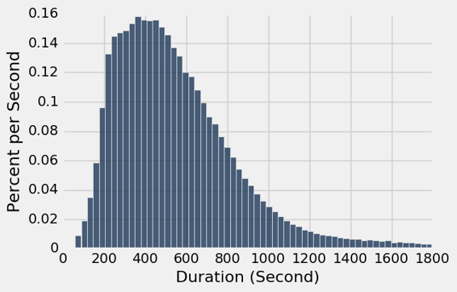

# 七、函数和表格

> 原文：[Functions and Tables](https://github.com/data-8/textbook/tree/gh-pages/chapters/07)

> 译者：[飞龙](https://github.com/wizardforcel)

> 协议：[CC BY-NC-SA 4.0](http://creativecommons.org/licenses/by-nc-sa/4.0/)

> 自豪地采用[谷歌翻译](https://translate.google.cn/)

通过使用 Python 中已有的函数，我们正在建立一个使用的技术清单，用于识别数据集中的规律和主题。 现在我们将探索Python编程语言的核心功能：函数定义。

我们在本书中已经广泛使用了函数，但从未定义过我们自己的函数。定义一个函数的目的是，给一个计算过程命名，它可能会使用多次。计算中有许多需要重复计算的情况。 例如，我们常常希望对表的列中的每个值执行相同的操作。

## 定义函数

`double`函数的定义仅仅使一个数值加倍。

```py
# Our first function definition

def double(x):
    """ Double x """
    return 2*x
```

我们通过编写`def`来开始定义任何函数。 下面是这个小函数的其他部分（语法）的细分：



当我们运行上面的单元格时，没有使特定的数字加倍，并且`double`主体中的代码还没有求值。因此，我们的函数类似于一个菜谱。 每次我们遵循菜谱中的指导，我们都需要以食材开始。 每次我们想用我们的函数来使一个数字加倍时，我们需要指定一个数字。

我们可以用和调用其他函数完全相同的方式，来调用`double`。 每次我们这样做的时候，主体中的代码都会执行，参数的值赋给了名称`x`。

```py
double(17)
34
double(-0.6/4)
-0.3
```

以上两个表达式都是调用表达式。 在第二个里面，计算了表达式`-0.6 / 4`的值，然后将其作为参数`x`传递给`double`函数。 每个调用表达式最终都会执行`double`的主体，但使用不同的`x`值。

`double`的主体只有一行：

```py
return 2*x
```

执行这个`return`语句会完成`double`函数体的执行，并计算调用表达式的值。

`double`的参数可以是任何表达式，只要它的值是一个数字。 例如，它可以是一个名称。 `double`函数不知道或不在意如何计算或存储参数。 它唯一的工作是，使用传递给它的参数的值来执行它自己的主体。

```py
any_name = 42
double(any_name)
84
```

参数也可以是任何可以加倍的值。例如，可以将整个数值数组作为参数传递给`double`，结果将是另一个数组。

```py
double(make_array(3, 4, 5))
array([ 6,  8, 10])
```

但是，函数内部定义的名称（包括像double的x这样的参数）只存在一小会儿。 它们只在函数被调用的时候被定义，并且只能在函数体内被访问。 我们不能在`double`之外引用`x`。 技术术语是`x`具有局部作用域。

因此，即使我们在上面的单元格中调用了`double`，名称`x`也不能在函数体外识别。

```py
x
---------------------------------------------------------------------------
NameError                                 Traceback (most recent call last)
<ipython-input-18-401b30e3b8b5> in <module>()
----> 1 x

NameError: name 'x' is not defined
```

文档字符串。 虽然`double`比较容易理解，但是很多函数执行复杂的任务，并且没有解释就很难使用。 （你自己也可能已经发现了！）因此，一个组成良好的函数有一个唤起它的行为的名字，以及文档。 在 Python 中，这被称为文档字符串 - 描述了它的行为和对其参数的预期。 文档字符串也可以展示函数的示例调用，其中调用前面是`>>>`。

文档字符串可以是任何字符串，只要它是函数体中的第一个东西。 文档字符串通常在开始和结束处使用三个引号来定义，这允许字符串跨越多行。 第一行通常是函数的完整但简短的描述，而下面的行则为将来的用户提供了进一步的指导。

下面是一个名为`percent`的函数定义，它带有两个参数。定义包括一个文档字符串。

```py
# A function with more than one argument

def percent(x, total):
    """Convert x to a percentage of total.
    
    More precisely, this function divides x by total,
    multiplies the result by 100, and rounds the result
    to two decimal places.
    
    >>> percent(4, 16)
    25.0
    >>> percent(1, 6)
    16.67
    """
    return round((x/total)*100, 2)
percent(33, 200)
16.5
```

将上面定义的函数`percent`与下面定义的函数`percents`进行对比。 后者以数组为参数，将数组中的所有数字转换为数组中所有值的百分数。 百分数都四舍五入到两位，这次使用`round`来代替`np.round`，因为参数是一个数组而不是一个数字。

```py
def percents(counts):
    """Convert the values in array_x to percents out of the total of array_x."""
    total = counts.sum()
    return np.round((counts/total)*100, 2)
```

函数`percents`返回一个百分数的数组，除了四舍五入之外，它总计是 100。

```py
some_array = make_array(7, 10, 4)
percents(some_array)
array([ 33.33,  47.62,  19.05])
```

理解 Python 执行函数的步骤是有帮助的。 为了方便起见，我们在下面的同一个单元格中放入了函数定义和对这个函数的调用。

```py
def biggest_difference(array_x):
    """Find the biggest difference in absolute value between two adjacent elements of array_x."""
    diffs = np.diff(array_x)
    absolute_diffs = abs(diffs)
    return max(absolute_diffs)

some_numbers = make_array(2, 4, 5, 6, 4, -1, 1)
big_diff = biggest_difference(some_numbers)
print("The biggest difference is", big_diff)
The biggest difference is 5
```

这就是当我们运行单元格时，所发生的事情。



## 多个参数

可以有多种方式来推广一个表达式或代码块，因此一个函数可以有多个参数，每个参数决定结果的不同方面。 例如，我们以前定义的百分比`percents`，每次都四舍五入到两位。 以下两个参的数定义允许不同调用四舍五入到不同的位数。

```py
def percents(counts, decimal_places):
    """Convert the values in array_x to percents out of the total of array_x."""
    total = counts.sum()
    return np.round((counts/total)*100, decimal_places)

parts = make_array(2, 1, 4)
print("Rounded to 1 decimal place: ", percents(parts, 1))
print("Rounded to 2 decimal places:", percents(parts, 2))
print("Rounded to 3 decimal places:", percents(parts, 3))
Rounded to 1 decimal place:  [ 28.6  14.3  57.1]
Rounded to 2 decimal places: [ 28.57  14.29  57.14]
Rounded to 3 decimal places: [ 28.571  14.286  57.143]
```

这个新定义的灵活性来源于一个小的代价：每次调用该函数时，都必须指定小数位数。默认参数值允许使用可变数量的参数调用函数;在调用表达式中未指定的任何参数都被赋予其默认值，这在`def`语句的第一行中进行了说明。 例如，在`percents`的最终定义中，可选参数`decimal_places`赋为默认值`2`。

```py
def percents(counts, decimal_places=2):
    """Convert the values in array_x to percents out of the total of array_x."""
    total = counts.sum()
    return np.round((counts/total)*100, decimal_places)

parts = make_array(2, 1, 4)
print("Rounded to 1 decimal place:", percents(parts, 1))
print("Rounded to the default number of decimal places:", percents(parts))
Rounded to 1 decimal place: [ 28.6  14.3  57.1]
Rounded to the default number of decimal places: [ 28.57  14.29  57.14]
```

## 注：方法

函数通过将参数表达式放入函数名称后面的括号来调用。 任何独立定义的函数都是这样调用的。 你也看到了方法的例子，这些方法就像函数一样，但是用点符号来调用，比如`some_table.sort(some_label)`。 你定义的函数将始终首先使用函数名称，并传入所有参数来调用。

## 在列上应用函数

我们已经看到很多例子，通过将函数应用于现有列或其他数组，来创建新的表格的列。 所有这些函数都以数组作为参数。 但是我们经常打算，通过一个函数转换列中的条目，它不将数组作为它的函数。 例如，它可能只需要一个数字作为它的参数，就像下面定义的函数`cut_off_at_100`。

```py
def cut_off_at_100(x):
    """The smaller of x and 100"""
    return min(x, 100)
cut_off_at_100(17)
17
cut_off_at_100(117)
100
cut_off_at_100(100)
100
```

如果参数小于或等于 100，函数`cut_off_at_100`只返回它的参数。但是如果参数大于 100，则返回 100。

在我们之前使用人口普查数据的例子中，我们看到变量`AGE`的值为 100，表示“100 岁以上”。 以这种方式将年龄限制在 100 岁，正是`cut_off_at_100`所做的。

为了一次性对很多年龄使用这个函数，我们必须能够引用函数本身，而不用实际调用它。 类似地，我们可能会向厨师展示一个蛋糕的菜谱，并要求她用它来烤 6 个蛋糕。 在这种情况下，我们不会使用这个配方自己烘烤蛋糕， 我们的角色只是把菜谱给厨师。 同样，我们可以要求一个表格，在列中的 6 个不同的数字上调用`cut_off_at_100`。

首先，我们创建了一个表，一列是人，一列是它们的年龄。 例如，`C`是 52 岁。

```py
ages = Table().with_columns(
    'Person', make_array('A', 'B', 'C', 'D', 'E', 'F'),
    'Age', make_array(17, 117, 52, 100, 6, 101)
)
ages
```

| Person | Age |
| --- | --- |
| A | 17 |
| B | 117 |
| C | 52 |
| D | 100 |
| E | 6 |
| F | 101 |

### 应用

要在 100 岁截断年龄，我们将使用一个新的`Table`方法。 `apply`方法在列的每个元素上调用一个函数，形成一个返回值的新数组。 为了指出要调用的函数，只需将其命名（不带引号或括号）。 输入值的列的名称必须是字符串，仍然出现在引号内。

```py
ages.apply(cut_off_at_100, 'Age')
array([ 17, 100,  52, 100,   6, 100])
```

我们在这里所做的是，将`cut_off_at_100`函数应用于`age`表的`Age`列中的每个值。 输出是函数的相应返回值的数组。 例如，17 还是 17，117 变成了 100，52 还是 52，等等。

此数组的长度与`age`表中原始`Age`列的长度相同，可用作名为`Cut Off Age`的新列中的值，并与现有的`Person`和`Age`列共存。


```py
ages.with_column(
    'Cut Off Age', ages.apply(cut_off_at_100, 'Age')
)
```

| Person | Age | Cut Off Age |
| --- | --- | --- |
| A | 17 | 17 |
| B | 117 | 100 |
| C | 52 | 52 |
| D | 100 | 100 |
| E | 6 | 6 |
| F | 101 | 100 |

### 作为值的函数

我们已经看到,Python 有很多种值。 例如，`6`是一个数值，`"cake"`是一个文本值，`Table()`是一个空表，`age`是一个表值（因为我们在上面定义）的名称。

在 Python 中，每个函数（包括`cut_off_at_100`）也是一个值。 这有助于再次考虑菜谱。 蛋糕的菜谱是一个真实的东西，不同于蛋糕或配料，你可以给它一个名字，像“阿尼的蛋糕菜谱”。 当我们用`def`语句定义`cut_off_at_100`时，我们实际上做了两件事情：我们创建了一个函数来截断数字 100，我们给它命名为`cut_off_at_100`。

我们可以引用任何函数，通过写下它的名字，而没有实际调用它必需的括号或参数。当我们在上面调用`apply`时，我们做了这个。 当我们自己写下一个函数的名字，作为单元格中的最后一行时，Python 会生成一个函数的文本表示，就像打印一个数字或一个字符串值一样。

```py
cut_off_at_100
<function __main__.cut_off_at_100>
```

请注意，我们没有使用引号（它只是一段文本）或`cut_off_at_100()`（它是一个函数调用，而且是无效的）。我们只是写下`cut_off_at_100`来引用这个函数。

就像我们可以为其他值定义新名称一样，我们可以为函数定义新名称。 例如，假设我们想把我们的函数称为`cut_off`，而不是`cut_off_at_100`。 我们可以这样写：

```py
cut_off = cut_off_at_100
```
现在`cut_off`就是函数名称了。它是`cut_off_at_100`的相同函数。所以打印出的值应该相同。

```py
cut_off
<function __main__.cut_off_at_100>
```

让我们看看另一个`apply`的应用。

### 示例：预测

数据科学经常用来预测未来。 如果我们试图预测特定个体的结果 - 例如，她将如何回应处理方式，或者他是否会购买产品，那么将预测基于其他类似个体的结果是很自然的。

查尔斯·达尔文（Charles Darwin）的堂兄弗朗西斯·高尔顿（Sir Francis Galton）是使用这个思想来基于数值数据进行预测的先驱。 他研究了物理特征是如何传递下来的。

下面的数据是父母和他们的成年子女的身高测量值，由高尔顿仔细收集。 每行对应一个成年子女。 变量是家庭的数字代码，父母的身高（以英寸为单位），“双亲身高”，这是父母双方身高的加权平均值 [1]，家庭中子女的数量 ，以及子女的出生次序（第几个），性别和身高。

> [1] 高尔顿在计算男性和女性的平均身高之前，将女性身高乘上 1.08。对于这个的讨论，请查看 [Chance](http://chance.amstat.org/2013/09/1-pagano/)，这是一个由美国统计协会出版的杂志。

```py
# Galton's data on heights of parents and their adult children
galton = Table.read_table('galton.csv')
galton
```


| family | father | mother | midparentHeight | children | childNum | gender | childHeight |
| --- | --- | --- | --- | --- | --- | --- | --- |
| 1 | 78.5 | 67 | 75.43 | 4 | 1 | male | 73.2 |
| 1 | 78.5 | 67 | 75.43 | 4 | 2 | female | 69.2 |
| 1 | 78.5 | 67 | 75.43 | 4 | 3 | female | 69 |
| 1 | 78.5 | 67 | 75.43 | 4 | 4 | female | 69 |
| 2 | 75.5 | 66.5 | 73.66 | 4 | 1 | male | 73.5 |
| 2 | 75.5 | 66.5 | 73.66 | 4 | 2 | male | 72.5 |
| 2 | 75.5 | 66.5 | 73.66 | 4 | 3 | female | 65.5 |
| 2 | 75.5 | 66.5 | 73.66 | 4 | 4 | female | 65.5 |
| 3 | 75 | 64 | 72.06 | 2 | 1 | male | 71 |
| 3 | 75 | 64 | 72.06 | 2 | 2 | female | 68 |

（省略了 924 行）

收集数据的主要原因是，能够预测父母所生的子女的成年身高，其中父母和数据集中的类似。让我们尝试这样做，用双亲的身高作为我们预测的基础变量。 因此双亲的身高是我们的预测性变量。

表格`heights`包含双亲和子女的身高。 两个变量的散点图显示了正相关，正如我们对这些变量的预期。

```py
heights = galton.select(3, 7).relabeled(0, 'MidParent').relabeled(1, 'Child')
heights
```

| MidParent | Child |
| --- | --- |
| 75.43 | 73.2 |
| 75.43 | 69.2 |
| 75.43 | 69 |
| 75.43 | 69 |
| 73.66 | 73.5 |
| 73.66 | 72.5 |
| 73.66 | 65.5 |
| 73.66 | 65.5 |
| 72.06 | 71 |
| 72.06 | 68 |

（省略了 924 行）

```py
heights.scatter(0)
```


现在假设高尔顿遇到了新的一对夫妇，与他的数据集类似，并且想知道他们的子女有多高。考虑到双亲身高是 68 英寸，他预测子女身高的一个好方法是什么？

一个合理的方法是基于约 68 英寸的双亲身高对应的所有点，来做预测。预测值等于从这些点计算的子女身高的均值。

假设我们是高尔顿，并执行这个计划。现在我们只是对“68 英寸左右”的含义做一个合理的定义，并用它来处理。在课程的后面，我们将研究这种选择的后果。

我们的“接近”的意思是“在半英寸之内”。下图显示了 67.5 英寸和 68.5 英寸之间的双亲身高对应的所有点。这些都是红色直线之间的点。每一个点都对应一个子女；我们对新夫妇的子女身高的预测是所有子女的平均身高。这由金色的点表示。

忽略代码，仅仅专注于理解到达金色的点的心理过程。

```py
heights.scatter('MidParent')
_ = plots.plot([67.5, 67.5], [50, 85], color='red', lw=2)
_ = plots.plot([68.5, 68.5], [50, 85], color='red', lw=2)
_ = plots.scatter(68, 66.24, color='gold', s=40)
```


为了准确计算出金色的点的位置，我们首先需要确定直线之间的所有点。 这些点对应于`MidParent`在 67.5 英寸和 68.5 英寸之间的行。

```py
close_to_68 = heights.where('MidParent', are.between(67.5, 68.5))
close_to_68
```


| MidParent | Child |
| --- | --- |
| 68.44 | 62 |
| 67.94 | 71.2 |
| 67.94 | 67 |
| 68.33 | 62.5 |
| 68.23 | 73 |
| 68.23 | 72 |
| 68.23 | 69 |
| 67.98 | 73 |
| 67.98 | 71 |
| 67.98 | 71 |

（省略了 121 行）

双亲身高为 68 英寸的子女的预测身高，是这些行中子女的平均身高。 这是 66.24 英寸。

```py
close_to_68.column('Child').mean()
66.24045801526718
```


我们现在有了一种方法，给定任何数据集中的双亲身高，就可以预测子女的身高。我们可以定义一个函数`predict_child`来实现它。 除了名称的选择之外，函数的主体由上面两个单元格中的代码组成。

```py
def predict_child(mpht):
    """Predict the height of a child whose parents have a midparent height of mpht.
    
    The prediction is the average height of the children whose midparent height is
    in the range mpht plus or minus 0.5.
    """

    close_points = heights.where('MidParent', are.between(mpht-0.5, mpht + 0.5))
    return close_points.column('Child').mean() 
```

给定 68 英寸的双亲身高，函数`predict_child`返回与之前相同的预测（66.24 英寸）。 定义函数的好处在于，我们可以很容易地改变预测变量的值，并得到一个新的预测结果。

```py
predict_child(68)
66.24045801526718
predict_child(74)
70.415789473684214
```

这些预测有多好？ 我们可以了解它，通过将预测值与我们已有的数据进行比较。 为此，我们首先将函数`predict_child`应用于`Midparent`列，并将结果收入称为`Prediction`的新列中。

```py
# Apply predict_child to all the midparent heights

heights_with_predictions = heights.with_column(
    'Prediction', heights.apply(predict_child, 'MidParent')
)
heights_with_predictions
```

| MidParent | Child | Prediction |
| --- | --- | --- |
| 75.43 | 73.2 | 70.1 |
| 75.43 | 69.2 | 70.1 |
| 75.43 | 69 | 70.1 |
| 75.43 | 69 | 70.1 |
| 73.66 | 73.5 | 70.4158 |
| 73.66 | 72.5 | 70.4158 |
| 73.66 | 65.5 | 70.4158 |
| 73.66 | 65.5 | 70.4158 |
| 72.06 | 71 | 68.5025 |
| 72.06 | 68 | 68.5025 |

（省略了 924 行）

为了查看预测值相对于观察数据的位置，可以使用`MidParent`作为公共水平轴绘制重叠的散点图。

```py
heights_with_predictions.scatter('MidParent')
```



金色的点的图形称为均值图，因为每个金色的点都是两条直线的中心，就像之前绘制的那样。每个都按照给定的双亲高度，做出了子女高度的预测。例如，散点图显示，对于 72 英寸的双亲高度，子女的预测高度将在 68 英寸和 69 英寸之间，事实上，`predict_child(72)`返回 68.5。

高尔顿的计算和可视化与我们非常相似，除了他没有 Python。他通过散点图绘制了均值图，并注意到它大致沿着直线。这条直线现在被称为回归线，是最常见的预测方法之一。高尔顿的朋友，数学家卡尔·皮尔森（Karl Pearson）用这些分析来形式化关联的概念。

这个例子，就像约翰·斯诺（John Snow）对霍乱死亡的分析一样，说明了现代数据科学的一些基本概念的根源可追溯到一个多世纪之前。高尔顿的方法，比如我们在这里使用的方法，是最近邻预测方法的雏形，现在在不同的环境中有着有效的应用。机器学习的现代领域包括这些方法的自动化，来基于庞大且快速发展的数据集进行预测。

## 按照单变量分类

数据科学家经常需要根据共有的特征，将个体分成不同的组，然后确定组的一些特征。 例如，在使用高尔顿高度数据的例子中，我们看到根据父母的平均高度对家庭进行分类，然后找出每个小组中子女的平均身高，较为实用。

这部分关于将个体分类到非数值类别。我们从回顾`gourp`的基本用法开始。

### 计算每个分类的数量

具有单个参数的`group `方法计算列中每个值的数量。 结果中，分组列（用于分组的列）中的每个唯一值是一行。

这是一个关于冰淇淋圆通的小型数据表。 `group `方法可以用来列出不同的口味，并提供每种口味的计数。

```py
cones = Table().with_columns(
    'Flavor', make_array('strawberry', 'chocolate', 'chocolate', 'strawberry', 'chocolate'),
    'Price', make_array(3.55, 4.75, 6.55, 5.25, 5.25)
)
cones
```


| Flavor | Price |
| --- | --- |
| strawberry | 3.55 |
| chocolate | 4.75 |
| chocolate | 6.55 |
| strawberry | 5.25 |
| chocolate | 5.25 |

```py
cones.group('Flavor')
```

| Flavor | count |
| --- | --- |
| chocolate | 3 |
| strawberry | 2 |

有两个不同的类别，巧克力和草莓。 `group`的调用会在每个类别中创建一个计数表。 该列默认称为`count`，并包含每个类别中的行数。

注意，这一切都可以从`Flavor`列中找到。`Price `列尚未使用。

但是如果我们想要每种不同风味的圆筒的总价格呢？ 这是`group`的第二个参数的作用。

### 发现每个类别的特征


`group`的可选的第二个参数是一个函数，用于聚合所有这些行的其他列中的值。 例如，`sum`将累计与每个类别匹配的所有行中的价格。 这个结果中，分组列中每个唯一值是一行，但与原始表列数相同。

为了找到每种口味的总价格，我们再次调用`group`，用`Flavor`作为第一个参数。 但这一次有第二个参数：函数名称`sum`。

```py
cones.group('Flavor', sum)
```

| Flavor | Price sum |
| --- | --- |
| chocolate | 16.55 |
| strawberry | 8.8 |

为了创建这个新表格，`group`已经计算了对应于每种不同口味的，所有行中的`Price`条目的总和。 三个`chocolate`行的价格共计`$16.55`（你可以假设价格是以美元计量的）。 两个`strawberry`行的价格共计`8.80`。

新创建的“总和”列的标签是`Price sum`，它通过使用被求和列的标签，并且附加单词`sum`创建。

由于`group`计算除了类别之外的所有列的`sum`，因此不需要指定必须对价格求和。

为了更详细地了解`group`在做什么，请注意，你可以自己计算总价格，不仅可以通过心算，还可以使用代码。 例如，要查找所有巧克力圆筒的总价格，你可以开始创建一个仅包含巧克力圆筒的新表，然后访问价格列：

```py
cones.where('Flavor', are.equal_to('chocolate')).column('Price')
array([ 4.75,  6.55,  5.25])
sum(cones.where('Flavor', are.equal_to('chocolate')).column('Price'))
16.550000000000001
```

这就是`group `对`Flavor`中每个不同的值所做的事情。

```py
# For each distinct value in `Flavor, access all the rows
# and create an array of `Price`

cones_choc = cones.where('Flavor', are.equal_to('chocolate')).column('Price')
cones_strawb = cones.where('Flavor', are.equal_to('strawberry')).column('Price')

# Display the arrays in a table

grouped_cones = Table().with_columns(
    'Flavor', make_array('chocolate', 'strawberry'),
    'Array of All the Prices', make_array(cones_choc, cones_strawb)
)

# Append a column with the sum of the `Price` values in each array

price_totals = grouped_cones.with_column(
    'Sum of the Array', make_array(sum(cones_choc), sum(cones_strawb))
)
price_totals
```

| Flavor | Array of All the Prices | Sum of the Array |
| --- | --- | --- |
| chocolate | [ 4.75 6.55 5.25] | 16.55 |
| strawberry | [ 3.55 5.25] | 8.8 |

你可以用任何其他可以用于数组的函数来替换`sum`。 例如，你可以使用`max`来查找每个类别中的最大价格：

```py
cones.group('Flavor', max)
```

| Flavor | Price max |
| --- | --- |
| chocolate | 6.55 |
| strawberry | 5.25 |

同样，`group`在每个`Flavor`分类中创建价格数组，但现在它寻找每个数组的`max `。

```py
price_maxes = grouped_cones.with_column(
    'Max of the Array', make_array(max(cones_choc), max(cones_strawb))
)
price_maxes
```


| Flavor | Array of All the Prices | Max of the Array |
| --- | --- | --- |
| chocolate | [ 4.75 6.55 5.25] | 6.55 |
| strawberry | [ 3.55 5.25] | 5.25 |

实际上，只有一个参数的原始调用，与使用`len`作为函数并清理表格的效果相同。

```py
lengths = grouped_cones.with_column(
    'Length of the Array', make_array(len(cones_choc), len(cones_strawb))
)
lengths
```


| Flavor | Array of All the Prices | Length of the Array |
| --- | --- | --- |
| chocolate | [ 4.75 6.55 5.25] | 3 |
| strawberry | [ 3.55 5.25] | 2 |

### 示例：NBA 薪水

`nba`表包含了 2015~2016 年 NBA 球员的数据。 我们早些时候审查了这些数据。 回想一下，薪水以百万美元计算。

```py
nba1 = Table.read_table('nba_salaries.csv')
nba = nba1.relabeled("'15-'16 SALARY", 'SALARY')
nba
```


| PLAYER | POSITION | TEAM | SALARY |
| --- | --- | --- | --- |
| Paul Millsap | PF | Atlanta Hawks | 18.6717 |
| Al Horford | C | Atlanta Hawks | 12 |
| Tiago Splitter | C | Atlanta Hawks | 9.75625 |
| Jeff Teague | PG | Atlanta Hawks | 8 |
| Kyle Korver | SG | Atlanta Hawks | 5.74648 |
| Thabo Sefolosha | SF | Atlanta Hawks | 4 |
| Mike Scott | PF | Atlanta Hawks | 3.33333 |
| Kent Bazemore | SF | Atlanta Hawks | 2 |
| Dennis Schroder | PG | Atlanta Hawks | 1.7634 |
| Tim Hardaway Jr. | SG | Atlanta Hawks | 1.30452 |

（省略了 407 行）

（1）每支球队为球员的工资支付了多少钱？

唯一涉及的列是`TEAM`和`SALARY`。 我们必须按`TEAM`对这些行进行分组，然后对这些分类的工资进行求和。

```py
teams_and_money = nba.select('TEAM', 'SALARY')
teams_and_money.group('TEAM', sum)
```


| TEAM | SALARY sum |
| --- | --- |
| Atlanta Hawks | 69.5731 |
| Boston Celtics | 50.2855 |
| Brooklyn Nets | 57.307 |
| Charlotte Hornets | 84.1024 |
| Chicago Bulls | 78.8209 |
| Cleveland Cavaliers | 102.312 |
| Dallas Mavericks | 65.7626 |
| Denver Nuggets | 62.4294 |
| Detroit Pistons | 42.2118 |
| Golden State Warriors | 94.0851 |

（省略了 20 行）

（2）五个位置的每个中有多少个 NBA 球员呢？

我们必须按`POSITION`分类并计数。 这可以通过一个参数来完成：

```py
nba.group('POSITION')
```

| POSITION | count |
| --- | --- |
| C | 69 |
| PF | 85 |
| PG | 85 |
| SF | 82 |
| SG | 96 |

（3）五个位置的每个中，球员平均薪水是多少？

这一次，我们必须按`POSITION`分组，并计算薪水的均值。 为了清楚起见，我们将用一张表格来描述位置和薪水。

```py
positions_and_money = nba.select('POSITION', 'SALARY')
positions_and_money.group('POSITION', np.mean)
```


| POSITION | SALARY mean |
| --- | --- |
| C | 6.08291 |
| PF | 4.95134 |
| PG | 5.16549 |
| SF | 5.53267 |
| SG | 3.9882 |

中锋是最高薪的职位，均值超过 600 万美元。

如果我们开始没有选择这两列，那么`group`不会尝试对`nba`中的类别列计算“平均”。 （“亚特兰大老鹰”和“波士顿凯尔特人队”这两个字符串是不可能平均）。它只对数值列做算术，其余的都是空白的。

```py
nba.group('POSITION', np.mean)
```


| POSITION | PLAYER mean | TEAM mean | SALARY mean |
| --- | --- | --- | --- |
| C |  |  | 6.08291 |
| PF |  |  | 4.95134 |
| PG |  |  | 5.16549 |
| SF |  |  | 5.53267 |
| SG |  |  | 3.9882 |

## 交叉分类

### 通过多个变量的交叉分类

当个体具有多个特征时，有很多不同的对他们分类的方法。 例如，如果我们有大学生的人口数据，对于每个人我们都有专业和大学的年数，那么这些学生就可以按照专业，按年份，或者是专业和年份的组合来分类。

`group`方法也允许我们根据多个变量划分个体。 这被称为交叉分类。

## 两个变量：计算每个类别偶对的数量

`more_cones`表记录了六个冰淇淋圆筒的味道，颜色和价格。

```py
more_cones = Table().with_columns(
    'Flavor', make_array('strawberry', 'chocolate', 'chocolate', 'strawberry', 'chocolate', 'bubblegum'),
    'Color', make_array('pink', 'light brown', 'dark brown', 'pink', 'dark brown', 'pink'),
    'Price', make_array(3.55, 4.75, 5.25, 5.25, 5.25, 4.75)
)

more_cones
```


| Flavor | Color | Price |
| --- | --- | --- |
| strawberry | pink | 3.55 |
| chocolate | light brown | 4.75 |
| chocolate | dark brown | 5.25 |
| strawberry | pink | 5.25 |
| chocolate | dark brown | 5.25 |
| bubblegum | pink | 4.75 |

我们知道如何使用`group`，来计算每种口味的冰激凌圆筒的数量。

```py
more_cones.group('Flavor')
```


| Flavor | count |
| --- | --- |
| bubblegum | 1 |
| chocolate | 3 |
| strawberry | 2 |

但是现在每个圆筒也有一个颜色。 为了将圆筒按风味和颜色进行分类，我们将把标签列表作为参数传递给`group`。 在分组列中出现的每个唯一值的组合，在生成的表格中都占一行。 和以前一样，一个参数（这里是一个列表，但是也可以是一个数组）提供了行数。

虽然有六个圆筒，但只有四种风味和颜色的唯一组合。 两个圆筒是深褐色的巧克力，还有两个粉红色的草莓。

```py
more_cones.group(['Flavor', 'Color'])
```


| Flavor | Color | count |
| --- | --- | --- |
| bubblegum | pink | 1 |
| chocolate | dark brown | 2 |
| chocolate | light brown | 1 |
| strawberry | pink | 2 |

## 两个变量：查找每个类别偶对的特征


第二个参数聚合所有其他列，它们不在分组列的列表中。

```py
more_cones.group(['Flavor', 'Color'], sum)
```


| Flavor | Color | Price sum |
| --- | --- | --- |
| bubblegum | pink | 4.75 |
| chocolate | dark brown | 10.5 |
| chocolate | light brown | 4.75 |
| strawberry | pink | 8.8 |


三个或更多的变量。 你可以使用`group`，按三个或更多类别变量对行分类。 只要将它们全部包含列表中，它是第一个参数。 但是由多个变量交叉分类可能会变得复杂，因为不同类别组合的数量可能相当大。

### 数据透视表：重新排列`group`的输出


交叉分类的许多使用只涉及两个类别变量，如上例中的`Flavor`和`Color`。 在这些情况下，可以在不同类型的表中显示分类结果，称为数据透视表（pivot table）。 数据透视表，也被称为列联表（contingency table），可以更容易地处理根据两个变量进行分类的数据。

回想一下，使用`group `来计算每个风味和颜色的类别偶对的圆筒数量：

```py
more_cones.group(['Flavor', 'Color'])
```

| Flavor | Color | count |
| --- | --- | --- |
| bubblegum | pink | 1 |
| chocolate | dark brown | 2 |
| chocolate | light brown | 1 |
| strawberry | pink | 2 |

使用`Table`的`pivot`方法可以以不同方式展示相同数据。暂时忽略这些代码，然后查看所得表。

```py
more_cones.pivot('Flavor', 'Color')
```


| Color | bubblegum | chocolate | strawberry |
| --- | --- | --- | --- |
| dark brown | 0 | 2 | 0 |
| light brown | 0 | 1 | 0 |
| pink | 1 | 0 | 2 |


请注意，此表格显示了所有九种可能的风味和颜色偶对，包括我们的数据中不存在的偶对，比如“深棕色泡泡糖”。 还要注意，每个偶对中的计数都出现在表格的正文中：要找到浅棕色巧克力圆筒的数量，用眼睛沿着浅棕色的行看，直到它碰到巧克力一列。

`group`方法接受两个标签的列表，因为它是灵活的：可能需要一个或三个或更多。 另一方面，数据透视图总是需要两个列标签，一个确定列，一个确定行。

`pivot`方法与`group`方法密切相关：`group`将拥有相同值的组合的行分组在一起。它与`group`不同，因为它将所得值组织在一个网格中。 `pivot`的第一个参数是列标签，包含的值将用于在结果中形成新的列。第二个参数是用于行的列标签。结果提供了原始表的所有行的计数，它们拥有相同的行和列值组合。

像`group`一样，`pivot`可以和其他参数一同使用，来发现每个类别组合的特征。名为`values`的第三个可选参数表示一列值，它们替换网格的每个单元格中的计数。所有这些值将不会显示，但是；第四个参数`collect`表示如何将它们全部汇总到一个聚合值中，来显示在单元格中。

用例子来澄清这一点。这里是一个透视表，用于寻找每个单元格中的圆筒的总价格。

```py
more_cones.pivot('Flavor', 'Color', values='Price', collect=sum)
```


| Color | bubblegum | chocolate | strawberry |
| --- | --- | --- | --- |
| dark brown | 0 | 10.5 | 0 |
| light brown | 0 | 4.75 | 0 |
| pink | 4.75 | 0 | 8.8 |

这里`group `做了同一件事。

```py
more_cones.group(['Flavor', 'Color'], sum)
```


| Flavor | Color | Price sum |
| --- | --- | --- |
| bubblegum | pink | 4.75 |
| chocolate | dark brown | 10.5 |
| chocolate | light brown | 4.75 |
| strawberry | pink | 8.8 |

尽管两个表中的数字都相同，但由`pivot`生成的表格更易于阅读，因而更易于分析。 透视表的优点是它将分组的值放到相邻的列中，以便它们可以进行组合和比较。

### 示例：加州成人的教育和收入

加州的开放数据门户是丰富的加州生活的信息来源。 这是 2008 至 2014 年间加利福尼亚州教育程度和个人收入的数据集。数据来源于美国人口普查的当前人口调查。

对于每年，表格都记录了加州的`Population Count`（人口数量），按照年龄，性别，教育程度和个人收入，构成不同的组合。 我们将只研究 2014 年的数据。

```py
full_table = Table.read_table('educ_inc.csv')
ca_2014 = full_table.where('Year', are.equal_to('1/1/14 0:00')).where('Age', are.not_equal_to('00 to 17'))
ca_2014
```


| Year | Age | Gender | Educational Attainment | Personal Income | Population Count |
| --- | --- | --- | --- | --- | --- |
| 1/1/14 0:00 | 18 to 64 | Female | No high school diploma | H: 75,000 and over | 2058 |
| 1/1/14 0:00 | 65 to 80+ | Male | No high school diploma | H: 75,000 and over | 2153 |
| 1/1/14 0:00 | 65 to 80+ | Female | No high school diploma | G: 50,000 to 74,999 | 4666 |
| 1/1/14 0:00 | 65 to 80+ | Female | High school or equivalent | H: 75,000 and over | 7122 |
| 1/1/14 0:00 | 65 to 80+ | Female | No high school diploma | F: 35,000 to 49,999 | 7261 |
| 1/1/14 0:00 | 65 to 80+ | Male | No high school diploma | G: 50,000 to 74,999 | 8569 |
| 1/1/14 0:00 | 18 to 64 | Female | No high school diploma | G: 50,000 to 74,999 | 14635 |
| 1/1/14 0:00 | 65 to 80+ | Male | No high school diploma | F: 35,000 to 49,999 | 15212 |
| 1/1/14 0:00 | 65 to 80+ | Male | College, less than 4-yr degree | B: 5,000 to 9,999 | 15423 |
| 1/1/14 0:00 | 65 to 80+ | Female | Bachelor's degree or higher | A: 0 to 4,999 | 15459 |

（省略了 117 行）

表中的每一行对应一组年龄，性别，教育程度和收入。 总共有 127 个这样的组合！

作为第一步，从一个或两个变量开始是个好主意。 我们只关注一对：教育程度和个人收入。

```py
educ_inc = ca_2014.select('Educational Attainment', 'Personal Income', 'Population Count')
educ_inc
```


| Educational Attainment | Personal Income | Population Count |
| --- | --- | --- |
| No high school diploma | H: 75,000 and over | 2058 |
| No high school diploma | H: 75,000 and over | 2153 |
| No high school diploma | G: 50,000 to 74,999 | 4666 |
| High school or equivalent | H: 75,000 and over | 7122 |
| No high school diploma | F: 35,000 to 49,999 | 7261 |
| No high school diploma | G: 50,000 to 74,999 | 8569 |
| No high school diploma | G: 50,000 to 74,999 | 14635 |
| No high school diploma | F: 35,000 to 49,999 | 15212 |
| College, less than 4-yr degree | B: 5,000 to 9,999 | 15423 |
| Bachelor's degree or higher | A: 0 to 4,999 | 15459 |

（省略了 117 行）

我们先看看教育程度。 这个变量的分类已经由不同的收入水平细分了。 因此，我们将按照教育程度分组，并将每个分类中的人口数量相加。

```py
education = educ_inc.select('Educational Attainment', 'Population Count')
educ_totals = education.group('Educational Attainment', sum)
educ_totals
```


| Educational Attainment | Population Count sum |
| --- | --- |
| Bachelor's degree or higher | 8525698 |
| College, less than 4-yr degree | 7775497 |
| High school or equivalent | 6294141 |
| No high school diploma | 4258277 |

教育程度只有四类。 计数太大了，查看百分比更有帮助。 为此，我们将使用前面章节中定义的函数`percents`。 它将数值数组转换为输入数组总量的百分比数组。

```py
def percents(array_x):
    return np.round( (array_x/sum(array_x))*100, 2)
```

我们现在有加州成人的教育程度分布。 超过 30% 的人拥有学士或更高学位，而几乎 16% 没有高中文凭。

```py
educ_distribution = educ_totals.with_column(
    'Population Percent', percents(educ_totals.column(1))
)
educ_distribution
```


| Educational Attainment | Population Count sum | Population Percent |
| --- | --- | --- |
| Bachelor's degree or higher | 8525698 | 31.75 |
| College, less than 4-yr degree | 7775497 | 28.96 |
| High school or equivalent | 6294141 | 23.44 |
| No high school diploma | 4258277 | 15.86 |

通过使用`pivot`，我们可以得到一张加州成人的透视表（计数表），按照`Educational Attainment`和`Personal Income`交叉分类。

```py
totals = educ_inc.pivot('Educational Attainment', 'Personal Income', values='Population Count', collect=sum)
totals
```


| Personal Income | Bachelor's degree or higher | College, less than 4-yr degree | High school or equivalent | No high school diploma |
| --- | --- | --- | --- | --- |
| A: 0 to 4,999 | 575491 | 985011 | 1161873 | 1204529 |
| B: 5,000 to 9,999 | 326020 | 810641 | 626499 | 597039 |
| C: 10,000 to 14,999 | 452449 | 798596 | 692661 | 664607 |
| D: 15,000 to 24,999 | 773684 | 1345257 | 1252377 | 875498 |
| E: 25,000 to 34,999 | 693884 | 1091642 | 929218 | 464564 |
| F: 35,000 to 49,999 | 1122791 | 1112421 | 782804 | 260579 |
| G: 50,000 to 74,999 | 1594681 | 883826 | 525517 | 132516 |
| H: 75,000 and over | 2986698 | 748103 | 323192 | 58945 |

在这里你可以看到`pivot`相比其他方法的威力。 计数的每一列都是个人收入在特定教育程度中的分布。 将计数转换为百分数可以让我们比较四个分布。

```py
distributions = totals.select(0).with_columns(
    "Bachelor's degree or higher", percents(totals.column(1)),
    'College, less than 4-yr degree', percents(totals.column(2)),
    'High school or equivalent', percents(totals.column(3)),
    'No high school diploma', percents(totals.column(4))   
    )

distributions
```


| Personal Income | Bachelor's degree or higher | College, less than 4-yr degree | High school or equivalent | No high school diploma |
| --- | --- | --- | --- | --- |
| A: 0 to 4,999 | 6.75 | 12.67 | 18.46 | 28.29 |
| B: 5,000 to 9,999 | 3.82 | 10.43 | 9.95 | 14.02 |
| C: 10,000 to 14,999 | 5.31 | 10.27 | 11 | 15.61 |
| D: 15,000 to 24,999 | 9.07 | 17.3 | 19.9 | 20.56 |
| E: 25,000 to 34,999 | 8.14 | 14.04 | 14.76 | 10.91 |
| F: 35,000 to 49,999 | 13.17 | 14.31 | 12.44 | 6.12 |
| G: 50,000 to 74,999 | 18.7 | 11.37 | 8.35 | 3.11 |
| H: 75,000 and over | 35.03 | 9.62 | 5.13 | 1.38 |

一眼就能看出，超过 35% 的学士或以上学位的收入达到 $75,000 美元以上，而其他教育分类中，少于 10% 的人达到了这一水平。

下面的条形图比较了没有高中文凭的加州成年人的个人收入分布情况，和完成学士或更高学位的人的收入分布情况。 分布的差异是惊人的。 教育程度与个人收入有明显的正相关关系。

```py
distributions.select(0, 1, 4).barh(0)
```



## 按列连接表

通常，同一个人的数据在多个表格中维护。 例如，大学的一个办公室可能有每个学生完成学位的时间的数据，而另一个办公室则有学生学费和经济援助的数据。

为了了解学生的经历，将两个数据集放在一起可能会有帮助。 如果数据是在两个表中，每个学生都有一行，那么我们希望将这些列放在一起，确保行是匹配的，以便将每个学生的信息保持在一行上。

让我们在一个简单的示例的背景下实现它，然后在更大的数据集上使用这个方法。

圆筒表是我们以前遇到的。 现在假设每种口味的冰激凌的评分都在独立的表格中。

```py
cones = Table().with_columns(
    'Flavor', make_array('strawberry', 'vanilla', 'chocolate', 'strawberry', 'chocolate'),
    'Price', make_array(3.55, 4.75, 6.55, 5.25, 5.75)
)
cones
```


| Flavor | Price |
| --- | --- |
| strawberry | 3.55 |
| vanilla | 4.75 |
| chocolate | 6.55 |
| strawberry | 5.25 |
| chocolate | 5.75 |

```py
ratings = Table().with_columns(
    'Kind', make_array('strawberry', 'chocolate', 'vanilla'),
    'Stars', make_array(2.5, 3.5, 4)
)
ratings
```


| Kind | Stars |
| --- | --- |
| strawberry | 2.5 |
| chocolate | 3.5 |
| vanilla | 4 |

每个表都有一个包含冰淇淋风味的列：`cones`有`Flavor`列，`ratings `有`Kind`列。 这些列中的条目可以用来连接两个表。

`join`方法创建一个新的表，其中`cones`表中的每个圆筒都增加了评分信息。 对于`cones`中的每个圆筒，`join`会找到`ratings `中的行，它的`Kind `匹配圆筒的`Flavor`。 我们必须告诉`join`使用这些列进行匹配。

```py
rated = cones.join('Flavor', ratings, 'Kind')
rated
```


| Flavor | Price | Stars |
| --- | --- | --- |
| chocolate | 6.55 | 3.5 |
| chocolate | 5.75 | 3.5 |
| strawberry | 3.55 | 2.5 |
| strawberry | 5.25 | 2.5 |
| vanilla | 4.75 | 4 |

现在每个圆筒不仅拥有价格，而且还有风味评分。

一般来说，使用来自另一个表（比如`table2`）的信息来扩充一个表（如`table1`）的`join `调用如下所示：

```py
table1.join(table1_column_for_joining, table2, table2_column_for_joining)

```

新的`rated`表使我们能够计算出价格与星星的比值，你可以把它看作是非正式的价值衡量标准。 低的值更好 - 它们意味着你为评分的每个星星花费更少。

```py
rated.with_column('$/Star', rated.column('Price') / rated.column('Stars')).sort(3)
```


| Flavor | Price | Stars | $/Star |
| --- | --- | --- | --- |
| vanilla | 4.75 | 4 | 1.1875 |
| strawberry | 3.55 | 2.5 | 1.42 |
| chocolate | 5.75 | 3.5 | 1.64286 |
| chocolate | 6.55 | 3.5 | 1.87143 |
| strawberry | 5.25 | 2.5 | 2.1 |

虽然草莓在这三种口味中评分最低，但是这个标准下草莓更加便宜，因为每颗星星的花费并不高。

警告。顺序很重要。由于`join`中的第二个表用于扩充第一个表，所以重要的是，第一个表中的每一行在第二个表中只有一个匹配的行。如果第一个表中的某一行在第二个表中没有匹配项，则信息可能丢失。如果第一个表中的某一行在第二个表中有多个匹配项，那么`join`将只选择一个，这也是一种信息丢失。

我们可以在下面的例子中看到它，它试图通过相同的两列连接相同的两个表格，但是以另一种顺序。这种连接是没有意义的：它试图用价格来扩展每种风味的评分，但是根据`cones`表，每种风味都有一个以上的圆筒（和价格）。结果是两个圆筒消失了。`join`方法仅仅在`cones`寻找对应`chocolate`的第一行，而忽略其他行。

```py
ratings.join('Kind', cones, 'Flavor')
```

| Kind | Stars | Price |
| --- | --- | --- |
| chocolate | 3.5 | 6.55 |
| strawberry | 2.5 | 3.55 |
| vanilla | 4 | 4.75 |

假设有个冰淇淋的评分表，我们已经求出了每种风味的平均评分。

```py
reviews = Table().with_columns(
    'Flavor', make_array('vanilla', 'chocolate', 'vanilla', 'chocolate'),
    'Stars', make_array(5, 3, 5, 4)
)
reviews
```


| Flavor | Stars |
| --- | --- |
| vanilla | 5 |
| chocolate | 3 |
| vanilla | 5 |
| chocolate | 4 |

```py
average_review = reviews.group('Flavor', np.average)
average_review
```


| Flavor | Stars average |
| --- | --- |
| chocolate | 3.5 |
| vanilla | 5 |

我们可以连接`cones `和`average_review`，通过提供用于连接的列标签。


```py
cones.join('Flavor', average_review, 'Flavor')
```

| Flavor | Price | Stars average |
| --- | --- | --- |
| chocolate | 6.55 | 3.5 |
| chocolate | 5.75 | 3.5 |
| vanilla | 4.75 | 5 |

注意草莓圆筒是如何消失的。 没有草莓圆筒的评价，所以没有草莓的行可以连接的东西。 这可能是一个问题，也可能不是 - 这取决于我们试图使用连接表执行的分析。

## 湾区共享单车

在本章结尾，我们通过使用我们学过的所有方法，来检验新的大型数据集。 我们还将介绍一个强大的可视化工具`map_table`。

湾区自行车共享服务公司在其系统中发布了一个数据集，描述了 2014 年 9 月到 2015 年 8 月期间的每个自行车的租赁。 总共有 354152 次出租。 表的列是：

+   租赁 ID
+   租赁的时间，以秒为单位
+   开始日期
+   起点站的名称和起始终端的代码
+   终点站的名称和终止终端的代码
+   自行车的序列号
+   订阅者类型和邮政编码

```py
trips = Table.read_table('trip.csv')
trips
```


| Trip ID | Duration | Start Date | Start Station | Start Terminal | End Date | End Station | End Terminal | Bike # | Subscriber Type | Zip Code |
| --- | --- | --- | --- | --- | --- | --- | --- | --- | --- | --- |
| 913460 | 765 | 8/31/2015 23:26 | Harry Bridges Plaza (Ferry Building) | 50 | 8/31/2015 23:39 | San Francisco Caltrain (Townsend at 4th) | 70 | 288 | Subscriber | 2139 |
| 913459 | 1036 | 8/31/2015 23:11 | San Antonio Shopping Center | 31 | 8/31/2015 23:28 | Mountain View City Hall | 27 | 35 | Subscriber | 95032 |
| 913455 | 307 | 8/31/2015 23:13 | Post at Kearny | 47 | 8/31/2015 23:18 | 2nd at South Park | 64 | 468 | Subscriber | 94107 |
| 913454 | 409 | 8/31/2015 23:10 | San Jose City Hall | 10 | 8/31/2015 23:17 | San Salvador at 1st | 8 | 68 | Subscriber | 95113 |
| 913453 | 789 | 8/31/2015 23:09 | Embarcadero at Folsom | 51 | 8/31/2015 23:22 | Embarcadero at Sansome | 60 | 487 | Customer | 9069 |
| 913452 | 293 | 8/31/2015 23:07 | Yerba Buena Center of the Arts (3rd @ Howard) | 68 | 8/31/2015 23:12 | San Francisco Caltrain (Townsend at 4th) | 70 | 538 | Subscriber | 94118 |
| 913451 | 896 | 8/31/2015 23:07 | Embarcadero at Folsom | 51 | 8/31/2015 23:22 | Embarcadero at Sansome | 60 | 363 | Customer | 92562 |
| 913450 | 255 | 8/31/2015 22:16 | Embarcadero at Sansome | 60 | 8/31/2015 22:20 | Steuart at Market | 74 | 470 | Subscriber | 94111 |
| 913449 | 126 | 8/31/2015 22:12 | Beale at Market | 56 | 8/31/2015 22:15 | Temporary Transbay Terminal (Howard at Beale) | 55 | 439 | Subscriber | 94130 |
| 913448 | 932 | 8/31/2015 21:57 | Post at Kearny | 47 | 8/31/2015 22:12 | South Van Ness at Market | 66 | 472 | Subscriber | 94702 |

（省略了 354142 行）

我们只专注于免费行程，这是持续不到 1800 秒（半小时）的行程。 长途行程需要付费。

下面的直方图显示，大部分行程需要大约 10 分钟（600 秒）左右。 很少有人花了近 30 分钟（1800 秒），可能是因为人们试图在截止时间之前退还自行车，以免付费。

```py
commute = trips.where('Duration', are.below(1800))
commute.hist('Duration', unit='Second')
```



我们可以通过指定更多的桶来获得更多的细节。 但整体形状并没有太大变化。

```py
commute.hist('Duration', bins=60, unit='Second')
```



### 使用`group `和`pivot`探索数据

我们可以使用`group `来识别最常用的起点站。

```py
starts = commute.group('Start Station').sort('count', descending=True)
starts
```


| Start Station | count |
| --- | --- |
| San Francisco Caltrain (Townsend at 4th) | 25858 |
| San Francisco Caltrain 2 (330 Townsend) | 21523 |
| Harry Bridges Plaza (Ferry Building) | 15543 |
| Temporary Transbay Terminal (Howard at Beale) | 14298 |
| 2nd at Townsend | 13674 |
| Townsend at 7th | 13579 |
| Steuart at Market | 13215 |
| Embarcadero at Sansome | 12842 |
| Market at 10th | 11523 |
| Market at Sansome | 11023 |

（省略了 60 行）

大多数行程起始于 Townsend 的 Caltrain 站，和旧金山的四号车站。 人们乘坐火车进入城市，然后使用共享单车到达下一个目的地。

`group`方法也可以用于按照起点站和终点站，对租赁进行分类。

```py
commute.group(['Start Station', 'End Station'])
```


| Start Station | End Station | count |
| --- | --- | --- |
| 2nd at Folsom | 2nd at Folsom | 54 |
| 2nd at Folsom | 2nd at South Park | 295 |
| 2nd at Folsom | 2nd at Townsend | 437 |
| 2nd at Folsom | 5th at Howard | 113 |
| 2nd at Folsom | Beale at Market | 127 |
| 2nd at Folsom | Broadway St at Battery St | 67 |
| 2nd at Folsom | Civic Center BART (7th at Market) | 47 |
| 2nd at Folsom | Clay at Battery | 240 |
| 2nd at Folsom | Commercial at Montgomery | 128 |
| 2nd at Folsom | Davis at Jackson | 28 |

（省略了 1619 行）

共有五十四次行程开始和结束于在 Folsom 二号车站，。 有很多人（437 人）往返于 Folsom 二号和 Townsend 二号车站之间。

`pivot`方法执行相同的分类，但将结果显示在一个透视表中，该表显示了起点和终点站的所有可能组合，即使其中一些不对应任何行程。 请记住，`pivot`函数的第一个参数指定了数据透视表的列标签；第二个参数指定行标签。

在 Beale at Market 附近有一个火车站以及一个湾区快速公交（BART）站，解释了从那里开始和结束的大量行程。

```py
commute.pivot('Start Station', 'End Station')
```


| End Station | 2nd at Folsom | 2nd at South Park | 2nd at Townsend | 5th at Howard | Adobe on Almaden | Arena Green / SAP Center | Beale at Market | Broadway St at Battery St | California Ave Caltrain Station | Castro Street and El Camino Real | Civic Center BART (7th at Market) | Clay at Battery | Commercial at Montgomery | Cowper at University | Davis at Jackson | Embarcadero at Bryant | Embarcadero at Folsom | Embarcadero at Sansome | Embarcadero at Vallejo | Evelyn Park and Ride | Franklin at Maple | Golden Gate at Polk | Grant Avenue at Columbus Avenue | Harry Bridges Plaza (Ferry Building) | Howard at 2nd | Japantown | MLK Library | Market at 10th | Market at 4th | Market at Sansome | Mechanics Plaza (Market at Battery) | Mezes Park | Mountain View Caltrain Station | Mountain View City Hall | Palo Alto Caltrain Station | Park at Olive | Paseo de San Antonio | Post at Kearny | Powell Street BART | Powell at Post (Union Square) | Redwood City Caltrain Station | Redwood City Medical Center | Redwood City Public Library | Rengstorff Avenue / California Street | Ryland Park | SJSU - San Salvador at 9th | SJSU 4th at San Carlos | San Antonio Caltrain Station | San Antonio Shopping Center | San Francisco Caltrain (Townsend at 4th) | San Francisco Caltrain 2 (330 Townsend) | San Francisco City Hall | San Jose City Hall | San Jose Civic Center | San Jose Diridon Caltrain Station | San Mateo County Center | San Pedro Square | San Salvador at 1st | Santa Clara County Civic Center | Santa Clara at Almaden | South Van Ness at Market | Spear at Folsom | St James Park | Stanford in Redwood City | Steuart at Market | Temporary Transbay Terminal (Howard at Beale) | Townsend at 7th | University and Emerson | Washington at Kearny | Yerba Buena Center of the Arts (3rd @ Howard) |
| --- | --- | --- | --- | --- | --- | --- | --- | --- | --- | --- | --- | --- | --- | --- | --- | --- | --- | --- | --- | --- | --- | --- | --- | --- | --- | --- | --- | --- | --- | --- | --- | --- | --- | --- | --- | --- | --- | --- | --- | --- | --- | --- | --- | --- | --- | --- | --- | --- | --- | --- | --- | --- | --- | --- | --- | --- | --- | --- | --- | --- | --- | --- | --- | --- | --- | --- | --- | --- | --- | --- |
| 2nd at Folsom | 54 | 190 | 554 | 107 | 0 | 0 | 40 | 21 | 0 | 0 | 44 | 78 | 54 | 0 | 9 | 77 | 32 | 41 | 14 | 0 | 0 | 11 | 30 | 416 | 53 | 0 | 0 | 169 | 114 | 302 | 33 | 0 | 0 | 0 | 0 | 0 | 0 | 60 | 121 | 88 | 0 | 0 | 0 | 0 | 0 | 0 | 0 | 0 | 0 | 694 | 445 | 21 | 0 | 0 | 0 | 0 | 0 | 0 | 0 | 0 | 38 | 57 | 0 | 0 | 39 | 237 | 342 | 0 | 17 | 31 |
| 2nd at South Park | 295 | 164 | 71 | 180 | 0 | 0 | 208 | 85 | 0 | 0 | 112 | 87 | 160 | 0 | 37 | 56 | 178 | 83 | 116 | 0 | 0 | 57 | 73 | 574 | 500 | 0 | 0 | 139 | 199 | 1633 | 119 | 0 | 0 | 0 | 0 | 0 | 0 | 299 | 84 | 113 | 0 | 0 | 0 | 0 | 0 | 0 | 0 | 0 | 0 | 559 | 480 | 48 | 0 | 0 | 0 | 0 | 0 | 0 | 0 | 0 | 66 | 152 | 0 | 0 | 374 | 429 | 143 | 0 | 63 | 209 |
| 2nd at Townsend | 437 | 151 | 185 | 92 | 0 | 0 | 608 | 350 | 0 | 0 | 80 | 329 | 168 | 0 | 386 | 361 | 658 | 506 | 254 | 0 | 0 | 27 | 315 | 2607 | 295 | 0 | 0 | 110 | 225 | 845 | 177 | 0 | 0 | 0 | 0 | 0 | 0 | 120 | 100 | 141 | 0 | 0 | 0 | 0 | 0 | 0 | 0 | 0 | 0 | 905 | 299 | 14 | 0 | 0 | 0 | 0 | 0 | 0 | 0 | 0 | 72 | 508 | 0 | 0 | 2349 | 784 | 417 | 0 | 57 | 166 |
| 5th at Howard | 113 | 177 | 148 | 83 | 0 | 0 | 59 | 130 | 0 | 0 | 203 | 76 | 129 | 0 | 30 | 57 | 49 | 166 | 54 | 0 | 0 | 85 | 78 | 371 | 478 | 0 | 0 | 303 | 158 | 168 | 90 | 0 | 0 | 0 | 0 | 0 | 0 | 93 | 183 | 169 | 0 | 0 | 0 | 0 | 0 | 0 | 0 | 0 | 0 | 690 | 1859 | 48 | 0 | 0 | 0 | 0 | 0 | 0 | 0 | 0 | 116 | 102 | 0 | 0 | 182 | 750 | 200 | 0 | 43 | 267 |
| Adobe on Almaden | 0 | 0 | 0 | 0 | 11 | 4 | 0 | 0 | 0 | 0 | 0 | 0 | 0 | 0 | 0 | 0 | 0 | 0 | 0 | 0 | 0 | 0 | 0 | 0 | 0 | 17 | 7 | 0 | 0 | 0 | 0 | 0 | 0 | 0 | 0 | 0 | 25 | 0 | 0 | 0 | 0 | 0 | 0 | 0 | 7 | 7 | 16 | 0 | 0 | 0 | 0 | 0 | 19 | 23 | 265 | 0 | 20 | 4 | 5 | 10 | 0 | 0 | 14 | 0 | 0 | 0 | 0 | 0 | 0 | 0 |
| Arena Green / SAP Center | 0 | 0 | 0 | 0 | 7 | 64 | 0 | 0 | 0 | 0 | 0 | 0 | 0 | 0 | 0 | 0 | 0 | 0 | 0 | 0 | 0 | 0 | 0 | 0 | 0 | 16 | 5 | 0 | 0 | 0 | 0 | 0 | 0 | 0 | 0 | 0 | 21 | 0 | 0 | 0 | 0 | 0 | 0 | 0 | 24 | 3 | 7 | 0 | 0 | 0 | 0 | 0 | 6 | 20 | 7 | 0 | 56 | 12 | 38 | 259 | 0 | 0 | 13 | 0 | 0 | 0 | 0 | 0 | 0 | 0 |
| Beale at Market | 127 | 79 | 183 | 59 | 0 | 0 | 59 | 661 | 0 | 0 | 201 | 75 | 101 | 0 | 247 | 178 | 38 | 590 | 165 | 0 | 0 | 54 | 435 | 57 | 72 | 0 | 0 | 286 | 236 | 163 | 26 | 0 | 0 | 0 | 0 | 0 | 0 | 49 | 227 | 179 | 0 | 0 | 0 | 0 | 0 | 0 | 0 | 0 | 0 | 640 | 269 | 25 | 0 | 0 | 0 | 0 | 0 | 0 | 0 | 0 | 243 | 128 | 0 | 0 | 16 | 167 | 35 | 0 | 64 | 45 |
| Broadway St at Battery St | 67 | 89 | 279 | 119 | 0 | 0 | 1022 | 110 | 0 | 0 | 62 | 283 | 226 | 0 | 191 | 198 | 79 | 231 | 35 | 0 | 0 | 5 | 70 | 168 | 49 | 0 | 0 | 32 | 97 | 341 | 214 | 0 | 0 | 0 | 0 | 0 | 0 | 169 | 71 | 218 | 0 | 0 | 0 | 0 | 0 | 0 | 0 | 0 | 0 | 685 | 438 | 7 | 0 | 0 | 0 | 0 | 0 | 0 | 0 | 0 | 18 | 106 | 0 | 0 | 344 | 748 | 50 | 0 | 79 | 47 |
| California Ave Caltrain Station | 0 | 0 | 0 | 0 | 0 | 0 | 0 | 0 | 38 | 1 | 0 | 0 | 0 | 29 | 0 | 0 | 0 | 0 | 0 | 0 | 0 | 0 | 0 | 0 | 0 | 0 | 0 | 0 | 0 | 0 | 0 | 0 | 1 | 0 | 192 | 40 | 0 | 0 | 0 | 0 | 0 | 0 | 0 | 6 | 0 | 0 | 0 | 17 | 10 | 0 | 0 | 0 | 0 | 0 | 0 | 0 | 0 | 0 | 0 | 0 | 0 | 0 | 0 | 0 | 0 | 0 | 0 | 57 | 0 | 0 |
| Castro Street and El Camino Real | 0 | 0 | 0 | 0 | 0 | 0 | 0 | 0 | 0 | 30 | 0 | 0 | 0 | 0 | 0 | 0 | 0 | 0 | 0 | 14 | 0 | 0 | 0 | 0 | 0 | 0 | 0 | 0 | 0 | 0 | 0 | 0 | 931 | 34 | 0 | 0 | 0 | 0 | 0 | 0 | 0 | 0 | 0 | 7 | 0 | 0 | 0 | 4 | 12 | 0 | 0 | 0 | 0 | 0 | 0 | 0 | 0 | 0 | 0 | 0 | 0 | 0 | 0 | 0 | 0 | 0 | 0 | 0 | 0 | 0 |

（省略了 60 行）

我们也可以使用`pivot`来寻找起点和终点站之间的最短骑行时间。 在这里，`pivot`已经接受了可选参数`Duration`，以及`min`函数，它对每个单元格中的值执行。

```py
commute.pivot('Start Station', 'End Station', 'Duration', min)
```


| End Station | 2nd at Folsom | 2nd at South Park | 2nd at Townsend | 5th at Howard | Adobe on Almaden | Arena Green / SAP Center | Beale at Market | Broadway St at Battery St | California Ave Caltrain Station | Castro Street and El Camino Real | Civic Center BART (7th at Market) | Clay at Battery | Commercial at Montgomery | Cowper at University | Davis at Jackson | Embarcadero at Bryant | Embarcadero at Folsom | Embarcadero at Sansome | Embarcadero at Vallejo | Evelyn Park and Ride | Franklin at Maple | Golden Gate at Polk | Grant Avenue at Columbus Avenue | Harry Bridges Plaza (Ferry Building) | Howard at 2nd | Japantown | MLK Library | Market at 10th | Market at 4th | Market at Sansome | Mechanics Plaza (Market at Battery) | Mezes Park | Mountain View Caltrain Station | Mountain View City Hall | Palo Alto Caltrain Station | Park at Olive | Paseo de San Antonio | Post at Kearny | Powell Street BART | Powell at Post (Union Square) | Redwood City Caltrain Station | Redwood City Medical Center | Redwood City Public Library | Rengstorff Avenue / California Street | Ryland Park | SJSU - San Salvador at 9th | SJSU 4th at San Carlos | San Antonio Caltrain Station | San Antonio Shopping Center | San Francisco Caltrain (Townsend at 4th) | San Francisco Caltrain 2 (330 Townsend) | San Francisco City Hall | San Jose City Hall | San Jose Civic Center | San Jose Diridon Caltrain Station | San Mateo County Center | San Pedro Square | San Salvador at 1st | Santa Clara County Civic Center | Santa Clara at Almaden | South Van Ness at Market | Spear at Folsom | St James Park | Stanford in Redwood City | Steuart at Market | Temporary Transbay Terminal (Howard at Beale) | Townsend at 7th | University and Emerson | Washington at Kearny | Yerba Buena Center of the Arts (3rd @ Howard) |
| --- | --- | --- | --- | --- | --- | --- | --- | --- | --- | --- | --- | --- | --- | --- | --- | --- | --- | --- | --- | --- | --- | --- | --- | --- | --- | --- | --- | --- | --- | --- | --- | --- | --- | --- | --- | --- | --- | --- | --- | --- | --- | --- | --- | --- | --- | --- | --- | --- | --- | --- | --- | --- | --- | --- | --- | --- | --- | --- | --- | --- | --- | --- | --- | --- | --- | --- | --- | --- | --- | --- |
| 2nd at Folsom | 61 | 97 | 164 | 268 | 0 | 0 | 271 | 407 | 0 | 0 | 483 | 329 | 306 | 0 | 494 | 239 | 262 | 687 | 599 | 0 | 0 | 639 | 416 | 282 | 80 | 0 | 0 | 506 | 237 | 167 | 250 | 0 | 0 | 0 | 0 | 0 | 0 | 208 | 264 | 290 | 0 | 0 | 0 | 0 | 0 | 0 | 0 | 0 | 0 | 300 | 303 | 584 | 0 | 0 | 0 | 0 | 0 | 0 | 0 | 0 | 590 | 208 | 0 | 0 | 318 | 149 | 448 | 0 | 429 | 165 |
| 2nd at South Park | 61 | 60 | 77 | 86 | 0 | 0 | 78 | 345 | 0 | 0 | 290 | 188 | 171 | 0 | 357 | 104 | 81 | 490 | 341 | 0 | 0 | 369 | 278 | 122 | 60 | 0 | 0 | 416 | 142 | 61 | 68 | 0 | 0 | 0 | 0 | 0 | 0 | 60 | 237 | 106 | 0 | 0 | 0 | 0 | 0 | 0 | 0 | 0 | 0 | 63 | 66 | 458 | 0 | 0 | 0 | 0 | 0 | 0 | 0 | 0 | 399 | 63 | 0 | 0 | 79 | 61 | 78 | 0 | 270 | 96 |
| 2nd at Townsend | 137 | 67 | 60 | 423 | 0 | 0 | 311 | 469 | 0 | 0 | 546 | 520 | 474 | 0 | 436 | 145 | 232 | 509 | 494 | 0 | 0 | 773 | 549 | 325 | 221 | 0 | 0 | 667 | 367 | 265 | 395 | 0 | 0 | 0 | 0 | 0 | 0 | 319 | 455 | 398 | 0 | 0 | 0 | 0 | 0 | 0 | 0 | 0 | 0 | 125 | 133 | 742 | 0 | 0 | 0 | 0 | 0 | 0 | 0 | 0 | 777 | 241 | 0 | 0 | 291 | 249 | 259 | 0 | 610 | 284 |
| 5th at Howard | 215 | 300 | 384 | 68 | 0 | 0 | 357 | 530 | 0 | 0 | 179 | 412 | 364 | 0 | 543 | 419 | 359 | 695 | 609 | 0 | 0 | 235 | 474 | 453 | 145 | 0 | 0 | 269 | 161 | 250 | 306 | 0 | 0 | 0 | 0 | 0 | 0 | 234 | 89 | 202 | 0 | 0 | 0 | 0 | 0 | 0 | 0 | 0 | 0 | 256 | 221 | 347 | 0 | 0 | 0 | 0 | 0 | 0 | 0 | 0 | 375 | 402 | 0 | 0 | 455 | 265 | 357 | 0 | 553 | 109 |
| Adobe on Almaden | 0 | 0 | 0 | 0 | 84 | 275 | 0 | 0 | 0 | 0 | 0 | 0 | 0 | 0 | 0 | 0 | 0 | 0 | 0 | 0 | 0 | 0 | 0 | 0 | 0 | 701 | 387 | 0 | 0 | 0 | 0 | 0 | 0 | 0 | 0 | 0 | 229 | 0 | 0 | 0 | 0 | 0 | 0 | 0 | 441 | 452 | 318 | 0 | 0 | 0 | 0 | 0 | 309 | 146 | 182 | 0 | 207 | 358 | 876 | 101 | 0 | 0 | 369 | 0 | 0 | 0 | 0 | 0 | 0 | 0 |
| Arena Green / SAP Center | 0 | 0 | 0 | 0 | 305 | 62 | 0 | 0 | 0 | 0 | 0 | 0 | 0 | 0 | 0 | 0 | 0 | 0 | 0 | 0 | 0 | 0 | 0 | 0 | 0 | 526 | 546 | 0 | 0 | 0 | 0 | 0 | 0 | 0 | 0 | 0 | 403 | 0 | 0 | 0 | 0 | 0 | 0 | 0 | 288 | 875 | 685 | 0 | 0 | 0 | 0 | 0 | 440 | 420 | 153 | 0 | 166 | 624 | 759 | 116 | 0 | 0 | 301 | 0 | 0 | 0 | 0 | 0 | 0 | 0 |
| Beale at Market | 219 | 343 | 417 | 387 | 0 | 0 | 60 | 155 | 0 | 0 | 343 | 122 | 153 | 0 | 115 | 216 | 170 | 303 | 198 | 0 | 0 | 437 | 235 | 149 | 204 | 0 | 0 | 535 | 203 | 88 | 72 | 0 | 0 | 0 | 0 | 0 | 0 | 191 | 316 | 191 | 0 | 0 | 0 | 0 | 0 | 0 | 0 | 0 | 0 | 499 | 395 | 526 | 0 | 0 | 0 | 0 | 0 | 0 | 0 | 0 | 575 | 173 | 0 | 0 | 87 | 94 | 619 | 0 | 222 | 264 |
| Broadway St at Battery St | 351 | 424 | 499 | 555 | 0 | 0 | 195 | 62 | 0 | 0 | 520 | 90 | 129 | 0 | 70 | 340 | 284 | 128 | 101 | 0 | 0 | 961 | 148 | 168 | 357 | 0 | 0 | 652 | 351 | 218 | 221 | 0 | 0 | 0 | 0 | 0 | 0 | 255 | 376 | 316 | 0 | 0 | 0 | 0 | 0 | 0 | 0 | 0 | 0 | 611 | 599 | 799 | 0 | 0 | 0 | 0 | 0 | 0 | 0 | 0 | 738 | 336 | 0 | 0 | 169 | 291 | 885 | 0 | 134 | 411 |
| California Ave Caltrain Station | 0 | 0 | 0 | 0 | 0 | 0 | 0 | 0 | 82 | 1645 | 0 | 0 | 0 | 628 | 0 | 0 | 0 | 0 | 0 | 0 | 0 | 0 | 0 | 0 | 0 | 0 | 0 | 0 | 0 | 0 | 0 | 0 | 1771 | 0 | 484 | 131 | 0 | 0 | 0 | 0 | 0 | 0 | 0 | 1077 | 0 | 0 | 0 | 870 | 911 | 0 | 0 | 0 | 0 | 0 | 0 | 0 | 0 | 0 | 0 | 0 | 0 | 0 | 0 | 0 | 0 | 0 | 0 | 531 | 0 | 0 |
| Castro Street and El Camino Real | 0 | 0 | 0 | 0 | 0 | 0 | 0 | 0 | 0 | 74 | 0 | 0 | 0 | 0 | 0 | 0 | 0 | 0 | 0 | 499 | 0 | 0 | 0 | 0 | 0 | 0 | 0 | 0 | 0 | 0 | 0 | 0 | 201 | 108 | 0 | 0 | 0 | 0 | 0 | 0 | 0 | 0 | 0 | 654 | 0 | 0 | 0 | 953 | 696 | 0 | 0 | 0 | 0 | 0 | 0 | 0 | 0 | 0 | 0 | 0 | 0 | 0 | 0 | 0 | 0 | 0 | 0 | 0 | 0 | 0 |

（省略了 60 行）

有人从 Folsom 的二号车站骑到 Beale at Market，距离大约五个街区，非常快（271 秒，约 4.5 分钟）。 2nd Avenue 和 Almaden 的 Adobe 之间没有自行车行程，因为后者在不同的城市。

### 绘制地图

`stations`表包含每个自行车站的地理信息，包括纬度，经度和“地标”，它是该站所在城市的名称。

```py
stations = Table.read_table('station.csv')
stations
```

| station_id | name | lat | long | dockcount | landmark | installation |
| --- | --- | --- | --- | --- | --- | --- |
| 2 | San Jose Diridon Caltrain Station | 37.3297 | -121.902 | 27 | San Jose | 8/6/2013 |
| 3 | San Jose Civic Center | 37.3307 | -121.889 | 15 | San Jose | 8/5/2013 |
| 4 | Santa Clara at Almaden | 37.334 | -121.895 | 11 | San Jose | 8/6/2013 |
| 5 | Adobe on Almaden | 37.3314 | -121.893 | 19 | San Jose | 8/5/2013 |
| 6 | San Pedro Square | 37.3367 | -121.894 | 15 | San Jose | 8/7/2013 |
| 7 | Paseo de San Antonio | 37.3338 | -121.887 | 15 | San Jose | 8/7/2013 |
| 8 | San Salvador at 1st | 37.3302 | -121.886 | 15 | San Jose | 8/5/2013 |
| 9 | Japantown | 37.3487 | -121.895 | 15 | San Jose | 8/5/2013 |
| 10 | San Jose City Hall | 37.3374 | -121.887 | 15 | San Jose | 8/6/2013 |
| 11 | MLK Library | 37.3359 | -121.886 | 19 | San Jose | 8/6/2013 |

（省略了 60 行）

我们可以使用`Marker.map_table`来绘制一个车站所在位置的地图。 该函数在一个表格上进行操作，该表格的列依次是纬度，经度以及每个点的可选标识符。

```py
Marker.map_table(stations.select('lat', 'long', 'name'))
```

[地图 1](src/7-1.html)

地图使用 OpenStreetMap 创建的，OpenStreetMap 是一个开放的在线地图系统，你可以像使用 Google 地图或任何其他在线地图一样使用。 放大到旧金山，看看车站如何分布。 点击一个标记，看看它是哪个站。

你也可以用彩色圆圈表示地图上的点。 这是旧金山自行车站的地图。

```py
sf = stations.where('landmark', are.equal_to('San Francisco'))
sf_map_data = sf.select('lat', 'long', 'name')
Circle.map_table(sf_map_data, color='green', radius=200)
```

[地图 2](src/7-2.html)

### 更多信息的地图：`join`的应用

自行车站位于湾区五个不同的城市。 为了区分每个城市，通过使用不同的颜色，我们首先使用`group`来标识所有城市，并为每个城市分配一个颜色。

```py
cities = stations.group('landmark').relabeled('landmark', 'city')
cities
```


| city | count |
| --- | --- |
| Mountain View | 7 |
| Palo Alto | 5 |
| Redwood City | 7 |
| San Francisco | 35 |
| San Jose | 16 |

```py
colors = cities.with_column('color', make_array('blue', 'red', 'green', 'orange', 'purple'))
colors
```

| city | count | color |
| --- | --- | --- |
| Mountain View | 7 | blue |
| Palo Alto | 5 | red |
| Redwood City | 7 | green |
| San Francisco | 35 | orange |
| San Jose | 16 | purple |

现在我们可以按照`landmark`连接`stations`和`colors`，之后选取绘制地图所需的列。

```py
joined = stations.join('landmark', colors, 'city')
colored = joined.select('lat', 'long', 'name', 'color')
Marker.map_table(colored)

```

[地图 3](src/7-3.html)

现在五个不同城市由五种不同颜色标记。

要查看大部分自行车租赁的来源，让我们确定起点站：

```py
starts = commute.group('Start Station').sort('count', descending=True)
starts
```

| Start Station | count |
| --- | --- | --- |
| San Francisco Caltrain (Townsend at 4th) | 25858 |
| San Francisco Caltrain 2 (330 Townsend) | 21523 |
| Harry Bridges Plaza (Ferry Building) | 15543 |
| Temporary Transbay Terminal (Howard at Beale) | 14298 |
| 2nd at Townsend | 13674 |
| Townsend at 7th | 13579 |
| Steuart at Market | 13215 |
| Embarcadero at Sansome | 12842 |
| Market at 10th | 11523 |
| Market at Sansome | 11023 |

（省略了 60 行）

我们可以包含映射这些车站所需的地理数据，首先连接`starts `的`stations`：

```py
station_starts = stations.join('name', starts, 'Start Station')
station_starts
```


| name | station_id | lat | long | dockcount | landmark | installation | count |
| --- | --- | --- | --- | --- | --- | --- | --- |
| 2nd at Folsom | 62 | 37.7853 | -122.396 | 19 | San Francisco | 8/22/2013 | 7841 |
| 2nd at South Park | 64 | 37.7823 | -122.393 | 15 | San Francisco | 8/22/2013 | 9274 |
| 2nd at Townsend | 61 | 37.7805 | -122.39 | 27 | San Francisco | 8/22/2013 | 13674 |
| 5th at Howard | 57 | 37.7818 | -122.405 | 15 | San Francisco | 8/21/2013 | 7394 |
| Adobe on Almaden | 5 | 37.3314 | -121.893 | 19 | San Jose | 8/5/2013 | 522 |
| Arena Green / SAP Center | 14 | 37.3327 | -121.9 | 19 | San Jose | 8/5/2013 | 590 |
| Beale at Market | 56 | 37.7923 | -122.397 | 19 | San Francisco | 8/20/2013 | 8135 |
| Broadway St at Battery St | 82 | 37.7985 | -122.401 | 15 | San Francisco | 1/22/2014 | 7460 |
| California Ave Caltrain Station | 36 | 37.4291 | -122.143 | 15 | Palo Alto | 8/14/2013 | 300 |
| Castro Street and El Camino Real | 32 | 37.386 | -122.084 | 11 | Mountain View | 12/31/2013 | 1137 |

（省略了 58 行）

现在我们只提取绘制地图所需的数据，为每个站添加一个颜色和一个面积。 面积是起始于每个站点的租用次数的 1000 倍，其中选择了常数 1000，以便在地图上以适当的比例绘制圆圈。

```py
starts_map_data = station_starts.select('lat', 'long', 'name').with_columns(
    'color', 'blue',
    'area', station_starts.column('count') * 1000
)
starts_map_data.show(3)
Circle.map_table(starts_map_data)
```


| lat | long | name | color | area |
| --- | --- | --- | --- | --- |
| 37.7853 | -122.396 | 2nd at Folsom | blue | 7841000 |
| 37.7823 | -122.393 | 2nd at South Park | blue | 9274000 |
| 37.7805 | -122.39 | 2nd at Townsend | blue | 13674000 |

（省略了 65 行）

[地图 4](src/7-4.html)

旧金山的一大块表明，这个城市的东部是湾区自行车租赁的重点区域。
