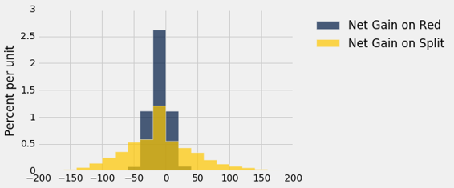
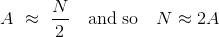
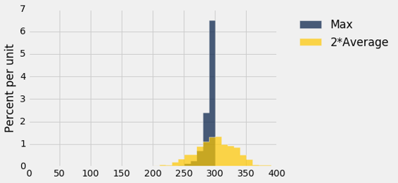

# 九、经验分布

> 原文：[Empirical Distributions](https://github.com/data-8/textbook/tree/gh-pages/chapters/09)

> 译者：[飞龙](https://github.com/wizardforcel)

> 协议：[CC BY-NC-SA 4.0](http://creativecommons.org/licenses/by-nc-sa/4.0/)

> 自豪地采用[谷歌翻译](https://translate.google.cn/)

大部分数据科学都涉及来自大型随机样本的数据。 在本节中，我们将研究这些样本的一些属性。

我们将从一个简单的实验开始：多次掷骰子并跟踪出现的点数。 `die `表包含骰子面上的点数。 所有的数字只出现一次，因为我们假设骰子是平等的。

```py
die = Table().with_column('Face', np.arange(1, 7, 1))
die
```


| Face |
| --- |
| 1 |
| 2 |
| 3 |
| 4 |
| 5 |
| 6 |

### 概率分布

下面的直方图帮助我们可视化，每个面出现概率为 1/6 事实。 我们说直方图显示了所有可能的面的概率分布。 由于所有的条形表示相同的百分比几率，所以这个分布成为整数 1 到 6 上的均匀分布。

```py
die_bins = np.arange(0.5, 6.6, 1)
die.hist(bins = die_bins)
```


递增值由相同的固定量分隔，例如骰子面上的值（递增值由 1 分隔），这样的变量被称为离散值。上面的直方图被称为离散直方图。它的桶由数组`die_bins`指定，并确保每个条形的中心是对应的整数值。

重要的是要记住，骰子不能显示 1.3 个点或 5.2 个点 - 总是显示整数个点。但是我们的可视化将每个值的概率扩展到条形区域。虽然在本课程的这个阶段这看起来有些随意，但是稍后当我们在离散直方图上叠加平滑曲线时，这将变得很重要。

在继续之前，让我们确保轴域上的数字是有意义的。每个面的概率是 1/6，四舍五入到小数点后两位的概率是 16.67%。每个桶的宽度是 1 个单位。所以每个条形的高度是每单位 16.67%。这与图形的水平和垂直比例一致。

### 经验分布

上面的分布由每个面的理论概率组成。 这不基于数据。 不投掷任何骰子，它就可以被研究和理解。

另一方面，经验分布是观测数据的分布。 他们可以通过经验直方图可视化。

让我们通过模拟一个骰子的投掷来获得一些数据。 这可以通过 1 到 6 的整数的带放回随机抽样来完成。为了使用 Python 来实现，我们将使用`Table`的`sample`方法，它带放回地随机抽取表中的行。它的参数是样本量，它返回一个由选定的行组成的表。 `with_replacement=False`的可选参数指定了应该抽取样本而不放回，但不适用于投掷骰子。

这是一个十次骰子投掷的结果。

```py
die.sample(10)
```


| Face |
| --- |
| 5 |
| 3 |
| 3 |
| 4 |
| 2 |
| 2 |
| 4 |
| 1 |
| 6 |
| 6 |

我们可以使用相同的方法来模拟尽可能多的投掷，然后绘制结果的经验直方图。 因为我们要反复这样做，所以我们定义了一个函数`empirical_hist_die`，它以样本量为参数；该函数根据其参数多次投掷骰子，然后绘制直方图。

```py
def empirical_hist_die(n):
    die.sample(n).hist(bins = die_bins)
```

### 经验直方图


这是十次投掷的经验直方图。 它看起来不像上面的概率直方图。 运行该单元格几次，看看它如何变化。

```py
empirical_hist_die(10)
```


当样本量增加时，经验直方图开始看起来更像是理论概率的直方图。

```py
empirical_hist_die(100)
```


```py
empirical_hist_die(1000)
```


当我们增加模拟中的投掷次数时，每个条形的面积接近 16.67%，这是概率直方图中每个条形的面积。

我们在实例中观察到了一般规则：

### 平均定律

如果偶然的实验在相同的条件下独立重复，那么从长远来看，事件发生的频率越来越接近事件的理论概率。

例如，从长远来看，四点的比例越来越接近 1/6。

这里“独立地且在相同的条件下”意味着，无论所有其他重复的结果如何，每个重复都以相同的方式执行。

## 从总体中取样

当随机样本来自较大总体时，平均定律也成立。

作为一个例子，我们将研究航班延误时间的总体。 `united `表包含 2015 年夏天从旧金山出发的美联航国内航班的数据。数据由[美国运输部运输统计局](http://www.transtats.bts.gov/Fields.asp?Table_ID=293)公布。

这里有 13,825 行，每行对应一个航班。 列是航班日期，航班号，目的地机场代码和以分钟为单位的出发延误时间。有些延误时间是负的；那些航班提前离开。

```py
united = Table.read_table('united_summer2015.csv')
united
```


| Date | Flight Number | Destination | Delay |
| --- | --- | --- | --- |
| 6/1/15 | 73 | HNL | 257 |
| 6/1/15 | 217 | EWR | 28 |
| 6/1/15 | 237 | STL | -3 |
| 6/1/15 | 250 | SAN | 0 |
| 6/1/15 | 267 | PHL | 64 |
| 6/1/15 | 273 | SEA | -6 |
| 6/1/15 | 278 | SEA | -8 |
| 6/1/15 | 292 | EWR | 12 |
| 6/1/15 | 300 | HNL | 20 |
| 6/1/15 | 317 | IND | -10 |

（省略了 13815 行）

一个航班提前 16 分钟起飞，另一个航班延误 580 分钟。 其他延迟时间几乎都在 -10 分钟到 200 分钟之间，如下面的直方图所示。

```py
united.column('Delay').min()
-16

united.column('Delay').max()
580

delay_bins = np.append(np.arange(-20, 301, 10), 600)
united.select('Delay').hist(bins = delay_bins, unit = 'minute')
```


就本节而言，仅仅关注部分数据就足够了，我们忽略延迟超过 200 分钟的 0.8% 的航班。 这个限制只是为了视觉便利。 该表仍然保留所有的数据。

```py
united.where('Delay', are.above(200)).num_rows/united.num_rows
0.008390596745027125

delay_bins = np.arange(-20, 201, 10)
united.select('Delay').hist(bins = delay_bins, unit = 'minute')
```


`[0,10)`的条形高度不到每分钟 3%，这意味着只有不到 30% 的航班延误了 0 到 10 分钟。 这是通过行的计数来确认的：

```py
united.where('Delay', are.between(0, 10)).num_rows/united.num_rows
0.2935985533453888
```

### 样本的经验分布

现在让我们将这 13,825 个航班看做一个总体，并从中带放回地抽取随机样本。 将我们的分析代码打包成一个函数是有帮助的。 函数`empirical_hist_delay`以样本量为参数，绘制结果的经验直方图。

```py
def empirical_hist_delay(n):
    united.sample(n).select('Delay').hist(bins = delay_bins, unit = 'minute')
```

正如我们用骰子所看到的，随着样本量的增加，样本的经验直方图更接近于总体的直方图。 将这些直方图与上面的总体直方图进行比较。

```py
empirical_hist_delay(10)
```


```py
empirical_hist_delay(100)
```


最一致的可见差异在总体中罕见的值之中。 在我们的示例中，这些值位于分布的最右边。 但随着样本量的增加，这些值以大致正确的比例，开始出现在样本中。

```py
empirical_hist_delay(1000)
```


### 样本的经验直方图的总结

我们在本节中观察到的东西，可以总结如下：

对于大型随机样本，样本的经验直方图类似于总体的直方图，概率很高。

这证明了，在统计推断中使用大型随机样本是合理的。 这个想法是，由于大型随机样本可能类似于从中抽取的总体，从样本中计算出的数量可能接近于总体中相应的数量。

## 轮盘赌

上面的分布让我们对整个随机样本有了印象。但有时候我们只是对基于样本计算的一个或两个量感兴趣。

例如，假设样本包含一系列投注的输赢。那么我们可能只是对赢得的总金额感兴趣，而不是输赢的整个序列。

使用我们的几率长期行为的新知识，让我们探索赌博游戏。我们将模拟轮盘赌，它在拉斯维加斯和蒙特卡洛等赌场中受欢迎。

在内华达，轮盘赌的主要随机器是一个带有 38 个口袋的轮子。其中两个口袋是绿色的，十八个黑色，十八个红色。轮子在主轴上，轮子上有一个小球。当轮子旋转时，球体跳起来，最后落在其中一个口袋里。这就是获胜的口袋。

`wheel`表代表内华达轮盘赌的口袋。

```py
wheel
```

| Pocket | Color |
| --- | --- |
| 0 | green |
| 00 | green |
| 1 | red |
| 2 | black |
| 3 | red |
| 4 | black |
| 5 | red |
| 6 | black |
| 7 | red |
| 8 | black |

（省略了 28 行）

你可以对轮盘赌桌上展示的几个预先指定的口袋下注。 如果你对“红色”下注，如果球落在红色的口袋里，你就赢了。

红色的下注返回相等的钱。 也就是说，它支付一比一。为了理解这是什么意思，假设你在“红色”下注一美元。 第一件事情发生之前，即使在车轮旋转之前，你必须交出你的一美元。 如果球落在绿色或黑色的口袋里，你就失去它了。 如果球落在红色的口袋里，你会把你的钱拿回来（让你不输不赢），再加上另外一美元的奖金。

函数`red_winnings`以一个颜色作为参数，如果颜色是红色，则返回`1`。 对于所有其他颜色，它返回`-1`。 我们将`red_winnings`应用于`wheel`的`Color`列，来获得新的表`bets`，如果你对红色下注一美元，它显示每个口袋的净收益。

```py
def red_winnings(color):
    if color == 'red':
        return 1
    else:
        return -1
bets = wheel.with_column(
    'Winnings: Red', wheel.apply(red_winnings, 'Color')
    )
bets
```


| Pocket | Color | Winnings: Red |
| --- | --- | --- |
| 0 | green | -1 |
| 00 | green | -1 |
| 1 | red | 1 |
| 2 | black | -1 |
| 3 | red | 1 |
| 4 | black | -1 |
| 5 | red | 1 |
| 6 | black | -1 |
| 7 | red | 1 |
| 8 | black | -1 |

（省略了 28 行）

假设我们决定对红色下注一美元，会发生什么呢？

这里是一轮的模拟。

```py
one_spin = bets.sample(1)
one_spin
```


| Pocket | Color | Winnings: Red |
| --- | --- | --- |
| 14 | red | 1 |

这轮的颜色是`Color`列中的值。 无论你的赌注如何，结果可能是红色，绿色或黑色。 要看看这些事件发生的频率，我们可以模拟许多这样的单独轮次，并绘制出我们所看到的颜色的条形图。 （我们可以称之为经验条形图。）

为了实现它，我们可以使用`for`循环。 我们在这里选择了重复 5000 次，但是当你运行这个单元格时，你可以改变它。

```py
num_simulations = 5000

colors = make_array()
winnings_on_red = make_array()

for i in np.arange(num_simulations):
    spin = bets.sample(1)
    new_color = spin.column("Color").item(0)
    colors = np.append(colors, new_color)
    new_winnings = spin.column('Winnings: Red')
    winnings_on_red = np.append(winnings_on_red, new_winnings)

Table().with_column('Color', colors)\
       .group('Color')\
       .barh('Color')
```


38 个口袋里有 18 个是红色的，每个口袋都是等可能的。 因此，在 5000 次模拟中，我们预计大致（但可能不是完全）看到`18/38*5000`或者 2,368 次红色。模拟证明了这一点。

在模拟中，我们也记录了你的奖金。 这些经验直方图显示了，你对红色下注的不同结果的（近似）几率。

```py
Table().with_column('Winnings: Red', winnings_on_red)\
       .hist(bins = np.arange(-1.55, 1.65, .1))
```


每个模拟的唯一可能的结果是，你赢了一美元或输了一美元，这反映在直方图中。 我们也可以看到，你赢的次数要比输的次数少一点。 你喜欢这个赌博策略吗？

### 多次游戏

大多数轮盘赌玩家玩好几轮。 假设你在 200 次独立轮次反复下注一美元。 你总共会赚多少钱？

这里是一套 200 轮的模拟。 `spins`表包括所有 200 个赌注的结果。 你的净收益是`Winnings: Red`列中所有 +1 和 -1 的和。

```py
spins = bets.sample(200)
spins.column('Winnings: Red').sum()
-26
```

运行几次单元格。 有时你的净收益是正的，但更多的时候它似乎是负的。

为了更清楚地看到发生了什么，让我们多次模拟 200 轮，就像我们模拟一轮那样。 对于每次模拟，我们将记录来自 200 轮的总奖金。 然后我们将制作 5000 个不同的模拟总奖金的直方图。

```py
num_spins = 200

net_gain = make_array()

for i in np.arange(num_simulations):
    spins = bets.sample(num_spins)
    new_net_gain = spins.column('Winnings: Red').sum()
    net_gain = np.append(net_gain, new_net_gain)

Table().with_column('Net Gain on Red', net_gain).hist()
```


注意横轴上 0 的位置。 这就是你不赚不赔的地方。 通过使用这个赌博策略，你喜欢这个赚钱几率吗？

如果对红色下注不吸引人，也许值得尝试不同的赌注。 “分割”（Split）是轮盘赌桌上两个相邻号码的下注，例如 0 和 00。分割的回报是 17 比 1。

`split_winnings`函数将口袋作为参数，如果口袋是 0 或 00，则返回 17。对于所有其他口袋，返回 -1。

表格`more_bets`是投注表格的一个版本，扩展的一列是对 0/00 分割下注的情况下，每个口袋的奖金。

```py
def split_winnings(pocket):
    if pocket == '0':
        return 17
    elif pocket == '00':
        return 17
    else:
        return -1
more_bets = wheel.with_columns(
    'Winnings: Red', wheel.apply(red_winnings, 'Color'),
    'Winnings: Split', wheel.apply(split_winnings, 'Pocket')
    )
more_bets
```

| Pocket | Color | Winnings: Red | Winnings: Split |
| --- | --- | --- | --- |
| 0 | green | -1 | 17 |
| 00 | green | -1 | 17 |
| 1 | red | 1 | -1 |
| 2 | black | -1 | -1 |
| 3 | red | 1 | -1 |
| 4 | black | -1 | -1 |
| 5 | red | 1 | -1 |
| 6 | black | -1 | -1 |
| 7 | red | 1 | -1 |
| 8 | black | -1 | -1 |

（省略了 28 行）

下面的代码模拟了两个投注的结果 - 红色和 0/00 分割 - 在 200 轮中。 代码与以前的模拟相同，除了添加了 Split。 （注意：`num_simulations`和`num_spins`之前分别定义为 5,000 和 200，所以我们不需要再次定义它们。）

```py
net_gain_red = make_array()
net_gain_split = make_array()

for i in np.arange(num_simulations):
    spins = more_bets.sample(num_spins)
    new_net_gain_red = spins.column('Winnings: Red').sum()
    net_gain_red = np.append(net_gain_red, new_net_gain_red)
    new_net_gain_split = spins.column('Winnings: Split').sum()
    net_gain_split = np.append(net_gain_split, new_net_gain_split)

Table().with_columns(
    'Net Gain on Red', net_gain_red,
    'Net Gain on Split', net_gain_split
    ).hist(bins=np.arange(-200, 200, 20))
```



横轴上 0 的位置表明，无论你选择哪种赌注，你都更有可能赔钱而不是赚钱。在两个直方图中，不到 50% 的区域在 0 的右侧。

然而，分割的赌注赚钱几率更大，赚取超过 50 美元的机会也是如此。 金色直方图有很多区域在五十美元的右侧，而蓝色直方图几乎没有。 那么你应该对分割下注吗？

这取决于你愿意承担多少风险，因为直方图还表明，如果你对分割下注，你比对红色下注更容易损失超过 50 美元。

轮盘赌桌上，所有赌注的单位美元的预期净损失相同（除了线注，这是更糟的）。 但一些赌注的回报比其他赌注更为可变。 你可以选择这些赌注，只要你准备好可能会大输一场。

## 统计量的经验分布

平均定律意味着，大型随机样本的经验分布类似于总体的分布，概率相当高。

在两个直方图中可以看到相似之处：大型随机样本的经验直方图很可能类似于总体的直方图。

提醒一下，这里是所有美联航航班延误的直方图，以及这些航班的大小为 1000 的随机样本的经验直方图。

```py
united = Table.read_table('united_summer2015.csv')
delay_bins = np.arange(-20, 201, 10)
united.select('Delay').hist(bins = delay_bins, unit = 'minute')
plots.title('Population');
```


```py
sample_1000 = united.sample(1000)
sample_1000.select('Delay').hist(bins = delay_bins, unit = 'minute')
plots.title('Sample of Size 1000');
```


两个直方图明显相似，虽然他们并不等价。

### 参数

我们经常对总体相关的数量感兴趣。

在选民的总体中，有多少人会投票给候选人 A 呢？
在 Facebook 用户的总体中，用户最多拥有的 Facebook 好友数是多少？
在美联航航班的总体中，起飞延误时间的中位数是多少？

与总体相关的数量被称为参数。 对于美联航航班的总体，我们知道参数“延误时间的中位数”的值：

```py
np.median(united.column('Delay'))
2.0
```

NumPy 函数`median`返回数组的中值（中位数）。 在所有的航班中，延误时间的中位数为 2 分钟。 也就是说，总体中约有 50% 的航班延误了 2 分钟以内：

```py
united.where('Delay', are.below_or_equal_to(2)).num_rows/united.num_rows
0.5018444846292948
```

一半的航班在预定起飞时间的 2 分钟之内起飞。 这是非常短暂的延误！

注意。 由于“重复”，百分比并不完全是 50，也就是说，延误了 2 分钟的航班有 480 个。数据集中的重复很常见，我们不会在这个课程中担心它。

```py
united.where('Delay', are.equal_to(2)).num_rows
480
```

### 统计

在很多情况下，我们会感兴趣的是找出未知参数的值。 为此，我们将依赖来自总体的大型随机样本的数据。

统计量（注意是单数！）是使用样本中数据计算的任何数字。 因此，样本中位数是一个统计量。

请记住，`sample_1000`包含来自`united`的 1000 个航班的随机样本。 样本中位数的观测值是：

```py
np.median(sample_1000.column('Delay'))
2.0
```

我们的样本 - 一千个航班 - 给了我们统计量的观测值。 这提出了一个重要的推论问题：

统计量的数值可能会有所不同。 使用基于随机样本的任何统计量时，首先考虑的事情是，样本可能不同，因此统计量也可能不同。

```py
np.median(united.sample(1000).column('Delay'))
3.0
```

运行单元格几次来查看答案的变化。 通常它等于 2，与总体参数值相同。 但有时候不一样。

统计量有多么不同？ 回答这个问题的一种方法是多次运行单元格，并记下这些值。 这些值的直方图将告诉我们统计量的分布。

我们将使用`for`循环来“多次运行单元格”。 在此之前，让我们注意模拟中的主要步骤。

### 模拟统计量

我们将使用以下步骤来模拟样本中位数。 你可以用任何其他样本量来替换 1000 的样本量，并将样本中位数替换为其他统计量。

第一步：生成一个统计量。 抽取大小为 1000 的随机样本，并计算样本的中位数。 注意中位数的值。

第二步：生成更多的统计值。 重复步骤 1 多次，每次重新抽样。

第三步：结果可视化。 在第二步结束时，你将会记录许多样本中位数，每个中位数来自不同的样本。 你可以在表格中显示所有的中位数。 你也可以使用直方图来显示它们 - 这是统计量的经验直方图。

我们现在执行这个计划。 正如在所有的模拟中，我们首先创建一个空数组，我们在其中收集我们的结果。

+   上面的第一步是`for`循环的主体。
+   第二步，重复第一步“无数次”，由循环完成。 我们“无数次”是5000次，但是你可以改变这个。
+   第三步是显示表格，并在后面的单元格中调用`hist`。

该单元格需要大量的时间来运行。 那是因为它正在执行抽取大小为 1000 的样本，并计算其中位数的过程，重复 5000 次。 这是很多抽样和重复！

```py
medians = make_array()

for i in np.arange(5000):
    new_median = np.median(united.sample(1000).column('Delay'))
    medians = np.append(medians, new_median)

Table().with_column('Sample Median', medians)
```


| Sample Median |
| --- |
| 3 |
| 2 |
| 2 |
| 3 |
| 2 |
| 2 |
| 2 |
| 3 |
| 1 |
| 3 |

（省略了 4990 行）

```py
Table().with_column('Sample Median', medians).hist(bins=np.arange(0.5, 5, 1))
```


你可以看到样本中位数很可能接近 2，这是总体中位数的值。 由于 1000 次航班延误的样本可能与延误总体相似，因此这些样本的延误中位数应接近总体的延误中位数，也就不足为奇了。

这是一个例子，统计量如何较好估计参数。

### 模拟的威力

如果我们能够生成所有可能的大小为 1000 的随机样本，我们就可以知道所有可能的统计量（样本中位数），以及所有这些值的概率。我们可以在统计量的概率直方图中可视化所有值和概率。

但在许多情况下（包括这个），所有可能的样本数量足以超过计算机的容量，概率的纯粹数学计算可能有些困难。

这是经验直方图的作用。

我们知道，如果样本量很大，并且如果重复抽样过程无数次，那么根据平均定律，统计量的经验直方图可能类似于统计量的概率直方图。

这意味着反复模拟随机过程是一种近似概率分布的方法，不需要在数学上计算概率，或者生成所有可能的随机样本。因此，计算机模拟成为数据科学中的一个强大工具。他们可以帮助数据科学家理解随机数量的特性，这些数据会以其他方式进行分析。

这就是这种的模拟的经典例子。

### 估计敌军飞机的数量

在第二次世界大战中，为盟军工作的数据分析师负责估算德国战机的数量。 这些数据包括盟军观察到的德国飞机的序列号。 这些序列号为数据分析师提供了答案。

为了估算战机总数，数据分析人员必须对序列号做出一些假设。 这里有两个这样的假设，大大简化，使我们的计算更容易。

+   战机有`N`架，编号为 `1,2, ..., N`。

+   观察到的飞机从`N`架飞机中均匀、随机带放回地抽取。

目标是估计数字`N`。 这是未知的参数。

假设你观察一些飞机并记下他们的序列号。 你如何使用这些数据来猜测`N`的值？ 用于估计的自然和简单的统计量，就是观察到的最大的序列号。

让我们看看这个统计量如何用于估计。 但首先是另一个简化：现在一些历史学家估计，德国的飞机制造业生产了近 10 万架不同类型的战机，但在这里我们只能想象一种。 这使得假设 1 更易于证明。

假设实际上有`N = 300 `个这样的飞机，而且你观察到其中的 30 架。 我们可以构造一个名为`serialno`的表，其中包含序列号`1`到`N`。 然后，我们可以带放回取样 30 次（见假设 2），来获得我们的序列号样本。 我们的统计量是这 30 个数字中的最大值。 这就是我们用来估计参数`N`的东西。

```py
N = 300
serialno = Table().with_column('serial Number', np.arange(1, N+1))
serialno
```


| serial number |
| --- |
| 1 |
| 2 |
| 3 |
| 4 |
| 5 |
| 6 |
| 7 |
| 8 |
| 9 |
| 10 |

（省略了 290 行）

```py
serialno.sample(30).column(0).max()
291
```

与所有涉及随机抽样的代码一样，运行该单元几次；来查看变化。你会发现，即使只有 300 个观测值，最大的序列号通常在 250-300 范围内。

原则上，最大的序列号可以像 1 那样小，如果你不幸看到了 30 次 1 号机。如果你至少观察到一次 300 号机，它可能会增大到 300。但通常情况下，它似乎处于非常高的 200 以上。看起来，如果你使用最大的观测序列号作为你对总数的估计，你不会有太大的错误。

### 模拟统计 

让我们模拟统计，看看我们能否证实它。模拟的步骤是：

第一步。从 1 到 300 带放回地随机抽样 30 次，并注意观察到的最大数量。这是统计量。

第二步。重复步骤一 750 次，每次重新取样。你可以用任何其他的大数值代替 750。

第三步。创建一个表格来显示统计量的 750 个观察值，并使用这些值绘制统计量的经验直方图。

```py
sample_size = 30
repetitions = 750
maxes = make_array()

for i in np.arange(repetitions):
    sampled_numbers = serialno.sample(sample_size)
    maxes = np.append(maxes, sampled_numbers.column(0).max())  

Table().with_column('Max Serial Number', maxes)
```


| Max Serial Number |
| --- |
| 280 |
| 253 |
| 294 |
| 299 |
| 298 |
| 237 |
| 296 |
| 297 |
| 293 |
| 295 |

（省略了 740 行）

```py
every_ten = np.arange(1, N+100, 10)
Table().with_column('Max Serial Number', maxes).hist(bins = every_ten)
```


这是 750 个估计值的直方图，每个估计值是统计量“观察到的最大序列号”的观测值。

正如你所看到的，尽管在理论上它们可能会小得多，但估计都在 300 附近。直方图表明，作为飞机总数的估计，最大的序列号可能低了大约 10 到 25 个。但是，飞机的真实数量低了 50 个是不太可能的。

### 良好的近似

我们前面提到过，如果生成所有可能的样本，并计算每个样本的统计量，那么你将准确了解统计量可能有多么不同。事实上，你将会完整地列举统计量的所有可能值及其所有概率。

换句话说，你将得到统计量的概率分布和概率直方图。

统计量的概率分布也称为统计量的抽样分布，因为它基于所有可能的样本。

但是，我们上面已经提到，可能的样本总数往往非常大。例如，如果有 300 架飞机，你可以看到的，30 个序列号的可能序列总数为：

```py
300**30
205891132094649000000000000000000000000000000000000000000000000000000000000
```

这是很多样本。 幸运的是，我们不必生成所有这些。 我们知道统计量的经验直方图，基于许多但不是全部可能的样本，是概率直方图的很好的近似。 因此统计量的经验分布让我们很好地了解到，统计量可能有多么不同。

确实，统计量的概率分布包含比经验分布更准确的统计量信息。 但是，正如在这个例子中一样，通常经验分布所提供的近似值，足以让数据科学家了解统计量可以变化多少。 如果你有一台计算机，经验分布更容易计算。 因此，当数据科学家试图理解统计的性质时，通常使用经验分布而不是精确的概率分布。

### 参数的不同估计

这里举一个例子来说明这一点。 到目前为止，我们已经使用了最大的观测序号作为飞机总数的估计。 但还有其他可能的估计，我们现在将考虑其中之一。

这个估计的基本思想是观察到的序列号的平均值可能在1到`N`之间。 因此，如果`A`是平均值，那么：



因此，可以使用一个新的统计量化来估计飞机总数：取观测到的平均序列号并加倍。

与使用最大的观测数据相比，这种估计方法如何？ 计算新统计量的概率分布并不容易。 但是和以前一样，我们可以模拟它来近似得到概率。 我们来看看基于重复抽样的统计量的经验分布。 为了便于比较，重复次数选择为 750，与之前的模拟相同。

```py
maxes = make_array()
twice_ave = make_array()

for i in np.arange(repetitions):
    sampled_numbers = serialno.sample(sample_size)

    new_max = sampled_numbers.column(0).max()
    maxes = np.append(maxes, new_max)

    new_twice_ave = 2*np.mean(sampled_numbers.column(0))
    twice_ave = np.append(twice_ave, new_twice_ave)


results = Table().with_columns(
    'Repetition', np.arange(1, repetitions+1),
    'Max', maxes,
    '2*Average', twice_ave
)

results
```


| Repetition | Max | 2*Average |
| --- | --- | --- |
| 1 | 296 | 312.067 |
| 2 | 283 | 290.133 |
| 3 | 290 | 250.667 |
| 4 | 296 | 306.8 |
| 5 | 298 | 335.533 |
| 6 | 281 | 240 |
| 7 | 300 | 317.267 |
| 8 | 295 | 322.067 |
| 9 | 296 | 317.6 |
| 10 | 299 | 308.733 |

（省略了 740 行）

请注意，与所观察到的最大数字不同，新的估计值（“平均值的两倍”）可能会高估飞机的数量。 当观察到的序列号的平均值接近于`N`而不是`1`时，就会发生这种情况。

下面的直方图显示了两个估计的经验分布。

```py
results.drop(0).hist(bins = every_ten)
```



你可以看到，原有方法几乎总是低估; 形式上，我们说它是有偏差的。 但它的变异性很小，很可能接近真正的飞机总数。

新方法高估了它，和低估的频率一样，因此从长远来看，平均而言大致没有偏差。 然而，它比旧的估计更可变，因此容易出现较大的绝对误差。

这是一个偏差 - 变异性权衡的例子，在竞争性估计中并不罕见。 你决定使用哪种估计取决于对你最重要的误差种类。 就敌机而言，低估总数可能会造成严重的后果，在这种情况下，你可能会选择使用更加可变的方法，它一半几率都是高估的。 另一方面，如果高估导致了防范不存在的飞机的不必要的高成本，那么你可能会对低估的方法感到满意。

### 技术注解

事实上，“两倍均值”不是无偏的。平均而言，它正好高估了 1。例如，如果`N`等于 3，来自`1,2,3`的抽取结果的均值是`2`，`2 x 2 = 4`，它比`N`多了 1。“两倍均值”减 1 是`N`的无偏估计量。
